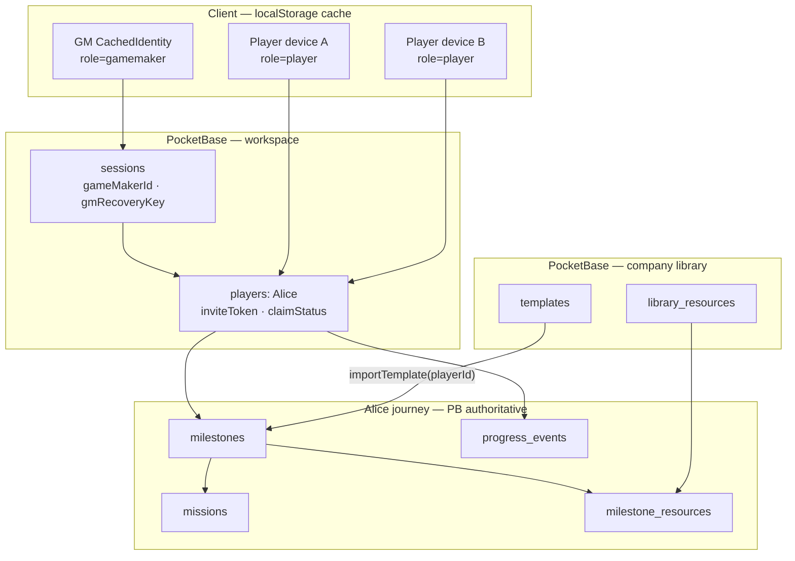

# MesseBuddy - Project Specification

> **Status:** Active implementation reference  
> **Last updated:** 2026-07-05  
> **Authors:** Group 3 - Alisa Diakova · Hoon Kim · Kseniya Tsiabus · Luis Müller  
> **External PO:** Peter Tubak (Messe München)  
> **Course:** Management & Digital Technologies II · LMU Munich School of Management · Summer Term 2026

---

## How to Use This Document

This specification is the single authoritative reference for the MesseBuddy
prototype iteration 1. It supersedes all prior notes, PDFs, and meeting
summaries. Every architectural decision made before implementation began is
recorded here with its rationale. For the non-technical specifications, refer to
the
[working documentation](https://docs.google.com/document/d/1vYRRWtMpqojfWyCz4hGfwWOtxlNONKiLoZO8EFmIAPI/edit?tab=t.0#heading=h.9no5t7o13xjb)
in Google Drive.

**For new agent sessions:** paste this document as context before asking
implementation questions. All terminology, data shapes, component names, and
constraints are defined here. Do not infer from external knowledge - use this
document.

**Append-only sections** are marked `[APPEND-ONLY]`. Add new entries to the
Decision Log; never delete or edit existing log rows.

**Implementation status** (code gaps, phased plan, smoke tests) lives in
[`plans/production-implementation-plans.md`](plans/production-implementation-plans.md)
only — not in this document.

---

## Product Overview


### What MesseBuddy Is

MesseBuddy is a **mobile-first Progressive Web App (PWA)** that gamifies the
corporate onboarding experience. It represents an onboarding journey as an
interactive map of office spaces (Milestones), each containing a set of
activities (Missions) a new employee must complete. Progress is tracked via **XP
earned per Mission**; the Game Maker sets each Mission's `xpValue` directly.

**Core value propositions:**

- Customization by the Game Maker with no developer involvement (templates make
  reuse easy)
- Gamified progression that is non-linear and autonomy-preserving
- Simple identity model — no account signup; players claim an identity via invite QR
- Validation flows that promote real human contact (GM approval, GM scan, crowd
  attestation) over opaque automation

### Core Product Journey

The app exists to support one primary loop:

1. **Game Maker** creates a **workspace** (`Session`) — one per GM; **session ≈
   department** by convention — and adds **players** to it. Each player gets a
   tailored milestone/mission journey; the GM may **copy from a Template** to
   bootstrap a player's map. **Library resources** attach to milestones on each
   player's journey. Templates copy milestone/mission structure (and resource
   bindings) into a **specific player**.
2. **Game Maker** shares a **per-player invite link**
   (`/join/:sessionId?t=:inviteToken`) generated when the player identity is
   created.
3. **New player** opens the invite link → **claims** that `players` row (first
   device binds `uid` + `recoveryKey`) → enters the **Player Cockpit**. The same
   link on another device re-opens the same identity (see § Invite claim).
4. **Player** completes **their** Missions on the map → earns **XP** when
   validation succeeds.
5. **Game Maker** monitors the **player list** (aggregate progress) and drills
   into **per-player detail** to customize milestones/missions, approve
   requests, scan completion QRs, and review form submissions.

Everything else (buddy card, resources, AI chat, tutorial, pre-boarding checklist,
background image, templates) is **quality-of-life** around this loop — not a
separate product surface.

### What MesseBuddy Is Not

- Not an HRM dashboard or replacement for existing HR tooling
- Not a native mobile app (PWA only)
- Not an SSO or identity management system (prototype scope)
- Not a replacement for company documentation - it links to existing resources

## Technology should create conditions for human connection, not replace it.

## Terminology Glossary

This glossary is authoritative.

| Term                   | Definition                                                                                                                                                                                                                                                                                                               |
| ---------------------- | ------------------------------------------------------------------------------------------------------------------------------------------------------------------------------------------------------------------------------------------------------------------------------------------------------------------------ |
| **Workspace / Session** | The Game Maker's single onboarding container (`/admin/:sessionId`). Holds map settings (`bgImageUrl`, `mapNodeScale`, `qrSecret`), GM identity (`gameMakerId`, `gmRecoveryKey`), pre-boarding, and all managed players. **One session ≈ one department** by convention — no department entity in the system. |
| **Player**             | A claimable onboarding identity — one PocketBase `players` row per person the GM onboards. Has its own Milestones, Missions, milestone resource attachments, ProgressEvents, and BuddyProfile. `claimStatus = invited` until first claim; then `claimed`. The GM is **not** a `players` row. |
| **Invite / pending player** | A `players` row created by the GM (`invitePlayer`) with a unique `inviteToken`. Listed on the Players tab as "Not joined yet" until claimed. |
| **Player invite URL** | `{origin}/join/{sessionId}?t={inviteToken}` — permanent capability URL to one `players` row. First visit: claim flow. Revisit (any device): hydrate identity from PB → cockpit. Progress always from server. |
| **User type**          | `UserRole` in `CachedIdentity`: `gamemaker` \| `player`. Drives route guards. **Not** stored on `players` rows — collection membership implies player user type. |
| **Device identity** | `localStorage.mb_identity` cache — profile picker and route guards. Authoritative state lives in PocketBase (`sessions` for GM, `players` for claimed players). |
| **Session**            | Synonym for **Workspace / Session**. |
| **Milestone**          | A top-level grouping on **one player's** map. Scoped by `playerId`. Contains that player's Missions and milestone resource attachments. |
| **Mission**            | An individual task within a Milestone. Scoped by `playerId`. Atomic unit of work. Carries a GM-set `xpValue` and a `validationMethod`. |
| **Game Maker**         | Session owner (`sessions.gameMakerId`). Configures per-player journeys, manages the company template/resource libraries, validates completions, and monitors progress. |
| **`jobTitle` (field)** | Human-readable job label on `players` for UI only (e.g. "Senior Engineer"). No access-control meaning. |
| **Manager** *(future)* | Planned `UserRole` extension — may validate missions on behalf of the GM but **cannot** edit milestones or missions. Not in prototype scope. |
| **Buddy**              | QoL — mentor metadata (`buddy_profiles`), not a user type. |
| **XP**                 | Experience points awarded when a Mission is validated. **The Game Maker sets `missions.xpValue` directly.** Milestone `xpThreshold` = sum of `xpValue` for Missions in that Milestone (recomputed on save). Session total XP = sum of earned Mission XP across Milestones.                                              |
| **Validation Method**  | How completion is confirmed. One of: `gmApprove` (player requests → GM approves in UI), `selfApprove` (player self-marks → immediate), `qr` (player shows signed URL QR → **GM scans** on `ValidationPage`), `peerScan` (player shows signed URL QR → **N unique third parties** scan on `PeerScanPage` — no app identity required). `form` **type** always `autoApproved` regardless of method. Default: `gmApprove`. |
| **Players list**       | All `players` rows in the workspace — invited and claimed — with aggregate progress % when claimed. |
| **Player detail**      | GM drill-down for one player: customize milestones/missions, attach library resources, analytics, buddy, invite link. Route: `/admin/:sessionId/player/:playerId`. |
| **Library resource**   | Company-wide catalog entry in `library_resources` — visible to all GMs. Referenced by templates and attached to player milestones via `milestone_resources`. |
| **Template**           | Global portable journey blueprint in `templates` — Milestones, Missions, FormSchemas, and resource bindings by `resourceKey`. GM copies onto a **specific player** via `importTemplate`. Any GM may edit. |
| **GM Validation URL**  | `{origin}/validate/{sessionId}?t={signed}` — player completion QR (`validationMethod = qr`). **GM-only** confirm path. Player or anonymous scanner → `InvalidIdentityPage`. HMAC via `sessions.qrSecret` (C-16).                                                                                                        |
| **Peer Scan URL**      | `{origin}/peer/{sessionId}?t={signed}` — crowd attestation QR (`validationMethod = peerScan`). Public: scanner enters name (or mission-specific form). One attestation per `scannerDeviceId` per `(missionId, playerId)`. GM sees live feed.                                                                            |
| **Validation Request** | Transient state after player marks complete on `gmApprove` (`pendingApproval`) or while waiting for GM scan (`qr`) or peer target (`peerScan`).                                                                                                                                                                          |
| **Current Missions**   | Missions the GM surfaced to the player's dashboard (`isInCurrentMissions`).                                                                                                                                                                                                                                            |
| **Milestone resource** | Attachment linking a `library_resources` row to a player's milestone (`milestone_resources`). Shown in the player milestone sidebar when `isVisibleToPlayer`. **No `missionId` FK.** |
| **Recovery Key**       | 8-character token shown once on identity claim; restores `localStorage` identity.                                                                                                                                                                                                                                        |
| **Scanner Device ID**  | Client-generated UUID in `localStorage` (`mb_scan_device_id`) — dedupes peer-scan attestations per mission.                                                                                                                                                                                                            |
| **Shared Hook**         | A React hook that serves both Player and GameMaker roles from a single implementation. Accepts a `role` parameter (or infers it from context) to return role-appropriate data and callbacks. Examples: `useProgress`, `useBuddyProfile`, `useResources`. Components never call [`AppAdapter`](src/adapters/interface.ts:18) directly — they consume data exclusively through shared hooks. |
| **Canonical Domain Type** | The single authoritative TypeScript interface for a PocketBase-persisted entity, defined in [`domain.ts`](src/types/domain.ts:1). All views, hooks, and adapter methods derive from these types. Never forked — variations are created via `Omit<>`, `Pick<>`, or `Readonly<>` utility types. |
| **View Type**            | A role-scoped projection of a canonical domain type. Player components receive `Player*View` types (e.g., `PlayerSessionView` omits `qrSecret` and `gameMakerId`). Admin components receive full domain types. Created via TypeScript utility types — zero runtime cost. Defined in `src/types/views.ts`. |
| **SharedDataProvider**   | A React context provider that wraps [`AdapterContext`](src/adapters/AdapterContext.tsx:13) and shared hooks. Components call `useSharedData(entity, role)` to receive typed, role-appropriate data views. Encapsulates the adapter boundary — components never import `AppAdapter` or shared hooks directly. |
| **DataVisibility**       | Type-level classification of domain fields: `admin-only` (never exposed to Player views), `player-readonly` (Player can read, never mutate), `both-readwrite` (both roles can read; write paths are role-gated by hook callbacks). Encoded in view types via TypeScript utility types — not a runtime enum. |

## Tech Stack

All stack choices below are **locked**. Do not re-open without a new Decision
Log entry. Rationale is recorded in [Decision Log](#decision-log-append-only).

| Layer      | Choice                                                                                                                       |
| ---------- | ---------------------------------------------------------------------------------------------------------------------------- |
| Frontend   | React + Vite (PWA via `vite-plugin-pwa` / Workbox)                                                                           |
| Language   | TypeScript strict mode                                                                                                       |
| Backend    | PocketBase - single Go binary providing REST, SSE, file storage, SQLite, and an admin UI                                     |
| AI Gateway | LiteLLM Proxy - internally deployed, OpenAI-compatible `/chat/completions`; provider abstraction layer; RAG via pgvector     |
| Vector DB  | pgvector (PostgreSQL + pgvector extension) - stores embedded company documents; queried by LiteLLM at request time           |
| Hosting    | `docker compose` - three services: `app` (nginx + PocketBase), `litellm` (LiteLLM proxy), `pgvector` (vector store)          |
| Local dev  | `deno task dev` + `./pocketbase serve` on `:8090` + `litellm --config docker/litellm.yaml --port 4000` + pgvector on `:5432` |

## Docker & Deployment

### Service Architecture

```
docker compose up --build
```

| Service    | Image / Build                         | Port(s)                           | Process(es)                      | Persistent data        |
| ---------- | ------------------------------------- | --------------------------------- | -------------------------------- | ---------------------- |
| `app`      | Built from `Dockerfile`               | `:80` (PWA), `:8090` (PocketBase) | nginx + PocketBase (supervisord) | `pb_data` volume       |
| `litellm`  | `ghcr.io/berriai/litellm:main-stable` | `:4000`                           | LiteLLM proxy                    | -                      |
| `pgvector` | `pgvector/pgvector:pg16`              | `:5432`                           | PostgreSQL + pgvector extension  | `pgvector_data` volume |

### Build Pipeline (Dockerfile)

Multi-stage build - Deno never touches the production image:

```
Stage 1 - builder (denoland/deno:2.4.2)
  deno install                    # pre-fetch all npm imports from deno.json
  deno task build                 # tsc + vite build → dist/
  VITE_PB_URL and VITE_LITELLM_URL baked into the JS bundle as build args

Stage 2 - runtime (debian:bookworm-slim)
  nginx         serves dist/ on :80; proxies /api/ and /_/ to PocketBase
  PocketBase    serves REST + SSE on :8090; data stored in /pb_data
  supervisord   manages both processes; logs to stdout/stderr
```

**Key constraint:** `VITE_PB_URL` and `VITE_LITELLM_URL` are Vite build-time
variables - they are frozen into the JS bundle at image build time. For a
non-localhost deployment, pass them as build args:

```sh
docker compose build \
  --build-arg VITE_PB_URL=https://your-domain.com \
  --build-arg VITE_LITELLM_URL=https://your-domain.com:4000
```

### Configuration Files

| File                      | Purpose                                                                                                                                                            |
| ------------------------- | ------------------------------------------------------------------------------------------------------------------------------------------------------------------ |
| `Dockerfile`              | Multi-stage build: Deno build → nginx + PocketBase runtime image                                                                                                   |
| `docker-compose.yml`      | Orchestrates `app`, `litellm`, and `pgvector` services; declares `pb_data` and `pgvector_data` volumes                                                             |
| `docker/nginx.conf`       | Serves PWA; proxies `/api/` and `/_/` to PocketBase; SPA fallback; SSE-compatible proxy config                                                                     |
| `docker/supervisord.conf` | Manages nginx and PocketBase as co-processes inside `app` container                                                                                                |
| `docker/litellm.yaml`     | LiteLLM model list, router, RAG config (pgvector connection + embedding model), and system prompt. **Edit this to change provider, model, or embedded documents.** |
| `.env.example`            | Copy to `.env`; set `OPENAI_API_KEY` (or another provider) and `LITELLM_MASTER_KEY`                                                                                |

### Quick Start

```sh
# 1. Clone and enter the project
cd messe-buddy-app

# 2. Create env file and fill in API key(s)
cp .env.example .env

# 3. Build and start all services
docker compose up --build

# App   → http://localhost
# PocketBase admin → http://localhost:8090/_/
# LiteLLM  → http://localhost:4000
```

### nginx Routing (inside `app` container)

| Path prefix       | Destination             | Notes                                      |
| ----------------- | ----------------------- | ------------------------------------------ |
| `/api/*`, `/_/*`  | `http://127.0.0.1:8090` | PocketBase REST, SSE, and admin UI         |
| `/*` (everything) | `/usr/share/nginx/html` | PWA static files; fallback to `index.html` |

LiteLLM is **not** proxied through nginx - the browser reaches it directly on
`:4000`. `VITE_LITELLM_URL=http://localhost:4000` is baked into the bundle.

### pgvector Data Persistence

pgvector stores its data in a Docker named volume (`pgvector_data`). The volume
is mounted at `/var/lib/postgresql/data` inside the container and survives
container restarts and image rebuilds.

To ingest company documents into the vector store, use LiteLLM's
`/v1/embeddings` endpoint or the LiteLLM batch ingestion CLI. Documents must be
chunked, embedded, and inserted before the chatbot can retrieve them. See
`docker/litellm.yaml` for the configured embedding model and pgvector connection
string.

### PocketBase Data Persistence

PocketBase stores its SQLite database and uploaded files in `/pb_data` inside
the container. This path is declared as a Docker named volume (`pb_data`) in
`docker-compose.yml`. Data survives container restarts and image rebuilds.

To back up: `docker cp $(docker compose ps -q app):/pb_data ./pb_data_backup`

### LiteLLM Configuration (`docker/litellm.yaml`)

The model name `policy-assistant` is the identifier the PWA's `useChatStream`
hook sends in the `model` field. The proxy resolves it to the upstream model
configured in `litellm.yaml`. To change the underlying provider or model, edit
the `litellm_params` block - no PWA code change required.

**RAG pipeline:** LiteLLM queries pgvector for relevant document chunks before
forwarding the request to the upstream provider. Retrieved chunks are injected
into the prompt at the proxy layer. To update the knowledge base, re-embed and
re-ingest the documents - the PWA and its API calls remain unchanged.

The `default_system_prompt` in `litellm.yaml` sets the chatbot's persona and
scope. Retrieved document chunks are appended to this prompt automatically.
Replace the placeholder text with actual Messe München onboarding context.

## User Roles & Identity Model

### Roles (UI user types)

Two user types only: **`gamemaker`** and **`player`**. Encoded in
`CachedIdentity.role` and `RequireRole` — not as a field on `players` rows.

**Player (new employee)**

- Read-only cockpit; marks **their** Missions complete and submits validation requests
- Fills in form-type Missions (profile form, structured data)
- One `players` row per workspace; journey data scoped by `playerId`

**Game Maker (admin)**

- Full read-write cockpit; creates and edits **per-player** Milestones and Missions
- Manages the company **template** and **library resource** catalogs (global)
- Attaches library resources to player milestones; approves Mission completions
- Configures the `validationMethod` per Mission
- Manages Buddy profiles and workspace background images

### No SSO in Prototype

There is no PocketBase auth collection login. Identity is UID-based, backed by
PocketBase rows and cached in `localStorage`.

- **Player UID:** client-generated UUID on claim, stored in `players.uid` and
  `localStorage.mb_identity`
- **Game Maker UID:** client-generated UUID on workspace creation, stored in
  `sessions.gameMakerId` and `sessions.gmRecoveryKey` (not a `players` row)
- **No Pocketbase auth collections are used** (C-03)

### Identity model

**Game Makers** are identified by the workspace session (`gameMakerId`,
`gmRecoveryKey`). **Players** are claimable identities in the `players`
collection — profile metadata and journey ownership live on that row.
**`players.jobTitle`** is display-only.

**`localStorage` caches an identity subset for offline resolution.** The
`mb_identity` key stores only the fields needed to re-establish identity without
a network call:

```ts
interface CachedIdentity {
  uid: string;            // matches sessions.gameMakerId or players.uid
  recoveryKey: string;    // matches sessions.gmRecoveryKey or players.recoveryKey
  sessionId: string;      // workspace session id
  role: UserRole;         // gamemaker | player — UI user type
  name?: string;
  isDemo?: boolean;
}
```

The [`useIdentity()`](src/hooks/useIdentity.ts:41) hook resolves from cache and
hydrates from PocketBase when online. **`CachedIdentity.role` mirrors the user
type** for route guards; device cache is not authoritative over PB row data.

### Identity storage and resolution

The app does **not** use PocketBase auth. Identity is resolved client-side via
`useIdentity`:

| Source | Storage | Written by | Cleared by |
| ------ | ------- | ---------- | ---------- |
| **Persisted** | `localStorage` key `mb_identity` (stores `CachedIdentity`) | `claimPlayer`, `recoverIdentity`, `createGameMakerSession`, `setIdentity` | **`removeProfile(uid)`** — explicit user action (landing profile card, stale-session banner). **Not** on logout. |
| **Scanner device** | `localStorage` key `mb_scan_device_id` | First peer-scan page visit | Browser data wipe |
| **Ephemeral demo** | In-memory `ephemeralIdentityStore` (module singleton) | Landing page demo buttons via `setEphemeralIdentity` | `clearEphemeralIdentity` (e.g. ephemeral admin "back to landing") |

**Identity lifecycle (normative):**

| User action | Behavior |
| ----------- | -------- |
| **Log out / Back to landing** | `navigate("/")` only. Profile remains in `mb_identity`. |
| **Remove profile** | `removeProfile(uid)` — landing UI or stale-session card when workspace missing. |
| **Claim player invite** | No existing identity → open `/join/:sessionId?t=:inviteToken` → claim flow → `/session/:sessionId`. |
| **Re-open invite on new device** | Lookup by `inviteToken` → hydrate `CachedIdentity` from PB → `/session/:sessionId`. |
| **Scan wrong QR type** | Route to `InvalidIdentityPage` with reason (see [`docs/qr-routing.puml`](docs/qr-routing.puml)). |

**Resolution order:** `readEphemeralIdentity()` first; if absent, parse
`localStorage.mb_identity`. Cross-tab `localStorage` changes sync via the
`storage` event listener in `useIdentity`.

Ephemeral identity lets demo flows skip `localStorage` writes while still
passing `RequireRole` (which calls `useIdentity`). Production join/create flows
always persist to `localStorage`.

> **Trust boundary:** `CachedIdentity.role` drives route guards. GM authority is
> verified via `sessions.gameMakerId`; player authority via `players.uid` once
> claimed.

### Invite claim (per-player `inviteToken`)

Each GM-invited player row receives a unique `inviteToken` at creation. The
invite URL is `{origin}/join/{sessionId}?t={inviteToken}`.

| Step | Behavior |
| ---- | -------- |
| **GM adds player** | `invitePlayer` → `players` row with `claimStatus=invited`, generated `inviteToken`, optional display `name`. No `uid`/`recoveryKey` until claim. |
| **First claim** | Player opens invite URL → enters display name (if needed) → `claimPlayer` assigns `uid` + `recoveryKey` → `claimStatus=claimed` → write `CachedIdentity` (`role=player`) → `/session/:sessionId`. |
| **Same link, new device** | `getPlayerByInviteToken`. If `claimed`, hydrate `CachedIdentity` from the PB row → `/session/:sessionId`. No separate recovery step when the invite link is used. |
| **Profile picker only** | `mb_identity` caches profiles for convenience; optional if user always uses invite URL. |
| **Wrong identity on device** | Existing cached GM/other player → `InvalidIdentityPage`. |

**Multi-device:** All mission progress, form submissions, and profile fields live
in PocketBase. The invite URL is a **capability link** in prototype scope — any
device with the link can hydrate the player cache from PB. `recoveryKey` remains
for manual recovery when the link is lost. Concurrent edits use
**last-write-wins** with no merge UI in prototype scope.

### Route guards

Protected routes wrap children in `RequireRole`, which redirects to `/` when:

1. No identity (neither ephemeral nor `localStorage`)
2. `identity.role` does not match the route's required role
3. `identity.sessionId` does not match the URL `:sessionId` param

This applies to Player Cockpit, Admin Cockpit, and `ValidationPage`.

### Workspace & player model

One Game Maker operates one **workspace session** (≈ one department). Each
managed player is a `players` row with its own milestone, mission, and resource
attachment journey.



**Data scope:**

| Entity | Scope | Notes |
| ------ | ----- | ----- |
| `sessions` | Workspace | One per GM; map background, `qrSecret`, `gameMakerId`, `gmRecoveryKey`, pre-boarding |
| `players` | Workspace | One per onboarded person; **no GM rows**; `claimStatus`, `inviteToken`, profile fields |
| `milestones`, `missions`, `form_schemas` | Per player | `playerId` FK |
| `library_resources` | Company-wide | All GMs; optional user-only `tags` text (not interpreted in prototype) |
| `milestone_resources` | Per player milestone | `playerId`, `milestoneId`, `libraryResourceId`; no `missionId` |
| `templates` | Company-wide | Any GM may edit; `importTemplate` targets one `playerId` |
| `progress_events`, `buddy_profiles` | Per player | Unchanged |

### Session constraint

> A single `uid` may hold at most one identity per workspace session (one
> `players` row per `uid` per `sessionId`).

Joining as a player **claims** an existing `players` row in the target workspace
(via `inviteToken`). A device may cache multiple profiles (different workspaces
or roles) in `mb_identity`; `mb_active_uid` selects the last-active profile on
app boot.

### Identity Recovery

When `localStorage` is cleared (new device, browser reset):

1. User opens Landing Page → clicks **"Recover my progress"**
2. Enters their `recoveryKey` (8-char token)
3. App queries PocketBase: `players WHERE recoveryKey = input` (player path), or
   `sessions WHERE gmRecoveryKey = input` (GM path), optionally scoped by
   `sessionId` when known from URL
4. On match: `CachedIdentity` is reconstructed and written to `localStorage`
5. User is routed to their cockpit (`/admin/:sessionId` or `/session/:sessionId`
   based on `role`)

The `recoveryKey` is displayed **once** on first claim with a copy button.

**Game Maker recovery:** `sessions WHERE gmRecoveryKey = input`.

**Player recovery:** `players WHERE recoveryKey = input` (invite link preferred
on new devices).

### Returning User (identity valid)

On every app load, if `useIdentity` resolves a identity (ephemeral or
`localStorage`) and the referenced `sessionId` resolves in Pocketbase, the user
is silently routed to their cockpit without interaction.

## Application Views & User Interaction

### Entry Points (Landing Page)

| Path                 | Condition              | Destination                                |
| -------------------- | ---------------------- | ------------------------------------------ |
| **Restore**          | `localStorage` valid   | Silent redirect to Player or Admin Cockpit |
| **Join Session**     | Player, first time     | Identity Gate → Player Cockpit             |
| **Create Session**   | Game Maker             | Session Setup → Admin Cockpit              |
| **Recover Progress** | `localStorage` missing | Recovery Gate → Restore → Cockpit          |
| **Demo Player/Admin** | Landing demo buttons  | Ephemeral identity → Cockpit (no `localStorage` write) |

**Session Setup** allows: create blank session, or load from Template (JSON
import).

### Routes

| Path | Guard | Page | Notes |
| ---- | ----- | ---- | ----- |
| `/` | Public | `RootRedirect` → dashboard or `LandingPage` | Auto-resume via `mb_active_uid` |
| `/join/:sessionId` | Public | `LandingPage` | Reads `?t=inviteToken`; claim or recover player row |
| `/session/:sessionId` | `RequireRole` → `player` | `PlayerCockpitPage` | Player cockpit (missions scoped to their `playerId`) |
| `/admin/:sessionId` | `RequireRole` → `gamemaker` | `AdminHomePage` | GM workspace — Players and Resources tabs |
| `/admin/:sessionId/player/:playerId` | `RequireRole` → `gamemaker` | `PlayerDetailPage` | Per-player customize, analytics, invite |
| `/form/:sessionId/:missionId` | `RequireRole` → `player` | `FormPage` | Dynamic form missions |
| `/validate/:sessionId` | GM auth on page | `ValidationPage` | GM scans player completion QR (`qr`) |
| `/peer/:sessionId` | Public | `PeerScanPage` | Crowd attestation (`peerScan`) — **planned** |
| `/admin/:sessionId/scan` | `RequireRole` → `gamemaker` | `QRScannerView` | In-app URL scanner → routes by URL type |
| `/invalid-identity` | Public | `InvalidIdentityPage` | Wrong scanner for URL type — **planned** |

> `ValidationPage` authorizes by matching `session.gameMakerId` to the cached GM
> `uid`.

### Player Cockpit

The Player's primary view - read-only. Components in render order:

- `TopBar`
- `TutorialOverlay` (first login only)
- `MilestoneMapViewer` ·
- `MilestoneSidebarViewer`
- `CurrentMissionsList`
- `MissionDetailPopup`
- `BuddyCard`
- `ResourcesSection`

**Tutorial flow (sequential, non-skippable):**

- Step 1 → highlights Current Missions → launches Mission 1 (Profile Setup Form)
- Profile Form submitted (`autoApproved`) → `profileComplete = true`
- Step 2 → explains the Milestone Map · Step 3 → Buddy Card · Step 4 → Resources
- `tutorialComplete = true` → Player has free access

### Quality-of-life features (supporting the core loop)

These do not change validation or XP rules; they reduce friction for GMs and
players:

| Feature | Role | Scope |
| ------- | ---- | ----- |
| **Templates** | GM | Export/import Milestones, Missions, FormSchemas, Resources |
| **Buddy card** | Both | GM assigns mentor info; player sees contact card |
| **Resources** | Both | Per-milestone sidebar + Resources tab on admin home (C-26). No mission link. |
| **AI chat** | Player | LiteLLM + RAG policy Q&A |
| **Tutorial overlay** | Player | First-run guided tour |
| **Pre-boarding checklist** | GM | Session-scoped tasks before day one |
| **Background image / map scale** | GM | Shared map aesthetics for workspace session |
| **Recovery key** | Both | Identity restore without accounts |

### Mission Type Routing

| Type   | Behavior                                      | Completion Path                                                                                             |
| ------ | --------------------------------------------- | ----------------------------------------------------------------------------------------------------------- |
| `text` | Opens `MissionDetailPopup` with markdown body | Mark Complete → `ValidationDisplay` → completion path per `validationMethod` (see below)                    |
| `link` | Opens external URL in new tab                 | Mark as Visited → `ValidationDisplay` → completion path per `validationMethod` (see below)                  |
| `form` | Navigates to `FormPage`                       | Save and Submit → `status: autoApproved` → back to Cockpit (no validation gate; ignores `validationMethod`) |

### Mission Validation

All validation paths award **`mission.xpValue` XP** on successful completion
(`computeProgress` sums completed missions at read time — C-11).

Diagram: [`docs/mission-validation-flow.puml`](docs/mission-validation-flow.puml) ·
QR routing: [`docs/qr-routing.puml`](docs/qr-routing.puml)

| Method | Player action | Who confirms | ProgressEvent write |
| ------ | ------------- | ------------ | ------------------- |
| **`gmApprove`** | Mark complete | GM in `PendingApprovalsPanel` | `pendingApproval` → `completed` |
| **`selfApprove`** | Mark complete | Immediate | `autoApproved` |
| **`qr`** | Mark complete → show QR | **GM scans** `/validate/...` | `completed` on GM confirm (no write before — C-07) |
| **`peerScan`** | Show peer QR | **N unique scanners** on `/peer/...` | `completed` when `peer_scans` count ≥ `peerScanTarget` |
| **`form` type** | Submit on `FormPage` | Automatic | `autoApproved` + `formResponse` (ignores `validationMethod` — C-06) |

**`gmApprove`**

1. Player marks complete → `status: pendingApproval`
2. `ValidationDisplay` — waiting state (poll/SSE per C-20)
3. GM approves in player analytics → `status: completed`
4. Player cockpit XP updates

**`selfApprove`**

1. Player marks complete → `status: autoApproved` immediately
2. No `ValidationDisplay`

**`qr` (GM scans player QR)**

1. Player marks complete → `QRDisplay` with `/validate/{sessionId}?t=...`
2. No `ProgressEvent` until GM confirms (C-07)
3. GM scans via camera or `QRScannerView` → `ValidationPage`
4. HMAC verify → confirm → `status: completed`
5. Player SSE/poll dismisses wait state

**`peerScan` (crowd attestation — e.g. "Say hi to 5 people")**

1. Player opens mission → `PeerQRDisplay` with `/peer/{sessionId}?t=...`
2. Third party scans with any QR app → `PeerScanPage` (no identity)
3. Scanner submits name / optional form fields → `peer_scans` record
4. Dedup: one row per `(missionId, playerId, scannerDeviceId)`
5. When count ≥ `mission.peerScanTarget` → `upsertProgressEvent(completed)`
6. GM player analytics shows live attestations (SSE)

**QR identity rules (normative)**

| URL scanned | Scanner identity | Result |
| ----------- | ---------------- | ------ |
| `/join/:sessionId?t=:inviteToken` | None | Claim player row → player cockpit |
| `/join/:sessionId?t=:inviteToken` | Player or GM exists | `InvalidIdentityPage` |
| `/validate/...` | GM for this workspace | Validation confirm |
| `/validate/...` | Player or none | `InvalidIdentityPage` |
| `/peer/...` | Any (incl. none) | Peer attestation form |

**Signing:** `qrPayload.ts` / `peerPayload.ts` are single encode/decode points
(C-16). All QR codes are **plain HTTPS URIs** — scannable by the device camera
without the MesseBuddy app installed; the browser handles routing.

> **Trust boundary (`qr`):** Prefer server `missions.xpValue` at confirm over
> payload value. See OD-07.

### Admin surfaces

**GM Home (`AdminHomePage`)** — tabbed workspace shell

| Tab | Purpose |
| --- | ------- |
| **Players** | All workspace players — invited + claimed; summary stats; **Add player** → `invitePlayer` → `inviteToken` + link |
| **Resource library** | Global CRUD on `library_resources` — all GMs; attach entries to player milestones from player detail |

- Navigate to player detail for per-player customize / analytics
- Stale workspace session → "Remove this profile"
- **Player display name (admin):** show `preferredName` when set, with `name` as
  secondary label when they differ

**Player Detail (`PlayerDetailPage`)** — per-player command center

| Tab | Purpose |
| --- | ------- |
| **Analytics** | Map progress, pending approvals, peer-scan feed, form submissions |
| **Customize** | This player's milestones, missions, map BG; attach library resources per milestone |
| **Buddy** | Mentor card for this player |
| **Pre-boarding** | Workspace checklist |

- `MissionBottomSheet` — missions + resources for selected milestone
- Per-player invite link (`SessionInviteCard`) — `/join/:sessionId?t=:inviteToken`
- `AdminQRScannerModal` — scan any MesseBuddy URL

Diagram: [`docs/player-lifecycle.puml`](docs/player-lifecycle.puml) *(rename from `hire-lifecycle.puml` in ARCH)*

### Admin draft architecture (normative)

Player customization uses **draft layers** until explicit Save:

| State | Location | Rule |
| ----- | -------- | ---- |
| `draftMilestones[]` | `useAdminMilestoneEditor` | Source of truth for name, position |
| `draftMissions` Map | `useAdminMissionEditor` | Source of truth for mission fields incl. `xpValue` |
| `missionOrderChanges` Map | `useAdminMissionEditor` | Must be **merged into list props** for display before save |
| `selectedMilestoneId` | player detail | **Store ID only** — derive `Milestone` from `draftMilestones` for UI |

**Dirty guards:** Any exit from mission editor (back, close, overlay dismiss)
must run the same confirm sheet when `isDirty`.

**Mutations:** All adapter writes from admin UI must surface errors (toast) —
no silent `void` on promises.

**Background Image:** Game Maker uploads JPEG/PNG/WEBP → Pocketbase file storage
→ `session.bgImageUrl` updated → both Player and Admin `BackgroundCanvas` fetch
the same URL.

## Use Cases

Use cases are the application's named operations. Business logic belongs here -
not in components, not in PB queries. Each use case is a pure function or a
small module. Components call use cases; use cases call adapters.

We intentionally keep the backend operations lean and small so it can be as
flexible as possible for the users.

| Use case              | Inputs                                | Output                | Side effects                |
| --------------------- | ------------------------------------- | --------------------- | --------------------------- |
| `computeMilestoneThreshold` | `Mission[]` for one milestone | `number` | None — sum of xpValue |
| `computeProgress`     | `ProgressEvent[]`, `Mission[]`        | `PlayerProgress`      | None - pure function        |
| `upsertProgressEvent` | `playerId`, `missionId`, `patch`      | `ProgressEvent`       | PATCH or POST to PB         |
| `recordPeerScan`      | `missionId`, `playerId`, attestation  | `PeerScan`            | POST to PB; may complete mission |
| `validateMission`     | `ScanData`, `gameMakerUid`            | `ProgressEvent`       | Calls `upsertProgressEvent` |
| `completeForm`        | `missionId`, `formResponse`           | `ProgressEvent`       | Calls `upsertProgressEvent` |
| `joinSession`         | `inviteToken`, `name`                 | `CachedIdentity`      | Orchestrates `claimPlayer`; writes `localStorage` |
| `invitePlayer`        | `sessionId`, `name?`                  | `Player`              | Creates invited `players` row with `inviteToken` |
| `claimPlayer`         | `inviteToken`, `name?`                | `CachedIdentity`      | Binds `uid`/`recoveryKey`; `claimStatus=claimed` |
| `recoverIdentity`     | `recoveryKey`                         | `CachedIdentity`      | Writes `localStorage`       |
| `exportTemplate`      | `playerId`, `name`                    | `TemplateExport`      | None - pure function; resolves resource bindings |
| `importTemplate`      | `TemplateExport`, `playerId`          | `void`                | POST milestones/missions/attachments onto target player |

> **`upsertProgressEvent` is the single write path for all ProgressEvent
> mutations.** No component or page may PATCH or POST to `progress_events`
> directly. This enforces C-05 (one record per `(playerId, missionId)`) at a
> single point.

## React Component Architecture


### Component Class Diagram


### Pages (top-level routes)

```
App
├── RootRedirect                      [/]  auto-resume or LandingPage
├── LandingPage                       [/join/:sessionId]
├── PlayerCockpitPage                 [/session/:sessionId]
├── AdminHomePage                     [/admin/:sessionId]  Players + Resources tabs
├── PlayerDetailPage                  [/admin/:sessionId/player/:playerId]
├── FormPage                          [/form/:sessionId/:missionId]
├── ValidationPage                    [/validate/:sessionId]  GM QR confirm
├── PeerScanPage                      [/peer/:sessionId]  crowd attestation (planned)
├── InvalidIdentityPage               [/invalid-identity]  wrong QR for identity (planned)
└── QRScannerView                     [/admin/:sessionId/scan]  GM camera scanner
```

### Shared Component Contracts

These components are used in both cockpits. A boolean prop gates role-specific
behavior.

| Component          | Shared via                  | Key prop              | Trade-off                                                                             |
| ------------------ | --------------------------- | --------------------- | ------------------------------------------------------------------------------------- |
| `MilestoneNode`    | Both map views              | `draggable: boolean`  | Single component; split if edit behavior grows (D-007). |
| `MissionCard`      | Both cockpits + sidebars    | `editable: boolean`   | Same trade-off as above (D-007).                        |
| `BackgroundCanvas` | Both map views              | `imageUrl: string`    | Pure rendering; no role-specific logic.                                               |
| `TagBadge`         | Mission cards, detail popup | `variant: MissionTag` | -                                                                                     |
| `XpBadge`          | Mission cards               | `value: number`       | -                                                                                     |

### Player Cockpit Component Tree

```
PlayerCockpitPage
├── TopBar
├── TutorialOverlay                   [first login only]
├── MilestoneMapViewer
│   ├── BackgroundCanvas
│   ├── MilestoneNode ×N              [draggable=false]
│   ├── YouAreHereMarker
│   └── ProgressLegend
├── MilestoneSidebarViewer            [overlay on milestone click]
│   └── MissionCard ×N                [editable=false]
├── CurrentMissionsList
│   └── MissionCard ×N                [editable=false]
├── MissionDetailPopup                [on mission click, text/link types]
├── ValidationDisplay                 [full-screen, mounts on Mark Complete]
│   ├── QRDisplay                     [validationMethod = 'qr'; URL QR + player subscribe]
│   ├── PeerQRDisplay                 [validationMethod = 'peerScan'; crowd QR]
│   └── PendingApprovalDisplay        [validationMethod = 'gmApprove']
├── BuddyCard
└── ResourcesSection
    ├── SearchBar
    └── ResourceCard ×N
```

### Admin Cockpit Component Tree

```
AdminCockpitPage
├── TopBar
├── PlayerSelectorDropdown
├── PlayerProfileCard
├── PendingApprovalsPanel             [gmApprove pendingApproval events only]
│   └── ApprovalRequestCard ×N        [Approve / Reject — not QR missions]
├── AdminQRScannerModal               [generic URL scanner → ValidationPage]
├── MilestoneMapEditor
│   ├── BackgroundImageUploader
│   ├── BackgroundCanvas
│   ├── GridOverlay
│   └── MilestoneNode ×N              [draggable=true]
├── MilestoneSidebarEditor
│   ├── MissionCard ×N                [editable=true]
│   └── MissionEditor
│       ├── MarkdownEditor
│       ├── DifficultySelector
│       ├── TagSelector
│       ├── MissionTypeSelector
│       ├── ValidationMethodSelector  [gmApprove | selfApprove | qr]
│       └── FormEditor                [when type = 'form']
│           └── FormFieldEditor ×N
├── CurrentMissionsList               [drag-to-reorder]
├── BuddyAssignmentForm
├── ResourcesEditor
└── SaveActions
    └── SaveTemplateModal
```

### Supporting Pages

```
FormPage
└── FormField ×N                      [driven by FieldSchema[]]

ValidationPage                        [GM-only; RequireRole gamemaker]
├── Confirmation card                 [milestone, mission, player names, XP]
└── Confirm / Cancel                  [Confirm → upsertProgressEvent completed]

QRScannerView                         [/admin/:sessionId/scan]
├── CameraFeed                        [device camera API]
└── ValidationResult                  [scan status only; confirm on ValidationPage]
```

## TypeScript Data Model


### Conventions

- **No TypeScript `enum`** - use `const` object + `keyof` union:
  ```ts
  export const MISSION_TYPE = {
    TEXT: "text",
    LINK: "link",
    FORM: "form",
  } as const;
  export type MissionType = typeof MISSION_TYPE[keyof typeof MISSION_TYPE];
  ```
- **Optional fields** typed as `T | undefined`, never assumed present without a
  guard
- **`strict: true`** throughout - `arr[i]` is `T | undefined`
- **Immutability:** all interface fields are `readonly`; collections are
  `ReadonlyArray<T>`
- **`interface`** for object contracts; **`type`** for unions, intersections,
  aliases
- **Adapter boundary rule:** raw PB responses (with JSON string fields) are
  mapped to typed app-layer interfaces inside the PB adapter module. No
  component ever calls `JSON.parse` on a record field.

### Union Types

```ts
type MissionType = "text" | "link" | "form";
type MissionTag = "mandatory" | "needsApproval" | "urgent" | "overdue";
type ValidationMethod = "gmApprove" | "selfApprove" | "qr" | "peerScan"; // per-mission; form missions ignore this
type ProgressStatus =
  | "pending"
  | "pendingApproval"
  | "completed"
  | "autoApproved";
//   pending         - no Player action yet
//   pendingApproval - Player marked complete, awaiting GM action (gmApprove path)
//   completed       - GM confirmed (gmApprove or qr path)
//   autoApproved    - form submit or selfApprove path; no GM action required
type MilestoneStatus = "upcoming" | "inProgress" | "completed";
type ResourceType = "guide" | "video" | "link" | "document";
type FieldType = "text" | "textarea" | "select" | "multiSelect";
type UserRole = "player" | "gamemaker";
```

### Value Objects (client-only, never persisted)

```ts
interface FieldSchema {
  readonly id: string;
  readonly label: string;
  readonly type: FieldType;
  readonly required: boolean;
  readonly placeholder?: string;
  readonly options?: ReadonlyArray<string>; // select / multiSelect only
}

// QR-strategy specific - only used when mission.validationMethod = 'qr'
interface QRPayload {
  readonly playerId: string;
  readonly missionId: string;
  readonly sessionId: string;
  readonly xpValue: number;
  readonly issuedAt: number; // Unix ms timestamp
  readonly hmac: string; // hex HMAC-SHA256 (C-16); keyed with session qrSecret
}

// URL utilities in qrUrl.ts (C-16 transport wrapper)
// buildValidationUrl(sessionId, encodedPayload) → full app URL for QR canvas
// parseValidationToken(scannedString) → { sessionId, token } | null

interface ScanData {
  readonly playerId: string;
  readonly missionId: string;
  readonly sessionId: string;
  readonly xpValue: number;
  readonly playerName: string;
  readonly missionTitle: string;
  readonly decodedAt: string;
}
```

### Pocketbase Base

```ts
interface PBRecord {
  readonly id: string;
  readonly created: string;
  readonly updated: string;
}
```

All persistent types extend `PBRecord`.

### Adapter Boundary Types

Raw shapes as returned by the PB SDK (JSON string fields). These exist **only
inside the PB adapter module** - never imported by components or use cases.

```ts
interface FormSchemaRaw extends PBRecord {
  readonly missionId: string;
  readonly fields: string; // JSON.stringify(FieldSchema[])
}

interface ProgressEventRaw extends PBRecord {
  readonly sessionId: string;
  readonly playerId: string;
  readonly missionId: string;
  readonly status: ProgressStatus;
  readonly validatedBy?: string;
  readonly validatedAt?: string;
  readonly formResponse?: string; // JSON.stringify(Record<fieldId, value>)
}
```

The adapter parses these into the typed app-layer interfaces below before
returning them. One parse point; zero scattered `JSON.parse` calls.

### Persistent Types (app-layer, post-adapter)

```ts
interface Session extends PBRecord {
  readonly name: string;
  readonly bgImageUrl: string;
  readonly gameMakerId: string; // raw UID string, not a PB relation
  readonly gmRecoveryKey: string; // GM recovery; shown once on workspace create
  readonly qrSecret?: string; // 64-char hex HMAC key (C-16); GM verify only; PB auto-generates
  readonly preBoardingChecks: ReadonlyArray<PreBoardingCheckItem>; // session-scoped checklist JSON
}

interface Player extends PBRecord {
  readonly uid?: string; // set on claim; unique index when present
  readonly recoveryKey?: string; // set on claim; unique index when present
  readonly sessionId: string; // FK → workspace sessions
  readonly claimStatus: "invited" | "claimed";
  readonly inviteToken: string; // unique; permanent invite permalink key
  readonly tutorialComplete: boolean;
  readonly profileComplete: boolean;
  readonly name: string;
  readonly preferredName?: string;
  readonly pronouns?: string;
  readonly avatarUrl?: string;
  readonly jobTitle: string; // UI label only — no access-control meaning
  readonly team: string;
  readonly startDate: string;
  readonly location: string;
  readonly timezone: string;
  readonly skillsConfident: ReadonlyArray<string>;
  readonly skillsDevelop: ReadonlyArray<string>;
  readonly languages: ReadonlyArray<string>;
  readonly workStyle?: string;
  readonly energizers?: ReadonlyArray<string>;
  readonly drainers?: ReadonlyArray<string>;
}

interface BuddyProfile extends PBRecord {
  readonly sessionId: string;
  readonly assignedToPlayerId: string;
  readonly name: string;
  readonly role: string; // job title of the buddy
  readonly tenure?: string;
  readonly avatarUrl?: string;
  readonly contactUrl?: string;
}

interface Milestone extends PBRecord {
  readonly sessionId: string; // workspace FK (denormalized for queries)
  readonly playerId: string; // FK → players — journey owner
  readonly name: string;
  readonly xPercent: number; // 0–100, percentage of canvas width
  readonly yPercent: number; // 0–100, percentage of canvas height
  readonly xpThreshold: number; // sum of missions.xpValue in this milestone; synced on save
  readonly order: number;
}

interface Mission extends PBRecord {
  readonly sessionId: string; // workspace FK (denormalized)
  readonly playerId: string; // FK → players — journey owner
  readonly milestoneId: string;
  readonly title: string;
  readonly body: string; // markdown
  readonly type: MissionType;
  readonly externalUrl?: string; // only when type = 'link'
  readonly xpValue: number; // set directly by Game Maker (XP awarded on validation)
  readonly tags: ReadonlyArray<MissionTag>;
  readonly suggestedDueDate?: string;
  readonly order: number;
  readonly isInCurrentMissions: boolean;
  readonly validationMethod: ValidationMethod; // default: 'gmApprove'; ignored when type = 'form'
  readonly peerScanTarget?: number; // required when validationMethod = 'peerScan'; min unique scanners
}

interface FormSchema extends PBRecord {
  readonly missionId: string;
  readonly fields: ReadonlyArray<FieldSchema>; // parsed from PB JSON field by adapter
}

interface ProgressEvent extends PBRecord {
  readonly sessionId: string;
  readonly playerId: string;
  readonly missionId: string;
  readonly status: ProgressStatus;
  readonly validatedBy?: string; // Game Maker UID or 'peerScan' system marker
  readonly validatedAt?: string;
  readonly formResponse?: Readonly<Record<string, string>>; // parsed by adapter
}

interface PeerScan extends PBRecord {
  readonly sessionId: string;
  readonly missionId: string;
  readonly playerId: string; // mission owner
  readonly scannerDeviceId: string; // from mb_scan_device_id
  readonly scannerName: string;
  readonly formResponse?: Readonly<Record<string, string>>;
}

interface LibraryResource extends PBRecord {
  readonly resourceKey: string; // unique slug; referenced by templates
  readonly title: string;
  readonly description?: string;
  readonly type: ResourceType;
  readonly url: string;
  readonly tags?: string; // optional user-only text; not interpreted in prototype
}

interface MilestoneResource extends PBRecord {
  readonly sessionId: string; // denormalized workspace FK
  readonly playerId: string; // denormalized journey owner
  readonly milestoneId: string; // FK → milestones
  readonly libraryResourceId: string; // FK → library_resources
  readonly isVisibleToPlayer: boolean;
}
```

### Ephemeral Types (client-only, never persisted)

```ts
// Derived by computeProgress use case
interface MilestoneProgress {
  readonly milestoneId: string;
  readonly earnedXP: number;
  readonly xpThreshold: number; // sum of mission xpValues in milestone
  readonly percentComplete: number; // earnedXP / xpThreshold
  readonly status: MilestoneStatus;
  readonly completedMissionIds: ReadonlyArray<string>;
}

interface PlayerProgress {
  readonly playerId: string;
  readonly totalXP: number;
  readonly milestoneProgress: ReadonlyArray<MilestoneProgress>;
  readonly completedMissionIds: ReadonlyArray<string>;
}

// In-progress admin edit; not yet written to PB
interface DraftMission {
  readonly milestoneId: string;
  readonly isDirty: boolean;
  readonly title?: string;
  readonly body?: string;
  readonly type?: MissionType;
  readonly externalUrl?: string;
  readonly xpValue?: number;
  readonly tags?: ReadonlyArray<MissionTag>;
  readonly suggestedDueDate?: string;
  readonly validationMethod?: ValidationMethod;
  readonly peerScanTarget?: number;
}

// IDs stripped on export; used for template JSON
interface TemplateRecord {
  readonly name: string;
  readonly exportedAt: string;
  readonly milestones: ReadonlyArray<Omit<Milestone, keyof PBRecord>>;
  readonly missions: ReadonlyArray<Omit<Mission, keyof PBRecord>>;
  readonly formSchemas: ReadonlyArray<Omit<FormSchema, keyof PBRecord>>;
  readonly resourceBindings: ReadonlyArray<{
    readonly milestoneOrder: number;
    readonly resourceKey: string;
  }>;
}
```

## Pocketbase Schema

### Collection Index

| Collection        | Key indexes                                         | Constraints                                    |
| ----------------- | --------------------------------------------------- | ---------------------------------------------- |
| `sessions`        | `gameMakerId`, `gmRecoveryKey` (unique, sparse)   | One workspace per GM (app-enforced)            |
| `players`         | `uid` (unique, sparse), `recoveryKey` (unique, sparse), `inviteToken` (unique), `sessionId` | Player identities only; `claimStatus`; `uid`/`recoveryKey` null until claim |
| `milestones`      | `playerId`, `order`                                 | Per-player journey                             |
| `missions`        | `playerId`, `milestoneId`, `order`                  | Per-player journey                             |
| `form_schemas`    | `missionId` (unique)                                | One schema per mission                         |
| `progress_events` | `(playerId, missionId)` composite                   | App-layer uniqueness via `upsertProgressEvent` (C-05) |
| `peer_scans`      | `(missionId, playerId, scannerDeviceId)` composite  | C-25                                           |
| `buddy_profiles`  | `assignedToPlayerId`                                | -                                              |
| `library_resources` | `resourceKey` (unique)                            | Company-wide catalog; any GM may edit          |
| `milestone_resources` | `playerId`, `milestoneId`, `libraryResourceId`    | Per-milestone attachment; no `missionId` (C-26)  |
| `templates`       | `name` (unique)                                     | Company-wide; any GM may edit                  |

### Field Type Notes

- Array fields (`tags`, `skillsConfident`, etc.) → Pocketbase `JSON` field;
  parsed in the adapter
- `form_schemas.fields` → Pocketbase `JSON` field; parsed into `FieldSchema[]`
  by the adapter with a type guard
- `progress_events.formResponse` → Pocketbase `JSON` field; parsed into
  `Record<string, string>` by the adapter
- File fields → Pocketbase file type; SDK returns full URL

### ProgressEvent Upsert

There is one `ProgressEvent` per `(playerId, missionId)` pair. **All writes go
through `upsertProgressEvent`:**

```
upsertProgressEvent(playerId, missionId, patch):
  existing = query progress_events WHERE playerId = ? AND missionId = ?
  IF existing → PATCH existing.id WITH patch
  ELSE        → POST new record WITH { playerId, missionId, ...patch }
```

PB does not natively support composite unique indexes. The upsert function is
the single enforcement point for C-05.

## XP Model

### Governing rules

- **`missions.xpValue`** is set **directly by the Game Maker** in the mission
  editor. There is **no `difficulty` field** and no normalization algorithm.
- **`milestones.xpThreshold`** = sum of `xpValue` for all Missions in that
  Milestone. Recomputed and persisted when missions are saved.
- **`PlayerProgress.earnedXP`** is computed at read time by `computeProgress`
  (C-11) — sums `xpValue` of completed missions.
- **Session `totalXP`** = sum of `earnedXP` across milestones.
- Changing `xpValue` after a player completed a mission affects displayed
  progress retroactively unless OD-24 (snapshot) is implemented.

### Editor UX

- GM picks XP from a constrained chip set (e.g. 5, 10, 15, 20) or numeric input.
- Player and admin lists display the same `xpValue` the GM saved.
- Validation confirm screens show `mission.xpValue` from server record.

### Worked example

Milestone "Arrive & Get Set Up" with missions worth 10, 5, 10, 5, 10, 5, 5 XP:

```
xpThreshold = 50
Player completes first three → earnedXP = 25 → percentComplete = 50%
```

Used in `TopBar` and Game Maker player analytics.

## Session Export / Import

### Template Export (structure only, no player data)

```ts
interface TemplateExport {
  exportType: "template";
  exportedAt: string;
  name: string;
  tags?: string; // optional user-only text; not interpreted in prototype
  milestones: Array<Omit<Milestone, keyof PBRecord>>;
  missions: Array<
    Omit<Mission, keyof PBRecord> & { readonly _milestoneOrder: number }
  >;
  formSchemas: Array<
    Omit<FormSchema, keyof PBRecord> & { readonly _missionOrder: number }
  >;
  resourceBindings: Array<{
    readonly milestoneOrder: number;
    readonly resourceKey: string;
  }>;
}
```

**Import process (template → player):**

1. Target `playerId` must already exist (invited or claimed)
2. Insert Milestones for **that player** in `order` sequence → collect `order → newId` map
3. Insert Missions for **that player**, remapping `milestoneId` via the map
4. Insert FormSchemas, remapping `missionId` via the map
5. For each `resourceBinding`, resolve `resourceKey` in `library_resources` and
   create `milestone_resources` on the remapped milestone

**Export process (player → template):** `exportTemplate(playerId, name)` strips
PB ids, embeds `_milestoneOrder` / `_missionOrder`, and emits `resourceBindings`
from existing `milestone_resources` → `library_resources.resourceKey`.

**Import does not create a session.** `bootstrapFromTemplate` at GM signup is
removed; templates apply only to existing players.

**Import process (full session export):** same as template per player, plus Players,
ProgressEvents, BuddyProfiles with id remapping.

### Full Session Export (includes player runtime data)

```ts
interface FullSessionExport {
  exportType: "full";
  exportedAt: string;
  session: Omit<Session, keyof PBRecord>;
  milestones: Array<Omit<Milestone, keyof PBRecord>>;
  missions: Array<Omit<Mission, keyof PBRecord>>;
  formSchemas: Array<Omit<FormSchema, keyof PBRecord>>;
  resources: Array<Omit<LibraryResource, keyof PBRecord>>;
  players: Array<Omit<Player, keyof PBRecord>>; // uid + recoveryKey preserved
  progressEvents: Array<Omit<ProgressEvent, keyof PBRecord>>;
  buddyProfiles: Array<Omit<BuddyProfile, keyof PBRecord>>;
}
```

**Import process:** same as template, plus:

- Insert Players preserving `uid` and `recoveryKey` verbatim (enables identity
  recovery post-migration)
- Insert ProgressEvents remapping `playerId` and `missionId` via id maps
- Insert BuddyProfiles remapping `assignedToPlayerId`

---

## Design Constraints & Invariants

| # | Constraint | Enforcement |
| --- | ---------- | ----------- |
| C-01 | One `players` row per person per workspace; `uid` unique globally once claimed | `players.uid` unique index |
| C-02 | Progress is always recoverable | `recoveryKey` on `players`; `gmRecoveryKey` on `sessions` |
| C-03 | No PocketBase auth login | GM via `sessions.gameMakerId` + `gmRecoveryKey`; players via `players` rows (`uid`, `recoveryKey`, `inviteToken`). `localStorage.mb_identity` caches `UserRole`. |
| C-04 | `xpThreshold` = sum of `missions.xpValue` in the Milestone | Recomputed on mission save; stored on `milestones` |
| C-05 | One `ProgressEvent` per `(playerId, missionId)` | `upsertProgressEvent` only |
| C-06 | Form missions always `autoApproved`, regardless of `validationMethod` | `ValidationDisplay` never mounts for `form` type |
| C-07 | GM `qr` path: offline HMAC verify → GM confirm → `upsertProgressEvent`; no PB SSE on confirm path | `ValidationPage` + `qrPayload.ts` |
| C-08 | Milestone positions are percentage-based | `xPercent`/`yPercent` 0–100 |
| C-09 | `MilestoneNode` and `MissionCard` are shared components | `draggable` / `editable` props (D-007) |
| C-10 | Templates strip all PBRecord IDs on export | Import creates fresh records |
| C-11 | `PlayerProgress` and `MilestoneProgress` are never persisted | `computeProgress` at read time |
| C-12 | No TypeScript enums | `const` object + `keyof` union |
| C-13 | No component calls `JSON.parse` on PB fields | Adapter parses once |
| C-14 | No component writes directly to `progress_events` | `upsertProgressEvent` only |
| C-15 | `validationMethod` defaults to `gmApprove` | `MissionEditor` default; ignored for `form` type |
| C-16 | QR payloads include HMAC-SHA256 via `sessions.qrSecret` | `qrPayload.ts` single encode/decode point |
| C-17 | Chat is ephemeral client-only | `useChatStream`; no PB persistence |
| C-18 | Domain data access through shared hooks only | `useProgress`, `useBuddyProfile`, `useResources` |
| C-19 | Role-scoped view types omit admin-only fields | `src/types/views.ts` |
| C-20 | Real-time subscriptions are hook-internal | Opaque to components (OD-09) |
| C-21 | Pre-boarding checks in dedicated collection | `pre_boarding_checks` collection |
| C-22 | Admin lists project pending draft edits | `usePlayerDetailPage`, `MissionBottomSheet` |
| C-23 | Logout navigates to landing only; `removeProfile` is explicit | `AdminHomePage`, `usePlayerCockpitPage` |
| C-24 | Players list shows all workspace `players` (invited + claimed) | `AdminHomePage` Players tab |
| C-25 | `peerScan` attestations unique per `(missionId, playerId, scannerDeviceId)` | `peer_scans` unique index |
| C-26 | Milestones and Missions per `playerId`; player-visible resources via `milestone_resources` → `library_resources`; no mission–resource link | Schema FKs |
| C-27 | Per-player invite via `inviteToken` on `players`; URL `/join/:sessionId?t=` | `invitePlayer`, `claimPlayer`, `SessionInviteCard` |
| C-28 | `templates` and `library_resources` are company-wide; any GM may edit | No `sessionId` on library collections |

---

## Decision Log [APPEND-ONLY]

Single register of product and architecture decisions. **Add new rows; never edit
or delete existing rows.** Open questions use `Status: open`; settled items use
`Status: decided`.

| ID | Date | Status | Decision | Rationale |
| --- | ---- | ------ | -------- | --------- |
| D-007 | 2026-06 | decided | `MilestoneNode` and `MissionCard` are shared across Player and GM views with `draggable` / `editable` boolean props | Acceptable prototype trade-off; split components if role-specific behavior grows |
| OD-02 | 2026-07-03 | decided | XP is GM-set `missions.xpValue` only — no `difficulty`, no `deriveXP` | Simpler editor; GM controls reward directly (C-04) |
| OD-08 | 2026-07-03 | decided | `validationMethod` is per-mission | Mixed validation strategies within one player journey |
| OD-09 | 2026-07-03 | decided | SSE/polling strategy is internal to shared hooks | Components stay unaware of transport (C-20) |
| D-C04 | 2026-07-03 | decided | `milestones.xpThreshold` = sum of mission `xpValue` in that milestone | Progress % reflects configured content, not a fixed 100 |
| OD-14 | 2026-07-05 | decided | `players.role` stores user type in PocketBase; `localStorage` is cache only | GM and Player both have `players` rows; `role` is not job title |
| D-ARCH | 2026-07-05 | decided | **Workspace model:** one `sessions` row per GM; each hire is a `players` row with per-player milestones/missions; resources linked per `milestoneId`; `role` = user type, `jobTitle` = UI label | Replaces prior one-session-per-hire model; matches multi-player GM workflow |
| OD-22 | 2026-07-05 | decided | Resources attach to milestones via `milestoneId`; no `missionId` FK | GM links resources like missions; player sees them in milestone sidebar |
| OD-25 | 2026-07-05 | decided | Per-player `inviteToken`; invite URL `/join/:sessionId?t=`; capability link hydrates cache on any device | Same link reopens same PB row; progress always server-authoritative |
| OD-26 | 2026-07-05 | decided | Resources editor: dedicated **Resources** tab on `AdminHomePage` plus inline CRUD in milestone editor | Central list + contextual edit at milestone |
| OD-27 | 2026-07-05 | decided | Multi-device concurrent edits use last-write-wins; no merge UI in prototype | Keeps backend simple; conflict resolution deferred |
| OD-01 | — | open | Should `link`-type missions auto-complete on click, or require explicit mark + validation? | Affects whether link missions mount `ValidationDisplay` |
| OD-03 | — | open | `MilestoneNode` fill: gradient vs step thresholds (0/25/50/75/100%) | Visual design only |
| OD-04 | — | open | `ResourcesSection`: metadata filters vs free-text search only | `SearchBar` complexity |
| OD-05 | — | open | Multiple buddy profiles per session (pool) vs one per player | `BuddyProfile` schema |
| OD-06 | — | open | Offline form submission: queue-and-sync vs block until online | Service Worker strategy |
| OD-07 | — | open | Re-derive `xpValue` from server at QR confirm vs trust payload | `qr` validation security |
| OD-10 | — | open | Inline `pendingApproval` on mission card vs full-screen `ValidationDisplay` | Player feedback UX |
| OD-12 | — | open | QR `issuedAt` expiry: per-session config vs fixed constant | Scan UX vs replay security |
| OD-13 | — | open | How player-side QR signing obtains HMAC key in production | `qr` / `peerScan` security |
| OD-20 | — | open | Auto-apply starter template when GM adds a player vs empty until manual import | Onboarding empty-state |
| OD-21 | — | open | `peerScan` scanner input: mission `FormSchema` vs fixed name-only form | `PeerScanPage` + analytics |
| OD-24 | — | open | Snapshot `validatedXp` on confirm vs re-derive from live `missions.xpValue` | Fairness vs C-11 simplicity |
| OD-28 | — | open | Harden invite tokens (expiry, PIN, or one-time claim) | Prototype uses permanent capability URLs (OD-25) |
| OD-29 | — | open | `UserRole` extension for manager: validate missions, no milestone/mission edit | Future system role |
| D-ARCH-2 | 2026-07-05 | decided | **Workspace model (final):** one `sessions` row per GM (`gameMakerId`, `gmRecoveryKey`); claimable identities = `players` only (no GM row); `inviteToken` + `claimStatus`; per-player `playerId` journeys. **Supersedes D-ARCH and OD-14** where they require GM `players` rows or `players.role`. | Separates user types from player entities; fixes phantom workspace-as-hire |
| D-ARCH-3 | 2026-07-05 | decided | **Company library:** global `templates` + `library_resources`; per-player `milestone_resources` attachments; `importTemplate(template, playerId)`; templates reference resources by `resourceKey`. **Supersedes OD-22 and OD-26** resource-session scoping. | Shared onboarding across GMs/sessions; independent journeys per player |
| D-ARCH-4 | 2026-07-05 | decided | **Session ≈ department** by convention; no department entity, enum, or app logic. Optional user-only `tags` text on library rows for future filtering only. | Prototype simplicity; architecture allows later scalability |
| D-ARCH-5 | 2026-07-05 | decided | Any GM may create, edit, and delete `templates` and `library_resources` | Shared company onboarding ops; no ACL in prototype (C-03) |
| D-NAMING-1 | 2026-07-05 | decided | UI user types = `gamemaker` \| `player` (`UserRole`); PB onboarding entity = `players` / domain `Player`; **no `role` field on `players` rows** | Aligns code with product language; removes legacy hire/role overload |
| D-NAMING-2 | 2026-07-05 | decided | Purge **hire** from routes, hooks, filenames, and docs. Use **player** consistently (`useGmPlayers`, `/player/:playerId`, `PlayerDetailPage`). Adapter: `invitePlayer`, `claimPlayer`. | Cleans up legacy one-session-per-hire implementation naming |

Diagram index: [`docs/README.md`](docs/README.md)
