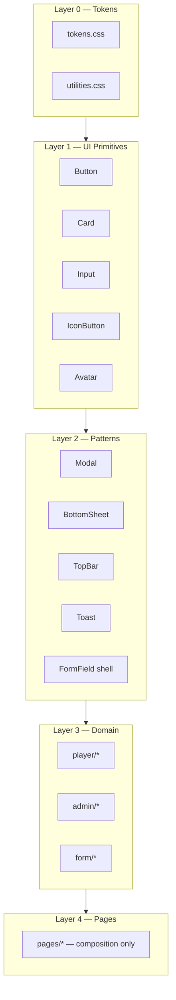

# MesseBuddy Component Architecture

Design-centric modularization plan for the React + CSS codebase. Complements [`design-tokens.md`](design-tokens.md) (token values) and [`SPECS.md`](../SPECS.md) (domain constraints).

---

## Goals

1. **Design language in code** — tokens → primitives → patterns → domain → pages
2. **Shrink `index.css`** — import manifest only; styles live in focused CSS files
3. **No design inline styles** — geometry/dynamic layout only (maps, charts, camera)
4. **Composable UI** — pages assemble patterns; patterns wrap primitives

---

## Layer model



| Layer | Location | Responsibility |
|-------|----------|----------------|
| 0 | `src/styles/` | Tokens, reset, utilities, BEM blocks |
| 1 | `src/components/ui/` | Thin typed wrappers over BEM classes |
| 2 | `src/components/patterns/` | Cross-route UX (modals, chrome, toasts) |
| 3 | `src/components/{admin,player,form,qr,tutorial}/` | Feature-specific UI |
| 4 | `src/pages/` | Data wiring + layout composition (< 200 lines) |

---

## CSS architecture

### Import order (`src/index.css`)

```css
@import url("…Geist fonts…");
@import "./styles/reset.css";
@import "./styles/tokens.css";
@import "./styles/utilities.css";
@import "./styles/layouts/page.css";
@import "./styles/layouts/landing.css";
@import "./styles/components/button.css";
@import "./styles/components/card.css";
@import "./styles/components/form.css";
@import "./styles/components/icon-button.css";
@import "./styles/components/avatar.css";
@import "./styles/components/topbar.css";
@import "./styles/components/modal.css";
@import "./styles/components/bottom-sheet.css";
@import "./styles/components/a11y.css";
@import "./styles/components/chat.css";
@import "./styles/components/map.css";
@import "./styles/components/shared.css";
@import "./styles/components/player.css";
@import "./styles/components/admin.css";
@import "./styles/components/tutorial.css";
@import "./styles/legacy.css";   /* delete when empty — see Remaining CSS work */
```

### File naming

| Prefix | Scope | Example |
|--------|-------|---------|
| `core-` | Utility class | `.core-flex-row` |
| `.btn`, `.card` | Primitive BEM block | `button.css` |
| `.topbar` | Pattern chrome | `topbar.css` |
| `.landing__` | Page layout | `layouts/landing.css` |
| `{feature}-` | Domain component | `mission-card` |

### Co-location rule

Each primitive has a matching CSS file under `src/styles/components/`. The React component applies BEM classes; it does not embed design values.

---

## UI primitives (Layer 1)

Implemented in `src/components/ui/`. Import via barrel:

```ts
import { Button, Card, Input, IconButton, Avatar } from "../components/ui/index.ts";
```

### Button

```tsx
<Button variant="primary" fullWidth>Join session</Button>
<Button variant="ghost" disabled>Back</Button>
```

| Prop | Values | CSS |
|------|--------|-----|
| `variant` | `primary`, `secondary`, `ghost`, `destructive` | `.btn--{variant}` |
| `fullWidth` | boolean | `.btn--full` |

### Card

```tsx
<Card padding="md">…</Card>
```

Maps to `.card` with optional padding modifiers.

### Input / Textarea

```tsx
<Input hasError={!!error} aria-invalid={!!error} />
<Textarea rows={4} />
```

Maps to `.form-input` / `.form-input--error`.

### IconButton

```tsx
<IconButton variant="onPrimary" aria-label="Log out" onClick={onLogout}>
  <MdLogout size={18} />
</IconButton>
```

| `variant` | Use |
|-----------|-----|
| `default` | Muted icon on light surfaces |
| `onPrimary` | Icons on navy TopBar |

### Avatar

```tsx
<Avatar src={url} initials="HK" onClick={onEdit} aria-label="Edit profile" />
```

Maps to `.avatar` block. Replaces ad-hoc `topbar__avatar` inline styles.

### Class helper

`src/utils/cn.ts` — joins conditional class strings (no runtime dependency).

---

## Patterns (Layer 2)

Cross-cutting components that compose primitives.

| Pattern | Location | Notes |
|---------|----------|-------|
| `TopBar` | [`shared/TopBar.tsx`](../src/components/shared/TopBar.tsx) | Uses `Avatar`, `IconButton`; rename to `AppTopBar` planned |
| `Toast` | [`patterns/Toast.tsx`](../src/components/patterns/Toast.tsx) | CSS in `shared.css` |
| `Modal` | [`patterns/Modal.tsx`](../src/components/patterns/Modal.tsx) | Centered dialogs |
| `BottomSheet` | [`patterns/BottomSheet.tsx`](../src/components/patterns/BottomSheet.tsx) | Drag handle, backdrop |
| `ConfirmDialog` | [`shared/ConfirmDialog.tsx`](../src/components/shared/ConfirmDialog.tsx) | Wraps `Modal` |

---

## Semantic tokens

Role and mission-type colors live in `tokens.css` — never hardcode HSL in TSX.

| Token | Use |
|-------|-----|
| `--color-role-player` / `--color-role-player-bg` | Landing employee profile |
| `--color-role-admin` / `--color-role-admin-bg` | Landing admin profile |
| `--color-mission-text` / `link` / `form` | Admin mission type badges |

Apply via `data-role` or `data-mission-type` attributes in CSS.

---

## Governance

1. **No new colors in TSX** — extend `tokens.css` + document in `design-tokens.md`
2. **No `style={{}}` for design** — allowed for dynamic geometry only
3. **≥ 2 pages → primitive or pattern** — not page-local CSS
4. **Page files < 200 lines** — extract views to `pages/<route>/`
5. **New overlays → `Modal` or `BottomSheet`** — no new backdrop BEM blocks
6. **Icons → `react-icons` only** — no emoji/ASCII icons

---

## CSS inventory

`src/index.css` is an import manifest only. Styles live in focused files:

| File | Scope |
|------|-------|
| `reset.css`, `tokens.css`, `utilities.css` | Foundation |
| `layouts/page.css`, `layouts/landing.css` | Page shells |
| `components/button.css` … `avatar.css` | UI primitives |
| `components/topbar.css`, `modal.css`, `bottom-sheet.css` | Patterns |
| `components/chat.css`, `map.css` | Chat + milestone map |
| `components/shared.css`, `player.css`, `admin.css`, `tutorial.css` | Domain |
| `legacy.css` | **~1,240 lines** still to extract (see below) |

### Landing page

- `src/pages/landing/` — `LandingShell`, `ProfileCard`, `ProfileList`, `EmployeeForm`, `AdminForm`, `RecoverySection`
- `LandingPage.tsx` — composition only (~75 lines)
- Role accents via `data-role` + `--color-role-*` tokens (no inline HSL in TSX)

### Patterns in use

`Modal`, `BottomSheet`, and `Toast` back: `ConfirmDialog`, `RecoveryKeyModal`, `NameCaptureModal`, `SaveTemplateModal`, `MissionDetailPopup`, `AdminQRScannerModal`, `ResourcesEditor`, `MissionBottomSheet` (chrome).

---

## Remaining CSS work

Drain `legacy.css` into focused files, then delete it. Page splits are the main driver:

| Target | Action |
|--------|--------|
| `HireDetailPage.tsx` | Split into `src/pages/hire-detail/` views; extract hire-header, analytics, editor chrome CSS |
| `PlayerCockpitPage.tsx` | Split into `src/pages/player-cockpit/` views; move cockpit layout + tab bar from `legacy.css` → `player.css` |
| Sidebar + mission list | `legacy.css` → `components/sidebar.css` or extend `player.css` |
| QR scanner, form shell, prose | `legacy.css` → `components/qr.css`, `form.css`, `shared.css` as appropriate |
| Segment group, swipe-delete, mission list item | `legacy.css` → `admin.css` |

**Exit criterion:** `legacy.css` is empty and removed from `index.css`.

---

## Adding a new screen

1. Check `design-tokens.md` component catalog — reuse before creating
2. Compose from `ui/` + `patterns/`
3. Domain logic in `src/components/{domain}/`
4. Page file wires hooks + adapter calls only
5. New shared styles → appropriate `src/styles/components/*.css` file
6. Smoke test at **390×844** after UI changes

---

## References

- [`design-tokens.md`](design-tokens.md) — color, type, spacing values
- [`src/styles/tokens.css`](../src/styles/tokens.css) — runtime token source
- [`src/components/ui/index.ts`](../src/components/ui/index.ts) — primitive exports
- [`AGENTS.md`](../AGENTS.md) — stack, routes, constraints
