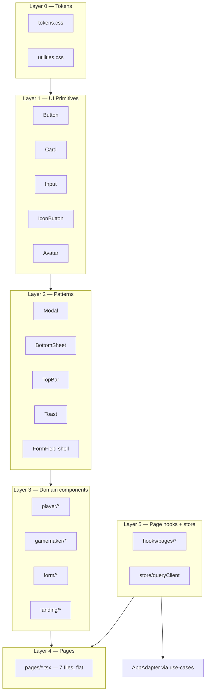
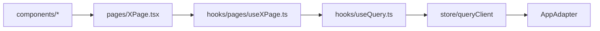

# MesseBuddy Component Architecture

Design-centric modularization plan for the React + CSS codebase. Complements [`design-tokens.md`](design-tokens.md) (token values) and [`SPECS.md`](../SPECS.md) (domain constraints).

**Implementation plan:** [`plans/pages-and-data-refactor.md`](../plans/pages-and-data-refactor.md) (approved flat pages + query store).

---

## Goals

1. **Design language in code** — tokens → primitives → patterns → domain → pages
2. **Shrink `index.css`** — import manifest only; styles live in focused CSS files
3. **No design inline styles** — geometry/dynamic layout only (maps, charts, camera)
4. **Composable UI** — pages assemble components; components stay presentational
5. **Thin pages** — seven route composers in flat `pages/`; all other UI in `components/`

---

## Layer model



| Layer | Location | Responsibility |
|-------|----------|----------------|
| 0 | `src/styles/` | Tokens, reset, utilities, BEM blocks |
| 1 | `src/components/shared/` | Primitives + cross-route UX (buttons, modals, chrome) |
| 2 | `src/components/{gamemaker,player,form,qr,tutorial,landing}/` | Feature-specific presentational UI |
| 3 | `src/pages/` | **Seven** route composers only — wire hooks, pick pane/tab, render components |
| 4 | `src/hooks/pages/` | Per-page data: route params → query keys → actions |
| 4 | `src/store/` | FLUX read cache: dedup, invalidate, loading semantics |

---

## Page authoring rules

### What is a page file?

A file in `src/pages/` exists only when the user crosses a **distinct route context**:

| Separate `pages/*.tsx` | Same page file (in-page state) |
|------------------------|--------------------------------|
| Different role shell (player vs GM vs public) | Wizard **steps** (linear next/back) |
| Leaves parent shell (form mission, QR validation) | **Tabs** on the same shell |
| External deep link entry (`/join/…`, `/validate/…`) | Loading / error / empty branches |
| | Tutorial overlay, modals, bottom sheets |

**Approved inventory (7 files):** `LandingPage`, `PlayerCockpitPage`, `PlayerFormPage`, `GmHomePage`, `GmPlayerDetailPage`, `ValidationPage`, `NotFoundPage`.

`src/pages/` rules:

- **Flat only** — no subfolders, no `.ts` helpers in `pages/`
- **Target < 200 lines** — extract markup to `components/{domain}/`
- **No `useEffect` + `adapter.*`** — reads go through `hooks/pages/` + `store/`
- **No business logic in JSX** — page hook returns data + actions; page renders branches

### Tabs and wizards without extra page files

Multiple URL paths may render the **same** page component. The page derives the active pane from the pathname:

```tsx
// App.tsx — one component, two paths
{ path: "/session/:sessionId", element: <PlayerCockpitPage /> }
{ path: "/session/:sessionId/assistant", element: <PlayerCockpitPage /> }
```

`RouteTabBar` uses `NavLink` to real paths — not `useState` tab keys.

### Component authoring rules

| Rule | Detail |
|------|--------|
| **Presentational** | Domain components receive data + callbacks via props; no `useAdapter` |
| **No fetch in components** | Data fetching lives in `hooks/pages/` + `store/` |
| **≥ 2 pages → shared** | Reuse `components/shared/` primitive or pattern before duplicating |
| **Overlays** | `Modal` / `BottomSheet` in `components/` — never a separate page file |
| **Co-locate CSS** | BEM in `src/styles/components/`; see CSS section below |
| **Icons** | `react-icons` only — no emoji/ASCII icons |
| **Extract when large** | Component file > ~200 lines → split sub-components in same domain folder |

### Page hook contract

Each page has one hook in `hooks/pages/` (e.g. `usePlayerCockpitPage.ts`):

```typescript
interface PageHookResult {
  readonly data: { /* view model fields */ };
  readonly isInitialLoading: boolean;  // no data yet → full spinner
  readonly isRefreshing: boolean;      // has data → keep UI visible
  readonly error: Error | null;
  readonly actions: { /* mutations, navigation helpers */ };
}
```

Pages must not combine unrelated hooks that each fetch the same collections. One hook orchestrates query keys for that route.

---

## Data wiring (FLUX reads)



- **Reads:** `useQuery(key)` — coalesced, cacheable
- **Writes:** `useMutation` → adapter / use-case → `invalidateQuery(keys)`
- **SSE:** patch progress key in store; avoid full refetch
- **Replace `useSession`** with `sessionMeta` + `journey` keys (see refactor plan)

---

## CSS architecture

### Import order (`src/index.css`)

```css
@import url("…Geist fonts…");
@import "./styles/reset.css";
@import "./styles/tokens.css";
@import "./styles/utilities.css";
@import "./styles/layouts/page.css";
@import "./styles/layouts/landing.css";
@import "./styles/components/button.css";
@import "./styles/components/card.css";
@import "./styles/components/form.css";
@import "./styles/components/icon-button.css";
@import "./styles/components/avatar.css";
@import "./styles/components/topbar.css";
@import "./styles/components/modal.css";
@import "./styles/components/bottom-sheet.css";
@import "./styles/components/a11y.css";
@import "./styles/components/chat.css";
@import "./styles/components/map.css";
@import "./styles/components/sidebar.css";
@import "./styles/components/qr.css";
@import "./styles/components/shared.css";
@import "./styles/components/player.css";
@import "./styles/components/gamemaker.css";
@import "./styles/components/tutorial.css";
```

### File naming

| Prefix | Scope | Example |
|--------|-------|---------|
| `core-` | Utility class | `.core-flex-row` |
| `.btn`, `.card` | Primitive BEM block | `button.css` |
| `.topbar` | Pattern chrome | `topbar.css` |
| `.landing__` | Landing layout | `layouts/landing.css` |
| `{feature}-` | Domain component | `mission-card` |

### Co-location rule

Each primitive has a matching CSS file under `src/styles/components/`. The React component applies BEM classes; it does not embed design values.

---

## Shared components (Layer 1)

Implemented in `src/components/shared/`. Import via barrel:

```ts
import { Button, Card, Input, IconButton, Avatar } from "../components/shared/index.ts";
```

### Button

```tsx
<Button variant="primary" fullWidth>Join session</Button>
<Button variant="ghost" disabled>Back</Button>
```

| Prop | Values | CSS |
|------|--------|-----|
| `variant` | `primary`, `secondary`, `ghost`, `destructive` | `.btn--{variant}` |
| `fullWidth` | boolean | `.btn--full` |

### Card

```tsx
<Card padded={false}>…</Card>
```

Maps to `.card` with optional `.card--flush`.

### Input / Textarea

```tsx
<Input hasError={!!error} aria-invalid={!!error} />
<Textarea rows={4} />
```

Maps to `.form-input` / `.form-input--error`.

### IconButton

```tsx
<IconButton variant="onPrimary" aria-label="Log out" onClick={onLogout}>
  <MdLogout size={18} />
</IconButton>
```

| `variant` | Use |
|-----------|-----|
| `default` | Muted icon on light surfaces |
| `onPrimary` | Icons on navy TopBar |

### Avatar

```tsx
<Avatar src={url} initials="HK" onClick={onEdit} aria-label="Edit profile" />
```

Maps to `.avatar` block.

### Class helper

`src/utils/cn.ts` — joins conditional class strings (no runtime dependency).

---

## Overlay & chrome components

Cross-cutting components that compose primitives.

| Component | Location | Notes |
|-----------|----------|-------|
| `TopBar` | [`shared/TopBar.tsx`](../src/components/shared/TopBar.tsx) | Uses `Avatar`, `IconButton` |
| `Toast` | [`shared/Toast.tsx`](../src/components/shared/Toast.tsx) | CSS in `shared.css` |
| `Modal` | [`shared/Modal.tsx`](../src/components/shared/Modal.tsx) | Centered dialogs |
| `BottomSheet` | [`shared/BottomSheet.tsx`](../src/components/shared/BottomSheet.tsx) | Drag handle, backdrop |
| `RouteTabBar` | [`shared/RouteTabBar.tsx`](../src/components/shared/RouteTabBar.tsx) | `NavLink` tabs |
| `ConfirmDialog` | [`shared/ConfirmDialog.tsx`](../src/components/shared/ConfirmDialog.tsx) | Wraps `Modal` |

---

## Semantic tokens

Role and mission-type colors live in `tokens.css` — never hardcode HSL in TSX.

| Token | Use |
|-------|-----|
| `--color-role-player` / `--color-role-player-bg` | Landing employee profile |
| `--color-role-gamemaker` / `--color-role-gamemaker-bg` | Landing Game Maker profile |
| `--color-mission-text` / `link` / `form` | Admin mission type badges |

Apply via `data-role` or `data-mission-type` attributes in CSS.

---

## Governance

1. **No new colors in TSX** — extend `tokens.css` + document in `design-tokens.md`
2. **No `style={{}}` for design** — allowed for dynamic geometry only
3. **≥ 2 pages → primitive or pattern** — not page-local CSS
4. **Page files < 200 lines** — extract views to `components/{domain}/`, not `pages/subfolders/`
5. **New overlays → `Modal` or `BottomSheet`** — no new backdrop BEM blocks
6. **Icons → `react-icons` only** — no emoji/ASCII icons
7. **Seven page files max** — tabs, wizards, and state branches stay in the owning page
8. **No adapter in components** — `hooks/pages/` + `store/` only

---

## Page map (target)

| Page file | Routes | Key components |
|-----------|--------|----------------|
| `LandingPage.tsx` | `/`, `/join/:sessionId` | `LandingShell`, `ProfileList`, `GameMakerForm`, `EmployeeForm` |
| `PlayerCockpitPage.tsx` | `/session/:id`, `.../assistant` | `PlayerDashboardView`, `PlayerAssistantView`, `TutorialOverlay`, `MissionDetailPopup`, `MilestoneSidebarViewer` |
| `PlayerFormPage.tsx` | `/form/:sessionId/:missionId` | `FormShell`, `FormField` |
| `GmHomePage.tsx` | `/gamemaker/:id`, `.../library` | `GmPlayersTab`, `ResourceLibraryTab`, `OnboardingJourneyModal` |
| `GmPlayerDetailPage.tsx` | `/gamemaker/:id/player/:pid`, tab + scan paths | `PlayerAnalyticsTab`, `PlayerCustomizeTab`, `PlayerBuddyTab`, `PlayerPreboardingTab`, `MissionBottomSheet`, scan viewport |
| `ValidationPage.tsx` | `/validate/:sessionId` | `FetchErrorPanel`, confirm card |
| `NotFoundPage.tsx` | `*` | — |

Hook per page: `hooks/pages/use{PageName}.ts` (drop `.tsx` suffix from page name).

---

## Adding a new screen

1. **Decide if it is a new page file** — use the table in [Page authoring rules](#page-authoring-rules). Default: extend an existing page.
2. Check `design-tokens.md` component catalog — reuse before creating.
3. Compose from `components/shared/` and domain folders.
4. Add query keys + `hooks/pages/use…Page.ts` — do not add fetch effects to the page file.
5. New shared styles → appropriate `src/styles/components/*.css` file.
6. Smoke test at **390×844** per `design-tokens.md` §10.

---

## References

- [`design-tokens.md`](design-tokens.md) — color, type, spacing, page composition map
- [`plans/pages-and-data-refactor.md`](../plans/pages-and-data-refactor.md) — migration phases
- [`src/styles/tokens.css`](../src/styles/tokens.css) — runtime token source
- [`src/components/shared/index.ts`](../src/components/shared/index.ts) — shared component exports
- [`AGENTS.md`](../AGENTS.md) — stack, routes, constraints
