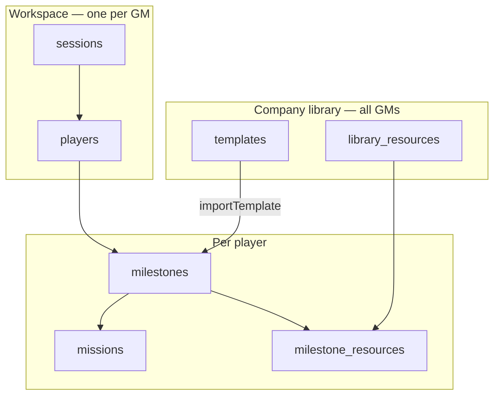

# Architecture diagrams

PlantUML sources for MesseBuddy. Render with any PlantUML viewer or IDE plugin.

**Authoritative for data model:** [`pb-schema.md`](pb-schema.md) · [`ts-data-model.puml`](ts-data-model.puml)  
**Authoritative for product flows:** [`SPECS.md`](../SPECS.md) · [`player-lifecycle.puml`](player-lifecycle.puml)

> **Note:** [`c4component.puml`](c4component.puml) and [`app-class-component.puml`](app-class-component.puml)
> describe an earlier UI decomposition (`AdminCockpitPage`, etc.). Route and page
> names in code are migrating per ARCH-09 (see implementation plan). Data-layer
> diagrams reflect the locked architecture (D-ARCH-2 … D-NAMING-2).

## Diagram index

| File | Purpose |
| ---- | ------- |
| [`c4context.puml`](c4context.puml) | C4 Level 1 — system context (players, GMs, AI, vector store) |
| [`c4container.puml`](c4container.puml) | C4 Level 2 — Docker Compose containers |
| [`c4component.puml`](c4component.puml) | C4 Level 3 — React PWA components (historical UI names) |
| [`ts-data-model.puml`](ts-data-model.puml) | Domain types, collections, relationships (target) |
| [`player-lifecycle.puml`](player-lifecycle.puml) | Sequence: GM workspace → add player → claim → monitor |
| [`mission-validation-flow.puml`](mission-validation-flow.puml) | Sequence: four `validationMethod` strategies |
| [`qr-routing.puml`](qr-routing.puml) | Invite, GM validation, and peer-scan URL routing |
| [`app-class-component.puml`](app-class-component.puml) | Component class diagram (historical UI names) |
| [`pb-schema.md`](pb-schema.md) | PocketBase collections, indexes, migrations |

## Architecture summary (2026-07-05)

**Identity:** GM on `sessions` (`gameMakerId`, `gmRecoveryKey`). Players on
`players` (`inviteToken`, `claimStatus`). `UserRole` in `CachedIdentity` only.
