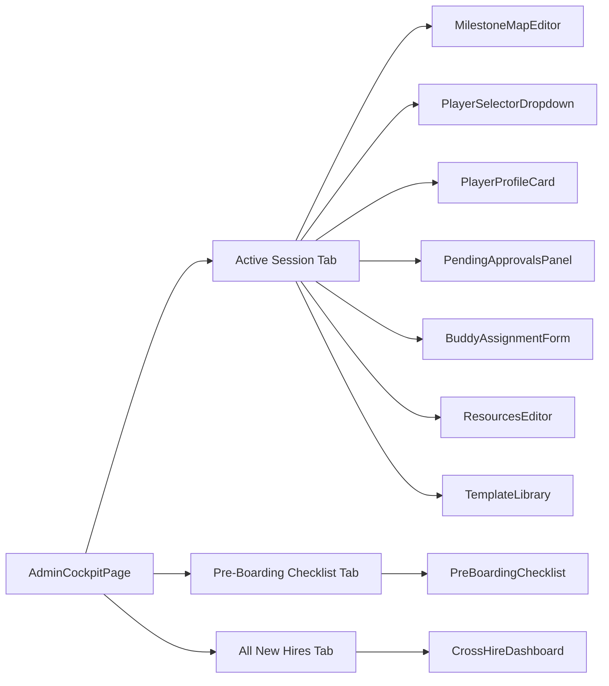
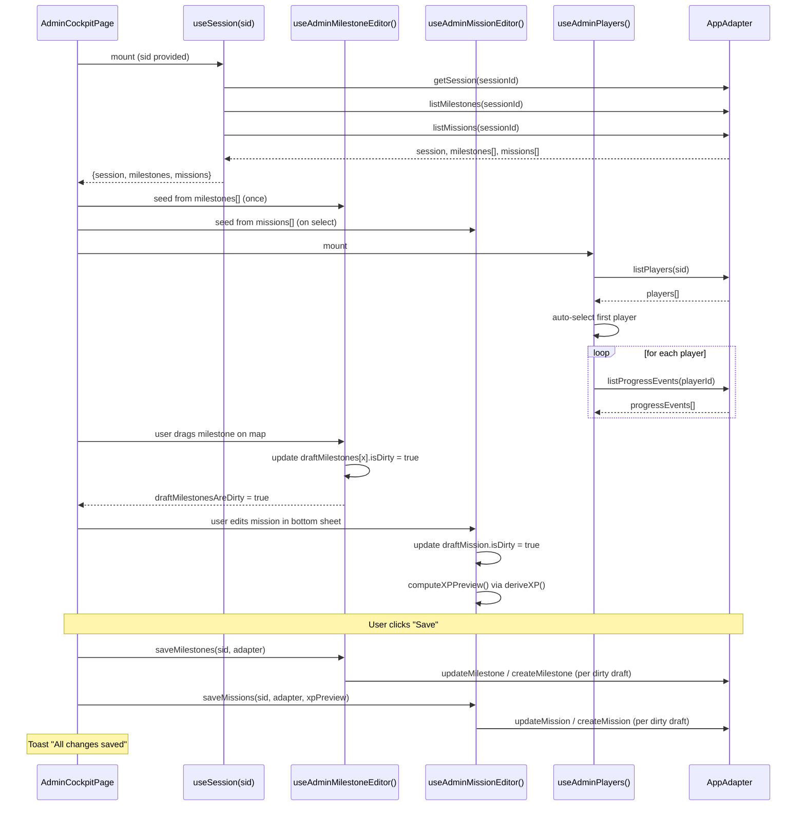

# Admin Dashboard Analysis — Dynamic Data & Integration Report

## 1. Overview: Page Structure and Tab Architecture

The [`AdminCockpitPage`](src/pages/AdminCockpitPage.tsx) is a single-page application with three tabs, each rendering distinct data views:

| Tab | Key | Component(s) |
|-----|-----|-------------|
| Active Session | `activeSession` | Map editor + sidebar panels (player selection, approvals, buddy assignment, resources, templates) |
| Pre-Boarding Checklist | `preBoarding` | [`PreBoardingChecklist`](src/components/admin/PreBoardingChecklist.tsx:1) component |
| All New Hires | `allNewHires` | [`CrossHireDashboard`](src/components/admin/CrossHireDashboard.tsx:39) with cross-session data |

The page is parameterized by a URL `sessionId` (via React Router's `useParams`). The admin identity is resolved from the session storage via [`useIdentity()`](src/hooks/useIdentity.ts:4), which reads the `mb_identity` key.



---

## 2. Dynamic Data Categories

### A. Session-Level Configuration (Admin-Editable)

| Field | Source | Editable? | How |
|-------|--------|-----------|-----|
| [`Session.name`](src/types/domain.ts:19) | `useSession` → adapter | No (display only) | Shown in TopBar as "Game Master" |
| [`Session.bgImageUrl`](src/types/domain.ts:20) | `useSession` + local override state | **Yes** — via background image upload | [`handleUploadBackground()`](src/pages/AdminCockpitPage.tsx:234) calls `adapter.updateSession(sid, { bgImageUrl })`, sets a local `bgImageUrlOverride` to avoid re-fetching the session object. The override is passed to [`MilestoneMapEditor`](src/components/admin/MilestoneMapEditor.tsx:1). |
| [`Session.mapNodeScale`](src/types/domain.ts:30) | `useSession` → adapter | No (display only) | Passed as prop to MilestoneMapEditor for canvas scaling. Fraction of background image covered by the node canvas (0–1). CSS transform applied: `scale(1 / mapNodeScale)`. |
| [`Session.gameMakerId`](src/types/domain.ts:32) | `useSession` → adapter | No (display only) | Raw UID string, not a PB relation. |
| [`Session.qrSecret`](src/types/domain.ts:33) | `useSession` → adapter | No (display only) | HMAC key for QR signing (C-16); GM verify only. |

### B. Milestones (Admin-Editable with Draft Pattern)

**Source:** Fetched once by [`useSession()`](src/hooks/useSession.ts:16) via `adapter.listMilestones(sessionId)`.

**Editing mechanism:** The [`useAdminMilestoneEditor`](src/hooks/useAdminMilestoneEditor.ts:49) hook implements a **draft pattern**:
- On first mount, it seeds local draft state from the server-fetched milestones ([`line 61-68`](src/hooks/useAdminMilestoneEditor.ts:61)).
- All edits (drag-drop repositioning, rename, add, delete, reset-to-grid) modify only the local `draftMilestones` array and set `isDirty: true`.
- The admin must explicitly call [`saveMilestones()`](src/pages/AdminCockpitPage.tsx:258), which iterates over dirty drafts and calls `adapter.updateMilestone()` or `adapter.createMilestone()`.
- A "Discard" button ([`handleDiscard()`](src/pages/AdminCockpitPage.tsx:284)) resets the draft to the original server state.

**Rendered on:** [`MilestoneMapEditor`](src/components/admin/MilestoneMapEditor.tsx:1) — the map canvas where milestones are draggable nodes with XP pill counts.

### C. Missions (Admin-Editable with Draft Pattern)

**Source:** Fetched once by [`useSession()`](src/hooks/useSession.ts:16) via `adapter.listMissions(sessionId)`.

**Editing mechanism:** The [`useAdminMissionEditor`](src/hooks/useAdminMissionEditor.ts:72) hook manages a more complex draft state:
- Missions are edited in the full-screen [`MissionBottomSheet`](src/components/admin/MissionBottomSheet.tsx:1), opened by clicking a milestone on the map.
- Drafts are keyed by local ID (not PB mission ID) to support both editing existing missions and creating new ones ([`line 69-70`](src/hooks/useAdminMissionEditor.ts:69)).
- Supports title, body (markdown), type (`text`, `link`, `form`), difficulty (1–5), tags, suggested due date, validation method, form field schemas, and `isInCurrentMissions`.
- **XP preview:** [`xpPreview`](src/hooks/useAdminMissionEditor.ts:172) is computed live via [`deriveXP()`](src/use-cases/deriveXP.ts:1) as the admin edits difficulty — it shows what XP this mission would earn at its current position in the milestone's mission chain.
- **Reorder tracking:** `missionOrderChanges` Map tracks drag-reordered missions separately from content changes ([`line 81`](src/hooks/useAdminMissionEditor.ts:81)).

**Rendered on:** [`MissionBottomSheet`](src/components/admin/MissionBottomSheet.tsx:1) — full-screen bottom sheet with mission editor, form field editor, and save actions.

### D. Players (Dynamic, Player-Context Dependent)

| Data | Source | How It Changes |
|------|--------|---------------|
| **Player list** | [`useAdminPlayers()`](src/hooks/useAdminPlayers.ts:40) → `adapter.listPlayers(sid)` | Populated on mount; auto-selects the first player ([`line 88-91`](src/hooks/useAdminPlayers.ts:88)). |
| **Selected player** | Dropdown in [`PlayerSelectorDropdown`](src/components/admin/PlayerSelectorDropdown.tsx:1) | Changes which player's progress, buddy profile, and approvals are shown. |
| **Player profile card** | [`PlayerProfileCard`](src/components/admin/PlayerProfileCard.tsx:9) — shows name, role, team, start date, total XP, milestone progress bar | Updates reactively when `selectedPlayerId` changes. The XP and milestone progress are computed from the player's progress events via [`computeProgress()`](src/use-cases/computeProgress.ts:1). |
| **Milestone progress** | Computed by [`computeProgress(selectedPlayer.id, missions, milestones, playerEvents)`](src/hooks/useAdminPlayers.ts:112) — re-derived at read time (C-11), never snapshotted. | Updates when any of the four inputs change. |

### E. Progress Events / Pending Approvals (Dynamic, Player-Context Dependent)

**Source:** [`useAdminPlayers()`](src/hooks/useAdminPlayers.ts:40) fetches all progress events for all players on mount ([`line 93-98`](src/hooks/useAdminPlayers.ts:93)), then filters to `status === "pendingApproval"` for the pending approvals panel.

**Rendered in:** [`PendingApprovalsPanel`](src/components/admin/PendingApprovalsPanel.tsx:13) — shows each pending event with player name, mission title, XP value, and approve/reject buttons.

**Admin actions:**
- **Approve** → calls `adapter.upsertProgressEvent(playerId, missionId, { status: "completed", validatedBy, validatedAt })` ([`line 59-73`](src/hooks/useAdminPlayers.ts:59)). This is the single upsert point enforced by C-05.
- **Reject** → calls `adapter.upsertProgressEvent(playerId, missionId, { status: "pending" })` ([`line 126-138`](src/hooks/useAdminPlayers.ts:126)), resetting the event to pending state.

### F. Buddy Assignment (Player-Context Dependent)

**Source:** Loaded on player selection via `adapter.getBuddyProfile(playerId)` in [`loadBuddyProfile()`](src/pages/AdminCockpitPage.tsx:175).

**Editable fields:** name, role, tenure, contactUrl — all stored in a local draft state (`buddyDraft`).

**Save action:** Calls `adapter.upsertBuddyProfile(selectedPlayerId, buddyDraft)` ([`line 218-230`](src/pages/AdminCockpitPage.tsx:218)).

**Rendered in:** [`BuddyAssignmentForm`](src/components/admin/BuddyAssignmentForm.tsx:16) — a form with player selector dropdown and text inputs.

### G. Resources (Admin-Owned Full CRUD)

**Source:** Fetched on mount via `adapter.listResources(sid)` ([`line 109-112`](src/pages/AdminCockpitPage.tsx:109)).

> **Note:** The [`useResources`](src/hooks/useResources.ts:1) hook exists but is player-only — it filters resources to `isVisibleToPlayer` only. Admin uses inline state with direct adapter calls.

**Editable operations:**
- **Add** → `adapter.createResource(data)` — form with title, type (resourceType), URL.
- **Delete** → `adapter.deleteResource(resourceId)`.
- **Toggle visibility** → `adapter.updateResource(resourceId, { isVisibleToPlayer: visible })` — checkbox toggle per resource.

**Rendered in:** [`ResourcesEditor`](src/components/admin/ResourcesEditor.tsx:15) — list of resources with visibility checkboxes and add form.

### H. Session Invite / QR Code (Static but Dynamic by Session)

**Source:** Derived from `sessionId` prop — no adapter call needed.

**Computed value:** `joinUrl = \`${location.origin}/join/${sessionId}\`` ([`line 50`](src/components/admin/SessionInviteCard.tsx:50)).

**Rendered in:** [`SessionInviteCard`](src/components/admin/SessionInviteCard.tsx:46) — displays a QR code (rendered via CDN-loaded `qrcode.js`) and the join URL with copy button.

### I. Pre-Boarding Checklist (Tab-Specific, Session-Level)

**Source:** Seeded from `session.preBoardingChecks` on first load ([`line 27-31`](src/hooks/usePreBoardingChecklist.ts:27)).

**Editable operations:**
- **Toggle item** → calls `adapter.updateSession(sid, { preBoardingChecks: next })`.
- **Add item** → creates new `PreBoardingCheckItem` with generated ID.
- **Mark all done** → sets all items to `checked: true`.

**Rendered in:** [`PreBoardingChecklist`](src/components/admin/PreBoardingChecklist.tsx:1) — only visible when the "Pre-Boarding Checklist" tab is active.

### J. Cross-Hire / All New Hires (Cross-Session Data)

**Source:** [`useCrossHireData()`](src/hooks/useCrossHireData.ts:10) fetches **all sessions**, then for each session, all players and their progress events — building a cross-session view.

**Computed per hire row:**
- `progressPercent` — average of milestone percentComplete values (rounded).
- `daysSinceLastActivity` — derived from max(updated timestamp) across the player's progress events.
- `isStalled` — true if daysSinceLastActivity > 3.

**Rendered in:** [`CrossHireDashboard`](src/components/admin/CrossHireDashboard.tsx:39) — summary stats (active hires, avg progress, stalled count), filterable list with status badges and progress bars. Only active when the "All New Hires" tab is selected ([`line 100`](src/pages/AdminCockpitPage.tsx:100)).

### K. Template Library (Admin-Owned Export/Import)

**Source:** [`useTemplateLibrary()`](src/hooks/useTemplateLibrary.ts:14) — consumes `adminResources`, milestones, missions, and session data to build template summaries via [`toTemplateSummaries()`](src/utils/templateSummary.ts:1).

**Editable operations:**
- **Save as template** → calls `templateLibrary.handleExportTemplate(replaceTarget)` ([`line 642`](src/pages/AdminCockpitPage.tsx:642)). Exports milestones, missions (with `_milestoneOrder`), formSchemas (with `_missionOrder`), and resources — all with PBRecord IDs stripped.
- **Load template** → `templateLibrary.handleLoadTemplate(id)` — bootstraps a new session from the template via [`bootstrapFromTemplate()`](src/use-cases/bootstrapFromTemplate.ts:1).
- **Delete template** → `templateLibrary.handleDeleteTemplate(id)`.

**Rendered in:** [`TemplateLibrary`](src/components/shared/TemplateLibrary.tsx:1) component + [`SaveTemplateModal`](src/components/admin/SaveTemplateModal.tsx:1).

### L. QR Scanner (Modal Overlay)

**Source:** Controlled by local `scannerOpen` state ([`line 68`](src/pages/AdminCockpitPage.tsx:68)).

**Rendered in:** [`AdminQRScannerModal`](src/components/admin/AdminQRScannerModal.tsx:1) — full-screen modal for scanning player QR codes. Triggered from the map editor's "Scan" button ([`line 476`](src/pages/AdminCockpitPage.tsx:476)).

**Data flow:** Scanned QR payload is a [`QRPayload`](src/types/value-objects.ts:17) containing `playerId`, `missionId`, `sessionId`, `xpValue`, `issuedAt`, and HMAC-SHA256 signature. After decoding, it becomes [`ScanData`](src/types/value-objects.ts:27) enriched with `playerName` and `missionTitle`.

---

## 3. Data Flow Architecture

```mermaid
graph TB
    subgraph AdminCockpitPage[src/pages/AdminCockpitPage.tsx]
        direction LR
        
        subgraph Identity["Identity Layer"]
            I1[useIdentity()]
            I2[identity.uid → validatorUid]
        end
        
        subgraph SessionLayer["Session Data Layer"]
            S1[useSession(sid)]
            S2[session, milestones[], missions[]]
            S3[refresh: () → void]
        end
        
        subgraph MilestoneEditor["Milestone Editor"]
            M1[useAdminMilestoneEditor(milestones)]
            M2[draftMilestones[] + dirty tracking]
            M3[saveMilestones / discardMilestones]
        end
        
        subgraph MissionEditor["Mission Editor"]
            Mi1[useAdminMissionEditor(missions)]
            Mi2[draftMissions Map + orderChanges]
            Mi3[xpPreview via deriveXP()]
            Mi4[saveMissions / discardMissions]
        end
        
        subgraph PlayerLayer["Player Data Layer"]
            P1[useAdminPlayers({sid, milestones, missions})]
            P2[players[], selectedPlayerId]
            P3[selectedPlayerProgress via computeProgress()]
            P4[pendingEvents[] filtered from all progress events]
            P5[handleApprove / handleReject]
        end
        
        subgraph PreBoarding["Pre-Boarding Checklist"]
            PB1[usePreBoardingChecklist(sid, session)]
            PB2[items[], onToggle(), onAdd(), onMarkAllDone()]
        end
        
        subgraph CrossHire["Cross-Hire Data"]
            CH1[useCrossHireData(adapter, activeTab === ALL_NEW)]
            CH2[rows[] — cross-session progress data]
        end
        
        subgraph TemplateLibrary["Template Library"]
            TL1[useTemplateLibrary({sid, session, milestones, missions})]
            TL2[templates[], handleLoadTemplate(), handleExportTemplate()]
        end
        
        Resources["Resources (inline state) → adapter.listResources(sid)"]
        
        Buddy["Buddy Assignment → loadBuddyProfile(playerId)"]
    end
    
    I1 --> I2
    S1 --> S2
    S1 --> S3
    M1 --> M2
    Mi1 --> Mi2
    P1 --> P2
    P1 --> P3
    P1 --> P4
    PB1 --> PB2
    CH1 --> CH2
    TL1 --> TL2
    
    style AdminCockpitPage fill:#e8f0fe,stroke:#1a73e8
```

### Hook Lifecycle Diagram



---

## 4. Player-Context Dependent Data Summary

The following data **changes dynamically** when the admin selects a different player from the dropdown:

| Component | What Changes | Trigger |
|-----------|-------------|---------|
| [`PlayerProfileCard`](src/components/admin/PlayerProfileCard.tsx:9) | Name, role, team, start date, total XP, milestone progress bar | `selectedPlayer` + `selectedPlayerProgress` from hook |
| [`PendingApprovalsPanel`](src/components/admin/PendingApprovalsPanel.tsx:13) | List of pending approval requests (filtered by player's events) | `pendingEvents` from hook — re-fetched on every player change |
| [`BuddyAssignmentForm`](src/components/admin/BuddyAssignmentForm.tsx:16) | Pre-filled buddy profile data (name, role, tenure, contactUrl) or empty form | `adapter.getBuddyProfile(playerId)` called in `loadBuddyProfile()` |

---

## 5. Dirty State & Save Mechanics

The page tracks three independent dirty states ([`isDirty`](src/pages/AdminCockpitPage.tsx:243)):
1. **Milestone drafts** — `milestoneEditor.draftMilestonesAreDirty` (any milestone has `isDirty: true`)
2. **Mission content drafts** — `missionEditor.draftMissionsAreDirty` (any mission draft is dirty)
3. **Mission order changes** — `missionEditor.missionOrderChanges.size > 0`

A single "Save" button ([`handleSave()`](src/pages/AdminCockpitPage.tsx:256)) persists all three in sequence, followed by a toast notification. A "Discard" button resets both milestone and mission drafts to their original server state.

---

## 6. Key Type Definitions Referenced

### Domain Types (persisted)

| Type | File | Line | Description |
|------|------|------|-------------|
| [`Session`](src/types/domain.ts:19) | `domain.ts` | 19 | Session config with name, bgImageUrl, mapNodeScale, gameMakerId, qrSecret, preBoardingChecks |
| [`Player`](src/types/domain.ts:36) | `domain.ts` | 36 | Player profile with uid, recoveryKey, tutorialComplete, preferredName, pronouns, avatarUrl, role, team, startDate, location, timezone, skillsConfident, skillsDevelop, languages, workStyle, energizers, drainers |
| [`BuddyProfile`](src/types/domain.ts:59) | `domain.ts` | 59 | Buddy assignment with name, role, tenure, avatarUrl, contactUrl, quote, email, phone |
| [`Milestone`](src/types/domain.ts:72) | `domain.ts` | 72 | Milestone node with xPercent, yPercent, xpThreshold, order |
| [`Mission`](src/types/domain.ts:81) | `domain.ts` | 81 | Mission with title, body, type, externalUrl, difficulty, xpValue, tags, suggestedDueDate, order, isInCurrentMissions, validationMethod |
| [`ProgressEvent`](src/types/domain.ts:102) | `domain.ts` | 102 | Progress event with status, validatedBy, validatedAt, formResponse |
| [`Resource`](src/types/domain.ts:112) | `domain.ts` | 112 | Resource with title, description, type, url, isVisibleToPlayer |

### Value Objects (client-only, not persisted)

| Type | File | Line | Description |
|------|------|------|-------------|
| [`FieldSchema`](src/types/value-objects.ts:5) | `value-objects.ts` | 5 | Form field with id, label, type, required, placeholder, options |
| [`QRPayload`](src/types/value-objects.ts:17) | `value-objects.ts` | 17 | QR payload with playerId, missionId, sessionId, xpValue, issuedAt, hmac (HMAC-SHA256) |
| [`ScanData`](src/types/value-objects.ts:27) | `value-objects.ts` | 27 | Decoded scan data enriched with playerName and missionTitle |
| [`LocalIdentity`](src/types/value-objects.ts:38) | `value-objects.ts` | 38 | localStorage identity (mb_identity): uid, recoveryKey, sessionId, role, name, isDemo |

### Derived Types (computed at read time)

| Type | File | Line | Description |
|------|------|------|-------------|
| [`MilestoneProgress`](src/types/ephemeral.ts:20) | `ephemeral.ts` | 20 | Per-milestone progress with earnedXP, xpThreshold, percentComplete, status, completedMissionIds |
| [`PlayerProgress`](src/types/ephemeral.ts:29) | `ephemeral.ts` | 29 | Player-level progress with totalXP and milestoneProgress array |

### Draft Types (in-progress edits)

| Type | File | Line | Description |
|------|------|------|-------------|
| [`DraftMilestone`](src/types/ephemeral.ts:37) | `ephemeral.ts` | 37 | In-progress milestone edit with isDirty flag and optional bgImageUrl |
| [`DraftMission`](src/types/ephemeral.ts:47) | `ephemeral.ts` | 47 | In-progress mission edit with originalId, title, body, type, difficulty, tags, formFields |

### Export Types

| Type | File | Line | Description |
|------|------|------|-------------|
| [`TemplateExport`](src/types/exports.ts:18) | `exports.ts` | 18 | Template with milestones, missions (_milestoneOrder), formSchemas (_missionOrder), resources — IDs stripped |
| [`FullSessionExport`](src/types/exports.ts:33) | `exports.ts` | 33 | Full backup including session, players, progressEvents, buddyProfiles |

### Union Types (const + keyof pattern per C-12)

| Type | File | Line | Values |
|------|------|------|--------|
| [`MISSION_TYPE`](src/types/unions.ts:4) | `unions.ts` | 4 | TEXT, LINK, FORM |
| [`VALIDATION_METHOD`](src/types/unions.ts:19) | `unions.ts` | 19 | GM_APPROVE, SELF_APPROVE, QR |
| [`PROGRESS_STATUS`](src/types/unions.ts:27) | `unions.ts` | 27 | PENDING, PENDING_APPROVAL, COMPLETED, AUTO_APPROVED |
| [`MILESTONE_STATUS`](src/types/unions.ts:36) | `unions.ts` | 36 | UPCOMING, IN_PROGRESS, COMPLETED |
| [`RESOURCE_TYPE`](src/types/unions.ts:44) | `unions.ts` | 44 | GUIDE, VIDEO, LINK, DOCUMENT |
| [`FIELD_TYPE`](src/types/unions.ts:52) | `unions.ts` | 52 | TEXT, TEXTAREA, SELECT, MULTI_SELECT |

---

## 7. Adapter Interface Summary

The [`AppAdapter`](src/adapters/interface.ts:18) defines the single contract for all data access. The admin page uses these adapter methods directly:

| Method | Purpose |
|--------|---------|
| `getSession(sessionId)` | Fetch session config |
| `listSessions()` | All sessions (for cross-hire view) |
| `updateSession(sid, patch)` | Update session fields (bgImageUrl, preBoardingChecks) |
| `listMilestones(sessionId)` | Milestone list for a session |
| `createMilestone(data)` / `updateMilestone(id, patch)` / `deleteMilestone(id)` | CRUD milestones |
| `listMissions(sessionId)` | Mission list for a session |
| `createMission(data)` / `updateMission(id, patch)` / `deleteMission(id)` | CRUD missions |
| `getFormSchema(missionId)` | Fetch form field schema for FORM-type mission |
| `upsertProgressEvent(playerId, missionId, patch)` | Single upsert point (C-05) |
| `listProgressEvents(playerId)` | All progress events for a player |
| `getBuddyProfile(playerId)` / `upsertBuddyProfile(playerId, data)` | Buddy assignment CRUD |
| `listResources(sessionId)` / `createResource()` / `updateResource()` / `deleteResource()` | Resource CRUD (admin) |
| `listTemplates()` / `saveTemplate(template)` / `deleteTemplate(name)` | Template library operations |

---

## 8. Summary of Admin Capabilities

The admin can **view** and **edit**:
- Session background image, milestones (position/name), missions (content/difficulty/order/validation method/form schema/isInCurrentMissions), resources (CRUD + visibility toggle), pre-board checklist items, buddy assignments per player, template library entries.

The admin can **approve/reject** player mission progress events (pending approvals).

The admin can **view** (read-only):
- Player list with profile cards showing XP and milestone progress, cross-session hire progress dashboard, session invite QR code/URL.
