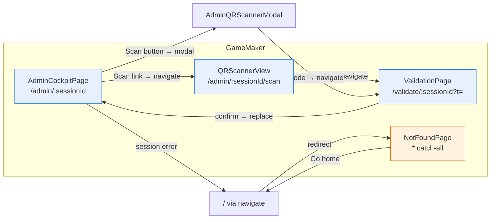
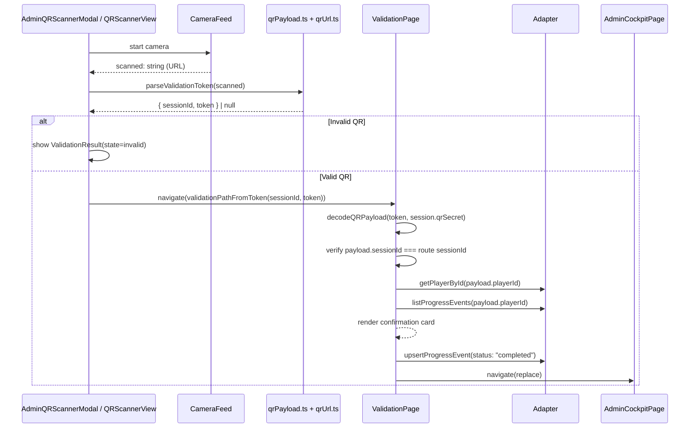
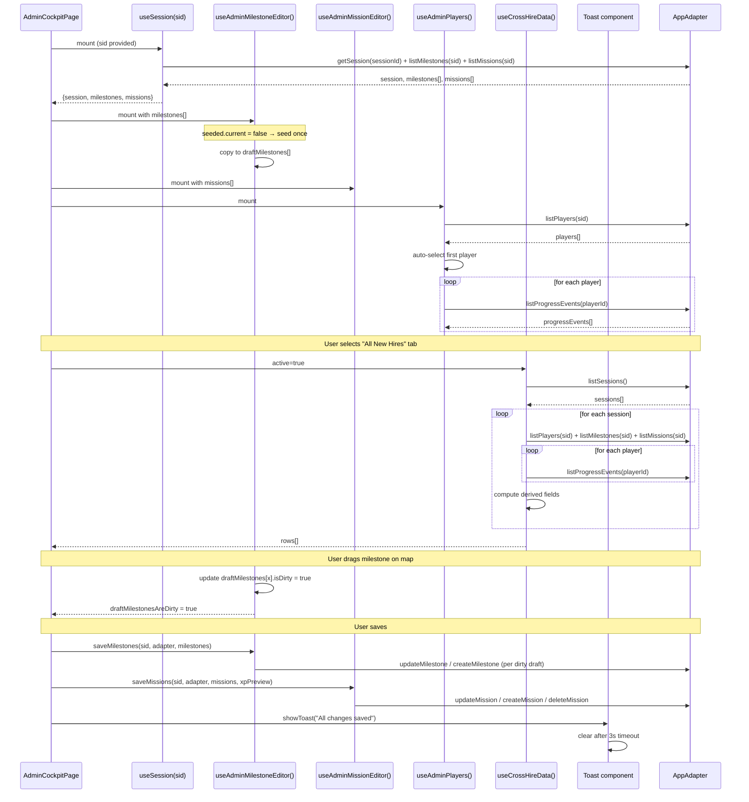
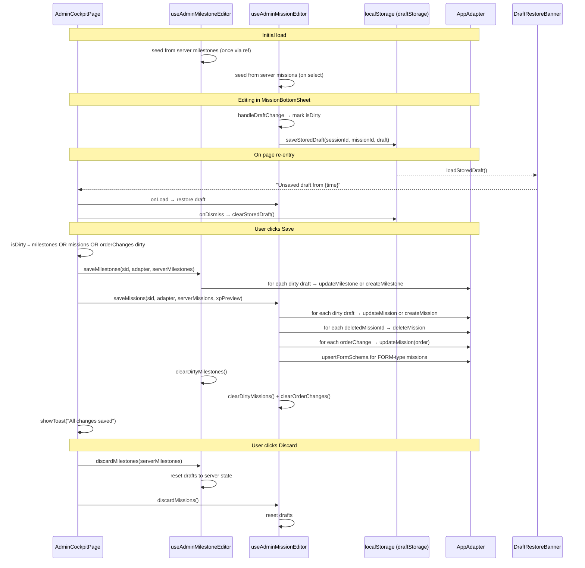

# Admin Dashboard Analysis — Dynamic Data & Integration Report

## 1. Overview: Page Architecture

The admin experience spans four pages—one main cockpit with three tabs and three supplementary pages. Each page serves a distinct role in session management, player oversight, and QR-based validation.

| # | Page | Route | Role | Purpose |
|---|------|-------|------|---------|
| 1 | [`AdminCockpitPage`](src/pages/AdminCockpitPage.tsx:41) | `/admin/:sessionId` | GameMaker | Central cockpit — 3 tabs for session editing, pre-boarding, and cross-hire oversight |
| 2 | [`QRScannerView`](src/pages/QRScannerView.tsx:14) | `/admin/:sessionId/scan` | GameMaker | Standalone full-page QR scanner, navigates to ValidationPage on scan |
| 3 | [`ValidationPage`](src/pages/ValidationPage.tsx:11) | `/validate/:sessionId?t=<token>` | GameMaker | Decodes QR payload, displays confirmation card, writes `completed` status |
| 4 | [`NotFoundPage`](src/pages/NotFoundPage.tsx:4) | `*` (catch-all) | Public | Error display for unknown routes and unexpected errors |



---

### 1.1 [`AdminCockpitPage`](src/pages/AdminCockpitPage.tsx:41) — Three Tabs

The main admin page is a single-page application with three tabs, each rendering distinct data views. The page is parameterized by a URL `sessionId` (via React Router's [`useParams`](src/pages/AdminCockpitPage.tsx:42)). The admin identity is resolved from session storage via [`useIdentity()`](src/hooks/useIdentity.ts:4), which reads the `mb_identity` key in `localStorage`.

| Tab | Key | Component(s) |
|-----|-----|-------------|
| Active Session | `activeSession` | Map editor + sidebar with 13+ panels |
| Pre-Boarding Checklist | `preBoarding` | [`PreBoardingChecklist`](src/components/admin/PreBoardingChecklist.tsx:1) |
| All New Hires | `allNewHires` | [`CrossHireDashboard`](src/components/admin/CrossHireDashboard.tsx:39) with cross-session data |

#### Active Session Tab — Component Tree

```mermaid
graph TB
    subgraph AdminCockpitPage["AdminCockpitPage (/admin/:sid)"]
        direction TB
        TB[TopBar]
        TOOL[Session Toolbar<br/>back-to-landing / log-out]

        subgraph Tabs["Tab Navigation"]
            T1["Active Session"]
            T2["Pre-Boarding Checklist"]
            T3["All New Hires"]
        end

        subgraph ActiveSession["Active Session (activeTab === activeSession)"]
            direction LR
            subgraph Map["Map Canvas"]
                MME[MilestoneMapEditor]
                GO[GridOverlay]
                BU[BackgroundImageUploader]
                MN[MilestoneNode × N]
            end

            subgraph Sidebar["Scrollable Sidebar"]
                SIC[SessionInviteCard]
                PSD[PlayerSelectorDropdown]
                PPC[PlayerProfileCard]
                PAP[PendingApprovalsPanel]
                BAF[BuddyAssignmentForm]
                RE[ResourcesEditor]
                TL[TemplateLibrary]
            end
        end

        subgraph PreBoardingTab["Pre-Boarding Tab"]
            PBC[PreBoardingChecklist]
        end

        subgraph AllNewHiresTab["All New Hires Tab"]
            CHD[CrossHireDashboard]
        end

        subgraph Modals["Overlays"]
            QR_MODAL[AdminQRScannerModal]
            MBS[MissionBottomSheet]
            STM[SaveTemplateModal]
            DRB[DraftRestoreBanner]
        end

        subgraph Toast["Floating"]
            TST[Toast]
        end
    end

    T1 --> ActiveSession
    T2 --> PreBoardingTab
    T3 --> AllNewHiresTab
    MME --> BU
    MME --> GO
    MME --> MN
    MBS --> MissionEditor
    MBS --> MissionListView
    MBS --> MissionListItem
    MBS --> MissionTypeSelector
    MBS --> DifficultySelector
    MBS --> TagSelector
    MBS --> ValidationMethodSelector
    MBS --> FormEditor
    MBS --> FormFieldEditor
    MBS --> SaveActions
    QR_MODAL --> CameraFeed
    QR_MODAL --> ValidationResult
    RE --> ResourceCard × N
    TL --> SaveActions

    style AdminCockpitPage fill:#e8f0fe,stroke:#1a73e8
    style ActiveSession fill:#eaf7ea,stroke:#2e7d32
    style PreBoardingTab fill:#fff8e1,stroke:#f9a825
    style AllNewHiresTab fill:#fce4ec,stroke:#c62828
    style Modals fill:#f3e5f5,stroke:#7b1fa2
    style Toast fill:#e1f5fe,stroke:#0288d1
```

**All 18 admin-used components in the Active Session tab:**

| Component | File | Role |
|-----------|------|------|
| [`TopBar`](src/components/shared/TopBar.tsx:1) | `shared/TopBar.tsx` | Header with session name, "Game Master" label |
| [`MilestoneMapEditor`](src/components/admin/MilestoneMapEditor.tsx:1) | `admin/MilestoneMapEditor.tsx` | Drag-repositionable milestone canvas with background image |
| [`GridOverlay`](src/components/admin/GridOverlay.tsx:1) | `admin/GridOverlay.tsx` | Visual grid on the map canvas |
| [`BackgroundImageUploader`](src/components/admin/BackgroundImageUploader.tsx:1) | `admin/BackgroundImageUploader.tsx` | Upload handler for map background |
| [`SessionInviteCard`](src/components/admin/SessionInviteCard.tsx:46) | `admin/SessionInviteCard.tsx` | QR code + join URL generation |
| [`PlayerSelectorDropdown`](src/components/admin/PlayerSelectorDropdown.tsx:1) | `admin/PlayerSelectorDropdown.tsx` | Dropdown to select active player |
| [`PlayerProfileCard`](src/components/admin/PlayerProfileCard.tsx:9) | `admin/PlayerProfileCard.tsx` | Player info + XP + milestone progress |
| [`PendingApprovalsPanel`](src/components/admin/PendingApprovalsPanel.tsx:13) | `admin/PendingApprovalsPanel.tsx` | Approve/reject cards for gmApprove missions |
| [`BuddyAssignmentForm`](src/components/admin/BuddyAssignmentForm.tsx:16) | `admin/BuddyAssignmentForm.tsx` | Buddy profile editor per player |
| [`ResourcesEditor`](src/components/admin/ResourcesEditor.tsx:15) | `admin/ResourcesEditor.tsx` | Full CRUD + visibility toggle for resources |
| [`TemplateLibrary`](src/components/shared/TemplateLibrary.tsx:1) | `shared/TemplateLibrary.tsx` | List + load + delete templates |
| [`SaveTemplateModal`](src/components/admin/SaveTemplateModal.tsx:1) | `admin/SaveTemplateModal.tsx` | Modal for naming and saving templates |
| [`MissionBottomSheet`](src/components/admin/MissionBottomSheet.tsx:1) | `admin/MissionBottomSheet.tsx` | Full-screen mission editor bottom sheet |
| [`MissionEditor`](src/components/admin/MissionEditor.tsx:1) | `admin/MissionEditor.tsx` | Mission content editor (title, body, type) |
| [`MissionListView`](src/components/admin/MissionListView.tsx:1) | `admin/MissionListView.tsx` | Ordered list of missions in a milestone |
| [`MissionListItem`](src/components/admin/MissionListItem.tsx:1) | `admin/MissionListItem.tsx` | Single mission card in the list |
| [`SaveActions`](src/components/admin/SaveActions.tsx:1) | `admin/SaveActions.tsx` | Save/discard button bar |
| [`DraftRestoreBanner`](src/components/admin/DraftRestoreBanner.tsx:9) | `admin/DraftRestoreBanner.tsx` | Banner to restore `localStorage`-persisted draft |

**Additional sub-editors used inside [`MissionBottomSheet`](src/components/admin/MissionBottomSheet.tsx:1):**

| Component | File | Role |
|-----------|------|------|
| [`MissionTypeSelector`](src/components/admin/MissionTypeSelector.tsx:1) | `admin/MissionTypeSelector.tsx` | Text/Link/Form type picker |
| [`DifficultySelector`](src/components/admin/DifficultySelector.tsx:1) | `admin/DifficultySelector.tsx` | 1–5 difficulty slider |
| [`TagSelector`](src/components/admin/TagSelector.tsx:1) | `admin/TagSelector.tsx` | Tag picker for mission tags |
| [`ValidationMethodSelector`](src/components/admin/ValidationMethodSelector.tsx:1) | `admin/ValidationMethodSelector.tsx` | Self-approve / GM-approve / QR picker |
| [`FormEditor`](src/components/admin/FormEditor.tsx:1) | `admin/FormEditor.tsx` | Form field schema editor for FORM-type missions |
| [`FormFieldEditor`](src/components/admin/FormFieldEditor.tsx:1) | `admin/FormFieldEditor.tsx` | Individual field editor inside FormEditor |
| [`MarkdownEditor`](src/components/admin/MarkdownEditor.tsx:1) | `admin/MarkdownEditor.tsx` | Markdown body editor |
| [`MissionEditorView`](src/components/admin/MissionEditorView.tsx:1) | `admin/MissionEditorView.tsx` | Combined mission editor view |
| [`AdminMissionsList`](src/components/admin/AdminMissionsList.tsx:1) | `admin/AdminMissionsList.tsx` | Mission list with reorder support |
| [`ConfirmSheet`](src/components/admin/ConfirmSheet.tsx:1) | `admin/ConfirmSheet.tsx` | Confirmation bottom sheet for destructive actions |

---

### 1.2 [`QRScannerView`](src/pages/QRScannerView.tsx:14) — Standalone Scanner Page

Rendered at `/admin/:sessionId/scan`. A full-page scanner with a [`CameraFeed`](src/components/qr/CameraFeed.tsx) component (start/stop camera toggle), [`ValidationResult`](src/components/qr/ValidationResult.tsx) for feedback, and a back-to-cockpit link.

**Data flow:** On decode, calls [`parseValidationToken()`](src/utils/qrUrl.ts:39) to extract `(sessionId, token)`, then navigates to [`validationPathFromToken()`](src/utils/qrUrl.ts:31) which resolves to `/validate/<sessionId>?t=<token>`.

No adapter calls — the scanner is purely a camera UI that parses QR content and forwards to [`ValidationPage`](src/pages/ValidationPage.tsx:11).

| Component | Key Props | Source |
|-----------|-----------|--------|
| [`TopBar`](src/components/shared/TopBar.tsx:1) | `playerName`, `totalXP=0`, `role="Game Master"` | [`useIdentity`](src/hooks/useIdentity.ts:41) → `profiles[0]?.uid` |
| [`CameraFeed`](src/components/qr/CameraFeed.tsx) | `isActive`, `onDecode`, `onError` | Local state |
| [`ValidationResult`](src/components/qr/ValidationResult.tsx) | `state`, `errorMessage` | Local `scanState` |

---

### 1.3 [`ValidationPage`](src/pages/ValidationPage.tsx:11) — GM Confirmation Page

Rendered via deep link (`/validate/:sessionId?t=<token>`) from either the in-page QR scanner modal or the standalone scanner page.

**Decode & verify flow:**

1. Reads `sessionId` from URL params and `t` from search params ([`line 18`](src/pages/ValidationPage.tsx:18))
2. Fetches session via [`useSession(sid)`](src/pages/ValidationPage.tsx:27) — gets `session`, `milestones`, `missions`
3. Decodes token via [`decodeQRPayload(token, secret)`](src/pages/ValidationPage.tsx:57) using [`session.qrSecret`](src/types/domain.ts:32)
4. Verifies decoded [`sessionId`](src/types/value-objects.ts:21) matches URL param ([`line 59`](src/pages/ValidationPage.tsx:59))
5. Looks up mission/milestone names from fetched data, player name via [`adapter.getPlayerById()`](src/pages/ValidationPage.tsx:72)
6. Checks for existing completion via [`adapter.listProgressEvents()`](src/pages/ValidationPage.tsx:73)
7. Renders confirmation card with player name, mission title, milestone name, XP value, and "already completed" indicator
8. On confirm, calls [`adapter.upsertProgressEvent()`](src/pages/ValidationPage.tsx:110) with `status: "completed"`, then navigates to admin cockpit

| Component | Key Props | Source |
|-----------|-----------|--------|
| [`TopBar`](src/components/shared/TopBar.tsx:1) | `playerName` (from profile UID), `totalXP=0`, `role="Game Master"` | [`useIdentity`](src/hooks/useIdentity.ts:41) |
| [`FetchErrorPanel`](src/components/shared/FetchErrorPanel.tsx:15) | `message`, `onRetry` → `refresh()`, `onBack` → `goToAdmin()` | On session error, missing token, or decode failure |

**Error states handled:**

| Condition | Render |
|-----------|--------|
| Session fetch error | [`FetchErrorPanel`](src/pages/ValidationPage.tsx:130) with retry |
| Missing `t` param | [`FetchErrorPanel`](src/pages/ValidationPage.tsx:143) with "Missing validation token" message |
| Decode failure (invalid HMAC) | [`FetchErrorPanel`](src/pages/ValidationPage.tsx:87) with error message |
| Wrong session | Inline error: "This QR code belongs to a different session" ([`line 62`](src/pages/ValidationPage.tsx:62)) |
| Confirm save failure | Inline error: "Failed to save validation" ([`line 117`](src/pages/ValidationPage.tsx:117)) |

---

### 1.4 [`NotFoundPage`](src/pages/NotFoundPage.tsx:4) — Catch-All Error Page

Rendered by React Router for unknown routes (catch-all `*` pattern) or as `errorElement` for unexpected errors. Detects whether the error is a 404 or a generic error via [`useRouteError()`](src/pages/NotFoundPage.tsx:7).

| State | Heading | Message |
|-------|---------|---------|
| 404 or no error | "Page not found" | "This URL doesn't exist in MesseBuddy." |
| Other error | "Something went wrong" | Error status text if available |

A single "Go home" button navigates to `/` via [`navigate("/")`](src/pages/NotFoundPage.tsx:58). No adapter calls or data fetching.

---

## 2. Admin ↔ Player Data Overlap Map

The following table maps every shared data type across admin and player views, with read/write permissions per role. See [Player View Analysis](docs/player-view-data.md) for the player-side details.

| Data Type | Admin Read | Admin Write | Player Read | Player Write | Shared Hook / Component |
|-----------|-----------|-------------|-------------|-------------|------------------------|
| [`Session`](src/types/domain.ts:19) | ✓ — via [`useSession`](src/hooks/useSession.ts:16) | ✓ — `bgImageUrl`, `preBoardingChecks` via [`updateSession`](src/adapters/interface.ts:23) | ✓ — via [`useSession`](src/hooks/useSession.ts:16) | ✗ | [`useSession`](src/hooks/useSession.ts:16) |
| [`Milestone`](src/types/domain.ts:72) | ✓ — via [`useSession`](src/hooks/useSession.ts:16) | ✓ — CRUD via [`useAdminMilestoneEditor`](src/hooks/useAdminMilestoneEditor.ts:49) | ✓ — via [`useSession`](src/hooks/useSession.ts:16) | ✗ | [`useSession`](src/hooks/useSession.ts:16) |
| [`Mission`](src/types/domain.ts:81) | ✓ — via [`useSession`](src/hooks/useSession.ts:16) | ✓ — CRUD via [`useAdminMissionEditor`](src/hooks/useAdminMissionEditor.ts:72) | ✓ — via [`useSession`](src/hooks/useSession.ts:16) | ✗ | [`useSession`](src/hooks/useSession.ts:16) |
| [`Player`](src/types/domain.ts:36) | ✓ — via [`useAdminPlayers`](src/hooks/useAdminPlayers.ts:40) | ✗ (profile fields admin-read only) | ✓ — via [`useIdentity`](src/hooks/useIdentity.ts:41) + `getPlayer` | ✓ — `updatePlayer` (profile mirror only) | Separate hooks |
| [`ProgressEvent`](src/types/domain.ts:102) | ✓ — via [`useAdminPlayers`](src/hooks/useAdminPlayers.ts:40) | ✓ — approve/reject via `upsertProgressEvent` | ✓ — via [`usePlayerProgress`](src/hooks/usePlayerProgress.ts:21) | ✓ — self-approve, request approval, form submit | Same [`AppAdapter.upsertProgressEvent`](src/adapters/interface.ts:65) |
| [`BuddyProfile`](src/types/domain.ts:59) | ✓ — via [`loadBuddyProfile`](src/pages/AdminCockpitPage.tsx:175) | ✓ — via [`upsertBuddyProfile`](src/pages/AdminCockpitPage.tsx:218) | ✓ — via [`useBuddy`](src/hooks/useBuddy.ts:12) | ✗ | Same adapter method |
| [`Resource`](src/types/domain.ts:112) | ✓ — via inline `adapter.listResources` ([`line 109`](src/pages/AdminCockpitPage.tsx:109)) | ✓ — CRUD | ✓ — via [`useResources`](src/hooks/useResources.ts:12), filtered to `isVisibleToPlayer` | ✗ | Same adapter methods |
| [`FormSchema`](src/types/domain.ts:97) | ✓ — via [`useAdminMissionEditor`](src/hooks/useAdminMissionEditor.ts:72) | ✓ — via `upsertFormSchema` | ✓ — via inline `adapter.getFormSchema` ([`FormPage`](src/pages/FormPage.tsx:81)) | ✗ | Same adapter method |
| [`MilestoneProgress`](src/types/ephemeral.ts:20) | ✓ — computed via [`computeProgress`](src/use-cases/computeProgress.ts:1) in [`useAdminPlayers`](src/hooks/useAdminPlayers.ts:107) | ✗ (derived) | ✓ — computed via [`computeProgress`](src/use-cases/computeProgress.ts:1) in [`usePlayerProgress`](src/hooks/usePlayerProgress.ts:50) | ✗ (derived) | [`computeProgress`](src/use-cases/computeProgress.ts:19) |
| [`PlayerProgress`](src/types/ephemeral.ts:29) | ✓ — same compute as above | ✗ (derived) | ✓ — same compute | ✗ (derived) | [`computeProgress`](src/use-cases/computeProgress.ts:19) |
| [`LocalIdentity`](src/types/value-objects.ts:38) | ✓ — via [`useIdentity`](src/hooks/useIdentity.ts:41) | ✓ — `removeProfile` on logout ([`line 372`](src/pages/AdminCockpitPage.tsx:372)) | ✓ — via [`useIdentity`](src/hooks/useIdentity.ts:41) | ✓ — via landing flow ([`useLandingFlow`](src/hooks/useLandingFlow.ts:78)) | [`useIdentity`](src/hooks/useIdentity.ts:41) |

---

## 3. Dynamic Data Categories

### A. Session-Level Configuration (Admin-Editable)

**Source:** [`useSession(sessionId)`](src/hooks/useSession.ts:16) — fetches via `adapter.getSession()` + `adapter.listMilestones()` + `adapter.listMissions()` in parallel ([`line 34-38`](src/hooks/useSession.ts:34)).

| Field | Editable? | How Admin Edits It |
|-------|-----------|-------------------|
| [`Session.name`](src/types/domain.ts:20) | No (display only) | Shown in TopBar as "Game Master" |
| [`Session.bgImageUrl`](src/types/domain.ts:21) | **Yes** | [`handleUploadBackground()`](src/pages/AdminCockpitPage.tsx:234) calls `adapter.updateSession(sid, { bgImageUrl })`, sets local `bgImageUrlOverride` to avoid re-fetching |
| [`Session.mapNodeScale`](src/types/domain.ts:30) | No (display only) | Passed as prop to [`MilestoneMapEditor`](src/components/admin/MilestoneMapEditor.tsx:1) for canvas scaling |
| [`Session.gameMakerId`](src/types/domain.ts:32) | No (display only) | Raw UID string stored at session creation |
| [`Session.qrSecret`](src/types/domain.ts:33) | No (display only) | HMAC key for QR signing ([C-16](SPECS.md:946)); GM verify only |
| [`Session.preBoardingChecks`](src/types/domain.ts:33) | **Yes** | Via [`usePreBoardingChecklist`](src/hooks/usePreBoardingChecklist.ts:27) — toggle, add, mark-all-done → `adapter.updateSession()` |

**Cross-reference:** Players read `name`, `bgImageUrl`, `mapNodeScale`, and `qrSecret` from the same session record (see [Player View §3.B](docs/player-view-data.md:196)).

---

### B. Milestones (Admin-Editable with Draft Pattern)

**Source:** Fetched once by [`useSession()`](src/hooks/useSession.ts:16) via `adapter.listMilestones(sessionId)`.

**Editing mechanism:** The [`useAdminMilestoneEditor`](src/hooks/useAdminMilestoneEditor.ts:49) hook implements a **seed-once draft pattern**:

- **Seed guard:** A [`seeded` ref](src/hooks/useAdminMilestoneEditor.ts:58) ensures server milestones are copied into `draftMilestones` only once ([`line 61-68`](src/hooks/useAdminMilestoneEditor.ts:61)).
- All edits (drag-drop repositioning, rename, add, delete, reset-to-grid) modify only the local `draftMilestones` array and set `isDirty: true` on the changed draft.
- **Reset to grid:** Calls [`gridPositions(N)`](src/utils/mapGrid.ts) to distribute milestones into a 4-column grid, marking all as dirty ([`line 111-121`](src/hooks/useAdminMilestoneEditor.ts:111)).
- The admin must explicitly call [`saveMilestones()`](src/pages/AdminCockpitPage.tsx:258), which iterates over dirty drafts and calls `adapter.updateMilestone()` or `adapter.createMilestone()`.
- A "Discard" button ([`handleDiscard()`](src/pages/AdminCockpitPage.tsx:284)) resets using [`discardMilestones()`](src/hooks/useAdminMilestoneEditor.ts:156).

**Rendered on:** [`MilestoneMapEditor`](src/components/admin/MilestoneMapEditor.tsx:1) — drag-repositionable canvas nodes with pill-shaped mission count badges.

**Computed pattern — `draftMilestonesAsMilestones`:** The page transforms [`DraftMilestone`](src/types/ephemeral.ts:37) back into a [`Milestone`](src/types/domain.ts:72) shape for the map editor via [`useMemo`](src/pages/AdminCockpitPage.tsx:292):
```
draftMilestones.map(dm => {
  const real = milestones.find(m => m.id === dm.id);
  return { id, name, xPercent, yPercent, order, sessionId, xpThreshold, ... }
})
```
This allows [`MilestoneMapEditor`](src/components/admin/MilestoneMapEditor.tsx:1) (which expects `Milestone[]`) to consume draft state transparently.

**Computed pattern — `missionCounts` pills:** A separate [`useMemo`](src/pages/AdminCockpitPage.tsx:312) reduces missions to a `Record<string, number>` mapping `milestoneId → count`, rendered as numeric badges on milestone nodes.

**Cross-reference:** Players read milestones via the same [`useSession`](src/hooks/useSession.ts:16) hook but never edit them (see [Player View §3.C](docs/player-view-data.md:209)).

---

### C. Missions (Admin-Editable with Draft Pattern + Auto-Save)

**Source:** Fetched once by [`useSession()`](src/hooks/useSession.ts:16) via `adapter.listMissions(sessionId)`.

**Editing mechanism:** The [`useAdminMissionEditor`](src/hooks/useAdminMissionEditor.ts:72) hook manages a more complex draft state:

- Missions are edited in the full-screen [`MissionBottomSheet`](src/components/admin/MissionBottomSheet.tsx:1), opened by clicking a milestone on the map.
- **Draft keying:** Drafts are keyed by local ID (not PB mission ID) to support both editing existing missions and creating new ones ([`line 69`](src/hooks/useAdminMissionEditor.ts:69)).
- Supports: title, body (markdown), type (`text`, `link`, `form`), difficulty (1–5), tags, suggested due date, validation method, form field schemas, and `isInCurrentMissions`.
- **XP preview:** [`xpPreview`](src/hooks/useAdminMissionEditor.ts:172) is computed live via [`deriveXP()`](src/use-cases/deriveXP.ts:1). It constructs a synthetic `Mission` from the draft, appends it to existing missions, and reads the last XP value from the Fibonacci sequence.
- **Reorder tracking:** `missionOrderChanges` Map tracks drag-reordered missions separately from content changes ([`line 81`](src/hooks/useAdminMissionEditor.ts:81)).
- **Dirty tracking:** [`draftMissionsAreDirty`](src/hooks/useAdminMissionEditor.ts:182) — true if any draft has `isDirty: true`.
- **Deletion tracking:** `deletedMissionIds` is a `Set` that accumulates IDs to delete on save ([`line 84`](src/hooks/useAdminMissionEditor.ts:84)).

**Draft auto-save (localStorage):** When editing a mission, the editor persists the draft to `localStorage` via [`saveStoredDraft()`](src/utils/draftStorage.ts:32) against the key `mb_draft_<sessionId>_<missionId>`. On re-entry:

1. [`loadStoredDraft()`](src/utils/draftStorage.ts:18) checks for a saved draft
2. If found, [`DraftRestoreBanner`](src/components/admin/DraftRestoreBanner.tsx:9) shows "Unsaved draft from {time}" with "Dismiss" and "Load draft" buttons
3. On `onLoad`, the draft is restored into the editor; on `onDismiss`, the storage entry is cleared via [`clearStoredDraft()`](src/utils/draftStorage.ts:52)

**Persisted data per [`StoredDraft`](src/utils/draftStorage.ts:5):**
| Field | Type | Description |
|-------|------|-------------|
| `draft` | [`DraftMission`](src/types/ephemeral.ts:47) | The in-progress mission draft |
| `missionId` | `string` | The mission ID this draft belongs to |
| `savedAt` | `string` (ISO) | Timestamp of last auto-save |

**Cross-reference:** Players read missions via the same [`useSession`](src/hooks/useSession.ts:16) hook but never edit them (see [Player View §3.D](docs/player-view-data.md:228)).

---

### D. Players & Progress Events (Dynamic, Player-Context Dependent)

**Source:** [`useAdminPlayers({sid, milestones, missions, validatorUid, adapter})`](src/hooks/useAdminPlayers.ts:40).

| Data | How It Changes |
|------|---------------|
| **Player list** | Fetched on mount via `adapter.listPlayers(sid)` ([`line 77`](src/hooks/useAdminPlayers.ts:77)) |
| **Auto-select first player** | On initial load, calls `handlePlayerSelect(players[0]!.id)` ([`line 88-90`](src/hooks/useAdminPlayers.ts:88)) |
| **All progress events** | Fetched per-player via `Promise.all(players.map(p => adapter.listProgressEvents(p.id)))` ([`line 93-98`](src/hooks/useAdminPlayers.ts:93)) |
| **Selected player** | Changes via dropdown in [`PlayerSelectorDropdown`](src/components/admin/PlayerSelectorDropdown.tsx:1) |
| **Player progress** | [`computeProgress(selectedPlayer.id, missions, milestones, playerEvents)`](src/hooks/useAdminPlayers.ts:107) — re-derived at read time ([C-11](SPECS.md:946)) |
| **Pending approvals** | Filtered from all progress events where `status === "pendingApproval"` ([`line 120-122`](src/hooks/useAdminPlayers.ts:120)) |

**Admin approve/reject actions:**

| Action | Adapter Call | Effect |
|--------|-------------|--------|
| **Approve** | `upsertProgressEvent(playerId, missionId, { status: "completed", validatedBy, validatedAt })` ([`line 59-73`](src/hooks/useAdminPlayers.ts:59)) | Sets `completed`, refreshes events for that player |
| **Reject** | `upsertProgressEvent(playerId, missionId, { status: "pending" })` ([`line 126-138`](src/hooks/useAdminPlayers.ts:126)) | Resets to pending state, refreshes events |

**Cross-reference:** Players read the same `ProgressEvent` records but can only write `autoApproved` or `pendingApproval` statuses (see [Player View §3.E](docs/player-view-data.md:261)).

---

### E. Pending Approvals (Approve/Reject)

**Rendered in:** [`PendingApprovalsPanel`](src/components/admin/PendingApprovalsPanel.tsx:13) — shows each pending event with player name, mission title, XP value, and approve/reject buttons.

**Derivation:** `pendingEvents` is a filtered view of `allProgressEvents` ([`line 120-122`](src/hooks/useAdminPlayers.ts:120)) — no separate fetch. The filter uses `status === "pendingApproval"`.

**Mock adapter simulation:** In the mock adapter, `pendingApproval` events auto-transition to `completed` after 4 seconds via [`simulateGmApproval()`](src/adapters/mock/mockAdapter.ts:79). In production, the admin must explicitly approve or reject.

---

### F. Buddy Assignment (Player-Context Dependent)

**Source:** Loaded on player selection via `adapter.getBuddyProfile(playerId)` in [`loadBuddyProfile()`](src/pages/AdminCockpitPage.tsx:175).

**Ref pattern:** The page maintains a [`buddyProfileRef`](src/pages/AdminCockpitPage.tsx:173) (`useRef<BuddyProfile | null>`) to track the server-side profile reference alongside the local `buddyDraft` state. The ref is updated after save ([`line 227`](src/pages/AdminCockpitPage.tsx:227)).

**Editable fields:** `name`, `role`, `tenure`, `contactUrl` — all stored in a local `buddyDraft` state object.

**Save action:** Calls `adapter.upsertBuddyProfile(selectedPlayerId, buddyDraft)` ([`line 218-230`](src/pages/AdminCockpitPage.tsx:218)), then shows a "Buddy assigned" toast.

**Cross-reference:** Players read buddy profiles via [`useBuddy`](src/hooks/useBuddy.ts:12) but never edit them (see [Player View §3.F](docs/player-view-data.md:308)).

---

### G. Resources (Admin-Owned Full CRUD)

**Source:** Fetched on mount via `adapter.listResources(sid)` inline in the page ([`line 109-112`](src/pages/AdminCockpitPage.tsx:109)).

> **Note:** The [`useResources`](src/hooks/useResources.ts:12) hook exists but is **player-only** — it filters resources to `isVisibleToPlayer` only. The admin uses inline state with direct adapter calls.

**Operations:**

| Operation | Adapter Call | Notes |
|-----------|-------------|-------|
| Add | `adapter.createResource(data)` | Form with title, type (`guide`/`video`/`link`/`document`), URL |
| Delete | `adapter.deleteResource(resourceId)` | Removed from list and PB |
| Toggle visibility | `adapter.updateResource(resourceId, { isVisibleToPlayer: visible })` | Checkbox toggle per resource ([`line 143-154`](src/pages/AdminCockpitPage.tsx:143)) |

**Cross-reference:** Players read the same resources but only those with `isVisibleToPlayer: true` (see [Player View §3.G](docs/player-view-data.md:318)).

---

### H. Pre-Boarding Checklist (Tab-Specific, Session-Level)

**Source:** [`usePreBoardingChecklist(sid, session, adapter)`](src/hooks/usePreBoardingChecklist.ts:18).

**Seed mechanism:** On first load, when `session` changes reference, the hook copies `session.preBoardingChecks` into local `items` state ([`line 27-32`](src/hooks/usePreBoardingChecklist.ts:27)).

**Editable operations — all mutate local state then immediately call `adapter.updateSession()`:**

| Operation | Action |
|-----------|--------|
| **Toggle item** | `onToggle(id)` — flips `checked`, persists next array via `adapter.updateSession(sid, { preBoardingChecks: next })` ([`line 34-45`](src/hooks/usePreBoardingChecklist.ts:34)) |
| **Add item** | `onAdd(label)` — creates new [`PreBoardingCheckItem`](src/types/ephemeral.ts:11) with generated UUID, appends to array, persists ([`line 47-61`](src/hooks/usePreBoardingChecklist.ts:47)) |
| **Mark all done** | `onMarkAllDone()` — sets all items to `checked: true`, persists ([`line 63-69`](src/hooks/usePreBoardingChecklist.ts:63)) |

**Rendered in:** [`PreBoardingChecklist`](src/components/admin/PreBoardingChecklist.tsx:1) — only visible when the "Pre-Boarding Checklist" tab is active ([`line 532`](src/pages/AdminCockpitPage.tsx:532)). Players have no access to this tab.

---

### I. Cross-Hire / All New Hires (Cross-Session Data)

**Source:** [`useCrossHireData(adapter, active)`](src/hooks/useCrossHireData.ts:10) — fetches **all sessions**, then for each session, all players, milestones, missions, and progress events.

**Activation guard:** The hook only runs when `active` is `true` ([`line 17`](src/hooks/useCrossHireData.ts:17)), i.e. the "All New Hires" tab is selected ([`line 100`](src/pages/AdminCockpitPage.tsx:100)). This prevents expensive cross-session queries on initial mount.

**Cancellation pattern:** Uses a `cancelled` boolean flag checked between every async call ([`line 18, 22, 27, 35, 38`](src/hooks/useCrossHireData.ts:18)).

**Computed per hire row ([`line 66-74`](src/hooks/useCrossHireData.ts:66)):**

| Field | Derivation |
|-------|-----------|
| `progressPercent` | Average of `milestoneProgress.percentComplete` values across all milestones, rounded |
| `daysSinceLastActivity` | `Math.floor((now - max(event.updated)) / msPerDay)` |
| `isStalled` | `true` if `daysSinceLastActivity > 3` |

**Rendered in:** [`CrossHireDashboard`](src/components/admin/CrossHireDashboard.tsx:39) — summary stats (active hires, average progress, stalled count), filterable list with status badges and progress bars.

---

### J. Template Library (Admin-Owned Export/Import)

**Source:** [`useTemplateLibrary({sid, active, session, milestones, missions, resources, gmUid, adapter})`](src/hooks/useTemplateLibrary.ts:42).

**Activation guard:** Only fetches `adapter.listTemplates()` when the Active Session tab is active ([`line 59-62`](src/hooks/useTemplateLibrary.ts:59)).

**Operations:**

| Operation | Adapter / Action | Details |
|-----------|-----------------|---------|
| **Save as template** | [`exportTemplate()`](src/use-cases/exportTemplate.ts:27) → `adapter.saveTemplate()` → JSON download | Exports milestones, missions (with `_milestoneOrder` keys), formSchemas (with `_missionOrder` keys), and resources — all with PBRecord IDs stripped. Saves to adapter store + downloads as `.json` file ([`line 64-113`](src/hooks/useTemplateLibrary.ts:64)). |
| **Load template** | [`bootstrapFromTemplate()`](src/use-cases/bootstrapFromTemplate.ts:1) → `adapter` batch | Bootstraps a new session from the template, navigates to `/admin/<newSessionId>` ([`line 115-126`](src/hooks/useTemplateLibrary.ts:115)). |
| **Delete template** | `adapter.deleteTemplate(name)` | Removes from adapter store, updates local `templates` state ([`line 128-134`](src/hooks/useTemplateLibrary.ts:128)). |

**Rendered in:** [`TemplateLibrary`](src/components/shared/TemplateLibrary.tsx:1) component + [`SaveTemplateModal`](src/components/admin/SaveTemplateModal.tsx:1).

**Replace target logic:** When `handleExportTemplate(replaceTarget)` is called with a string, it overwrites the existing template of that name instead of creating a new one ([`line 81`](src/hooks/useTemplateLibrary.ts:81)).

---

### K. QR Scanner (Modal + Standalone Page)

There are **two scanner entry points** that both lead to [`ValidationPage`](src/pages/ValidationPage.tsx:11), plus a **simulate path**:

| Entry Point | Component | Route / State | Behavior |
|-------------|-----------|---------------|----------|
| **In-page modal** | [`AdminQRScannerModal`](src/components/admin/AdminQRScannerModal.tsx:22) | Controlled by `scannerOpen` state ([`line 68`](src/pages/AdminCockpitPage.tsx:68)), toggled from map editor "Scan" button | Full-screen modal overlay. On decode, closes modal → navigates to ValidationPage. |
| **Standalone page** | [`QRScannerView`](src/pages/QRScannerView.tsx:14) | `/admin/:sessionId/scan` | Full-page scanner. On decode, navigates to ValidationPage. |
| **Simulate scan** | Inside [`AdminQRScannerModal`](src/components/admin/AdminQRScannerModal.tsx:58) | "Simulate Scan" button in dev | Generates a QR payload for the first player + first QR mission, builds URL, feeds to `handleDecode`. |

**QR decode flow (both paths):**



**Camera lifecycle:** The modal uses `requestAnimationFrame` to delay camera start until after the modal is painted, avoiding `getUserMedia` race conditions ([`line 98-114`](src/components/admin/AdminQRScannerModal.tsx:98)).

---

### L. Session Invite / QR Code (Static but Dynamic by Session)

**Source:** Derived from `sessionId` prop — no adapter call needed.

**Computed value:** `joinUrl = \`${location.origin}/join/${sessionId}\`` ([`line 50`](src/components/admin/SessionInviteCard.tsx:50)).

**QR rendering:** Uses `qrcode.js` from CDN ([cdnjs](https://cdnjs.cloudflare.com/ajax/libs/qrcodejs/1.0.0/qrcode.min.js)) loaded on first render via dynamic script injection ([`line 32-44`](src/components/admin/SessionInviteCard.tsx:32)). Falls back to CDN injection if not already loaded; cleanup clears the canvas on unmount.

**Copy URL:** Uses `navigator.clipboard.writeText()` with a `document.execCommand('copy')` fallback. Shows a brief "Copied" state with a green checkmark icon for 2 seconds ([`line 61-76`](src/components/admin/SessionInviteCard.tsx:61)).

**Rendered in:** [`SessionInviteCard`](src/components/admin/SessionInviteCard.tsx:46) — topmost sidebar component in the Active Session tab.

---

### M. Session Toolbar & Logout Flow

**Rendered:** A toolbar below the TopBar showing a back button ([`line 350-380`](src/pages/AdminCockpitPage.tsx:350)).

**Two modes:**

| Mode | Label | Action |
|------|-------|--------|
| Demo session (`identity.isDemo`) | "Back to Landing" | `navigate("/")` — no profile removal |
| Real session | "Log Out" | `removeProfile(identity.uid)` ([`line 372`](src/pages/AdminCockpitPage.tsx:372)) + `navigate("/")` |

The `removeProfile` call removes the identity from `localStorage`, effectively logging out. After logout, the player returns to the landing page with no active identity for that session.

---

## 4. Data Flow Architecture

### 4.1 AdminCockpitPage Hook Hierarchy

```mermaid
graph TB
    subgraph AdminCockpitPage[src/pages/AdminCockpitPage.tsx]
        direction LR
        
        subgraph Identity["Identity Layer"]
            I1[useIdentity()]
            I2[identity.uid → validatorUid]
        end
        
        subgraph SessionLayer["Session Data Layer"]
            S1[useSession(sid)]
            S2[session, milestones[], missions[]]
            S3[refresh: () → void]
        end
        
        subgraph MilestoneEditor["Milestone Editor"]
            M1[useAdminMilestoneEditor(milestones)]
            M2[draftMilestones[] + dirty tracking]
            M3[saveMilestones / discardMilestones]
        end
        
        subgraph MissionEditor["Mission Editor"]
            Mi1[useAdminMissionEditor(missions)]
            Mi2[draftMissions Map + orderChanges + deletedIds]
            Mi3[xpPreview via deriveXP()]
            Mi4[saveMissions / discardMissions]
            Mi5[draftRestore: localStorage auto-save]
        end
        
        subgraph PlayerLayer["Player Data Layer"]
            P1[useAdminPlayers({sid, milestones, missions, validatorUid, adapter})]
            P2[players[], selectedPlayerId]
            P3[selectedPlayerProgress via computeProgress()]
            P4[pendingEvents[] filtered from all progress events]
            P5[handleApprove / handleReject]
        end
        
        subgraph PreBoarding["Pre-Boarding Checklist"]
            PB1[usePreBoardingChecklist(sid, session, adapter)]
            PB2[items[], onToggle(), onAdd(), onMarkAllDone()]
        end
        
        subgraph CrossHire["Cross-Hire Data"]
            CH1[useCrossHireData(adapter, activeTab === ALL_NEW)]
            CH2[rows[] — cross-session progress data]
            CH3[cancelled flag per row]
        end
        
        subgraph TemplateLibrary["Template Library"]
            TL1[useTemplateLibrary({sid, session, milestones, missions, resources, gmUid, adapter})]
            TL2[templates[], handleLoadTemplate(), handleExportTemplate(), handleDeleteTemplate()]
        end
        
        Resources["Resources (inline useState) → adapter.listResources()"]
        Buddy["Buddy Assignment → loadBuddyProfile(playerId)<br/>buddyProfileRef pattern"]
    end
    
    I1 --> I2
    S1 --> S2
    S1 --> S3
    M1 --> M2
    Mi1 --> Mi2
    P1 --> P2
    P1 --> P3
    P1 --> P4
    PB1 --> PB2
    CH1 --> CH2
    TL1 --> TL2
    
    style AdminCockpitPage fill:#e8f0fe,stroke:#1a73e8
```

### 4.2 Full Hook Lifecycle Sequence Diagram



### 4.3 QR Validation Flow (2 Paths → ValidationPage)

There are exactly two scanner entry points and one simulate path, all converging on [`ValidationPage`](src/pages/ValidationPage.tsx:11):

```mermaid
graph TD
    subgraph AdminCockpit["AdminCockpitPage (/admin/:sid)"]
        SCAN_BTN["Scan button on map toolbar"]
    end

    subgraph QRScannerView["QRScannerView (/admin/:sid/scan)"]
        FULL_PAGE["Standalone full-page scanner"]
    end

    subgraph AdminQRScannerModal["AdminQRScannerModal (modal overlay)"]
        MODAL["Modal scanner with camera"]
        SIMULATE["Simulate Scan button (dev)"]
    end

    subgraph ValidationPage["ValidationPage (/validate/:sid?t=)"]
        DECODE["decodeQRPayload(token, secret)"]
        VERIFY["verify payload.sessionId === sid"]
        LOOKUP["getPlayerById + listProgressEvents"]
        CONFIRM["upsertProgressEvent(status: completed)"]
    end

    SCAN_BTN -->|setScannerOpen(true)| MODAL
    FULL_PAGE -->|navigate on decode| ValidationPage
    MODAL -->|navigate on decode| ValidationPage
    SIMULATE -->|generate fake QR → handleDecode| MODAL
    DECODE --> VERIFY
    VERIFY --> LOOKUP
    LOOKUP --> CONFIRM
    CONFIRM -->|navigate replace| AdminCockpit
```

### 4.4 Draft Save/Discard Flow



### 4.5 Approve/Reject Flow


---

## 5. Error Handling & Refresh Patterns

### 5.1 Per-Section Refresh Mechanics

| Section | Refresh Mechanism | Trigger |
|---------|------------------|---------|
| **Session/milestones/missions** ([`useSession`](src/hooks/useSession.ts:16)) | `refreshKey` counter state — increments → re-runs `useEffect` ([`line 25`](src/hooks/useSession.ts:25)) | Called as `refresh()` from [`ValidationPage`](src/pages/ValidationPage.tsx:133) retry |
| **Players & progress** ([`useAdminPlayers`](src/hooks/useAdminPlayers.ts:40)) | Re-fetches `listProgressEvents` when `players` array changes ([`line 75-103`](src/hooks/useAdminPlayers.ts:75)). After approve/reject, re-fetches that player's events and merges ([`line 66-70`](src/hooks/useAdminPlayers.ts:66), [`line 131-135`](src/hooks/useAdminPlayers.ts:131)). | Player list change or manual approve/reject |
| **Cross-hire data** ([`useCrossHireData`](src/hooks/useCrossHireData.ts:10)) | Full re-fetch when `active` toggles or `adapter` reference changes ([`line 85`](src/hooks/useCrossHireData.ts:85)). | Tab switch or adapter context change |
| **Resources** (inline) | Fetched once on mount. After CRUD: optimistically update local state via `.then()` ([`line 127-129`](src/pages/AdminCockpitPage.tsx:127)). | Add/delete/toggle action |
| **Templates** ([`useTemplateLibrary`](src/hooks/useTemplateLibrary.ts:42)) | Fetched every time `active` becomes true (tab switch) ([`line 59-62`](src/hooks/useTemplateLibrary.ts:59)). | Tab activation |
| **Buddy profile** | Loaded on player selection via `loadBuddyProfile()` ([`line 175-198`](src/pages/AdminCockpitPage.tsx:175)). No automatic refresh. | Player dropdown change |
| **Pre-boarding checklist** | Seeded from `session.preBoardingChecks` on session reference change ([`line 27-32`](src/hooks/usePreBoardingChecklist.ts:27)). Mutations update local state + persist immediately. | Session reference change |

### 5.2 Error Handling Strategies

The admin view uses four distinct error handling strategies:

| Strategy | Where Used | Pattern |
|----------|-----------|---------|
| **Full-page error panel** ([`FetchErrorPanel`](src/components/shared/FetchErrorPanel.tsx:15)) | [`ValidationPage`](src/pages/ValidationPage.tsx:130) (session error) | Renders a centered error message with "Try again" (calls `refresh()`) and optional "Go back" button. Uses `data-testid` and `data-page` attributes for testing. |
| **Inline error text** | [`AdminQRScannerModal`](src/components/admin/AdminQRScannerModal.tsx:53) (camera error), [`ValidationPage`](src/pages/ValidationPage.tsx:87) (decode error, confirm error) | State variables (`errorMessage`, `decodeError`, `confirmError`) set on failure, rendered inline in the component body. |
| **Session error → redirect** | [`AdminCockpitPage`](src/pages/AdminCockpitPage.tsx:323) | If `sessionError` is set and not loading, writes to `sessionStorage` and redirects to landing page (`navigate("/", { replace: true })`). Renders `null` to prevent flash ([`line 330`](src/pages/AdminCockpitPage.tsx:330)). |
| **Toast notification** ([`Toast`](src/components/shared/Toast.tsx:23)) | Save success/failure ([`line 268`](src/pages/AdminCockpitPage.tsx:268)) | Fixed-position bottom-center notification. `isError` prop controls text color (red for errors, green for success). Auto-clears after 3 seconds via `setTimeout` ([`line 215`](src/pages/AdminCockpitPage.tsx:215)). |

### 5.3 Toast Notification Patterns

**Pattern used throughout the admin view:**

```
showToast("All changes saved")       // success — green text
showToast("Save failed")             // error — red text (isError: true)
showToast("Buddy assigned")          // success — green text
```

**Implementation** ([`line 213-216`](src/pages/AdminCockpitPage.tsx:213)):

```typescript
const showToast = useCallback((msg: string) => {
  setSaveToast(msg);
  setTimeout(() => setSaveToast(null), 3000);  // auto-clear after 3s
}, []);
```

The [`Toast`](src/components/shared/Toast.tsx:23) component renders a fixed-position `<div>` at `bottom: var(--space-6)` with `z-index: 2000`. It is purely visual — the parent manages the message state and timeout lifecycle.

---

## 6. Key Type Definitions Referenced

### 6.1 Domain Types (persisted in PocketBase)

| Type | File | Line | Description | Admin Usage |
|------|------|------|-------------|-------------|
| [`Session`](src/types/domain.ts:19) | `domain.ts` | 19 | Session config with `name`, `bgImageUrl`, `mapNodeScale`, `gameMakerId`, `qrSecret`, `preBoardingChecks` | Read via `useSession`, write `bgImageUrl` and `preBoardingChecks` via `updateSession` |
| [`Player`](src/types/domain.ts:36) | `domain.ts` | 36 | Player profile with `uid`, `recoveryKey`, `name`, `role`, `team`, `startDate`, profile fields | Read via `useAdminPlayers` → `adapter.listPlayers()`. Admin does **not** write player profiles. |
| [`BuddyProfile`](src/types/domain.ts:59) | `domain.ts` | 59 | Buddy assignment with `name`, `role`, `tenure`, `avatarUrl`, `contactUrl`, `quote`, `email`, `phone` | Read/write via `loadBuddyProfile` / `upsertBuddyProfile` |
| [`Milestone`](src/types/domain.ts:72) | `domain.ts` | 72 | Milestone node with `xPercent`, `yPercent`, `xpThreshold`, `order` | CRUD via `useAdminMilestoneEditor` |
| [`Mission`](src/types/domain.ts:81) | `domain.ts` | 81 | Mission with `title`, `body`, `type`, `externalUrl`, `difficulty`, `xpValue`, `tags`, `order`, `isInCurrentMissions`, `validationMethod` | CRUD via `useAdminMissionEditor` |
| [`ProgressEvent`](src/types/domain.ts:102) | `domain.ts` | 102 | Progress with `status`, `validatedBy`, `validatedAt`, `formResponse` | Read for pending approvals + progress compute; write for approve/reject |
| [`Resource`](src/types/domain.ts:112) | `domain.ts` | 112 | Resource with `title`, `description`, `type`, `url`, `isVisibleToPlayer` | Full CRUD from inline page state |
| [`FormSchema`](src/types/domain.ts:97) | `domain.ts` | 97 | `fields` array of [`FieldSchema`](src/types/value-objects.ts:5) | Read/write via `useAdminMissionEditor` → `adapter.upsertFormSchema` |
| [`PBRecord`](src/types/domain.ts:13) | `domain.ts` | 13 | Base: `id`, `created`, `updated` | Used as base interface for all persisted types |
| [`FormSchemaRaw`](src/types/domain.ts:123) | `domain.ts` | 123 | Adapter-boundary type: `fields` is a JSON string, not an array | Used **only** inside `src/adapters/pocketbase/` — never imported by components ([C-13](SPECS.md:946)) |
| [`ProgressEventRaw`](src/types/domain.ts:128) | `domain.ts` | 128 | Adapter-boundary type: `formResponse` is a JSON string | Used only inside PocketBase adapter |
| [`SessionRole`](src/types/domain.ts:138) | `domain.ts` | 138 | Role record: `userId`, `sessionId`, `role`, `joinedAt` | Defined but **not yet used** in admin flows — reserved for future auth |

### 6.2 Value Objects (client-only, not persisted)

| Type | File | Line | Description | Admin Usage |
|------|------|------|-------------|-------------|
| [`FieldSchema`](src/types/value-objects.ts:5) | `value-objects.ts` | 5 | Form field with `id`, `label`, `type`, `required`, `placeholder`, `options` | Used in `FormEditor` for building form mission schemas |
| [`QRPayload`](src/types/value-objects.ts:17) | `value-objects.ts` | 17 | QR payload with `playerId`, `missionId`, `sessionId`, `xpValue`, `issuedAt`, `hmac` (HMAC-SHA256) | Decoded by `ValidationPage` after scan |
| [`ScanData`](src/types/value-objects.ts:27) | `value-objects.ts` | 27 | Decoded scan data enriched with `playerName`, `missionTitle` | Used by `AdminQRScannerModal` result display |
| [`LocalIdentity`](src/types/value-objects.ts:38) | `value-objects.ts` | 38 | `localStorage` identity: `uid`, `recoveryKey`, `sessionId`, `role`, `name`, `isDemo` | Read by `useIdentity`; `role` determines routing; `isDemo` controls logout behavior |

### 6.3 Derived Types (computed at read time per [C-11](SPECS.md:946))

| Type | File | Line | Description | Admin Usage |
|------|------|------|-------------|-------------|
| [`MilestoneProgress`](src/types/ephemeral.ts:20) | `ephemeral.ts` | 20 | Per-milestone: `earnedXP`, `xpThreshold`, `percentComplete`, `status`, `completedMissionIds` | Displayed in `PlayerProfileCard` progress bars |
| [`PlayerProgress`](src/types/ephemeral.ts:29) | `ephemeral.ts` | 29 | Player-level: `totalXP`, `milestoneProgress[]`, `completedMissionIds[]` | `totalXP` shown in `PlayerProfileCard` |

### 6.4 Draft Types (in-progress edits)

| Type | File | Line | Description | Admin Usage |
|------|------|------|-------------|-------------|
| [`DraftMilestone`](src/types/ephemeral.ts:37) | `ephemeral.ts` | 37 | In-progress milestone: `id`, `name`, `xPercent`, `yPercent`, `bgImageUrl?`, `isDirty` | Managed by `useAdminMilestoneEditor` |
| [`DraftMission`](src/types/ephemeral.ts:47) | `ephemeral.ts` | 47 | In-progress mission: `milestoneId`, `originalId?`, `isDirty`, `title?`, `body?`, `type?`, `difficulty?`, `xpValue?`, `tags?`, `validationMethod?`, `formFields?` | Managed by `useAdminMissionEditor`; persisted to `localStorage` via `draftStorage.ts` |
| [`PreBoardingCheckItem`](src/types/ephemeral.ts:11) | `ephemeral.ts` | 11 | Checklist item: `id`, `label`, `checked`, `dueDate?` | Managed by `usePreBoardingChecklist`; stored on `Session.preBoardingChecks` |

### 6.5 Export Types

| Type | File | Line | Description | Admin Usage |
|------|------|------|-------------|-------------|
| [`TemplateExport`](src/types/exports.ts:18) | `exports.ts` | 18 | Template structure: milestones, missions (with `_milestoneOrder`), formSchemas (with `_missionOrder`), resources — all PBRecord IDs stripped | Saved/loaded via `useTemplateLibrary` |
| [`FullSessionExport`](src/types/exports.ts:33) | `exports.ts` | 33 | Full backup: session, milestones, missions, formSchemas, resources, **players**, **progressEvents**, **buddyProfiles** | Defined but **not yet used** in admin UI — reserved for future full-session backup |
| [`TemplateRecord`](src/types/ephemeral.ts:67) | `ephemeral.ts` | 67 | Alias of `TemplateExport` without the `exportType` discriminant | Used in template list renders |

### 6.6 Union Types (const + keyof pattern per [C-12](SPECS.md:946))

| Type | File | Line | Values | Admin Relevance |
|------|------|------|--------|-----------------|
| [`MISSION_TYPE`](src/types/unions.ts:4) | `unions.ts` | 4 | `text`, `link`, `form` | Rendered by `MissionTypeSelector` — determines which editor fields to show |
| [`VALIDATION_METHOD`](src/types/unions.ts:19) | `unions.ts` | 19 | `gmApprove`, `selfApprove`, `qr` | Selected by `ValidationMethodSelector` — controls player validation flow |
| [`PROGRESS_STATUS`](src/types/unions.ts:27) | `unions.ts` | 27 | `pending`, `pendingApproval`, `completed`, `autoApproved` | Filters `pendingApproval` for the pending approvals panel |
| [`MILESTONE_STATUS`](src/types/unions.ts:36) | `unions.ts` | 36 | `upcoming`, `inProgress`, `completed` | Used in `PlayerProfileCard` for milestone progress visualization |
| [`RESOURCE_TYPE`](src/types/unions.ts:44) | `unions.ts` | 44 | `guide`, `video`, `link`, `document` | Selected in `ResourcesEditor` add form |
| [`FIELD_TYPE`](src/types/unions.ts:52) | `unions.ts` | 52 | `text`, `textarea`, `select`, `multiSelect` | Used in `FormFieldEditor` for form mission field types |
| [`USER_ROLE`](src/types/unions.ts:60) | `unions.ts` | 60 | `player`, `gamemaker` | Used by `SessionRole` type; determines landing page routing |

---

## 7. Adapter Interface Summary

The [`AppAdapter`](src/adapters/interface.ts:18) defines the single contract for all data access. The admin page uses these adapter methods:

| Method | Purpose | Called By |
|--------|---------|-----------|
| `getSession(sessionId)` | Fetch session config | [`useSession`](src/hooks/useSession.ts:35), [`AdminQRScannerModal`](src/components/admin/AdminQRScannerModal.tsx:63) |
| `listSessions()` | All sessions (for cross-hire view) | [`useCrossHireData`](src/hooks/useCrossHireData.ts:21) |
| `createSession(name, uid)` | Create new session from landing page | [`useLandingFlow`](src/hooks/useLandingFlow.ts:82) |
| `updateSession(sid, patch)` | Update session fields (bgImageUrl, preBoardingChecks) | [`AdminCockpitPage`](src/pages/AdminCockpitPage.tsx:238), [`usePreBoardingChecklist`](src/hooks/usePreBoardingChecklist.ts:40) |
| `getPlayer(uid)` | Resolve player by UID | Used by player view only |
| `getPlayerById(playerId)` | Lookup player by PB record ID | [`ValidationPage`](src/pages/ValidationPage.tsx:72) |
| `listPlayers(sessionId)` | List all players in a session | [`useAdminPlayers`](src/hooks/useAdminPlayers.ts:77), [`useCrossHireData`](src/hooks/useCrossHireData.ts:31), [`AdminQRScannerModal`](src/components/admin/AdminQRScannerModal.tsx:61) |
| `createPlayer(data)` | Create player record | Landing page only |
| `updatePlayer(id, patch)` | Update player fields | Player view only (profile mirror) |
| `listMilestones(sessionId)` | Milestone list for a session | [`useSession`](src/hooks/useSession.ts:36), [`useCrossHireData`](src/hooks/useCrossHireData.ts:32) |
| `createMilestone(data)` / `updateMilestone(id, patch)` / `deleteMilestone(id)` | CRUD milestones | [`useAdminMilestoneEditor`](src/hooks/useAdminMilestoneEditor.ts:142, 132) |
| `listMissions(sessionId)` | Mission list for a session | [`useSession`](src/hooks/useSession.ts:37), [`useCrossHireData`](src/hooks/useCrossHireData.ts:33), [`AdminQRScannerModal`](src/components/admin/AdminQRScannerModal.tsx:62) |
| `createMission(data)` / `updateMission(id, patch)` / `deleteMission(id)` | CRUD missions | [`useAdminMissionEditor`](src/hooks/useAdminMissionEditor.ts:197) |
| `getFormSchema(missionId)` | Fetch form field schema | [`useAdminMissionEditor`](src/hooks/useAdminMissionEditor.ts:72) for edit mode; [`useTemplateLibrary`](src/hooks/useTemplateLibrary.ts:74) for export |
| `upsertFormSchema(missionId, fields)` | Save form field schema | [`useAdminMissionEditor`](src/hooks/useAdminMissionEditor.ts:72) — called during `saveMissions()` |
| `upsertProgressEvent(playerId, missionId, patch)` | Single upsert point ([C-05](SPECS.md:946)) | [`useAdminPlayers`](src/hooks/useAdminPlayers.ts:61) (approve), [`useAdminPlayers`](src/hooks/useAdminPlayers.ts:128) (reject), [`ValidationPage`](src/pages/ValidationPage.tsx:110) (confirm) |
| `listProgressEvents(playerId)` | All progress events for a player | [`useAdminPlayers`](src/hooks/useAdminPlayers.ts:95), [`useCrossHireData`](src/hooks/useCrossHireData.ts:40), [`ValidationPage`](src/pages/ValidationPage.tsx:73) |
| `getBuddyProfile(playerId)` / `upsertBuddyProfile(playerId, data)` | Buddy assignment CRUD | [`AdminCockpitPage`](src/pages/AdminCockpitPage.tsx:182, 220) |
| `listResources(sessionId)` / `createResource()` / `updateResource()` / `deleteResource()` | Resource CRUD | [`AdminCockpitPage`](src/pages/AdminCockpitPage.tsx:111, 127, 145, 137) |
| `listTemplates()` / `saveTemplate(template)` / `deleteTemplate(name)` | Template library operations | [`useTemplateLibrary`](src/hooks/useTemplateLibrary.ts:61, 91, 130) |
| `subscribeProgressEvent(playerId, missionId, cb)` | SSE subscription | Not used by admin code — player-only ([ValidationDisplay](src/components/player/ValidationDisplay.tsx:25)) |

### Adapter Methods NOT Called by Admin Code

| Method | Reason |
|--------|--------|
| `getPlayer(uid)` | Admin uses `getPlayerById(playerId)` and `listPlayers(sessionId)` instead |
| `createPlayer(data)` / `updatePlayer(id, patch)` | Player creation happens on landing/join; profile updates are player-only |
| `getPlayerByRecoveryKey(key)` | Recovery flow is landing-page-only |
| `subscribeProgressEvent(…)` | SSE subscription is player-only — admin uses explicit approve/reject |

---

## 8. Summary of Admin Capabilities

### Read-Write Data

| Data | Hook / State | Read | Write |
|------|-------------|------|-------|
| Session background image | `useSession` + `bgImageUrlOverride` state | ✓ | `updateSession({ bgImageUrl })` ([`line 238`](src/pages/AdminCockpitPage.tsx:238)) |
| Milestones (position/name) | `useAdminMilestoneEditor` | ✓ (draft) | `saveMilestones()` → `createMilestone` / `updateMilestone` |
| Missions (content/difficulty/order/type/form/validation) | `useAdminMissionEditor` | ✓ (draft) | `saveMissions()` → `createMission` / `updateMission` / `deleteMission` + `upsertFormSchema` |
| Resources (CRUD + visibility toggle) | Inline `useState` + adapter | ✓ | `createResource` / `updateResource` / `deleteResource` |
| Pre-boarding checklist items | `usePreBoardingChecklist` | ✓ | `onToggle` / `onAdd` / `onMarkAllDone` → `updateSession` |
| Buddy assignment per player | `loadBuddyProfile` + `buddyDraft` state | ✓ | `upsertBuddyProfile` ([`line 220`](src/pages/AdminCockpitPage.tsx:220)) |
| Template library | `useTemplateLibrary` | ✓ | `saveTemplate` / `deleteTemplate` |
| Session invite QR code | Derived from `sessionId` | ✓ | N/A (derived) |

### Approve/Reject Operations

| Operation | Adapter Call | Context |
|-----------|-------------|---------|
| Approve pending mission | `upsertProgressEvent(status: "completed")` | `PendingApprovalsPanel` via `useAdminPlayers.handleApprove` |
| Reject pending mission | `upsertProgressEvent(status: "pending")` | `PendingApprovalsPanel` via `useAdminPlayers.handleReject` |

### Read-Only View

| Data | Component | Source |
|------|-----------|--------|
| Player list with profile cards | `PlayerSelectorDropdown` + `PlayerProfileCard` | `useAdminPlayers` → `adapter.listPlayers()` |
| Player XP and milestone progress | `PlayerProfileCard` | `computeProgress()` in `useAdminPlayers` |
| Cross-session hire progress dashboard | `CrossHireDashboard` | `useCrossHireData()` |
| Template list | `TemplateLibrary` | `useTemplateLibrary` → `adapter.listTemplates()` |
| Session invite QR code/URL | `SessionInviteCard` | Derived from URL params |
