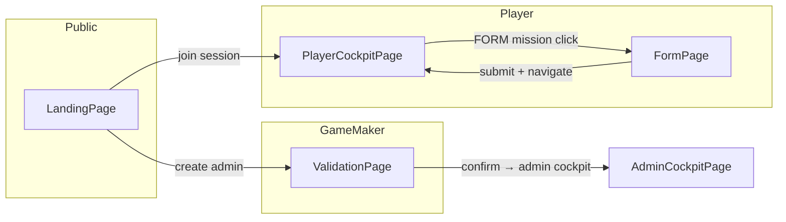
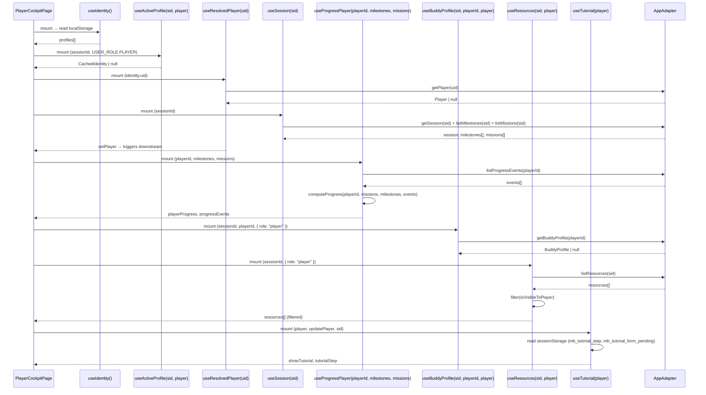

# Player View Analysis — Dynamic Data & Integration Report

## 1. Overview: 4 Player-Facing Pages

The player experience spans four pages, each serving a distinct role in the onboarding journey:

| # | Page | Route | Role | Purpose |
|---|------|-------|------|---------|
| 1 | [`LandingPage`](src/pages/LandingPage.tsx:501) | `/` or `/join/:sessionId` | Public | Identity selection, session join, new admin session creation, recovery |
| 2 | [`PlayerCockpitPage`](src/pages/PlayerCockpitPage.tsx:33) | `/session/:sessionId` | Player (read-only) | Dashboard — milestone map, current missions, buddy card, resources, AI assistant, tutorial |
| 3 | [`FormPage`](src/pages/FormPage.tsx:13) | `/form/:sessionId/:missionId` | Player (form submit) | Dedicated form-filling page for [`MISSION_TYPE.FORM`](src/types/unions.ts:4) missions |
| 4 | [`ValidationPage`](src/pages/ValidationPage.tsx:9) | `/validate/:sessionId` | GameMaker (confirm) | GM confirms a QR-code validation from a deep link; displays decoded payload and confirms XP award |

**Key distinction from admin view:** Players are **read-only consumers** of session config, milestones, missions, resources, and buddy profiles. Their only writes are `upsertProgressEvent` (self-approve, request-approval, or form submission) and `updatePlayer` (profile mission only). They never mutate session structure, create/edit milestones or missions, manage resources, or handle templates.



---

## 2. Page Structure — Component Trees & Props

### 2.1 [`LandingPage`](src/pages/LandingPage.tsx:501)

No adapter-fetched data. All state lives in [`useLandingFlow`](src/hooks/useLandingFlow.ts:78).

| Component | Props | Source |
|-----------|-------|--------|
| `ProfileCard` (×N) | `identity: CachedIdentity`, `isKeyOpen`, `onResume`, `onRemove`, `onShowKey`, `onHideKey` | [`profiles`](src/hooks/useLandingFlow.ts:46) from `useIdentity` |
| `EmployeeForm` | `step`, `sessionCode`, `playerName`, `verifiedSessionId`, `status`, `errorMessage`, handlers | `useLandingFlow` form fields |
| `AdminForm` | `sessionName`, `adminName`, `status`, `errorMessage`, handlers | `useLandingFlow` form fields |
| `Toast` | `message` | [`flow.toast`](src/hooks/useLandingFlow.ts:109) from `sessionStorage` |

**Adapter calls triggered from this page:**

| User Action | Adapter Method | Use Case |
|-------------|---------------|----------|
| "Verify session" | [`adapter.getSession(code)`](src/use-cases/joinSession.ts:27) | `verifySession()` — validates session exists before showing name input |
| "Join & save profile" | [`adapter.createPlayer(data)`](src/use-cases/joinSession.ts:59) | `joinSession()` — creates player with UID + recovery key |
| "Create & save profile" | [`adapter.createSession(name, uid)`](src/use-cases/joinSession.ts:82) | `createGameMakerSession()` — creates session + GM identity |
| "Recover" | [`adapter.getPlayerByRecoveryKey(key)`](src/use-cases/recoverIdentity.ts:13) | `recoverIdentity()` — looks up player by recovery key |

### 2.2 [`PlayerCockpitPage`](src/pages/PlayerCockpitPage.tsx:33)

The central player dashboard. All data flows through hooks; the page orchestrates render.

| Component | Key Props | Source Hook |
|-----------|-----------|-------------|
| `TopBar` | `playerName`, `totalXP`, `role` | `player` state + [`playerProgress?.totalXP`](src/hooks/useProgress/player.ts:54) |
| `MilestoneMapViewer` | `milestones`, `bgImageUrl`, `mapNodeScale`, `milestoneProgress`, `playerXPercent`, `playerYPercent`, `onMilestoneClick` | [`useSession`](src/hooks/useSession.ts:16) + [`useProgressPlayer`](src/hooks/useProgress/player.ts:10) + computed `currentMilestone` |
| `MilestoneSidebarViewer` | `milestoneId`, `milestoneName`, `missions`, `progressEvents`, `currentXP`, `xpThreshold`, `onClose`, `onMissionClick` | Derived from `selectedMilestoneId` filtering |
| `MissionDetailPopup` | `mission`, `playerId`, `sessionId`, `progressEvent`, `onClose`, `onValidated` | [`popupMission`](src/pages/PlayerCockpitPage.tsx:95) state + `progressEvents` lookup |
| `CurrentMissionsList` | `missions` (filtered to `isInCurrentMissions`), `progressEvents`, `onMissionClick`, `onMarkComplete` | [`currentMissions`](src/pages/PlayerCockpitPage.tsx:120) derivation |
| `BuddyCard` | `name`, `role`, `tenure?`, `avatarUrl?`, `contactUrl?`, `quote?`, `email?`, `phone?` | [`useBuddyProfile`](src/hooks/useBuddyProfile.ts:46) |
| `ResourcesSection` | `resources`, `onSearch` | [`useResources`](src/hooks/useResources.ts:41) |
| `AssistantChatCard` | `buddyName?`, `appContext?` | Derived from `player` + `buddy` |
| `TutorialOverlayWithStep` | `isVisible`, `currentStepIndex`, `steps`, `playerName`, `onNext`, `onSkip` | [`useTutorial`](src/hooks/useTutorial.ts:61) |
| `ConfirmDialog` | `isOpen`, `title`, `body`, `confirmLabel`, `onConfirm`, `onCancel` | `useTutorial` skip flow |

**Hook initialization sequence:**



### 2.3 [`FormPage`](src/pages/FormPage.tsx:13)

A dedicated full-page form for [`MISSION_TYPE.FORM`](src/types/unions.ts:4) missions. Per [C-06](SPECS.md:946), form missions are always `autoApproved` — the [`ValidationDisplay`](src/components/player/ValidationDisplay.tsx:15) never mounts for `type: "form"`.

| Component | Key Props | Source |
|-----------|-----------|--------|
| `TopBar` | `playerName`, `totalXP`, `role` | `player` + `playerProgress?.totalXP` |
| `FormShell` | `missionTitle`, `description`, `fields`, `values`, `errors`, `isSubmitting`, `isDraft`, handlers | `formSchema.fields` + local form state |
| `FetchErrorPanel` | `message`, `onRetry`, `testId`, `page` | On session error |

**Adapter calls from this page (via [`useFormMission`](src/hooks/useFormMission.ts:30)):**

| Trigger | Adapter Method | Purpose |
|---------|---------------|---------|
| Mount | [`adapter.getPlayer(uid)`](src/pages/FormPage.tsx:26) via [`useResolvedPlayer`](src/hooks/useResolvedPlayer.ts:16) | Resolve PB player record |
| Mount | [`adapter.getFormSchema(missionId)`](src/hooks/useFormMission.ts:59) | Fetch form field definitions |
| Submit | [`adapter.upsertProgressEvent(playerId, missionId, { status: "autoApproved", formResponse })`](src/hooks/useFormMission.ts:82) | Save form response (C-06: auto-approved) |
| Profile mission only | [`adapter.updatePlayer(playerId, patch)`](src/hooks/useFormMission.ts:84) | Mirror profile fields from form to Player record |

**Profile mirroring (`mission_m1_profile`):** When the profile form is submitted, the page mirrors 11 profile fields (name, preferredName, pronouns, role, team, location, timezone, workStyle, languages, skillsConfident, skillsDevelop) from the form response to the Player record. It also sets `profileComplete: true` and `tutorialComplete: true` — 13 fields written total.

### 2.4 [`ValidationPage`](src/pages/ValidationPage.tsx:9)

Rendered for GameMakers via a deep link (`/validate/:sessionId?t=<token>`). This page:
1. Decodes the QR payload token using [`decodeQRPayload()`](src/utils/qrPayload.ts:1) with the session secret
2. Verifies the payload belongs to the current session
3. Looks up player name and mission title
4. Checks for existing completed progress event
5. Shows a confirmation card with milestone, mission, player, and XP details
6. On confirm, calls `upsertProgressEvent` with `status: "completed"`

| Component | Key Props | Source |
|-----------|-----------|--------|
| `TopBar` | `playerName`, `totalXP`, `role` | Hardcoded "Game Master" |
| `FetchErrorPanel` | `message`, `onRetry`, `onBack`, `testId`, `page` | On error or missing token |
| Confirmation card (inline) | `milestoneName`, `missionTitle`, `playerName`, `xpValue`, `alreadyCompleted` | Decoded from QR + adapter lookups |

**Adapter calls from this page (via [`useValidationConfirm`](src/hooks/useValidationConfirm.ts:30)):**

| Trigger | Adapter Method | Purpose |
|---------|---------------|---------|
| Mount | [`adapter.getPlayerById(playerId)`](src/hooks/useValidationConfirm.ts:100) | Lookup player by PB ID from QR payload |
| Mount | [`adapter.listProgressEvents(playerId)`](src/hooks/useValidationConfirm.ts:101) | Check for existing completion |
| Confirm | [`adapter.upsertProgressEvent(playerId, missionId, { status: "completed", validatedBy, validatedAt })`](src/hooks/useValidationConfirm.ts:150) | Persist GM validation |

---

## 3. Data Categories by Source

### A. Identity (localStorage — [`mb_identity`](src/hooks/useIdentity.ts:4))

**Source:** [`useIdentity()`](src/hooks/useIdentity.ts:41) reads/writes [`CachedIdentity[]`](src/types/value-objects.ts:38) from `localStorage`. Cross-tab sync via `window` `"storage"` event.

**Constraints:** Per [C-03](SPECS.md:946), there is **no auth system**. Identity is UID-based, stored client-side. `role` is client-stored, not server-validated.

| Field | Type | Source | How Set |
|-------|------|--------|---------|
| `uid` | `string` (UUID) | `crypto.randomUUID()` | Generated at join (player) or session create (admin) |
| `recoveryKey` | `string` (8-char) | `generateRecoveryKey()` | Generated at join; also stored in `players.recoveryKey` |
| `sessionId` | `string` | PB record ID | From `createPlayer` / `createSession` result |
| `role` | `"player"` \| `"gamemaker"` | User choice at landing | Set at identity creation |
| `name` | `string?` | User input | Display name from join/create form |
| `isDemo` | `boolean?` | `true` for pre-seeded profiles | Hardcoded in [`DEMO_PROFILES`](src/hooks/useLandingFlow.ts:16) |

**Player-facing usage:** Every page reads `useIdentity()` to find the matching identity by `sessionId`. The identity provides the `uid` used to look up the PB [`Player`](src/types/domain.ts:36) record via `adapter.getPlayer(uid)`.

### B. Session Configuration (Read-Only for Players)

**Source:** [`useSession(sessionId)`](src/hooks/useSession.ts:16) fetches via `adapter.getSession()` + `adapter.listMilestones()` + `adapter.listMissions()` in parallel ([`line 55-58`](src/hooks/useSession.ts:55)).

`useSession` has an [overloaded return type](src/hooks/useSession.ts:14): player mode returns [`UseSessionBaseResult`](src/hooks/useSession.ts:5) (read-only), while gamemaker mode returns [`UseSessionGamemakerResult`](src/hooks/useSession.ts:14) with `updateSession`, `uploadBackground`, and `updateMapNodeScale`. Player code only uses the base result.

Players consume these fields; **none are editable**:

| Field | How Player Consumes It |
|-------|----------------------|
| [`Session.name`](src/types/domain.ts:20) | Rendered in TopBar (as "Game Master" session context) |
| [`Session.bgImageUrl`](src/types/domain.ts:21) | Passed to [`MilestoneMapViewer`](src/components/player/MilestoneMapViewer.tsx:10) as background image |
| [`Session.mapNodeScale`](src/types/domain.ts:30) | Passed to [`MilestoneMapViewer`](src/components/player/MilestoneMapViewer.tsx:12) for canvas scaling |
| [`Session.qrSecret`](src/types/domain.ts:33) | Read by [`QRDisplay`](src/components/player/QRDisplay.tsx:19) to encode QR payload HMAC, and by [`useValidationConfirm`](src/hooks/useValidationConfirm.ts:83) to decode QR payload |

The player never calls `updateSession` — the admin owns session mutation.

### C. Milestones (Read-Only for Players)

**Source:** Fetched once by [`useSession()`](src/hooks/useSession.ts:16) via `adapter.listMilestones(sessionId)`.

**Rendered in:**
- [`MilestoneMapViewer`](src/components/player/MilestoneMapViewer.tsx:18) — nodes on the map canvas, each showing progress percent and status color
- [`MilestoneSidebarViewer`](src/components/player/MilestoneSidebarViewer.tsx:20) — XP progress bar + mission list for a selected milestone

**Key fields consumed by player:**

| Field | Purpose |
|-------|---------|
| [`name`](src/types/domain.ts:74) | Node label on map; sidebar header |
| [`xPercent` / `yPercent`](src/types/domain.ts:75) | Node position on map canvas — percentage-based per [C-08](SPECS.md:946) |
| [`xpThreshold`](src/types/domain.ts:77) | Used by [`computeProgress()`](src/use-cases/computeProgress.ts:35) to derive `percentComplete` |
| [`order`](src/types/domain.ts:78) | Determines display order of milestone nodes |

Players do **not** call `createMilestone`, `updateMilestone`, or `deleteMilestone`.

### D. Missions (Read-Only for Players)

**Source:** Same as milestones — fetched once by [`useSession()`](src/hooks/useSession.ts:16) via `adapter.listMissions(sessionId)`.

**Rendered in:**
- [`CurrentMissionsList`](src/components/player/CurrentMissionsList.tsx:31) — missions filtered to `isInCurrentMissions: true`
- [`MilestoneSidebarViewer`](src/components/player/MilestoneSidebarViewer.tsx:20) — missions filtered by `milestoneId`
- [`MissionDetailPopup`](src/components/player/MissionDetailPopup.tsx:59) — full detail view with markdown body, XP badge, tags, and validation action
- [`FormPage`](src/pages/FormPage.tsx:12) — for FORM-type missions, navigated to instead of popup

**Key fields consumed by player:**

| Field | Purpose |
|-------|---------|
| [`title`](src/types/domain.ts:84) / [`body`](src/types/domain.ts:85) | Displayed in mission cards and detail popup |
| [`type`](src/types/domain.ts:86) | Determines rendering path: `text`/`link` → popup; `form` → navigate to [`FormPage`](src/pages/FormPage.tsx:12) |
| [`xpValue`](src/types/domain.ts:89) | Shown on mission cards and used by [`computeProgress()`](src/use-cases/computeProgress.ts:43) |
| [`difficulty`](src/types/domain.ts:88) | Displayed; the XP value is pre-derived by [`deriveXP()`](src/use-cases/deriveXP.ts:1) at admin save time |
| [`tags`](src/types/domain.ts:90) | Rendered as [`TagBadge`](src/components/shared/TagBadge.tsx) components |
| [`isInCurrentMissions`](src/types/domain.ts:93) | Filter for [`CurrentMissionsList`](src/components/player/CurrentMissionsList.tsx:31) |
| [`validationMethod`](src/types/domain.ts:94) | Controls the validation flow: `selfApprove` → instant auto-approve; `gmApprove` → request approval + subscribe; `qr` → show QR + subscribe |
| [`suggestedDueDate`](src/types/domain.ts:91) | Displayed as calendar icon on mission items |
| [`order`](src/types/domain.ts:92) | Display ordering of mission items |

**Routing decision ([`handleMissionClick`](src/pages/PlayerCockpitPage.tsx:130)):**

```mermaid
graph TD
    Click[Player clicks mission] --> Check{mission.type}
    Check -->|FORM + not completed| Navigate[/form/:sid/:mid]
    Check -->|TEXT or LINK| Check2{already completed?}
    Check2 -->|yes| Popup[Show MissionDetailPopup<br/>read-only view]
    Check2 -->|no| Popup2[Show MissionDetailPopup<br/>with validation action]
```

### E. Progress Events (Player-Read + Selective Write)

**Source:** [`useProgressPlayer(playerId, milestones, missions)`](src/hooks/useProgress/player.ts:10) fetches all progress events for the player on mount ([`line 37`](src/hooks/useProgress/player.ts:37)), then calls [`computeProgress()`](src/use-cases/computeProgress.ts:19) to derive [`PlayerProgress`](src/types/ephemeral.ts:29).

**Per [C-11](SPECS.md:946):** Progress is **never snapshotted** — [`computeProgress()`](src/use-cases/computeProgress.ts:19) re-derives at read time every time. This means retroactive difficulty changes affect earned XP because `xpValue` is read from the current mission record, not from the progress event.

**Per [C-05](SPECS.md:946):** One `ProgressEvent` per `(playerId, missionId)` — all writes go through the single [`upsertProgressEvent`](src/adapters/interface.ts:65) method.

**Player write paths (3 total):**

| Action | Trigger | Adapter Call | Status Written |
|--------|---------|-------------|----------------|
| Self-approve | "Mark Complete" on `selfApprove` mission | [`upsertProgressEvent(playerId, missionId, { status: "autoApproved" })`](src/components/player/MissionDetailPopup.tsx:93) | `autoApproved` |
| Request approval | "Mark Complete" on `gmApprove` mission | [`upsertProgressEvent(playerId, missionId, { status: "pendingApproval" })`](src/components/player/MissionDetailPopup.tsx:104) | `pendingApproval` |
| Form submit | Submit button on FormPage | [`upsertProgressEvent(playerId, missionId, { status: "autoApproved", formResponse })`](src/hooks/useFormMission.ts:82) | `autoApproved` |

**Per [C-07](SPECS.md:946):** For `qr` validation, the player does **not** write to PB. The player shows a QR code and subscribes to completion events. Only the GameMaker writes via [`useValidationConfirm`](src/hooks/useValidationConfirm.ts:150) after scanning.

**How players consume progress events:**

| Context | Usage |
|---------|-------|
| [`MilestoneMapViewer`](src/components/player/MilestoneMapViewer.tsx:9) | `milestoneProgress` array → sets `progressPercent` and `status` on each [`MilestoneNode`](src/components/shared/MilestoneNode.tsx) |
| [`CurrentMissionsList`](src/components/player/CurrentMissionsList.tsx:16) | `progressEvents` → determines completion checkmark per mission |
| [`MilestoneSidebarViewer`](src/components/player/MilestoneSidebarViewer.tsx:15) | `progressEvents` → per-mission completion status in sidebar mission list |
| [`MissionDetailPopup`](src/components/player/MissionDetailPopup.tsx:52) | `progressEvent` → whether mission is completed; controls action button label and behavior |
| `TopBar` (via [`PlayerCockpitPage`](src/pages/PlayerCockpitPage.tsx:257)) | `playerProgress.totalXP` → displayed in top bar |
| FormPage `TopBar` | `playerProgress?.totalXP` → displayed in top bar |

**SSE subscription flow (gmApprove + qr only):**

```mermaid
sequenceDiagram
    participant Popup as MissionDetailPopup
    participant VD as ValidationDisplay
    participant Adapter as AppAdapter

    Popup->>Adapter: upsertProgressEvent(status: "pendingApproval")
    Note over Popup: Only for gmApprove; qr skips this step
    Popup->>VD: setShowValidation(true)
    VD->>Adapter: subscribeProgressEvent(playerId, missionId, callback)
    Note over VD,Adapter: Mock: fires after 4s via simulateGmApproval<br/>PB: SSE subscription to ProgressEvent changes
    Adapter-->>VD: callback({ status: "completed" })
    VD->>Popup: onValidated()
    Popup->>Popup: close popup + refreshProgress()
```

### F. Buddy Assignment (Read-Only for Players)

**Source:** [`useBuddyProfile(sessionId, playerId, { role: "player" })`](src/hooks/useBuddyProfile.ts:46) fetches via `adapter.getBuddyProfile(playerId)` on mount.

**Rendered in:** [`BuddyCard`](src/components/player/BuddyCard.tsx:24) — shows buddy name, role, tenure, avatar (or initials), contact info (email, phone, or link), and personal quote.

**Also used in** [`AssistantChatCard`](src/components/player/AssistantChatCard.tsx:19) — buddy name is injected into the AI system prompt context.

Players do **not** call `upsertBuddyProfile` — the admin owns buddy assignment.

### G. Resources (Read-Only, Filtered for Players)

**Source:** [`useResources(sessionId, { role: "player" })`](src/hooks/useResources.ts:41) fetches all resources via `adapter.listResources(sessionId)`, then filters to `isVisibleToPlayer: true` only ([`line 67-69`](src/hooks/useResources.ts:67)).

**Rendered in:** [`ResourcesSection`](src/components/player/ResourcesSection.tsx:33) — a collapsible search block. Resources are shown only after the player types a search query; filtered results match `title` or `description` against the query.

Players do **not** call `createResource`, `updateResource`, or `deleteResource`.

### H. Tutorial State (sessionStorage + Player Field)

**Source:** [`useTutorial(player, updatePlayer, sessionId)`](src/hooks/useTutorial.ts:61) combines three data sources:

| Source | Key | Purpose |
|--------|-----|---------|
| `sessionStorage` | [`mb_tutorial_step`](src/hooks/useTutorial.ts:15) | Persists tutorial step across page reloads and form round-trips |
| `sessionStorage` | [`mb_tutorial_form_pending`](src/hooks/useTutorial.ts:14) | Flags that player was on the profile form step when navigating away |
| [`Player.tutorialComplete`](src/types/domain.ts:40) | PB field | Server-side flag — if `true`, tutorial is suppressed |

**Tutorial state restoration priority (on player load):**
1. **Form round-trip:** If `mb_tutorial_form_pending` exists, resume at profile step (step 4). If `profileComplete` is already true, skip.
2. **Persisted step:** If `mb_tutorial_step` exists and `tutorialComplete` is false, resume at persisted step.
3. **Fresh start:** If `tutorialComplete` is false with no persisted state, start at step 0.

**Demo override:** Demo accounts always show the tutorial regardless of `tutorialComplete` — see the [`tutorialPlayer`](src/pages/PlayerCockpitPage.tsx:96) `useMemo` which forces `tutorialComplete: false` for demo identities.

### I. AI Assistant Context (Derived, Not Persisted)

**Source:** Derived inline in [`PlayerCockpitPage`](src/pages/PlayerCockpitPage.tsx:151) from `player` and `buddy`.

The [`aiAppContext`](src/pages/PlayerCockpitPage.tsx:151) string wraps user name and buddy info in `<APPLICATION_CONTEXT>` tags recognized by the LiteLLM system prompt. Passed to [`AssistantChatCard`](src/components/player/AssistantChatCard.tsx:16) which delegates to [`useChat`](src/hooks/useChat.ts:12). The [`useChatStream`](src/hooks/useChatStream.ts:72) hook implements a full SSE streaming client with `AbortController` cancellation, while [`useMockChat`](src/hooks/useMockChat.ts) provides offline mock responses — the switch is now decided at runtime by [`useAssistantAvailability`](src/hooks/useAssistantAvailability.ts) polling `/llm/health/readiness`, not a build flag. The live `useChatStream` is a fully working implementation using `ReadableStream` for server-sent events.

---

## 4. Data Flow Diagrams

### Overall Player Data Flow

```mermaid
graph TB
    subgraph Adapter["AppAdapter (interface)"]
        A1[getSession]
        A2[getPlayer]
        A3[listMilestones]
        A4[listMissions]
        A5[listProgressEvents]
        A6[upsertProgressEvent]
        A7[subscribeProgressEvent]
        A8[getBuddyProfile]
        A9[listResources]
        A10[getFormSchema]
        A11[updatePlayer]
        A12[getPlayerById]
        A13[getSession]
        A14[createPlayer]
        A15[createSession]
        A16[getPlayerByRecoveryKey]
    end

    subgraph Hooks["Player Hooks"]
        H1[useIdentity]
        H2[useSession]
        H3[useProgressPlayer]
        H4[useBuddyProfile]
        H5[useResources]
        H6[useTutorial]
        H7[useLandingFlow]
        H8[useChat]
        H9[useActiveProfile]
        H10[useResolvedPlayer]
        H11[useFormMission]
        H12[useValidationConfirm]
    end

    subgraph Pages["Player Pages"]
        P1[LandingPage]
        P2[PlayerCockpitPage]
        P3[FormPage]
        P4[ValidationPage]
    end

    subgraph Components["Player Components"]
        C1[MilestoneMapViewer]
        C2[MilestoneSidebarViewer]
        C3[MissionDetailPopup]
        C4[CurrentMissionsList]
        C5[BuddyCard]
        C6[ResourcesSection]
        C7[AssistantChatCard]
        C8[QRDisplay]
        C9[ValidationDisplay]
        C10[PendingApprovalDisplay]
        C11[FormShell]
    end

    A1 --> H2
    A2 --> H10
    A3 --> H2
    A4 --> H2
    A5 --> H3
    A6 --> C3
    A6 --> H11
    A6 --> H12
    A7 --> C9
    A8 --> H4
    A9 --> H5
    A10 --> H11
    A11 --> H10
    A11 --> P3
    A12 --> H12
    A13 --> H7
    A14 --> H7
    A15 --> H7
    A16 --> H7

    H1 --> P1
    H1 --> P2
    H1 --> P3
    H7 --> P1
    H2 --> P2
    H2 --> P3
    H2 --> P4
    H3 --> P2
    H3 --> P3
    H4 --> P2
    H5 --> P2
    H6 --> P2
    H8 --> C7
    H9 --> P2
    H10 --> P2
    H10 --> P3
    H11 --> P3
    H12 --> P4

    P2 --> C1
    P2 --> C2
    P2 --> C3
    P2 --> C4
    P2 --> C5
    P2 --> C6
    P2 --> C7
    C3 --> C9
    C9 --> C8
    C9 --> C10
    P3 --> C11

    style Adapter fill:#e8f0fe,stroke:#1a73e8
    style Hooks fill:#fce4ec,stroke:#c62828
    style Pages fill:#e8f5e9,stroke:#2e7d32
    style Components fill:#fff3e0,stroke:#ef6c00
```



---

## 5. Type Definitions Referenced

### Domain Types (persisted in PocketBase)

| Type | File | Line | Fields Used by Player Code |
|------|------|------|---------------------------|
| [`Session`](src/types/domain.ts:19) | `domain.ts` | 19 | `name`, `bgImageUrl`, `mapNodeScale`, `qrSecret` |
| [`Player`](src/types/domain.ts:36) | `domain.ts` | 36 | `uid`, `recoveryKey`, `sessionId`, `tutorialComplete`, `profileComplete`, `name`, `preferredName`, `pronouns`, `avatarUrl`, `role`, `team`, `startDate`, `location`, `timezone`, `skillsConfident`, `skillsDevelop`, `languages`, `workStyle` |
| [`BuddyProfile`](src/types/domain.ts:59) | `domain.ts` | 59 | `name`, `role`, `tenure`, `avatarUrl`, `contactUrl`, `quote`, `email`, `phone` |
| [`Milestone`](src/types/domain.ts:72) | `domain.ts` | 72 | `name`, `xPercent`, `yPercent`, `xpThreshold`, `order` |
| [`Mission`](src/types/domain.ts:81) | `domain.ts` | 81 | `title`, `body`, `type`, `xpValue`, `difficulty`, `tags`, `isInCurrentMissions`, `validationMethod`, `suggestedDueDate`, `order`, `externalUrl`, `milestoneId` |
| [`ProgressEvent`](src/types/domain.ts:102) | `domain.ts` | 102 | `status`, `validatedBy`, `validatedAt`, `formResponse`, `missionId`, `playerId` |
| [`Resource`](src/types/domain.ts:112) | `domain.ts` | 112 | `title`, `description`, `type`, `url`, `isVisibleToPlayer` |
| [`FormSchema`](src/types/domain.ts:97) | `domain.ts` | 97 | `fields` (array of [`FieldSchema`](src/types/value-objects.ts:5)) |
| [`PBRecord`](src/types/domain.ts:13) | `domain.ts` | 13 | `id`, `created`, `updated` — used as base interface; `id` read by all hooks |

### Value Objects (client-only, not persisted)

| Type | File | Line | Player Usage |
|------|------|------|-------------|
| [`FieldSchema`](src/types/value-objects.ts:5) | `value-objects.ts` | 5 | Rendered by [`FormShell`](src/components/form/FormShell.tsx) as form inputs |
| [`CachedIdentity`](src/types/value-objects.ts:38) | `value-objects.ts` | 38 | Read/written by [`useIdentity()`](src/hooks/useIdentity.ts:41); `uid` used for player lookup; `role` + `sessionId` used for routing |
| [`QRPayload`](src/types/value-objects.ts:17) | `value-objects.ts` | 17 | Encoded by [`QRDisplay`](src/components/player/QRDisplay.tsx:33); decoded by [`ValidationPage`](src/pages/ValidationPage.tsx:57) |

### Derived Types (computed at read time per C-11)

| Type | File | Line | Player Usage |
|------|------|------|-------------|
| [`MilestoneProgress`](src/types/ephemeral.ts:20) | `ephemeral.ts` | 20 | Drives milestone node colors, sidebar XP bar, "You are here" marker placement |
| [`PlayerProgress`](src/types/ephemeral.ts:29) | `ephemeral.ts` | 29 | `totalXP` shown in TopBar; `milestoneProgress` drives map and sidebar |

### Union Types (const + keyof pattern per C-12)

| Type | File | Line | Values | Player Relevance |
|------|------|------|--------|-----------------|
| [`MISSION_TYPE`](src/types/unions.ts:4) | `unions.ts` | 4 | `text`, `link`, `form` | Routing: FORM → navigate to FormPage; others → popup |
| [`VALIDATION_METHOD`](src/types/unions.ts:19) | `unions.ts` | 19 | `gmApprove`, `selfApprove`, `qr` | Controls player validation flow in MissionDetailPopup |
| [`PROGRESS_STATUS`](src/types/unions.ts:27) | `unions.ts` | 27 | `pending`, `pendingApproval`, `completed`, `autoApproved` | Determines completion state display; `autoApproved` used for self-approve + form missions |
| [`MILESTONE_STATUS`](src/types/unions.ts:36) | `unions.ts` | 36 | `upcoming`, `inProgress`, `completed` | Milestone node color coding |
| [`RESOURCE_TYPE`](src/types/unions.ts:44) | `unions.ts` | 44 | `guide`, `video`, `link`, `document` | Icon selection in ResourcesSection |
| [`FIELD_TYPE`](src/types/unions.ts:52) | `unions.ts` | 52 | `text`, `textarea`, `select`, `multiSelect` | Form field rendering in FormShell |
| [`USER_ROLE`](src/types/unions.ts:60) | `unions.ts` | 60 | `player`, `gamemaker` | Routing after resume/recovery on LandingPage |

---

## 6. Adapter Methods Used by Player-Facing Code

Only a subset of the [`AppAdapter`](src/adapters/interface.ts:18) contract is called by player code. The table below lists every adapter method that player pages, hooks, or components actually invoke.

| Method | Caller(s) | Read or Write | Constraint |
|--------|-----------|---------------|------------|
| `getSession(sessionId)` | [`useSession`](src/hooks/useSession.ts:35), [`useLandingFlow` → `verifySession`](src/use-cases/joinSession.ts:27), [`useValidationConfirm`](src/hooks/useValidationConfirm.ts:83), [`QRDisplay`](src/components/player/QRDisplay.tsx:19) | Read | Fetch session config + qrSecret |
| `createSession(name, uid)` | [`useLandingFlow` → `createGameMakerSession`](src/use-cases/joinSession.ts:82) | Write | Admin session creation from landing page |
| `getPlayer(uid)` | [`useResolvedPlayer`](src/hooks/useResolvedPlayer.ts:36), [`PlayerCockpitPage`](src/pages/PlayerCockpitPage.tsx:57), [`FormPage`](src/pages/FormPage.tsx:26) | Read | Resolve PB Player record from identity UID |
| `getPlayerByRecoveryKey(key)` | [`useLandingFlow` → `recoverIdentity`](src/use-cases/recoverIdentity.ts:13) | Read | Recovery flow on landing page |
| `createPlayer(data)` | [`useLandingFlow` → `joinSession`](src/use-cases/joinSession.ts:59) | Write | Player join from landing page |
| `updatePlayer(id, patch)` | [`useTutorial` → `handleSkipConfirm`](src/hooks/useTutorial.ts:120), [`FormPage` → profile mirror](src/pages/FormPage.tsx:206) | Write | Set `tutorialComplete: true` on skip; mirror profile fields on form submit |
| `listMilestones(sessionId)` | [`useSession`](src/hooks/useSession.ts:56) | Read | Milestones for map and sidebar |
| `listMissions(sessionId)` | [`useSession`](src/hooks/useSession.ts:57) | Read | All missions for filtering and display |
| `getFormSchema(missionId)` | [`useFormMission`](src/hooks/useFormMission.ts:59) | Read | Form field definitions for render |
| `upsertProgressEvent(playerId, missionId, patch)` | [`MissionDetailPopup` → selfApprove](src/components/player/MissionDetailPopup.tsx:93), [`MissionDetailPopup` → gmApprove](src/components/player/MissionDetailPopup.tsx:104), [`useFormMission` → submit](src/hooks/useFormMission.ts:82), [`useValidationConfirm` → confirm](src/hooks/useValidationConfirm.ts:150) | Write | Single upsert point ([C-05](SPECS.md:946)) |
| `listProgressEvents(playerId)` | [`useProgressPlayer`](src/hooks/useProgress/player.ts:43), [`useValidationConfirm`](src/hooks/useValidationConfirm.ts:101) | Read | All progress events for progress derivation |
| `subscribeProgressEvent(playerId, missionId, cb)` | [`useWatchMission`](src/hooks/useProgress/watchMission.ts:10) (called by [`ValidationDisplay`](src/components/player/ValidationDisplay.tsx:25) and [`QRDisplay`](src/components/player/QRDisplay.tsx:69)) | Subscribe | SSE for gmApprove + qr validation completion ([C-07](SPECS.md:946)) |
| `getBuddyProfile(playerId)` | [`useBuddyProfile`](src/hooks/useBuddyProfile.ts:87) | Read | Buddy card display |
| `listResources(sessionId)` | [`useResources`](src/hooks/useResources.ts:61) | Read | Resources filtered to `isVisibleToPlayer` only |

### Adapter Methods NOT Called by Player Code

These methods exist on [`AppAdapter`](src/adapters/interface.ts:18) but are **only used by admin code**:

| Method | Admin-Only Caller |
|--------|------------------|
| `listSessions()` | [`useCrossHireData`](src/hooks/useCrossHireData.ts:10) |
| `updateSession()` | [`AdminCockpitPage`](src/pages/AdminCockpitPage.tsx:234) (bgImageUrl), [`usePreBoardingChecklist`](src/hooks/usePreBoardingChecklist.ts:27) |
| `getPlayerById()` | [`ValidationPage`](src/pages/ValidationPage.tsx:72) (GM-only page — included here for completeness) |
| `listPlayers()` | [`useAdminPlayers`](src/hooks/useAdminPlayers.ts:40) |
| `createMilestone()` / `updateMilestone()` / `deleteMilestone()` | [`useAdminMilestoneEditor`](src/hooks/useAdminMilestoneEditor.ts:49) |
| `createMission()` / `updateMission()` / `deleteMission()` | [`useAdminMissionEditor`](src/hooks/useAdminMissionEditor.ts:72) |
| `upsertFormSchema()` | [`useAdminMissionEditor`](src/hooks/useAdminMissionEditor.ts:72) |
| `upsertBuddyProfile()` | [`AdminCockpitPage`](src/pages/AdminCockpitPage.tsx:218) |
| `createResource()` / `updateResource()` / `deleteResource()` | [`AdminCockpitPage`](src/pages/AdminCockpitPage.tsx:109) |
| `listTemplates()` / `saveTemplate()` / `deleteTemplate()` | [`useTemplateLibrary`](src/hooks/useTemplateLibrary.ts:14) |

**Note:** [`getPlayerById`](src/adapters/interface.ts:30) is used by [`ValidationPage`](src/pages/ValidationPage.tsx:72) which is a GameMaker page, not a player page. It's listed in the NOT-called section for player purity — player code uses [`getPlayer(uid)`](src/adapters/interface.ts:29) exclusively.

---

## 7. Key Architectural Constraints Affecting Player View

| # | Constraint | Impact on Player View |
|---|-----------|----------------------|
| [C-03](SPECS.md:946) | No auth system — UID in `localStorage` as `mb_identity` | Every page reads `useIdentity()` to resolve the current player. No server-validated session tokens. Identity is an array of profiles; player picks which one to resume. |
| [C-05](SPECS.md:946) | One `ProgressEvent` per `(playerId, missionId)` | Player progress writes always go through `upsertProgressEvent`. No create/delete — the existence of a progress event for a mission implies the player has interacted with it. |
| [C-06](SPECS.md:946) | Form missions are always `autoApproved` regardless of `validationMethod` | [`ValidationDisplay`](src/components/player/ValidationDisplay.tsx:15) never mounts for form missions. FormPage writes `status: "autoApproved"` directly. |
| [C-07](SPECS.md:946) | QR validation is fully offline: HMAC verify → GM confirm → PB write | Player never writes to PB for QR missions. Player shows QR code + subscribes to completion. Only GM writes via ValidationPage. |
| [C-08](SPECS.md:946) | Milestone positions are percentage-based (`xPercent`/`yPercent` 0–100) | [`MilestoneMapViewer`](src/components/player/MilestoneMapViewer.tsx:18) renders nodes at percentage positions within the [`MapViewport`](src/components/shared/MapViewport.tsx). Same positioning as admin editor. |
| [C-11](SPECS.md:946) | Progress never snapshotted — `computeProgress` re-derives at read time | [`useProgressPlayer`](src/hooks/useProgress/player.ts:54) calls `computeProgress()` on every fetch. Retroactive difficulty changes affect displayed XP. No stale progress snapshots. |
| [C-12](SPECS.md:946) | No TypeScript `enum` — use `const` object + `keyof` union | All union types use `as const` objects. Player code compares against string literals (e.g., `"autoApproved"`, `"form"`, `"selfApprove"`). |
| [C-13](SPECS.md:946) | No component calls `JSON.parse` on PB fields | Form schemas and form responses arrive pre-parsed from the adapter. Player components receive typed objects. |
| [C-16](SPECS.md:946) | `qrPayload.ts` is the single encode/decode point (HMAC-SHA256) | [`QRDisplay`](src/components/player/QRDisplay.tsx:33) calls `encodeQRPayload()`; [`ValidationPage`](src/pages/ValidationPage.tsx:57) calls `decodeQRPayload()`. No other code touches QR encoding. |

---

## 8. Summary of Player Data Access Patterns

### Read-Only Data (fetched on mount, never mutated by player)

| Data | Hook | Adapter Method | Refresh Supported? |
|------|------|---------------|-------------------|
| Session config | [`useSession`](src/hooks/useSession.ts:16) | `getSession` | Yes — `refresh()` via counter state |
| Milestones | [`useSession`](src/hooks/useSession.ts:16) | `listMilestones` | Yes — same `refresh()` |
| Missions | [`useSession`](src/hooks/useSession.ts:16) | `listMissions` | Yes — same `refresh()` |
| Progress events | [`useProgressPlayer`](src/hooks/useProgress/player.ts:24) | `listProgressEvents` | Yes — `refresh()` called after validation completes |
| Buddy profile | [`useBuddyProfile`](src/hooks/useBuddyProfile.ts:46) | `getBuddyProfile` | No — no refresh exposed |
| Resources | [`useResources`](src/hooks/useResources.ts:41) | `listResources` + filter | No — no refresh exposed |
| Form schema | [`useFormMission`](src/hooks/useFormMission.ts:55) | `getFormSchema` | No — fetched once per `missionId` change |

### Write Operations (player-initiated)

| Operation | Trigger | Adapter Method | Status/Effect |
|-----------|---------|---------------|---------------|
| Join session | Landing "Join & save" | `createPlayer` | New player record |
| Self-complete mission | Mission popup "Mark Complete" (`selfApprove`) | `upsertProgressEvent` | `status: "autoApproved"` |
| Request approval | Mission popup "Mark Complete" (`gmApprove`) | `upsertProgressEvent` | `status: "pendingApproval"` |
| Submit form | FormPage "Submit" | `upsertProgressEvent` | `status: "autoApproved"` + `formResponse` |
| Profile mirror | FormPage submit (profile mission) | `updatePlayer` | Mirrors 11 fields + sets `profileComplete`, `tutorialComplete` |
| Skip tutorial | Tutorial "Skip" confirm | `updatePlayer` | `tutorialComplete: true` |

### Player Data Dependency Graph

```mermaid
graph TD
    subgraph localStorage
        ID[mb_identity<br/>CachedIdentity[]]
        SS1[mb_tutorial_step]
        SS2[mb_tutorial_form_pending]
    end

    subgraph Adapter
        A_SESSION[getSession]
        A_PLAYER[getPlayer]
        A_MILESTONES[listMilestones]
        A_MISSIONS[listMissions]
        A_PROGRESS[listProgressEvents]
        A_BUDDY[getBuddyProfile]
        A_RESOURCES[listResources]
        A_FORM[getFormSchema]
    end

    subgraph Derived
        CP[computeProgress<br/>PlayerProgress]
        AI[aiAppContext<br/>from player + buddy]
    end

    subgraph UI
        MAP[MilestoneMapViewer]
        SIDEBAR[MilestoneSidebarViewer]
        MISSIONS_LIST[CurrentMissionsList]
        POPUP[MissionDetailPopup]
        BUDDY_CARD[BuddyCard]
        RESOURCES[ResourcesSection]
        CHAT[AssistantChatCard]
        FORM[FormShell]
        TUTORIAL[TutorialOverlay]
        TOPBAR[TopBar]
    end

    ID --> A_PLAYER
    ID -->|sessionId| A_SESSION
    A_SESSION --> A_MILESTONES
    A_SESSION --> A_MISSIONS
    A_PLAYER -->|player.id| A_PROGRESS
    A_PLAYER -->|player.id| A_BUDDY
    A_SESSION -->|sessionId| A_RESOURCES
    A_PROGRESS --> CP
    A_MILESTONES --> CP
    A_MISSIONS --> CP
    A_MISSIONS -->|missionId| A_FORM

    CP --> MAP
    CP --> SIDEBAR
    CP --> TOPBAR
    A_MILESTONES --> MAP
    A_MILESTONES --> SIDEBAR
    A_MISSIONS --> MISSIONS_LIST
    A_MISSIONS --> SIDEBAR
    A_MISSIONS --> POPUP
    CP --> MISSIONS_LIST
    A_BUDDY --> BUDDY_CARD
    A_BUDDY --> CHAT
    A_PLAYER --> CHAT
    A_RESOURCES --> RESOURCES
    A_FORM --> FORM
    A_PLAYER --> TUTORIAL
    A_PLAYER --> TOPBAR

    SS1 --> TUTORIAL
    SS2 --> TUTORIAL

    style localStorage fill:#fff9c4,stroke:#f9a825
    style Adapter fill:#e8f0fe,stroke:#1a73e8
    style Derived fill:#f3e5f5,stroke:#7b1fa2
    style UI fill:#e8f5e9,stroke:#2e7d32
```