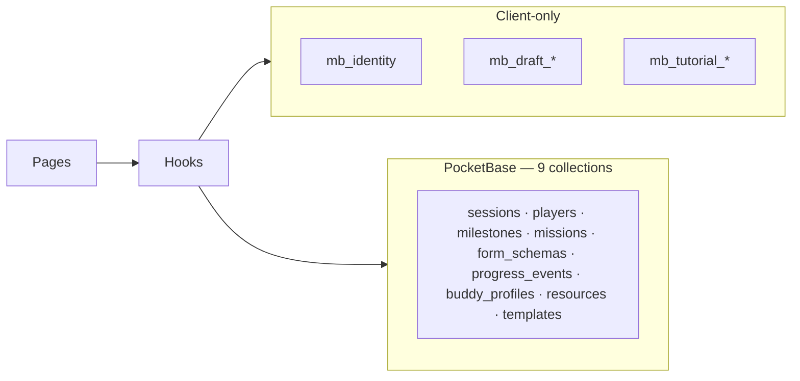

# Shared Data Access (Phase A + PocketBase Target)

C-18-compliant hook layer — pages and components import hooks only; [`AppAdapter`](src/adapters/interface.ts:18) is consumed from `src/hooks/` and `src/use-cases/` exclusively.

**UX baseline (no regression on PB swap):** feature behavior is defined by the view-data docs. PocketBase integration replaces the mock adapter backend only — hook signatures, page trees, and interaction flows stay the same.

- Game Maker CRUD: [`docs/admin-view-data.md`](admin-view-data.md)
- Player reads/writes: [`docs/player-view-data.md`](player-view-data.md)
- PocketBase schema: [`docs/pb-schema.md`](pb-schema.md)
- Implementation plan: [`plans/pocketbase-full-integration-strategy.md`](../plans/pocketbase-full-integration-strategy.md)

## Local vs synced data

| Layer | What | Persists across devices? |
|-------|------|--------------------------|
| **Local** | `useIdentity` → `mb_identity` | Per browser only (by design, C-03) |
| **Local** | `draftStorage` → mission editor drafts | Per browser; explicit Save writes to PB |
| **Local** | `useTutorial` → `sessionStorage` | Per tab/session; `tutorialComplete` on Player syncs via PB |
| **Synced** | All hooks below that call `useAdapter()` | Yes — via PocketBase when `VITE_USE_MOCK_PB=false` |

The adapter **never** reads or writes `localStorage` / `sessionStorage`.

## Adapter selection

| Env | Source | When |
|-----|--------|------|
| `VITE_USE_MOCK_PB=true` | [`mockAdapter`](src/adapters/mock/mockAdapter.ts) | Default local dev, offline prototyping |
| `VITE_USE_MOCK_PB=false` | [`pbAdapter`](src/adapters/pocketbase/mod.ts) (pending) | Docker production, multi-device |

Wired in [`AdapterContext.tsx`](src/adapters/AdapterContext.tsx) + [`AdapterContextValue.ts`](src/adapters/AdapterContextValue.ts).  
PB URL: `import.meta.env.VITE_PB_URL ?? "/api"` (Docker proxy) or `http://localhost:8090` for `deno task dev`.

## Hook registry

| Hook | Data source | Adapter / storage | Roles |
|------|---------------|-------------------|-------|
| `useIdentity` | **Local** | `localStorage` (`mb_identity`) | both |
| `useActiveProfile` | **Local** | composes `useIdentity` | both |
| `useResolvedPlayer` | **PB** | `getPlayer`, `updatePlayer` | player |
| `useSession` | **PB** | `getSession`, `listMilestones`, `listMissions`; GM: `updateSession`, `uploadBackground`, `updateMapNodeScale` | both |
| `useProgressPlayer` | **PB** | `listProgressEvents`, `upsertProgressEvent`, `watchMission` → `subscribeProgressEvent` | player |
| `useProgressAdmin` | **PB** | `listPlayers`, `listProgressEvents`, `upsertProgressEvent` | gamemaker |
| `useProgressCrossHire` | **PB** | `listSessions`, `listPlayers`, `listProgressEvents` | gamemaker |
| `useWatchMission` | **PB** | `subscribeProgressEvent` (C-20 — SSE opaque to components) | player (via `QRDisplay`, `ValidationDisplay`) |
| `useBuddyProfile` | **PB** | `getBuddyProfile`, `upsertBuddyProfile` | both |
| `useResources` | **PB** | `listResources`; GM: `createResource`, `updateResource`, `deleteResource` | both |
| `useFormMission` | **PB** | `getFormSchema`, `upsertProgressEvent`, `updatePlayer` | player |
| `useValidationConfirm` | **PB** | `getSession`, `getPlayerById`, `listProgressEvents`, `upsertProgressEvent` | gamemaker |
| `useQRScanContext` | **PB** | `getSession` (prefetch `qrSecret`) | gamemaker |
| `usePreBoardingChecklist` | **PB** | `updateSession({ preBoardingChecks })` | gamemaker |
| `useTemplateLibrary` | **PB** | `listTemplates`, `saveTemplate`, `deleteTemplate`; import via `bootstrapFromTemplate` use-case | gamemaker |
| `useAdminMilestoneEditor` | **PB** + **local draft** | `createMilestone`, `updateMilestone`, `deleteMilestone` | gamemaker |
| `useAdminMissionEditor` | **PB** + **local draft** | mission CRUD + `getFormSchema`, `upsertFormSchema`; drafts in `draftStorage` | gamemaker |
| `useTutorial` | **PB** + **sessionStorage** | `updatePlayer({ tutorialComplete })` | player |

## Use-cases (adapter consumers)

| Use-case | Adapter methods | Trigger |
|----------|-----------------|---------|
| `joinSession` | `getSession`, `createPlayer` | Landing — player join |
| `recoverIdentity` | `getPlayerByRecoveryKey` | Landing — recovery |
| `createGameMakerSession` (in `joinSession.ts`) | `createSession` | Landing — GM create |
| `importTemplate` / `bootstrapFromTemplate` | session + milestone + mission + form + resource creates | Template library |
| `exportTemplate` | read-only via hooks before `saveTemplate` | Template export |

## CRUD by role (implementation checklist)

### Game Maker — full detail in [`admin-view-data.md`](admin-view-data.md) §7

| Feature | Primary hook | PB collections touched |
|---------|--------------|------------------------|
| Session config (name, bg, scale, checklist) | `useSession`, `usePreBoardingChecklist` | `sessions` |
| Milestone / mission editor | `useAdminMilestoneEditor`, `useAdminMissionEditor` | `milestones`, `missions`, `form_schemas` |
| Player oversight + approvals | `useProgressAdmin` | `players`, `progress_events` |
| Cross-hire | `useProgressCrossHire` | `sessions`, `players`, `progress_events` |
| Buddy | `useBuddyProfile` | `buddy_profiles` |
| Resources | `useResources` | `resources` |
| Templates | `useTemplateLibrary` | `templates` + creates across collections on import |
| QR validation | `useValidationConfirm` | `progress_events` (GM confirm write) |

### Player — full detail in [`player-view-data.md`](player-view-data.md) §6

| Feature | Primary hook | PB collections touched |
|---------|--------------|------------------------|
| Cockpit reads | `useSession`, `useResolvedPlayer`, `useProgressPlayer`, `useBuddyProfile`, `useResources` | `sessions`, `players`, `milestones`, `missions`, `progress_events`, `buddy_profiles`, `resources` |
| Mission completion | `useProgressPlayer` | `progress_events` |
| Validation wait | `useWatchMission` | `progress_events` (SSE) |
| Form mission | `useFormMission` | `form_schemas`, `progress_events`, `players` |
| Tutorial skip | `useTutorial` | `players` |

## PocketBase integration constraints

| Constraint | Implication |
|------------|-------------|
| **No UI regression** | Changes limited to `src/adapters/pocketbase/*`, adapter context, and `useSession.uploadBackground` |
| **C-18** | ESLint blocks `useAdapter` in `src/pages/**` and `src/components/**` |
| **C-05** | All progress writes → `upsertProgressEvent` only |
| **C-13** | JSON/file parsing only in `parsers.ts` |
| **C-20** | SSE lives in adapter; `useWatchMission` is the component boundary |

## C-18 enforcement

ESLint `no-restricted-imports` blocks `useAdapter` and `AppAdapter` under `src/pages/**` and `src/components/**`.
