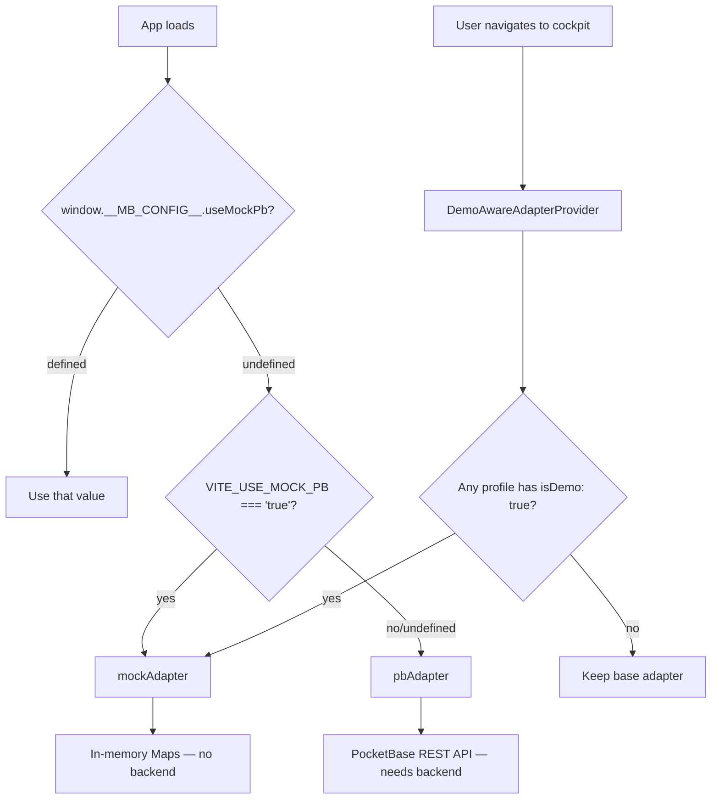

# Plan: Adapter Selection in Static (GH Pages / Local Dev) vs Production (Docker + PocketBase)

## Problem

The [`build-and-deploy.yml`](.github/workflows/build-and-deploy.yml) GitHub Pages workflow builds the app **without setting `VITE_USE_MOCK_PB`**, so `import.meta.env.VITE_USE_MOCK_PB` resolves to `undefined` (falsy). This causes:

- [`AdapterContext.tsx:14`](src/adapters/AdapterContext.tsx:14): `USE_MOCK_PB = false` → selects `pbAdapter`
- [`AdapterContextValue.ts:6`](src/adapters/AdapterContextValue.ts:6): Default context value is `pbAdapter`

But **no PocketBase backend exists on GitHub Pages** — only static files are served. Every non-demo session fails with network errors when calling `pbAdapter` methods.

The [`DemoAwareAdapterProvider`](src/adapters/DemoAwareAdapterProvider.tsx:19) partially masks this — it overrides to `mockAdapter` for sessions where a profile has `isDemo: true`. But real (non-demo) sessions are broken.

## Desired Outcome

| Deployment | Adapter | Backend | Behavior |
|---|---|---|---|
| GitHub Pages (`build-and-deploy.yml`) | `mockAdapter` | None (in-memory Maps) | Fully functional demo mode |
| Local dev (`deno task dev`) | `mockAdapter` | None (in-memory Maps) | Fully functional demo mode |
| Docker Compose (`docker compose up`) | `pbAdapter` | PocketBase (Go + SQLite) | Full production |
| Demo session within any deployment | `mockAdapter` (per `DemoAwareAdapterProvider`) | None | Fully functional demo, isolated per session |

## Design: Runtime Config Resolution

The pattern already exists for chat mock — [`src/config/llm.ts:39`](src/config/llm.ts:39) resolves `USE_MOCK_CHAT` from:

1. `window.__MB_CONFIG__.useMockChat` (runtime — written by [`docker/entrypoint.sh`](docker/entrypoint.sh:68) or [`public/config.js`](public/config.js:4))
2. `import.meta.env.VITE_USE_MOCK_CHAT` (build-time)
3. Default: `true` (safe — no key needed)

We extend this same pattern to adapter selection:



### Resolution Order

```
runtime (window.__MB_CONFIG__.useMockPb)
  → build-time (VITE_USE_MOCK_PB)
    → default: mockAdapter (safe, no backend needed)
```

The **safe default is `mockAdapter`** because it requires no backend and works everywhere. Only production deployments explicitly opt into `pbAdapter`.

## Changes Required

### 1. Add `useMockPb` to runtime config typings

**File:** [`src/vite-env.d.ts`](src/vite-env.d.ts:18)

Add to `MesseBuddyRuntimeConfig`:
```ts
readonly useMockPb?: boolean;
```

### 2. Update default runtime config for static deployments

**File:** [`public/config.js`](public/config.js:4)

Change from:
```js
window.__MB_CONFIG__ = { useMockChat: true };
```

To:
```js
window.__MB_CONFIG__ = { useMockChat: true, useMockPb: true };
```

This file is served as-is on GitHub Pages and used by `deno task dev` — the two static/no-backend deployment paths.

### 3. Add runtime config resolution to adapter selection

**File:** [`src/adapters/AdapterContextValue.ts`](src/adapters/AdapterContextValue.ts:6)

The current code:
```ts
const USE_MOCK_PB = import.meta.env.VITE_USE_MOCK_PB === "true";
export const AdapterContext = createContext<AppAdapter>(
  USE_MOCK_PB ? mockAdapter : pbAdapter,
);
```

Must resolve runtime config first:
```ts
const resolveUseMockPb = (): boolean => {
  const rt = (typeof window !== "undefined" && window.__MB_CONFIG__) || {};
  if (rt.useMockPb !== undefined) return rt.useMockPb;
  return import.meta.env.VITE_USE_MOCK_PB !== "false";
  // Default: true (safe — mock adapter, no backend needed)
};

export const AdapterContext = createContext<AppAdapter>(
  resolveUseMockPb() ? mockAdapter : pbAdapter,
);
```

**Same change in** [`src/adapters/AdapterContext.tsx:14`](src/adapters/AdapterContext.tsx:14):
```ts
const resolveUseMockPb = (): boolean => {
  const rt = (typeof window !== "undefined" && window.__MB_CONFIG__) || {};
  if (rt.useMockPb !== undefined) return rt.useMockPb;
  return import.meta.env.VITE_USE_MOCK_PB !== "false";
};

export const AdapterContextProvider = ({
  adapter = resolveUseMockPb() ? mockAdapter : pbAdapter,
  children,
}: AdapterContextProviderProps) => { ... };
```

This file is ~25 lines — well under the 500-line edit limit.

### 4. Update GitHub Pages workflow

**File:** [`.github/workflows/build-and-deploy.yml`](.github/workflows/build-and-deploy.yml:37)

Add env vars to both `check` and `deploy` jobs' build steps:

```yaml
- name: Type check & build
  run: deno task build
  env:
    VITE_USE_MOCK_PB: "true"
    VITE_USE_MOCK_CHAT: "true"
```

This is belt-and-suspenders — the runtime `config.js` already sets `useMockPb: true`, but setting the build-time env var ensures the build-time default is also correct.

### 5. Update Docker entrypoint for production

**File:** [`docker/entrypoint.sh`](docker/entrypoint.sh:68)

Change from:
```sh
cat > "$CONFIG_JS" <<'EOF'
window.__MB_CONFIG__ = { llmBaseUrl: "/llm", useMockChat: false };
EOF
```

To:
```sh
cat > "$CONFIG_JS" <<'EOF'
window.__MB_CONFIG__ = { llmBaseUrl: "/llm", useMockChat: false, useMockPb: false };
EOF
```

This ensures the runtime config overrides the safe default and enables real PocketBase in production.

### 6. Update PR check workflow (consistency)

**File:** [`.github/workflows/pr-check.yml`](.github/workflows/pr-check.yml:27)

Add the same env vars for consistency:
```yaml
- name: Type check & build
  run: deno task build
  env:
    VITE_USE_MOCK_PB: "true"
    VITE_USE_MOCK_CHAT: "true"
```

## Summary of File Changes

| File | Change | Lines affected |
|---|---|---|
| [`src/vite-env.d.ts`](src/vite-env.d.ts) | Add `useMockPb` to `MesseBuddyRuntimeConfig` | +1 |
| [`public/config.js`](public/config.js) | Add `useMockPb: true` | 1 line changed |
| [`src/adapters/AdapterContextValue.ts`](src/adapters/AdapterContextValue.ts) | Add runtime config resolution function | ~8 lines changed |
| [`src/adapters/AdapterContext.tsx`](src/adapters/AdapterContext.tsx) | Add runtime config resolution function | ~8 lines changed |
| [`.github/workflows/build-and-deploy.yml`](.github/workflows/build-and-deploy.yml) | Add `VITE_*` env vars to build steps | +4 lines × 2 jobs |
| [`.github/workflows/pr-check.yml`](.github/workflows/pr-check.yml) | Add `VITE_*` env vars to build step | +4 lines |
| [`docker/entrypoint.sh`](docker/entrypoint.sh) | Add `useMockPb: false` | 1 line changed |

**Total:** 7 files, ~30 lines net change. No new files. No adapter interface changes. No component changes.

## What Stays the Same

- [`AppAdapter`](src/adapters/interface.ts:18) interface — unchanged
- [`mockAdapter`](src/adapters/mock/mockAdapter.ts) — unchanged
- [`pbAdapter`](src/adapters/pocketbase/pbAdapter.ts) — unchanged
- [`DemoAwareAdapterProvider`](src/adapters/DemoAwareAdapterProvider.tsx:19) — unchanged, still overrides for demo sessions
- [`useAdapter()`](src/adapters/useAdapter.ts:5) — unchanged
- All components consuming `useAdapter()` — unchanged
- All hooks — unchanged
- [`Dockerfile`](Dockerfile) — unchanged (already sets `VITE_USE_MOCK_PB=false`)

## Verification

After implementation, verify each deployment path:

| Path | Expected adapter | How to verify |
|---|---|---|
| `deno task dev` (no env) | `mockAdapter` | `config.js` sets `useMockPb: true` |
| `deno task dev` + `VITE_USE_MOCK_PB=false` | `pbAdapter` (needs local PB) | Runtime config absent, build-time false |
| `docker compose up` | `pbAdapter` | `entrypoint.sh` sets `useMockPb: false` |
| GitHub Pages deploy | `mockAdapter` | `config.js` sets `useMockPb: true` |
| Demo session (any deployment) | `mockAdapter` | `DemoAwareAdapterProvider` override |
