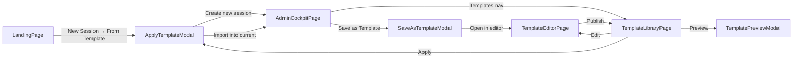
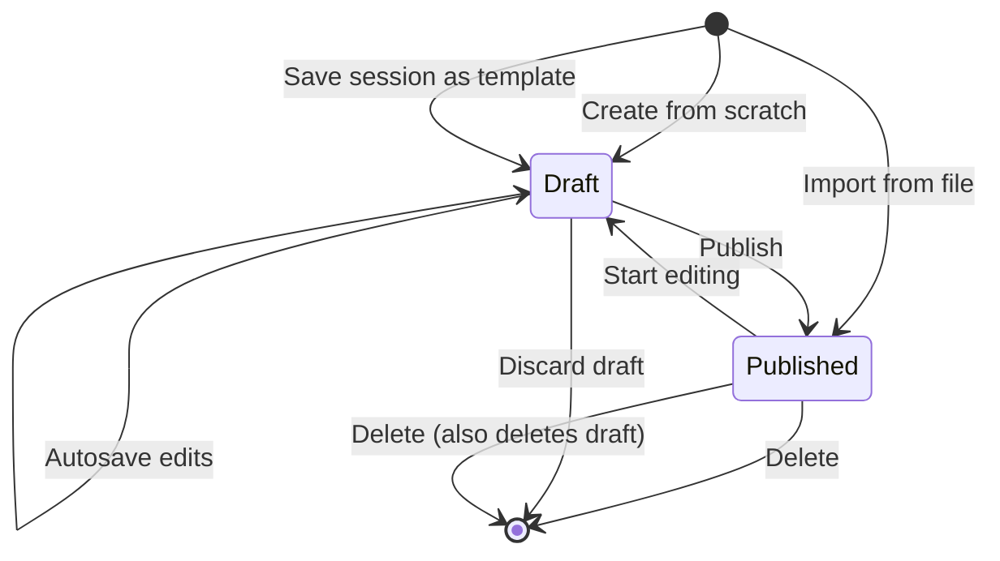
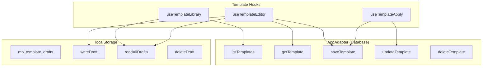
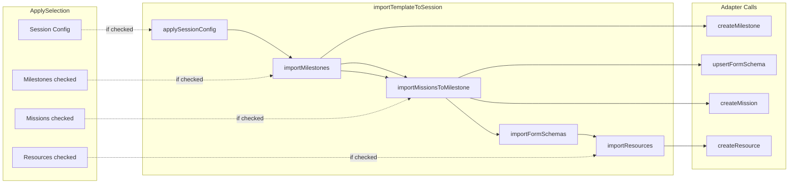

# Introduction


Templates become a first-class artifact — authored, edited, and published independently of any session. Published templates live in the adapter (database); every edit autosaves a full draft to `localStorage`. The Game Maker can browse published templates and local drafts, apply any template (or parts of it) to an existing or new session, and **preview a template as a rendered player experience before committing**. There is no backward compatibility with the old `TemplateExport` shape — the type is redesigned for this new workflow.

---

## 1. UI Screens & User Flows

### Screen Map



### Screen 1 — Template Library (`/templates`)

A dedicated page for browsing all templates.

```
┌──────────────────────────────────────┐
│ ← Templates              [+ New]     │
├──────────────────────────────────────┤
│ [🔍 Search templates...]             │
│                                      │
│ ── Published (3) ──                  │
│ ┌────────────────────────────────┐   │
│ │ Engineering Onboarding    v3   │   │
│ │ 4 milestones · 12 missions    │   │
│ │ 5 resources                   │   │
│ │ [Edit] [Preview] [Apply] [···]│   │
│ └────────────────────────────────┘   │
│ ┌────────────────────────────────┐   │
│ │ Sales Bootcamp           v2   │   │
│ │ Draft · 3 changes since pub   │   │
│ │ 3 milestones · 8 missions     │   │
│ │ [Edit] [Preview] [Apply] [···]│   │
│ └────────────────────────────────┘   │
│                                      │
│ ── Drafts (1) ──                     │
│ ┌────────────────────────────────┐   │
│ │ Executive Welcome          💾  │   │
│ │ Draft · never published        │   │
│ │ 5 milestones · 15 missions     │   │
│ │ [Edit] [Delete]                │   │
│ └────────────────────────────────┘   │
│                                      │
│ (Empty: "No templates yet.           │
│  Create one from scratch or save     │
│  a session as a template.")          │
└──────────────────────────────────────┘
```

**Behavior:**
- Segmented control toggles between Published and Drafts lists
- "Published" tab shows templates from `adapter.listTemplates()`; each card shows version number
- If a published template has a local draft (edits not yet published), the card shows "Draft · N changes since published" and loads the draft when editing
- "Drafts" tab shows only templates that exist in `localStorage` with no published counterpart
- `[···]` overflow menu: Rename, Delete, "Publish draft" (if draft), "Discard draft" (if draft)
- `[+ New]` navigates to `/templates/new`
- Search filters by template name across both lists

### Screen 2 — Template Editor (`/templates/new` or `/templates/:name/edit`)

A full-page editor for creating and modifying templates.

```
┌──────────────────────────────────────────────────────┐
│ ← [Engineering Onboarding ✎]     [Preview] [Publish] │
│ Draft · 3 changes since published                    │
├─────────────────┬────────────────────────────────────┤
│ Structure       │  ── Mission Editor ──               │
│                 │                                    │
│ ⬜ Session      │  Title   [Meet the team        ]   │
│   Config        │                                    │
│                 │  Body    ┌──────────────────────┐  │
│ ▸ Milestones    │          │ Welcome to the       │  │
│   (4)           │          │ engineering team...  │  │
│   ▸ Week 1 (3)  │          │                      │  │
│     ◆ Meet team │          └──────────────────────┘  │
│     ◆ Setup lap │                                    │
│     ◆ HR forms  │  Type    [TEXT ▾]                  │
│   ▸ Week 2 (2)  │                                    │
│     ◆ Product   │  Difficulty  [★★☆☆☆]              │
│     ◆ Codebase  │                                    │
│   ▸ Week 3 (4)  │  Tags     [core] [team] [+ Add]   │
│   ▸ Week 4 (3)  │                                    │
│                 │  Validation  [GM Approve ▾]        │
│ ▸ Resources     │                                    │
│   (5)           │  Current Missions  [✓]             │
│                 │                                    │
│ [+ Add Milestone]│  XP Preview: 25 XP                 │
│ [+ Add Resource] │                                    │
└─────────────────┴────────────────────────────────────┘
```

**Behavior:**
- Two-column layout on desktop; single-column with structure drawer on mobile
- **Left sidebar:** Structure tree showing all template sections. Click an item to edit it in the right panel. Drag to reorder milestones and missions. Each item has a delete button.
- **Right panel:** Context-aware editor that renders the appropriate form for the selected entity:
  - **Session Config:** `mapNodeScale` slider (0.1–1.0 with visual preview), background image uploader, pre-boarding checklist editor (add/remove/toggle items)
  - **Milestone:** name input, xPercent/yPercent numeric inputs (0–100), order (auto-managed)
  - **Mission:** reuses existing [`MissionEditor`](src/components/admin/MissionEditor.tsx) — title, markdown body, type selector, difficulty, XP preview (live via `deriveXP`), tag selector, validation method, current-missions toggle
  - **Resource:** title, description, type selector, URL, visibility toggle
- **Autosave:** Every change writes the full template draft to `localStorage` (debounced 1 s). A subtle "Saved" indicator appears briefly in the toolbar.
- **Dirty tracking:** Compares the current draft against the published version (loaded from adapter on mount). Changed sections show a dot indicator in the structure tree and the toolbar shows "N changes since published."
- **Publish:** Saves the template to the adapter via `saveTemplate()`, clears the draft from `localStorage`, updates the version counter. Navigates back to the library on success.
- **Preview:** Opens Template Preview modal showing the rendered template from the player's perspective.

### Screen 3 — Template Preview (modal)

```
┌──────────────────────────────────────┐
│ Preview: Engineering Onboarding    ✕ │
├──────────────────────────────────────┤
│                                      │
│  ┌── Map Preview ──────────────────┐ │
│  │  · Week 1      · Week 3        │ │
│  │       · Week 2    · Week 4     │ │
│  │  (simplified position map)     │ │
│  └────────────────────────────────┘ │
│                                      │
│  ── Milestones & Missions ──         │
│  ▸ Week 1 Onboarding (3 missions)    │
│    ◆ Meet the team  TXT  ★★  25 XP  │
│    ◆ Setup laptop   TXT  ★★  50 XP  │
│    ◆ HR forms       FRM  ★   25 XP  │
│  ▸ Week 2 Product (2 missions)      │
│    ...                               │
│                                      │
│  ── Resources ──                     │
│  ◆ Employee handbook  GUIDE          │
│  ◆ IT setup guide     DOCUMENT       │
│                                      │
│  ── Session Config ──                │
│  mapNodeScale: 0.5                   │
│  bgImage: (thumbnail)                │
│  3 pre-boarding checks               │
│                                      │
│                    [Apply Template]  │
└──────────────────────────────────────┘
```

### Screen 4 — Apply Template (modal)

A multi-step modal for choosing what to import and where.

```
┌──────────────────────────────────────────┐
│ Apply: Engineering Onboarding          ✕ │
├──────────────────────────────────────────┤
│                                          │
│ Target                                   │
│ ○ Create new session                     │
│ ● Apply to current session:              │
│   "Q3 Engineering Onboarding"            │
│                                          │
│ ── Choose what to import ──              │
│ ☑ Session Config                    ▸    │
│   mapNodeScale 0.5, bgImage, 3 checks    │
│ ☑ Milestones (4)                    ▸    │
│   ☑ Week 1 Onboarding (3 missions) ▸     │
│   ☑ Week 2 Product (2 missions)    ▸     │
│   ☐ Week 3 Culture (4 missions)    ▸     │
│   ☑ Week 4 Wrap-up (3 missions)    ▸     │
│ ☑ Resources (5)                    ▸     │
│   ☑ Employee handbook                    │
│   ☑ IT setup guide                       │
│   ☐ Benefits overview                    │
│   ☑ Security policy                      │
│   ☐ Team directory                       │
│                                          │
│ ─────────────────────────────────────    │
│ Will import: 3 milestones, 8 missions,   │
│ 3 resources, session config              │
│                                          │
│              [Cancel]  [Apply Template]  │
└──────────────────────────────────────────┘
```

**Behavior:**
- Target selection: "Create new session" or "Apply to current session" (pre-selected when opened from AdminCockpitPage). If opened from Library page with no active session, only "Create new session" is available.
- Import tree: parent checkbox toggles all children. Expanding a milestone shows its missions. Expanding a resource shows its details. Individual missions and resources can be unchecked.
- Summary bar updates live as checkboxes change.
- On confirm: calls the appropriate granular import use-cases, then navigates to the new session or re-fetches the current session's data.

### Screen 5 — Save Session as Template (modal, from AdminCockpitPage)

```
┌──────────────────────────────────────────┐
│ Save as Template                       ✕ │
├──────────────────────────────────────────┤
│                                          │
│ Template name                            │
│ [Engineering Onboarding v2           ]   │
│                                          │
│ ── Choose what to export ──              │
│ ☑ Session Config                        │
│ ☑ Milestones (4)  — 12 missions         │
│   ☑ Week 1 Onboarding (3)               │
│   ☑ Week 2 Product (2)                  │
│   ☐ Week 3 Culture (4)                  │
│   ☑ Week 4 Wrap-up (3)                  │
│ ☑ Resources (5)                         │
│   ☑ Employee handbook                   │
│   ☐ IT setup guide                       │
│   ...                                    │
│                                          │
│ ─────────────────────────────────────    │
│                                          │
│ ● Publish to library                     │
│ ○ Save as draft only                     │
│                                          │
│              [Cancel]  [Create Template] │
└──────────────────────────────────────────┘
```

**Behavior:**
- Pre-populated from current session data (session + milestones + missions + resources)
- Select which parts to export via the checkbox tree
- "Publish to library" → `adapter.saveTemplate()` + clear any existing draft
- "Save as draft only" → write to `localStorage` only, no adapter call
- On success: toast notification + optionally navigate to the template editor

---

## 2. Requirements & Constraints

### Functional

- **REQ-001**: Published templates live in the adapter; draft templates live in `localStorage` under key `mb_template_drafts`
- **REQ-002**: Template editor autosaves the full draft to `localStorage` on every change (debounced)
- **REQ-003**: Editing a published template clones it as a draft; the published version is not overwritten until the user clicks "Publish"
- **REQ-004**: Template Library page shows both published (from adapter) and draft-only (from `localStorage`) templates, with a segmented control to switch views
- **REQ-005**: Template cards show: name, version (if published), draft status badge, milestone/mission/resource counts, and action buttons
- **REQ-006**: Template editor uses a two-panel layout: structure tree (left) + context-aware entity editor (right)
- **REQ-007**: Entity editor panels reuse existing components: [`MissionEditor`](src/components/admin/MissionEditor.tsx) for missions, a new `SessionConfigEditor` for session config, simplified editors for milestones and resources
- **REQ-008**: Template Preview modal shows a player-perspective rendering: milestone map (simplified), mission list grouped by milestone, resources list, session config summary
- **REQ-009**: Apply Template modal supports: target selection (new session or existing), granular import via checkbox tree (session config, milestones, missions, resources individually selectable), live summary of what will be imported
- **REQ-010**: Save-as-Template modal from `AdminCockpitPage` supports: selective export via checkbox tree, publish-or-draft radio
- **REQ-011**: Granular import use-cases support: import milestones only, import missions only (scoped to a milestone or all), import resources only, apply session config only, or import everything
- **REQ-012**: After applying a template to the current session, the admin cockpit re-fetches and displays updated data

### Architectural Constraints

- **CON-001**: No backward compatibility with the old `TemplateExport` shape — the interface is redesigned cleanly
- **CON-002** (C-10): Template export — structure only, no player runtime data
- **CON-003** (C-13): No component calls `JSON.parse` on PB fields — parsing inside adapter
- **CON-004** (C-16): `qrSecret` must NOT be exported in session config
- **CON-005** (C-08): Milestone positions are percentage-based (0–100)
- **CON-006**: Import order: Config → Milestones (by order) → Missions (remap milestoneId) → FormSchemas (remap missionId) → Resources
- **CON-007**: `_milestoneOrder` and `_missionOrder` are the FK remapping keys for import

### Design Guidelines

- **GUD-001**: All template changes (create, edit, delete) are optimistic — the UI updates immediately, adapter writes happen in the background
- **GUD-002**: Autosave uses Tier 2 effect cleanup (cancelled flag) with a 1-second debounce
- **GUD-003**: Callback Wrapping Pattern for callbacks with volatile dependencies in the editor
- **GUD-004**: The `templateName` is the unique identifier in both adapter and `localStorage`

---

## 3. Implementation Phases

### Phase 0: Types & Constants

- **GOAL-000**: Define the new type system for templates, drafts, imports, and editor state

| Task | Description | File |
|------|-------------|------|
| TASK-001 | Define `TemplateExport` v2 with `exportType`, `name`, `version`, `exportedAt`, `sessionConfig?`, `milestones`, `missions` (with `_milestoneOrder`), `formSchemas` (with `_missionOrder`), `resources` | [`src/types/exports.ts`](src/types/exports.ts:18) |
| TASK-002 | Define `SessionConfig { mapNodeScale, bgImageUrl?, preBoardingChecks? }` (exclude `qrSecret` per CON-004) | [`src/types/exports.ts`](src/types/exports.ts:1) |
| TASK-003 | Define `TemplateDraft extends TemplateExport { draftOf?: string, lastModifiedLocally: string }` for localStorage | [`src/types/exports.ts`](src/types/exports.ts:1) |
| TASK-004 | Define `ApplyTarget = { type: "new-session" } \| { type: "existing-session", sessionId: string }` | [`src/types/exports.ts`](src/types/exports.ts:1) |
| TASK-005 | Define `ApplySelection { sessionConfig: boolean, milestoneIndices: Set<number>, missionKeys: Set<string>, resourceIndices: Set<number> }` | [`src/types/exports.ts`](src/types/exports.ts:1) |
| TASK-006 | Define `EntityRef` discriminated union: `{ type: "sessionConfig" } \| { type: "milestone", index: number } \| { type: "mission", milestoneIndex: number, missionIndex: number } \| { type: "resource", index: number }` | [`src/types/exports.ts`](src/types/exports.ts:1) |
| TASK-007 | Define `ImportResult { milestoneIdByOrder, missionIdByOrder, milestonesCreated, missionsCreated, resourcesCreated }` | [`src/types/exports.ts`](src/types/exports.ts:1) |
| TASK-008 | Define `TemplateWithStatus { template: TemplateExport, source: "published" \| "draft", hasDraft: boolean, draftChanges?: number }` for library display | [`src/types/exports.ts`](src/types/exports.ts:1) |

### Phase 1: Draft Storage Layer (localStorage)

- **GOAL-001**: Create the on-device draft persistence layer

| Task | Description | File |
|------|-------------|------|
| TASK-009 | Create [`src/utils/templateDraftStorage.ts`](src/utils) with constant `STORAGE_KEY = "mb_template_drafts"` | New file |
| TASK-010 | Implement `readAllDrafts(): Record<string, TemplateDraft>` — parses from localStorage, returns empty object on failure | [`src/utils/templateDraftStorage.ts`](src/utils) |
| TASK-011 | Implement `writeDraft(name: string, draft: TemplateDraft): void` — upserts by name, sets `lastModifiedLocally` to `Date.now()` | [`src/utils/templateDraftStorage.ts`](src/utils) |
| TASK-012 | Implement `deleteDraft(name: string): void` | [`src/utils/templateDraftStorage.ts`](src/utils) |
| TASK-013 | Implement `getDraft(name: string): TemplateDraft \| null` | [`src/utils/templateDraftStorage.ts`](src/utils) |
| TASK-014 | Implement `listDraftOnly(): TemplateDraft[]` — returns drafts without `draftOf` | [`src/utils/templateDraftStorage.ts`](src/utils) |
| TASK-015 | Implement `hasDraftForPublished(name: string): boolean` | [`src/utils/templateDraftStorage.ts`](src/utils) |

### Phase 2: Adapter Interface & Mock Implementation

- **GOAL-002**: Extend the adapter contract and implement in mock

| Task | Description | File |
|------|-------------|------|
| TASK-016 | Add `getTemplate(name: string): Promise<TemplateExport \| null>` to `AppAdapter` | [`src/adapters/interface.ts`](src/adapters/interface.ts:99) |
| TASK-017 | Add `updateTemplate(name: string, patch: Partial<TemplateExport>): Promise<void>` to `AppAdapter` | [`src/adapters/interface.ts`](src/adapters/interface.ts:99) |
| TASK-018 | Keep existing `listTemplates()`, `saveTemplate(template)`, `deleteTemplate(name)` unchanged | [`src/adapters/interface.ts`](src/adapters/interface.ts:99) |
| TASK-019 | Implement `getTemplate(name)` in mock adapter: look up in `templates` Map by name | [`src/adapters/mock/mockAdapter.ts`](src/adapters/mock/mockAdapter.ts:441) |
| TASK-020 | Implement `updateTemplate(name, patch)` in mock adapter: get existing, shallow-merge patch, write back; no-op if not found | [`src/adapters/mock/mockAdapter.ts`](src/adapters/mock/mockAdapter.ts:441) |
| TASK-021 | Add `getTemplate` and `updateTemplate` to the `mockAdapter` export object | [`src/adapters/mock/mockAdapter.ts`](src/adapters/mock/mockAdapter.ts:478) |

### Phase 3: Use Cases — Export & Granular Import

- **GOAL-003**: Build the pure-function use cases for export and granular import

| Task | Description | File |
|------|-------------|------|
| TASK-022 | Rewrite [`exportTemplate()`](src/use-cases/exportTemplate.ts:16) v2: accepts `name`, `version`, `session`, `milestones`, `missions`, `formSchemas`, `resources`, optional `selection?: ApplySelection`. Returns `TemplateExport` v2 with `sessionConfig`. Strips PB IDs. Embeds `_milestoneOrder` / `_missionOrder`. Excludes `qrSecret` | [`src/use-cases/exportTemplate.ts`](src/use-cases/exportTemplate.ts:1) |
| TASK-023 | Create [`src/use-cases/importTemplateParts.ts`](src/use-cases) with `importMilestonesFromTemplate(template, sessionId, adapter) → Promise<Map<number, string>>` | New file |
| TASK-024 | Add `importMissionsToMilestone(template, sessionId, targetMilestoneId \| null, milestoneIdByOrder, adapter) → Promise<Map<number, string>>` | [`src/use-cases/importTemplateParts.ts`](src/use-cases) |
| TASK-025 | Add `importFormSchemas(template, missionIdByOrder, adapter) → Promise<void>` | [`src/use-cases/importTemplateParts.ts`](src/use-cases) |
| TASK-026 | Add `importResources(template, sessionId, adapter) → Promise<void>` | [`src/use-cases/importTemplateParts.ts`](src/use-cases) |
| TASK-027 | Add `applySessionConfig(template, sessionId, adapter) → Promise<void>` | [`src/use-cases/importTemplateParts.ts`](src/use-cases) |
| TASK-028 | Add `importTemplateToSession(template, sessionId, adapter, selection?: ApplySelection) → Promise<ImportResult>` — composer respecting optional selection filter, executes in order: config → milestones → missions → formSchemas → resources | [`src/use-cases/importTemplateParts.ts`](src/use-cases) |
| TASK-029 | Rewrite [`importTemplate()`](src/use-cases/importTemplate.ts:13) v2: creates new session, calls `importTemplateToSession()`. Returns `{ sessionId, importResult }` | [`src/use-cases/importTemplate.ts`](src/use-cases/importTemplate.ts:1) |

### Phase 4: Utility — Template Diff

- **GOAL-004**: Utility to compute dirty state between draft and published versions

| Task | Description | File |
|------|-------------|------|
| TASK-030 | Create [`src/utils/templateDiff.ts`](src/utils). Implement `countChangedSections(draft: TemplateExport, published: TemplateExport): number` — compares milestones, missions, resources, and sessionConfig between draft and published. Returns count of sections that differ | New file |

### Phase 5: Hooks

- **GOAL-005**: Create hooks for template library, editor, and apply flows

| Task | Description | File |
|------|-------------|------|
| TASK-031 | Rewrite [`src/hooks/useTemplateLibrary.ts`](src/hooks/useTemplateLibrary.ts:42). New API: `publishedTemplates`, `draftOnlyTemplates`, `allTemplatesWithStatus` (merged with draft overlay), `isLoading`, `error`, `refresh()`, `publishDraft(name)`, `deleteTemplate(name)`, `discardDraft(name)`. On mount: merges `adapter.listTemplates()` with `readAllDrafts()`. Published templates with a corresponding draft show `hasDraft: true` | Rewrite |
| TASK-032 | Create [`src/hooks/useTemplateEditor.ts`](src/hooks). Accepts `templateName: string \| undefined`. On mount: if name provided, loads published + any draft (draft wins); if no name, initializes empty `TemplateExport`. API: `draft`, `selectedEntity`, `publishedVersion`, `changedSectionCount`, `selectEntity(ref)`, `updateEntity(ref, patch)`, `addEntity(type, data?)`, `deleteEntity(ref)`, `reorderEntities(type, fromIndex, toIndex)`, `publish()`, `setName(name)`, `setSessionConfig(patch)`. Autosaves draft to localStorage on every change (debounced 1 s, Tier 2 cleanup). Computes dirty state via `countChangedSections` | New file |
| TASK-033 | Create [`src/hooks/useTemplateApply.ts`](src/hooks). Accepts `template`, `adapter`, `currentSessionId?`. API: `target`, `selection`, `setTarget(t)`, `toggleSelection(path)`, `isApplying`, `error`, `apply(): Promise<{ sessionId: string } \| null>`. Calls `importTemplateToSession()` for existing-session target, or creates new session + import for new-session target | New file |

### Phase 6: UI — Template Library Page

- **GOAL-006**: Build the `/templates` browse page

| Task | Description | File |
|------|-------------|------|
| TASK-034 | Create [`src/pages/TemplateLibraryPage.tsx`](src/pages). TopBar with back arrow + "Templates" title + [+ New] button. SegmentedControl: "Published (N)" / "Drafts (M)". `TemplateCard` list for each tab. SearchBar filtering by name. Empty states for both tabs. Uses `useTemplateLibrary` hook | New file |
| TASK-035 | Create [`src/components/templates/TemplateCard.tsx`](src/components/templates). Props: `template: TemplateWithStatus`, `onEdit`, `onPreview`, `onApply`, `onDelete`, `onPublishDraft`, `onDiscardDraft`. Renders: name, version badge (published) or "Draft" badge, milestone/mission/resource counts, status line, action buttons, [···] overflow menu | New file |

### Phase 7: UI — Template Editor Page

- **GOAL-007**: Build the `/templates/new` and `/templates/:name/edit` editor page

| Task | Description | File |
|------|-------------|------|
| TASK-036 | Create [`src/pages/TemplateEditorPage.tsx`](src/pages). Layout: TopBar with back arrow, editable name input, [Preview] button, [Publish] button, status bar. Two-column body: `StructureTree` (30%) + `EntityEditorPanel` (70%). Uses `useTemplateEditor` hook. Autosave indicator in toolbar | New file |
| TASK-037 | Create [`src/components/templates/StructureTree.tsx`](src/components/templates). Props: `draft`, `selectedEntity`, `publishedVersion?`, `onSelect`, `onAdd`, `onDelete`, `onReorder`. Renders collapsible tree: Session Config, Milestones (with children missions), Resources. Each node: name + dirty dot. Add/delete buttons. Drag handles for reordering. Indentation for hierarchy | New file |
| TASK-038 | Create [`src/components/templates/EntityEditorPanel.tsx`](src/components/templates). Props: `entityRef`, `draft`, `onUpdate`. Switches on `entityRef.type` to render: `SessionConfigEditor`, `MilestoneEditor`, `MissionEditor` (reused from admin), `ResourceEditor`. Wraps each with a title bar showing entity name + type | New file |
| TASK-039 | Create [`src/components/templates/SessionConfigEditor.tsx`](src/components/templates). Props: `config`, `onChange`. Renders: `mapNodeScale` slider (0.1–1.0) with visual indicator, background image file input + preview thumbnail, pre-boarding checklist editor (list items: add/remove/toggle/label-edit) | New file |
| TASK-040 | Create [`src/components/templates/MilestoneEditor.tsx`](src/components/templates). Props: `milestone`, `onChange`. Renders: name input, xPercent number input (0–100), yPercent number input (0–100). Simplified — no map canvas | New file |
| TASK-041 | Create [`src/components/templates/ResourceEditor.tsx`](src/components/templates). Props: `resource`, `onChange`. Renders: title input, description textarea, type selector, URL input, visibility toggle | New file |

### Phase 8: UI — Modals (Preview, Apply, Save-as)

- **GOAL-008**: Build the modal components for preview, apply, and save-as-template

| Task | Description | File |
|------|-------------|------|
| TASK-042 | Create [`src/components/templates/TemplatePreviewModal.tsx`](src/components/templates). Props: `template`, `isOpen`, `onClose`, `onApply`. Renders: simplified milestone position map (mini grid with dots at x%/y%), grouped mission list with type/XP/difficulty badges, resources list with type icons, session config summary. "Apply Template" button | New file |
| TASK-043 | Create [`src/components/templates/ApplyTemplateModal.tsx`](src/components/templates). Props: `template`, `isOpen`, `currentSessionId?`, `sessions`, `onClose`, `onImported`. Two-step UI: (1) Target selector (radio + session dropdown), (2) `ImportTree` with checkboxes. Uses `useTemplateApply` hook. Summary bar with live count | New file |
| TASK-044 | Create [`src/components/templates/ImportTree.tsx`](src/components/templates). Props: `template`, `selection`, `onToggle`. Renders recursive checkbox tree: Session Config → Milestones (expandable, with child missions) → Resources. Parent toggles all children. Indentation for hierarchy | New file |
| TASK-045 | Create [`src/components/templates/SaveAsTemplateModal.tsx`](src/components/templates). Props: `session`, `milestones`, `missions`, `resources`, `formSchemas`, `isOpen`, `onClose`, `onSaved`. Renders: name input (pre-filled), export selection tree (`ImportTree` variant for export), publish-or-draft radio. "Create Template" button. Calls `exportTemplate` + `adapter.saveTemplate` or `writeDraft` | New file |
| TASK-046 | Create [`src/components/templates/DeleteTemplateDialog.tsx`](src/components/templates). Props: `template`, `isOpen`, `onConfirm`, `onCancel`. Warns about draft deletion if `hasDraft` | New file |

### Phase 9: Integration & Routing

- **GOAL-009**: Wire templates into the app's navigation and existing pages

| Task | Description | File |
|------|-------------|------|
| TASK-047 | Add routes: `/templates` → `TemplateLibraryPage`, `/templates/new` → `TemplateEditorPage`, `/templates/:name/edit` → `TemplateEditorPage` | Router config |
| TASK-048 | Replace inline `TemplateLibrary` in [`AdminCockpitPage`](src/pages/AdminCockpitPage.tsx:522) sidebar with a navigation button: "📋 Templates" → navigates to `/templates` | [`src/pages/AdminCockpitPage.tsx`](src/pages/AdminCockpitPage.tsx:522) |
| TASK-049 | Replace "Save as template" action in [`MissionBottomSheet`](src/components/admin/MissionBottomSheet.tsx:34) → opens new `SaveAsTemplateModal` | [`src/components/admin/MissionBottomSheet.tsx`](src/components/admin/MissionBottomSheet.tsx:34) |
| TASK-050 | Add "From Template" option to session creation on [`LandingPage`](src/pages/LandingPage.tsx). Opens `ApplyTemplateModal` with target forced to "new-session". On success, navigates to new admin cockpit | [`src/pages/LandingPage.tsx`](src/pages/LandingPage.tsx:1) |
| TASK-051 | Remove old components: `SaveActions`, `TemplateFields`, `SaveTemplateModal` (old), `TemplateLibrary` (old shared component) | Multiple files |
| TASK-052 | Remove old `bootstrapFromTemplate.ts` use-case (replaced by `importTemplate` v2 + apply flow) | [`src/use-cases/bootstrapFromTemplate.ts`](src/use-cases/bootstrapFromTemplate.ts:1) |

---

## 4. Architecture Diagrams

### Template Lifecycle



### Dual Storage Architecture



### Granular Import Flow




## 5. Alternatives

- **ALT-001** (Rejected): Version templates as separate PB records rather than a `version` field on the same record. Rejected because: adds complexity (version history, conflict resolution) without clear user demand; a single `version` counter is sufficient for the MVP
- **ALT-002** (Rejected): Store draft diffs (patches) instead of full template copies in localStorage. Rejected because: diff computation and application adds complexity; `localStorage` has ample space for template data (templates are kB, not MB); full copies are simpler to read, write, and debug
- **ALT-003** (Rejected): Build the template editor as a modal inside AdminCockpitPage instead of a dedicated route. Rejected because: a dedicated page provides more screen real estate for the two-panel editor, supports deep-linking (`/templates/:name/edit`), and doesn't conflict with admin cockpit state
- **ALT-004** (Rejected): Use IndexedDB for drafts instead of localStorage. Rejected because: template data is small (JSON, <100KB per template), localStorage is synchronous (no race conditions on read/write), and the project has no existing IndexedDB usage pattern


## 6. Dependencies

- **DEP-001**: `react-icons` — already available in the project, used for action buttons and status badges
- **DEP-002**: `react-router-dom` — already used for routing (`useNavigate`, `useParams`)
- **DEP-003**: [`MissionEditor`](src/components/admin/MissionEditor.tsx) — existing component reused in the template editor; must have stable props interface
- **DEP-004**: [`deriveXP`](src/use-cases/deriveXP.ts) — existing use case for XP preview in mission editor
- **DEP-005**: [`useAdapter`](src/adapters/useAdapter.ts) — existing hook to get the adapter instance
- **DEP-006**: No external dependencies required beyond the existing stack


## 7. Files

| File | Action | Description |
|------|--------|-------------|
| [`src/types/exports.ts`](src/types/exports.ts:1) | Rewrite | New type system: `TemplateExport` v2, `SessionConfig`, `TemplateDraft`, `ApplyTarget`, `ApplySelection`, `EntityRef`, `ImportResult`, `TemplateWithStatus` |
| [`src/types/ephemeral.ts`](src/types/ephemeral.ts:64) | Remove | Delete `TemplateRecord` alias (obsolete) |
| [`src/utils/templateDraftStorage.ts`](src/utils) | Create | localStorage draft persistence layer |
| [`src/utils/templateDiff.ts`](src/utils) | Create | Draft-vs-published diff utility |
| [`src/adapters/interface.ts`](src/adapters/interface.ts:99) | Modify | Add `getTemplate`, `updateTemplate` |
| [`src/adapters/mock/mockAdapter.ts`](src/adapters/mock/mockAdapter.ts:436) | Modify | Implement new adapter methods |
| [`src/use-cases/exportTemplate.ts`](src/use-cases/exportTemplate.ts:1) | Rewrite | v2 with `sessionConfig` and `selection` parameter |
| [`src/use-cases/importTemplate.ts`](src/use-cases/importTemplate.ts:1) | Rewrite | v2 delegating to `importTemplateToSession` |
| [`src/use-cases/importTemplateParts.ts`](src/use-cases) | Create | 6 granular import functions |
| [`src/use-cases/bootstrapFromTemplate.ts`](src/use-cases/bootstrapFromTemplate.ts:1) | Delete | Replaced by `importTemplate` v2 + apply flow |
| [`src/hooks/useTemplateLibrary.ts`](src/hooks/useTemplateLibrary.ts:1) | Rewrite | New API with published/draft merge |
| [`src/hooks/useTemplateEditor.ts`](src/hooks) | Create | Template editor state + autosave |
| [`src/hooks/useTemplateApply.ts`](src/hooks) | Create | Apply modal state management |
| [`src/pages/TemplateLibraryPage.tsx`](src/pages) | Create | `/templates` browse page |
| [`src/pages/TemplateEditorPage.tsx`](src/pages) | Create | `/templates/new` and `/templates/:name/edit` |
| [`src/pages/AdminCockpitPage.tsx`](src/pages/AdminCockpitPage.tsx:522) | Modify | Replace inline template components with nav link + modals |
| [`src/pages/LandingPage.tsx`](src/pages/LandingPage.tsx:1) | Modify | Add "From Template" session creation flow |
| [`src/components/templates/TemplateCard.tsx`](src/components/templates) | Create | Card UI for template library |
| [`src/components/templates/StructureTree.tsx`](src/components/templates) | Create | Editor sidebar tree |
| [`src/components/templates/EntityEditorPanel.tsx`](src/components/templates) | Create | Editor right panel switcher |
| [`src/components/templates/SessionConfigEditor.tsx`](src/components/templates) | Create | Session config form |
| [`src/components/templates/MilestoneEditor.tsx`](src/components/templates) | Create | Milestone form (simplified) |
| [`src/components/templates/ResourceEditor.tsx`](src/components/templates) | Create | Resource form |
| [`src/components/templates/TemplatePreviewModal.tsx`](src/components/templates) | Create | Preview modal |
| [`src/components/templates/ApplyTemplateModal.tsx`](src/components/templates) | Create | Apply modal |
| [`src/components/templates/ImportTree.tsx`](src/components/templates) | Create | Reusable checkbox tree |
| [`src/components/templates/SaveAsTemplateModal.tsx`](src/components/templates) | Create | Save-as-template from session |
| [`src/components/templates/DeleteTemplateDialog.tsx`](src/components/templates) | Create | Delete confirmation dialog |
| [`src/components/admin/SaveActions.tsx`](src/components/admin/SaveActions.tsx:1) | Delete | Replaced by `SaveAsTemplateModal` |
| [`src/components/admin/SaveTemplateModal.tsx`](src/components/admin/SaveTemplateModal.tsx:1) | Delete | Replaced by `SaveAsTemplateModal` |
| [`src/components/admin/TemplateFields.tsx`](src/components/admin/TemplateFields.tsx:1) | Delete | Replaced by `StructureTree` + entity editors |
| [`src/components/shared/TemplateLibrary.tsx`](src/components/shared/TemplateLibrary.tsx:1) | Delete | Replaced by `TemplateLibraryPage` + `TemplateCard` |
| [`src/utils/templateSummary.ts`](src/utils/templateSummary.ts:1) | Delete | `toTemplateSummaries` helper no longer needed |


## 8. Testing

- **TEST-001**: `writeDraft` + `readAllDrafts` + `deleteDraft` round-trip: write a draft, verify it appears in readAllDrafts, delete it, verify it's gone
- **TEST-002**: `listDraftOnly` excludes drafts with `draftOf` field: write two drafts (one with `draftOf: "Published"`, one without), verify only the one without `draftOf` is returned
- **TEST-003**: `hasDraftForPublished("Onboarding")` returns true after writing a draft with `draftOf: "Onboarding"`
- **TEST-004**: `exportTemplate` v2 includes `sessionConfig` with `mapNodeScale`, `bgImageUrl`, `preBoardingChecks`; excludes `qrSecret`
- **TEST-005**: `exportTemplate` v2 with `selection` excluding resources → output has empty `resources` array
- **TEST-006**: `importMilestonesFromTemplate` with 3 milestones → all created with correct order, returns `order→newId` map
- **TEST-007**: `importMissionsToMilestone` with `targetMilestoneId` → only missions for that milestone created, `milestoneId` correctly remapped
- **TEST-008**: `importTemplateToSession` with `ApplySelection` excluding resources → milestones and missions created, resources not
- **TEST-009**: `applySessionConfig` updates `mapNodeScale` and `preBoardingChecks` via `adapter.updateSession`
- **TEST-010**: `countChangedSections` returns 0 for identical drafts; returns 2 when 2 milestones differ
- **TEST-011**: `useTemplateEditor` autosave: change a field, wait 1.1 s, verify draft exists in localStorage with `lastModifiedLocally` updated
- **TEST-012**: `useTemplateEditor` publish: call `publish()`, verify draft removed from localStorage, template saved to adapter
- **TEST-013**: `useTemplateApply` with target "new-session": calls `apply()`, verify new session created with imported data, sessionId returned
- **TEST-014**: `ApplyTemplateModal` unchecking a milestone → its child missions also unchecked; re-checking the milestone → all children re-checked
- **TEST-015**: `SaveAsTemplateModal` with "Save as draft only" → template written to localStorage only, not adapter


## 9. Risks & Assumptions

- **RISK-001**: `bgImageUrl` in mock adapter is a `blob:` URL — meaningless when imported into another session. Mitigation: `sessionConfig.bgImageUrl` is optional; background images are only meaningful for PB-backed sessions with persistent file storage
- **RISK-002**: Two tabs editing drafts simultaneously could lose data (last write wins in localStorage). Mitigation: acceptable for MVP; future enhancement could use `BroadcastChannel` API for cross-tab sync
- **RISK-003**: `localStorage` has a 5–10 MB limit across browsers. Mitigation: template data is small (templates are a few kB of JSON); even dozens of drafts will stay well under the limit
- **RISK-004**: Deleting a published template that has a local draft loses the draft without warning. Mitigation: `DeleteTemplateDialog` warns about the draft and requires explicit confirmation
- **RISK-005**: Renaming a template creates a new key in localStorage and adapter, leaving the old key orphaned. Mitigation: `handleRenameTemplate` must delete the old key after saving under the new name (two-step: save new, delete old)
- **ASSUMPTION-001**: The PocketBase adapter (when implemented) will follow the same interface contract — `saveTemplate` stores `TemplateExport` as JSON in the `data` field, `updateTemplate` merges the `data` field
- **ASSUMPTION-002**: `useSession` hook data can be refreshed by the parent calling `adapter.listMilestones`/`adapter.listMissions`/`adapter.listResources` after import
- **ASSUMPTION-003**: The template `name` field is unique across both adapter and localStorage. A published template named "Onboarding" and a draft named "Onboarding" with `draftOf: "Onboarding"` are the same logical template


## 10. Related Specifications / Further Reading

- [SPECS.md § C-10 Template Export](SPECS.md) — authoritative spec for template structure constraints
- [src/types/exports.ts](src/types/exports.ts:1) — current types (to be rewritten)
- [src/use-cases/exportTemplate.ts](src/use-cases/exportTemplate.ts:1) — current export logic (to be rewritten)
- [src/use-cases/importTemplate.ts](src/use-cases/importTemplate.ts:1) — current import logic (to be rewritten)
- [docs/admin-view-data.md § J](docs/admin-view-data.md) — admin view data flow for template library
- [docs/pb-schema.md § templates](docs/pb-schema.md:120) — PocketBase `templates` collection schema
