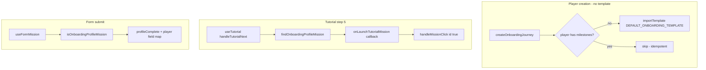

# Bug: Missing Initial Milestone When Creating Session from Scratch + Tutorial Hardcoded Mission ID

## Problem Statement

Two related issues when a Game Maker creates a new session and adds players **without selecting a template**:

1. The player has no milestones or missions, so the tutorial's "Complete Your Profile" step navigates to a non-existent form mission
2. The navigation target is hardcoded as `mission_m1_profile` — it never adapts to whatever missions actually exist for that player

## Root Cause Analysis

### Issue 1: No Initial Journey Seeded

[`createOnboardingJourney()`](src/use-cases/createOnboardingJourney.ts) only calls `invitePlayer()` and `upsertBuddyProfile()`. The template import path (`importTemplate`) is skipped when `input.templateName` is null.

### Issue 2: Hardcoded Mission ID in Tutorial

In [`useTutorial.ts`](src/hooks/useTutorial.ts), `handleTutorialNext()` checks if current step is `PROFILE_STEP_INDEX === 4`:

```typescript
if (tutorialStep === PROFILE_STEP_INDEX) {
  sessionStorage.setItem(TUTORIAL_FORM_KEY, "1");
  navigate(`/form/${sessionId}/${PROFILE_MISSION_ID}`); // ← hardcoded!
  return;
}
```

`PROFILE_MISSION_ID = "mission_m1_profile"` is a magic string tied to mock data. It does not derive from the player's actual mission data. This means:

- If no template was selected, `mission_m1_profile` does not exist → FormPage error
- Even if we seed content, this approach is fragile — any ID change silently breaks routing

### Issue 3: Hardcoded Mission ID in Form Submit

[`useFormMission.ts`](src/hooks/useFormMission.ts) uses the same magic ID for pre-population and for setting `profileComplete` / `tutorialComplete` on submit. Part B alone does not fix this.

### Why Mock Data Masks Both Issues

The mock adapter pre-seeds `MOCK_MILESTONES`, `MOCK_MISSIONS`, and `MOCK_FORM_SCHEMAS` on initialization, including the profile mission (`mission_m1_profile`) with its form schema. The PocketBase adapter has no equivalent seeding logic — it only returns what is in the database.

### SPECS Drift

SPECS describes profile as tutorial step 1. The code uses a 5-step flow with profile as the **final** step (`PROFILE_STEP_INDEX === 4` in [`tutorialSteps.ts`](src/components/tutorial/tutorialSteps.ts)). This plan aligns implementation with the code and updates SPECS accordingly.

## Design Constraints (from SPECS.md)

- **C-04**: XP Derivation algorithm is locked; `xpThreshold` = 100 per Milestone
- **C-06**: Form missions always auto-approved regardless of `validationMethod`
- **D-ARCH-2**: Milestones are player-scoped (each has its own `playerId`)
- **TEMPLATE IMPORT** uses `_milestoneOrder` / `_missionOrder` for FK remapping ([`importTemplate.ts`](src/use-cases/importTemplate.ts))
- **Scope**: Only [`createOnboardingJourney`](src/use-cases/createOnboardingJourney.ts) creates players today; no other invite path needs changes unless a new one is added

## Design Principles

1. **One journey seeding pipeline** — always `importTemplate`, never a parallel manual `createMilestone` / `createMission` path
2. **Semantic mission identity** — explicit `onboardingProfile` tag, not ID or positional heuristics
3. **Thin hooks, fat use-cases** — seeding and resolution in testable pure functions / use-cases; hooks delegate to existing cockpit handlers
4. **Single source of truth for default content** — one `TemplateExport` artifact shared by onboarding, tests, and (optionally) the GM template library

## Architecture



---

## Implementation Plan

### Phase 1 — Domain Constants & Shared Content

#### 1.1 Add explicit mission tag

Add to [`src/types/unions.ts`](src/types/unions.ts) and SPECS `MissionTag` union:

```typescript
ONBOARDING_PROFILE: "onboardingProfile",
```

Record in SPECS Decision Log. This is stable across PocketBase-generated IDs and template imports.

#### 1.2 Define `DEFAULT_ONBOARDING_TEMPLATE`

Create [`src/constants/defaultOnboardingTemplate.ts`](src/constants/defaultOnboardingTemplate.ts) as a typed `TemplateExport` const (not loose JSON — Deno import map, type-checking, no runtime parse).

Contents:

- One milestone: "Arrive & Get Set Up", `order: 0`, `xpThreshold: 100`, map coordinates
- One form mission: "Complete Your Profile", `tags: ["mandatory", "onboardingProfile"]`, `isInCurrentMissions: true`, `validationMethod: "selfApprove"`
- Matching form schema

#### 1.3 Extract shared profile form fields

Create [`src/constants/profileFormFields.ts`](src/constants/profileFormFields.ts) and reference from both `defaultOnboardingTemplate.ts` and [`mockData.ts`](src/adapters/mock/mockData.ts) — single field definition, no copy-paste.

#### 1.4 Tag mock profile mission

Add `onboardingProfile` to the profile mission in `mockData.ts` (`mission_m1_profile`) so mock and PocketBase paths behave identically in tutorial and form logic.

---

### Phase 2 — Seeding Use-Case (No Template Selected)

#### 2.1 New use-case: `applyDefaultOnboardingJourney.ts`

```typescript
export const applyDefaultOnboardingJourney = async (
  playerId: string,
  adapter: AppAdapter,
): Promise<void> => {
  const player = await adapter.getPlayerById(playerId);
  if (!player) throw new Error(`Player not found: ${playerId}`);

  const existing = await adapter.listMilestones(player.sessionId, { playerId });
  if (existing.length > 0) return;

  await importTemplate(DEFAULT_ONBOARDING_TEMPLATE, playerId, adapter);
};
```

Idempotency: skip if the player already has milestones. **Do not** call `importTemplate` twice — it deletes existing milestones first.

#### 2.2 Wire into `createOnboardingJourney`

After buddy upsert:

```typescript
if (input.templateName) {
  // existing importTemplate path
} else {
  await applyDefaultOnboardingJourney(player.id, adapter);
}
```

**Out of scope for v1:** `seedDefaultTemplates.ts` or a server migration that registers the default in the GM template picker. Applying the in-memory `TemplateExport` is sufficient to fix the bug. Optional follow-up: `saveTemplate` the same object into `templates` for GM reuse.

---

### Phase 3 — Mission Resolution Utilities

#### 3.1 New `src/utils/onboardingMission.ts`

Pure, unit-tested helpers:

```typescript
/** Primary: explicit tag. Returns null if not found — no positional fallback. */
export const findOnboardingProfileMission = (
  milestones: ReadonlyArray<Milestone>,
  missions: ReadonlyArray<Mission>,
): Mission | null => {
  const tagged = missions.filter((m) =>
    m.tags.includes(MISSION_TAG.ONBOARDING_PROFILE)
  );
  if (tagged.length === 0) return null;
  if (tagged.length === 1) return tagged[0]!;

  // Invariant: at most one per player; if multiple, pick by journey order
  const msOrder = new Map(milestones.map((ms) => [ms.id, ms.order]));
  return [...tagged].sort((a, b) => {
    const mo = (msOrder.get(a.milestoneId) ?? 0) - (msOrder.get(b.milestoneId) ?? 0);
    return mo !== 0 ? mo : a.order - b.order;
  })[0]!;
};

export const isOnboardingProfileMission = (
  mission: Pick<Mission, "tags">,
): boolean => mission.tags.includes(MISSION_TAG.ONBOARDING_PROFILE);
```

No "first mandatory mission in first milestone" heuristic in production code. If the tag is missing, that is a data bug worth surfacing (skip navigation, optional dev warning), not silently guessing.

---

### Phase 4 — Tutorial Refactor (Reuse Cockpit Routing)

#### 4.1 Change `useTutorial` signature

Callback-based — do not pass full milestone/mission arrays into the hook:

```typescript
export const useTutorial = (
  player: Player | null,
  updatePlayer: (
    patch: Partial<Omit<Player, keyof PBRecord>>,
  ) => Promise<Player>,
  sessionId: string,
  options: {
    readonly onboardingProfileMission: Mission | null;
    readonly onLaunchTutorialMission: (missionId: string) => void;
    readonly missionsReady: boolean;
  },
): UseTutorialResult;
```

#### 4.2 Profile step handler

```typescript
if (tutorialStep === PROFILE_STEP_INDEX) {
  if (!options.missionsReady) return;
  const mission = options.onboardingProfileMission;
  if (!mission) return;
  options.onLaunchTutorialMission(mission.id);
  return;
}
```

Remove `PROFILE_MISSION_ID` from `useTutorial`.

#### 4.3 Wire in `usePlayerCockpitPage`

[`usePlayerCockpitPage.ts`](src/pages/player-cockpit/usePlayerCockpitPage.ts) already has `handleMissionClick(missionId, fromTutorial)` with correct form vs popup routing and `TUTORIAL_FORM_KEY` handling. Reuse it:

```typescript
const onboardingProfileMission = useMemo(
  () => findOnboardingProfileMission(milestones, missions),
  [milestones, missions],
);

useTutorial(tutorialPlayer, updatePlayer, sessionId, {
  onboardingProfileMission,
  missionsReady: !sessionLoading,
  onLaunchTutorialMission: (id) => handleMissionClick(id, true),
});
```

No new `sessionStorage` keys. No popup state duplication inside the hook.

#### 4.4 TutorialOverlay CTA gating

Disable "Set up profile" when `!missionsReady || !onboardingProfileMission` (prop from model). Prevents advancing to a broken navigation while session data is still loading.

---

### Phase 5 — `useFormMission` (Replace ID Checks)

Replace both `PROFILE_MISSION_ID` comparisons with mission lookup + `isOnboardingProfileMission`:

- Pass full `Mission` (or at least `tags`) into hook options, not just `missionId`
- Pre-fill and `profileComplete` / `tutorialComplete` patch only when `isOnboardingProfileMission(mission)`

Do **not** use `type === "form" && tags.includes("mandatory")` — any mandatory form would incorrectly trigger profile completion.

---

### Phase 6 — Documentation & SPECS

| Item | Action |
| ---- | ------ |
| SPECS tutorial flow | Align with 5-step flow in `tutorialSteps.ts` |
| SPECS `MissionTag` | Add `onboardingProfile` |
| Decision log | See below |

---

## Files to Modify

| File | Change |
| ---- | ------ |
| `src/constants/profileFormFields.ts` | **new** — shared form field definitions |
| `src/constants/defaultOnboardingTemplate.ts` | **new** — `TemplateExport` const |
| `src/use-cases/applyDefaultOnboardingJourney.ts` | **new** — idempotent wrapper over `importTemplate` |
| `src/use-cases/createOnboardingJourney.ts` | Call apply-default when no template |
| `src/utils/onboardingMission.ts` | **new** — find + is helpers |
| `src/types/unions.ts` | Add `ONBOARDING_PROFILE` to `MISSION_TAG` |
| `SPECS.md` | Tag union, tutorial flow, decision log |
| `src/adapters/mock/mockData.ts` | Import shared fields; add tag to profile mission |
| `src/hooks/useTutorial.ts` | Callback-based launch; remove magic ID |
| `src/hooks/useFormMission.ts` | Tag-based profile detection |
| `src/pages/player-cockpit/usePlayerCockpitPage.ts` | Wire resolver + callback |
| `src/components/tutorial/TutorialOverlay.tsx` | Disable CTA when mission not ready |

**Not needed:** `seedInitialMilestone.ts`, `seedDefaultTemplates.ts`, `default_template.json`, `TutorialOverlay` `pendingMissionId` prop.

---

## Edge Cases

| Case | Behavior |
| ---- | -------- |
| Player already has milestones | `applyDefaultOnboardingJourney` returns early |
| GM later applies full template | `importTemplate` replaces seed (existing behavior) |
| Template has no `onboardingProfile` tag | Tutorial step 5 CTA disabled; no broken navigation |
| Session still loading at step 5 | CTA disabled until `missionsReady` |
| Multiple `onboardingProfile` missions | Resolver picks first by `(milestone.order, mission.order)` |
| First mandatory mission is not a form | N/A — default template and tutorial both target the tagged profile form mission |
| No missions when tutorial reaches step 5 | CTA disabled; tutorial does not navigate to a missing route |

---

## Testing Strategy

| Test | Asserts |
| ---- | ------- |
| `applyDefaultOnboardingJourney.test.ts` | Creates milestone + tagged form mission + schema; second call is no-op |
| `onboardingMission.test.ts` | Finds by tag; returns null without tag; tie-breaks by order |
| `importTemplate` + default template fixture | FK remap, `isInCurrentMissions`, schema bound to new mission id |
| `useTutorial` (extracted handler or hook test) | Profile step calls `onLaunchTutorialMission` with resolved id; no-op when `missionsReady === false` |
| `useFormMission` | Tagged mission sets `profileComplete`; unrelated form does not |
| E2E (Playwright) | GM creates session, adds player **without** template → tutorial → profile form submits |

Use `DEFAULT_ONBOARDING_TEMPLATE` in unit tests — same artifact as production.

---

## Decision Log Entry

| ID | Date | Decision | Rationale |
| -- | ---- | -------- | --------- |
| D-ONBOARDING-DEFAULT | 2026-07-06 | Seed blank-player journeys via bundled `DEFAULT_ONBOARDING_TEMPLATE` + `importTemplate`; identify profile mission with `onboardingProfile` tag instead of hardcoded IDs | Reuses existing import pipeline (no parallel seed path); tag is stable across PocketBase IDs and GM templates; tutorial and form logic share one resolver |

---

## Why This Scales

- **New onboarding flows** — change one `TemplateExport`, not adapter calls in multiple places
- **GM templates** — any template can mark its profile mission with `onboardingProfile`; tutorial and form logic follow the tag
- **No ID coupling** — PocketBase-generated IDs work everywhere
- **Hook stays small** — cockpit keeps routing ownership; tutorial does not grow mission-type branches
- **Testable core** — pure resolver + thin use-case, easy to cover without React
