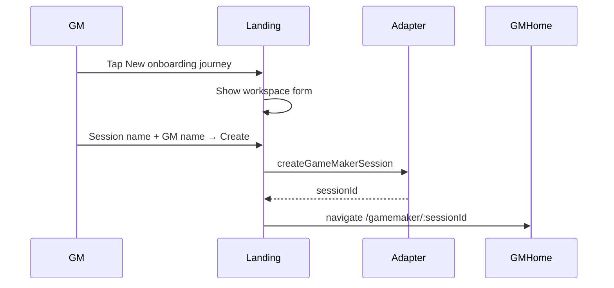
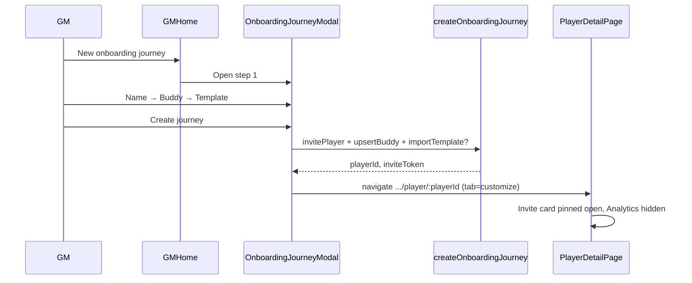
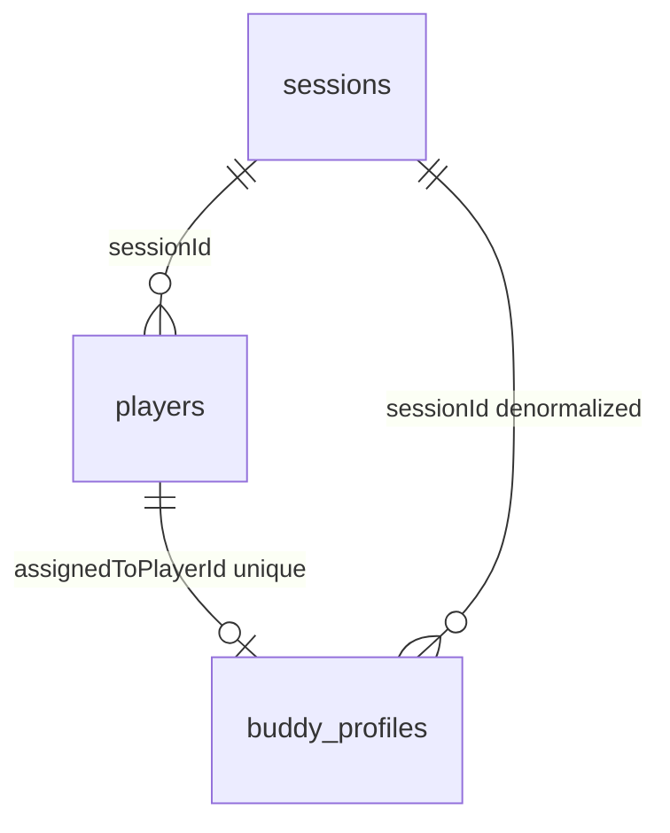
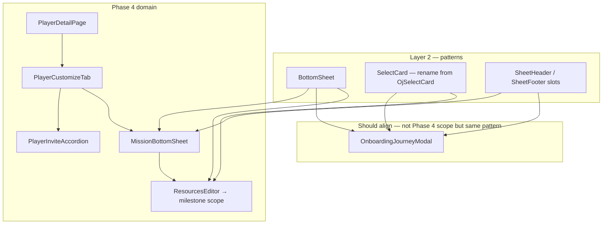

# Implementation Plan — Onboarding Journey UI Redesign

**ID:** OJ-01  
**Status:** In progress (Phases 1–4 complete; Phase 5 next)  
**Last updated:** 2026-07-05  
**Wireframe:** Cursor canvas [`onboarding-journey-redesign.canvas.tsx`](../../.cursor/projects/Users-hoonkim-Projects-messe-buddy-app/canvases/onboarding-journey-redesign.canvas.tsx) (open beside chat in IDE)

**Authority:** Product behavior in [`SPECS.md`](../SPECS.md) (invite claim C-27, workspace model D-ARCH-2). This plan is the implementation handoff for OJ-01; update [`production-implementation-plans.md`](production-implementation-plans.md) backlog when work starts.

---

## Summary

Consolidate redundant landing and GM “add player” flows into a single **new onboarding journey** UX. Players may **only** join via a per-player invitation link (`/join/:sessionId?t=:inviteToken`) — not from the landing page. After the GM completes a 3-step wizard, the app redirects to **player detail → Customize** with the invite card pinned open until claim; **Analytics** stays hidden until the player starts their journey.

---

## Problem → outcome

| Today | Target |
| ----- | ------ |
| Landing: `+ Employee`, `+ Game Maker`, Recovery key section, per-card recovery key | Landing: profile list + one bottom CTA **New onboarding journey** (workspace form unchanged) |
| Player self-join from landing (`EmployeeForm`) | Removed — join only via invite URL |
| GM **Add player** → name modal → customize tab (`?new=1`) with auto starter template | GM **New onboarding journey** → 3-step wizard (name, buddy, template) → redirect to Customize |
| Invite accordion at bottom of Customize; collapsed by default | `card player-invite` at **top** of Customize body, **forced open** until `claimStatus=claimed` |
| Analytics tab always visible on player detail | Analytics hidden until player **starts journey** (see gating below) |

**Unchanged:** Profile resume, `/join` claim flow, player cockpit after claim, Customize map/template/resources editing, Resource library tab on GM home.

---

## Wireframe screens

Interactive wireframe (390×844). Screen chips map 1:1 to sections below.

### 1. Landing — profiles only

```
┌ MesseBuddy brand ────────┐
├ Your profiles ─────────────┤
│  [profile card] × N        │  tap → resume session
├────────────────────────────┤
│ [New onboarding journey]   │  sole CTA (sticky bottom)
│ Players join via invite    │  helper caption
└────────────────────────────┘
```

- Remove: role toggles, `RecoverySection`, recovery key on `ProfileCard`.
- Keep: demo profiles, orphan badge (P-17), resume navigation.

### 2. Landing — workspace form (inline panel)

Same fields as today’s `GameMakerForm`: **Session name**, **Your name**, **Create & save profile**. Opened by bottom CTA (not a separate “Game Maker” toggle).

### 3. GM home — empty / with players

- Header CTA and empty-state CTA both labeled **New onboarding journey** (replaces “Add player”).
- Opens `OnboardingJourneyModal` (not `NameCaptureModal`).

### 4. Wizard — step 1: Player name

- Required text field.
- Copy: name appears on player card and invite.

### 5. Wizard — step 2: Assign buddy

**Not a buddy catalog** — `buddy_profiles` is one row per **player** (`assignedToPlayerId` unique).
“Pick existing” **copies** fields from a prior assignment into a **new** row for the new player (no FK).

**Canonical draft shape** — same as Assign Buddy tab (`useBuddyProfile` buddyDraft / `BuddyProfile` fields):

- Mode toggle: **Existing buddy** | **Add new**.
- **Existing:** radio list from `listDistinctBuddyProfilesForPicker(sessionId)` — show name, role, email, phone; submit `buddyProfileId` (PB record `id` of source assignment).
- **Add new:** **`BuddyAssignmentFields`** (extracted from `BuddyAssignmentForm` on player detail) — **not** a separate inline form. Draft held in modal until submit.
- Persist: `createOnboardingJourney` → `upsertBuddyProfile(newPlayerId, …)` (can run while `claimStatus=invited`).

**Phase 3 shipped** a temporary `BuddyPickerDraft` inline form; **Phase 4 (4.8)** replaces “Add new” with shared hook + fields per decision below.

### 6. Wizard — step 3: Choose template

- **Start from scratch** (empty) — first option; skip `importTemplate`.
- Saved templates — radio list with milestone/mission counts.
- Remove auto `pickStarterTemplate` from `invitePlayer`.

### 7. Player detail — Customize (pending claim)

Post-wizard redirect: `/gamemaker/:sessionId/player/:playerId` with **Customize** tab active.

```
┌ TopBar ──────────────────┐
├ ← {player name} ──────────┤
├ Customize │ Buddy │ Pre-boarding ┤   ← Analytics omitted
├───────────────────────────┤
│ card player-invite (OPEN) │   top of main body
│   QR + join URL + Copy    │
├ Onboarding template ──────┤
├ Milestones & map ─────────┤
└ Resources ────────────────┘
```

### 8. Player detail — journey started

- **Analytics** tab appears in tab bar.
- `card player-invite` may collapse; still available to re-share.
- GM can switch to Analytics for progress feed.

---

## Interaction flows

### GM: create workspace (landing)



### GM: create onboarding journey (wizard)



### Player: claim via invite (unchanged route)

```mermaid
sequenceDiagram
  participant GM
  participant Detail
  participant Player
  participant Join as /join/:sid?t=

  GM->>Detail: Copy link / show QR
  Player->>Join: Open invite URL
  Join->>Join: claimPlayer → claimStatus=claimed
  Join->>Player: /session/:sessionId cockpit
  Note over Detail: Invite card collapsible; Analytics still hidden until journey started
  Player->>Player: Complete first mission / progress event
  Note over Detail: Analytics tab becomes visible
```

### Tab and invite gating

| State | `claimStatus` | Progress events | Analytics tab | Invite card |
| ----- | ------------- | ----------------- | ------------- | ----------- |
| Pending invite | `invited` | 0 | Hidden | Pinned open (`pinnedUntilClaimed`) |
| Claimed, not started | `claimed` | 0 | Hidden | Collapsible |
| Journey started | `claimed` | ≥ 1 | Visible | Collapsible |

**Journey started** = at least one `progress_events` row for this `playerId` (same signal Analytics needs). Revisit if product prefers “claimed only” — wireframe currently uses first progress event.

---

## Implementation phases

### Phase 1 — Landing simplification

**Status:** Done (2026-07-05)

| Task | Files | Done |
| ---- | ----- | ---- |
| Remove Employee / Game Maker toggles; add bottom CTA | `ProfileList.tsx`, `landing.css` | x |
| Remove `EmployeeForm`, `RecoverySection` from `/` landing | `LandingPage.tsx` | x |
| Keep `/join/:sessionId` claim UI (`EmployeeForm` on join route only) | `LandingPage.tsx` | x |
| Remove recovery key UI from profile cards | `ProfileCard.tsx` | x |
| Trim `useLandingFlow` (workspace panel + join route only) | `useLandingFlow.ts` | x |
| Delete `RecoverySection.tsx` | — | x |
| Rewrite `smoke-landing.ts` | `scripts/smoke-landing.ts` | x |

**Exit:** Landing smoke updated; no Employee/Recovery UI on `/`.

### Phase 2 — Backend / use-case layer

**Status:** Done (2026-07-05)

#### Pre-flight audit (hooks, use-cases, schema)

| Finding | Severity | Action in Phase 2 |
| ------- | -------- | ----------------- |
| **Use-case `invitePlayer` vs `adapter.invitePlayer`** — same name; use-case silently auto-applies first template via `pickStarterTemplate` | Drift risk | Slim use-case to player-row only; template moves to `createOnboardingJourney` |
| **`pickStarterTemplate` / `generateUniqueInviteToken`** — only used by old invite flow; latter unused anywhere | Dead | Remove exports |
| **`recoverIdentity`** — UI removed in Phase 1; no remaining imports | Orphaned | Keep use-case (SPECS still documents recovery); no UI wire |
| **`verifySession`** in `joinSession.ts` — never imported | Dead | Remove |
| **`applyTemplateToSession.ts`** — file name says session; exports `applyTemplateToPlayer` (thin `importTemplate` wrapper) | Misleading | Rename file → `applyTemplateToPlayer.ts` |
| **`playerDetailStorage`** — param named `sessionId` but callers pass **`playerId`**; key is `mb_player_template_${playerId}` | Misleading | Rename param to `playerId` |
| **`buddy_profiles` schema** — one row per **player** (`assignedToPlayerId` unique); not a global buddy catalog | Schema truth | `listBuddyProfiles(sessionId)` lists session rows; picker dedupes by name in use-case |
| Plan `existingBuddyId` | Misleading | Use `buddyProfileId` (PB record `id`) — copy fields to new player, not FK link |
| **`BuddyPickerDraft.telephone`** vs domain **`BuddyProfile.phone`** | Naming | Phase 3 mapper; **Phase 4:** unify on `BuddyProfile` draft (`phone`) |
| **`useBuddyProfile` / `BuddyAssignmentForm`** vs wizard inline form | Dual UI (Phase 3) | **Phase 4 (4.8):** one hook + `BuddyAssignmentFields` for wizard “Add new” and Assign Buddy tab |
| **`gmPlayers.invitePlayer`** — hook method name implies invite-only; will become wizard entry in Phase 3 | Misleading | Phase 2: call slim `invitePlayer`; Phase 3: add `createOnboardingJourney` to hook |

**Layering (locked for OJ-01):**

```
OnboardingJourneyModal (Phase 3)
  → useGmPlayers.createOnboardingJourney (Phase 3)
    → createOnboardingJourney use-case (Phase 2)
      → invitePlayer use-case → adapter.invitePlayer
      → adapter.upsertBuddyProfile
      → importTemplate (when templateName set)
```

`joinSession` / `claimPlayer` — unchanged; `/join` route only.

#### Corrected contracts

```ts
// src/types/buddyPicker.ts
interface BuddyPickerDraft {
  readonly name: string;
  readonly email: string;
  readonly telephone: string; // UI label; maps to BuddyProfile.phone
  readonly role: string;
}

type BuddySelection =
  | { readonly kind: "new"; readonly draft: BuddyPickerDraft }
  | { readonly kind: "existing"; readonly buddyProfileId: string };

interface CreateOnboardingJourneyInput {
  readonly playerName: string;
  readonly buddy: BuddySelection;
  readonly templateName: string | null; // null = start from scratch
}

interface CreateOnboardingJourneyResult {
  readonly playerId: string;
  readonly inviteToken: string;
  readonly appliedTemplateName: string | null;
}
```

`listDistinctBuddyProfilesForPicker(sessionId, adapter)` — use-case helper; dedupes
`listBuddyProfiles` by normalized `name` for wizard step 2.

#### Implementation tasks

| Task | Files | Done |
| ---- | ----- | ---- |
| Add `listBuddyProfiles(sessionId)` | `interface.ts`, `mockAdapter.ts`, `pbAdapter.ts` | x |
| Add `buddyPicker.ts` types + field mapper | `src/types/buddyPicker.ts`, `types/index.ts` | x |
| New `createOnboardingJourney` + distinct-buddy helper | `src/use-cases/createOnboardingJourney.ts` | x |
| Slim `invitePlayer` use-case (adapter only, returns `Player`) | `invitePlayer.ts`, `gmPlayers.ts` | x |
| Remove dead exports; rename storage params; rename template file | see audit table | x |
| Seed mock buddies with `email` / `phone` for picker | `mockData.ts` | x |

**Exit:** `deno task build` green; `invitePlayer` no longer applies templates; `createOnboardingJourney` callable from tests/hooks.

#### Deprecated (do not extend)

- `InvitePlayerResult.appliedTemplateName` — replaced by `CreateOnboardingJourneyResult`
- Auto-template on add-player — superseded by explicit wizard step 3
- `existingBuddyId` naming in early plan drafts — use `buddyProfileId`

### Phase 3 — Wizard bottom sheet + GM home

**Status:** Done (2026-07-05)

**UI polish (3.11):** Migrated wizard from centered `modal--narrow` to **`BottomSheet`** (`oj-sheet`, temporary `100dvh` — **revert to 94dvh token in 4.10**); added `OjSelectCard` tappable cards; wireframe header hierarchy (step counter + Cancel + single title).

#### Buddy data model (pre-flight — resolved for Phase 3)

| Topic | Finding | Phase 3 implication |
| ----- | ------- | ------------------- |
| **Storage** | `buddy_profiles`: 1:1 with `players` via unique `assignedToPlayerId` | No new collection; no buddy catalog CRUD |
| **Adapter CRUD** | Create/Read/Update via `upsertBuddyProfile`, `getBuddyProfile`, `listBuddyProfiles`; **no Delete** | Wizard only **lists** + **creates** on journey submit |
| **“Existing” pick** | Copies `name`, `role`, `email`, `phone`, optional legacy fields from source row | UI label: “Reuse contact from …”; `buddyProfileId` = source assignment id |
| **Dedupe** | `listDistinctBuddyProfilesForPicker` dedupes by normalized **name** | Same person on two players → one picker row; edge case: name collision hides a row |
| **Before claim** | Buddy row created while `claimStatus=invited` | Player cockpit can show `BuddyCard` before claim; supersedes P-04 / form hint “once joined” for wizard path |
| **OD-05 (SPECS)** | Open: pool vs per-player | **Decided for OJ-01:** per-player assignment + copy-from-history picker (document in D-OJ-1) |
| **OD-20 (SPECS)** | Auto-apply first template on add-player | **Superseded** by wizard step 3 + `createOnboardingJourney` |
| **`useBuddyProfile`** | Phase 3: wizard used separate draft | **Phase 4:** extend for wizard draft mode + shared form with Assign Buddy tab |
| **`importTemplate`** | Does not touch buddies | Template step independent of buddy step |



**Layering (Phase 3 UI):**

```
GameMakerHomePage
  → OnboardingJourneyModal
       step 1: player name (local state)
       step 2: BuddyPicker → useBuddyPickerOptions (existing) + BuddyAssignmentFields (add new, Phase 4)
       step 3: TemplateRadioList → usePlayerTemplates.listTemplates (read-only)
  → useGmPlayers.createOnboardingJourney(input)
       → createOnboardingJourney use-case (Phase 2)
       → writeAppliedTemplate(playerId, name) when applied
  → navigate /gamemaker/:sid/player/:pid?journey=1
```

#### Phase 3 tasks (implementation order)

| # | Task | Files | Notes |
| - | ---- | ----- | ----- |
| 3.1 | **`useBuddyPickerOptions`** — fetch `listDistinctBuddyProfilesForPicker`; expose `{ options, loading, error, refresh }` | `src/hooks/useBuddyPickerOptions.ts` | Adapter via `useAdapter`; active-guard like `useGmPlayers` |
| 3.2 | **`BuddyPicker`** — mode toggle; existing radios; **Add new** form *(Phase 3: inline `BuddyPickerDraft`; Phase 4.8: `BuddyAssignmentFields`)* | `src/components/gamemaker/BuddyPicker.tsx` | Display `phone` as telephone in UI |
| 3.3 | **`TemplateRadioList`** — “Start from scratch” (`templateName=null`) + templates from props; show milestone/mission counts | `src/components/gamemaker/TemplateRadioList.tsx` | Reuse `TemplateExport` shape from `usePlayerTemplates` |
| 3.4 | **`OnboardingJourneyModal`** — 3 steps, Back/Cancel, `data-testid` contract; accumulates `CreateOnboardingJourneyInput`; calls `onSubmit` on Create journey | `src/components/gamemaker/OnboardingJourneyModal.tsx` | **`BottomSheet`** (`oj-sheet`, full viewport); not centered modal |
| 3.5 | **`useGmPlayers`** — add `createOnboardingJourney(input)`; **deprecate** `invitePlayer` from public hook API (remove or keep private until callers gone) | `src/hooks/useProgress/gmPlayers.ts` | On success: `writeAppliedTemplate` when `appliedTemplateName` set; `refresh()` player list |
| 3.6 | **`GameMakerHomePage`** — replace `NameCaptureModal` + `handleCreate` with `OnboardingJourneyModal`; loading/error toast on failure | `GameMakerHomePage.tsx` | Navigate `…/player/:pid?journey=1` (interim tab hint; Phase 4 removes query) |
| 3.7 | **`usePlayerDetailPage`** — `?journey=1` → initial tab **Customize** (replaces `?new=1` interim) | `usePlayerDetailPage.ts` | Small cross-phase hook; full invite/analytics gating stays Phase 4 |
| 3.8 | **`GmPlayersTab`** — CTA copy **New onboarding journey**; `data-testid="new-onboarding-journey-btn"` on header + empty state | `GmPlayersTab.tsx` | Remove “Add player” strings |
| 3.9 | **Styles** — wizard step layout, buddy option cards, template radios | `gamemaker.css` | `oj-sheet__*`, `oj-select-card`, `oj-mode-toggle` |
| 3.10 | **Remove** GM-home `NameCaptureModal` import | `GameMakerHomePage.tsx` | Keep `NameCaptureModal` for other flows if any |
| 3.11 | **Wizard UI polish** — bottom sheet shell, `OjSelectCard`, header hierarchy | `OnboardingJourneyModal.tsx`, `OjSelectCard.tsx`, `BottomSheet.tsx` | Full-height sheet; Phase 3.5 visual pass before Phase 4 |

#### Phase 3 component contracts

```ts
// useBuddyPickerOptions.ts
interface UseBuddyPickerOptionsResult {
  readonly options: ReadonlyArray<BuddyProfile>; // deduped picker rows
  readonly loading: boolean;
  readonly error: Error | null;
  readonly refresh: () => void;
}

// OnboardingJourneyModal.tsx — mounted when open; remount via key on GameMakerHomePage
interface OnboardingJourneyModalProps {
  readonly sessionId: string;
  readonly templates: ReadonlyArray<TemplateExport>;
  readonly loading: boolean;
  readonly onSubmit: (input: CreateOnboardingJourneyInput) => void;
  readonly onClose: () => void;
}

// BuddyPicker.tsx
interface BuddyPickerProps {
  readonly options: ReadonlyArray<BuddyProfile>;
  readonly loading: boolean;
  readonly value: BuddySelection | null;
  readonly onChange: (value: BuddySelection) => void;
}
```

#### Phase 3 — explicitly out of scope

- Global buddy catalog table or `deleteBuddyProfile`
- Refactoring `useBuddyProfile` / `BuddyAssignmentForm` for wizard reuse — **done (4.8)**
- Invite card pin-to-top / `pinnedUntilClaimed` — **done (4.2)**
- Analytics tab gating — **done (4.6)**
- `smoke-onboarding-journey` script — **Phase 3 scope** added (Phase 5 extends with invite/analytics gates)
- SPECS D-OJ-1 entry (Phase 5)

#### Phase 3 exit criteria

- [x] GM home shows **New onboarding journey** only (no Add player / name modal).
- [x] Wizard completes all 3 steps; mock session shows ≥1 existing buddy option (Marcus/Lena).
- [x] Submit calls `createOnboardingJourney`; new player appears in list as **Not joined yet**.
- [x] Redirect to `/gamemaker/:sessionId/player/:playerId?journey=1` with **Customize** tab active.
- [x] `deno task build` + `deno task lint` pass (src + smoke script).
- [x] No new calls to `useGmPlayers.invitePlayer` from UI.
- [x] `deno task smoke-onboarding-journey` — **12/12** on mock `:5173` (2026-07-05, Phase 4 extensions).

#### Phase 3 verification log (2026-07-05)

| Check | Result |
| ----- | ------ |
| `deno task build` | Pass |
| `deno task smoke-onboarding-journey` | **10/10** (Firefox, iPhone 15 viewport) |
| Screenshots | `.playwright-mcp/oj-00` … `oj-05` |
| Redirect URL | `/gamemaker/sess_mmt2026/player/:id?journey=1` |
| Customize tab | `aria-selected=true` |
| Template section | `template-select` visible |
| Pending on GM list | New player card after SPA back nav |

**Note:** Full page `goto` GM home resets mock adapter — smokes use in-app **All players** back nav for pending-player assertion.

#### Phase 3 manual test script (mock `:5173`)

1. Resume demo GM (Peter) → GM home.
2. Tap **New onboarding journey** → step 1 → enter name → Continue.
3. Step 2 → pick **Marcus Weber** (existing) or add new with email + telephone.
4. Step 3 → **Start from scratch** or a seeded template → **Create journey**.
5. Land on player detail Customize; player visible on GM home as pending.
6. Player detail → Customize shows template section (empty or applied).

**Exit:** Wizard E2E path reaches player detail Customize with invite pinning + Analytics gate ✅ (Phase 4).

### Phase 4 — Player detail behavior

**Status:** Complete (2026-07-05)

#### Phase 4 pre-flight audit (2026-07-05)

Structural review of player-detail surfaces before Phase 4 implementation. Goal: one canonical view per data relationship; no silent duplicates.

##### A. Duplicate milestone entry points (remove)

| Surface | Location | Opens | Verdict |
| ------- | -------- | ----- | ------- |
| `MilestoneMapEditor` in `player-detail__map-wrap` | `PlayerCustomizeTab` | `MissionBottomSheet` via `onSelectMilestone` | **Keep** — canonical customize map (edit positions, add nodes, mission counts on nodes) |
| `MilestoneGrid` (`data-testid="milestone-grid"`) | `PlayerCustomizeTab` (below map) | Same `onSelectMilestone` | **Removed (4.1)** |
| `IsometricMilestoneMap` in `player-detail__map-wrap` | `PlayerAnalyticsTab` | Same `openMilestone` | **Keep** — read-only progress map; different purpose (Analytics tab) |

**Action:** Delete `MilestoneGrid` usage from `PlayerCustomizeTab`; remove component + `.milestone-grid*` CSS if unused elsewhere. Drop `completedMissionIds` prop from customize tab if only grid consumed it.

##### B. Resources placement vs data model (relocate)

| Surface | Scope | SPECS alignment | Verdict |
| ------- | ----- | --------------- | ------- |
| `ResourcesEditor` + “Resources” section | Was on `PlayerCustomizeTab` | Per-milestone attach | **Removed from Customize (4.5)** |
| `MissionBottomSheet` | Missions + resources | SPECS aligned | **Done (4.4)** — milestone-scoped `ResourcesEditor` in sheet list view |
| `ResourceLibraryTab` | GM home — global `library_resources` CRUD | Correct layer | **Keep** — catalog only; attach from milestone sheet |
| `handleAddResource` fallback | Picks first milestone silently when none selected | Hides wrong attachment target | **Remove fallback** once resources live in sheet (require explicit `milestoneId`) |

**Smell today:** Customize “+ Add resource” can attach to `milestones[0]` without user choosing milestone — violates milestone FK semantics.

##### C. Invite card duplication and placement

| Instance | Tab | Order | Phase 4 target |
| -------- | --- | ----- | -------------- |
| `PlayerInviteAccordion` | Customize | **Top**, pinned when invited | **Done (4.2)** |
| `PlayerInviteAccordion` | Analytics | Was duplicated | **Removed (4.3)** |

**Missing:** `player-invite-body` testid on expanded body (smoke Phase 5); `data-testid` on `RouteTabBar` tabs (`player-detail-tab-*`).

##### D. Buddy model — one shape, two lifecycles (unify hook + form)

**Decision (2026-07-05):** Wizard buddy assignment and Assign Buddy tab are the **same `BuddyProfile` draft**, at different lifecycle moments — not parallel UI types. Reuse **`useBuddyProfile`** draft shape and **`BuddyAssignmentForm`** field content; do **not** maintain a separate `BuddyPickerDraft` form in the wizard.

| Lifecycle | When | `playerId` | Persist |
| --------- | ---- | ---------- | ------- |
| **Wizard step 2 — Add new** | Before player row exists | None (draft only in modal state) | Deferred → `createOnboardingJourney` → `upsertBuddyProfile` |
| **Wizard step 2 — Pick existing** | Before player row exists | N/A — copy source row | `createOnboardingJourney` copies via `buddyProfileId` |
| **Assign Buddy tab** | After player exists | Known | `useBuddyProfile.upsertBuddy()` on Save |

**Canonical data shape:** `BuddyProfile` draft  
`Omit<BuddyProfile, "id" | "created" | "updated" | "assignedToPlayerId">`  
(`sessionId`, `name`, `role`, `email`, `phone`, optional `tenure`, `contactUrl`, …) — **one mapper** to `upsertBuddyProfile`.

**Canonical hook:** **`useBuddyProfile`** (extend for wizard):
- **`playerId` present** — current behavior: fetch saved row, draft sync, `upsertBuddy`.
- **`playerId` absent / `mode: "draft"`** — no fetch; expose `buddyDraft` + `setBuddyDraft` only (wizard step 2 “Add new” before invite).

**Canonical component:** **`BuddyAssignmentForm`** (refactor):
- Extract **`BuddyAssignmentFields`** — the shared field block (name, role, email, phone, tenure, contactUrl per domain).
- **Assign Buddy tab** — card chrome + fields + Save (existing tab).
- **Wizard “Add new”** — **`BuddyAssignmentFields` only** (no card header, no Save, no player dropdown) inside `BuddyPicker` when mode = new.
- **Remove** inline duplicate inputs from `BuddyPicker` “new” branch.

**Keep separate (list only):** **`useBuddyPickerOptions`** — session-scoped “pick existing” radios (`SelectCard`); copies on submit, not a second form shape.

**Phase 4 cleanup:**
- Extend `useBuddyProfile` load/save to include **`email` / `phone`** (already on `BuddyProfile`; hook draft today omits them).
- Remove stale hint “Buddy can be assigned once a player has joined.”
- **`BuddyPickerDraft` / `BuddySelection` `{ kind: "new"; draft }`** → draft type aligns with `useBuddyProfile` buddyDraft (alias or replace).
- Migrate `buddyPickerDraftToProfileFields` → single **`buddyDraftToProfileFields`** used by wizard submit and tab save.
- Style: move `BuddyAssignmentForm` inline `style={{}}` to BEM (4.8 / 4.13).

~~**Do not duplicate:** Keep wizard picker separate from per-player edit tab~~ — **superseded:** same form + hook; only “pick existing” list stays wizard-specific.

##### E. Analytics tab gating (implemented 4.6)

| Item | Current | Phase 4 |
| ---- | ------- | ------- |
| `PLAYER_DETAIL_TABS` | Always 4 tabs | Derive visible tabs; omit Analytics when `!showAnalyticsTab` |
| `showAnalyticsTab` | Absent | `claimStatus === "claimed"` **and** ≥ 1 progress event for `playerId` (per gating table above) |
| Default tab after wizard | `?journey=1` → Customize | Keep; remove `?new=1` when cleaning query hacks |
| Tab fallback | None | If Analytics hidden while active, fall back to Customize |

##### F. Template UX overlap (acceptable)

| Surface | Role |
| ------- | ---- |
| Wizard step 3 `TemplateRadioList` | One-time apply on create |
| Customize `TemplateSelect` | Re-apply / switch template on existing player |

Not a duplicate — different lifecycle moments. `writeAppliedTemplate` + localStorage tracks applied name for Customize only.

##### G. Style / layout drift

| Issue | Location | Phase 4 fix |
| ----- | -------- | ----------- |
| `BuddyAssignmentForm` inline `style={{…}}` | Component body | Migrate to BEM in `gamemaker.css` (design-tokens §10) |
| `.player-invite` lives in `gamemaker.css` | Not `player.css` | OK short-term; optional move with player-detail pass |
| `.player-detail__map-wrap` shared | Customize + Analytics | **Keep** — shared geometry wrapper; different map components inside |
| Customize section order | template → map → resources → invite | Phase 4: **invite → template → map** (drop resources section) |

##### H. Phase 4 task list (revised)

| # | Task | Status |
| - | ---- | ------ |
| 4.1 | Remove `MilestoneGrid` from Customize | ✅ |
| 4.2 | Move invite accordion to top; `pinnedUntilClaimed` + `player-invite-body` testid | ✅ |
| 4.3 | Remove invite from Analytics tab | ✅ |
| 4.4 | Milestone-scoped resources inside `MissionBottomSheet` | ✅ |
| 4.5 | Remove Customize “Resources” section + props plumbing | ✅ |
| 4.6 | `showAnalyticsTab` + filter tabs + `activeTab` fallback | ✅ |
| 4.7 | `RouteTabBar` `testIdPrefix="player-detail-tab"` | ✅ |
| 4.8 | Unify buddy UI — `BuddyAssignmentFields`, `BuddyProfileDraft`, email/phone | ✅ |
| 4.9 | Extend `smoke-onboarding-journey` — invite pin, Analytics absent | ✅ |
| 4.10 | Sheet height token `--sheet-height: 94dvh`; remove wizard `100dvh` override | ✅ |
| 4.11 | Wizard uses pattern sheet chrome (`.sheet-header--stacked`) | ✅ |
| 4.12 | `SelectCard` pattern (replaces `OjSelectCard`) | ✅ |
| 4.13 | Move `.player-detail__*`, `.player-invite__*` → `player.css` | ✅ |
| 4.14 | Dedupe `.section-label` / `.mission-item` from `sidebar.css` | ✅ |
| 4.15 | Update `design-tokens.md` §6, §7.5, §8, §9 | ✅ |

#### Phase 4 exit criteria

- [x] Customize: invite **top**, pinned open when `claimStatus=invited`; no duplicate invite on Analytics.
- [x] `MilestoneGrid` removed; map is sole milestone entry on Customize.
- [x] `ResourcesEditor` lives in `MissionBottomSheet` (milestone-scoped); removed from Customize tab.
- [x] Analytics tab hidden until `claimed` + ≥1 progress event; `player-detail-tab-*` testids.
- [x] Buddy wizard “Add new” reuses `BuddyAssignmentFields`; shared `BuddyProfileDraft` type.
- [x] `--sheet-height: 94dvh` token; wizard + mission sheets aligned; shared `SelectCard` pattern.
- [x] `deno task build` passes; `smoke-onboarding-journey` **12/12** on mock `:5173`.

#### Phase 4 — style & component unification audit (2026-07-05)

Goal: one **BottomSheet** contract, one **select-card** pattern, player-detail styles in the right CSS file, design tokens as single source of truth.

##### I. Bottom sheet height drift (your observation — confirmed)

| Sheet | Height | Top chrome visible? | Source |
| ----- | ------ | ------------------- | ------ |
| `MissionBottomSheet` | `94dvh` | **Yes** — ~6dvh gap; `TopBar` (z-index 100) shows above sheet (z-index 101) | `bottom-sheet.css` default |
| `OnboardingJourneyModal` (`.oj-sheet`) | `100dvh` | **No** — covers full viewport including top bar | `gamemaker.css` override (Phase 3 polish) |
| **design-tokens.md §7.5 / §9** | documents **94dvh** | intentional peek at app chrome | **OJ sheet violates this** |

**Root cause:** No `--sheet-height` token; wizard added a one-off `.oj-sheet { height: 100dvh }` instead of extending the shared pattern.

**Decided (2026-07-05): Option A** — add `--sheet-height: 94dvh` to `tokens.css`; `.bottom-sheet { height: var(--sheet-height) }`; **remove** `.bottom-sheet.oj-sheet { height: 100dvh }`. Both wizard and mission sheets peek top bar consistently.

~~**Unify (pick one, document in tokens):**~~

| Option | CSS | UX | Status |
| ------ | --- | -- | ------ |
| **A (token default)** | `--sheet-height: 94dvh` on `.bottom-sheet` | Both sheets stop below top bar | **✅ Decided** |
| B (below topbar) | `calc(100dvh - var(--topbar-h))` | Sheet below fixed top bar | — |
| C (full overlay) | `100dvh` + z-index above top bar | Immersive | — |

##### J. Parallel sheet chrome (duplicate BEM)

Wizard reimplemented sheet header/footer instead of reusing pattern classes:

| Wizard (custom) | Mission sheet (pattern) | Same job? |
| --------------- | ----------------------- | --------- |
| `.oj-sheet__header` | `.sheet-header` | Yes |
| `.oj-sheet__title` | `.sheet-header__title` | Yes |
| `.oj-sheet__cancel` (raw `<button>`) | `.sheet-icon-btn` + ghost / text btn | Yes |
| `.oj-sheet__body` (padding wrapper) | `.sheet-body` + inner padding convention | Yes |
| `.oj-sheet__footer` + `.oj-sheet__actions` | `.sheet-footer` | Yes |

**Action (4.10):** Refactor `OnboardingJourneyModal` to use `.sheet-header`, `.sheet-header__title`, `.sheet-footer`; delete `.oj-sheet__header*` / footer duplicates. Keep only wizard-specific bits (step counter row) as `.sheet-header__meta` or a small `SheetStepHeader` subcomponent in `patterns/`.

##### K. Select-card pattern (should be shared, not `oj-*`)

`.oj-select-card` duplicates selection UX also found in:

| Block | Location | Same visual language? |
| ----- | -------- | --------------------- |
| `.oj-select-card` | Wizard buddy/template steps | Tappable bordered card, primary border when selected |
| `.milestone-grid__box` | Customize (to be removed) | Card + click → sheet |
| `.template-library__row` | Template library | Similar list selection |
| `.segment-btn` / `.chip-select__chip` | Various | Different idiom (pills vs cards) |

**Action (4.11):** Promote `OjSelectCard` → `patterns/SelectCard.tsx` with BEM `.select-card` in `bottom-sheet.css` or new `components/select-card.css`. Wizard + future milestone resource picker in sheet share one block.

##### L. CSS file placement drift

| Styles | Current file | Should live |
| ------ | ------------ | ----------- |
| `.player-detail__*`, `.player-invite__*` | `gamemaker.css` | **`player.css`** (player-detail route) |
| `.oj-sheet__*`, `.oj-select-*`, `.oj-mode-toggle` | `gamemaker.css` | **`bottom-sheet.css`** or wizard colocated until promoted to pattern |
| `.section-label`, `.mission-item` | **duplicated** in `shared.css` + `sidebar.css` | **`shared.css` only** — delete sidebar copy |
| `.gm-home__*` | `gamemaker.css` | OK |

`gamemaker.css` is ~1.7k lines — kitchen sink violating component-architecture “focused CSS files”.

##### M. Overlay z-index stack (subtle interaction drift)

| Layer | z-index | Notes |
| ----- | ------- | ----- |
| `TopBar` | 100 | Same as sheet **backdrop** |
| Bottom sheet backdrop / panel | 100 / 101 | Mission sheet |
| Centered `Modal` | 200 | `ResourcesEditor` add/edit uses Modal **above** mission sheet |
| QR scanner | 300 | OK |

**Smell:** Nesting `Modal` inside sheet flow (ResourcesEditor today; avoid after 4.4). Prefer inline panel or sheet sub-view like mission editor.

##### N. Components that **should** connect in Phase 4



| Component | Connected today? | Should be |
| --------- | ---------------- | --------- |
| `BottomSheet` | Mission + wizard | **Single height token + shared header/footer** |
| `MissionBottomSheet` | Map click only | **+ milestone ResourcesEditor section** |
| `OnboardingJourneyModal` | GM home only | Same sheet chrome as mission (4.10) |
| `PlayerInviteAccordion` | Customize bottom + Analytics | **Top of Customize only**; pin prop |
| `PlayerDetailSection` | Section headings | OK — uses `.section-label` |
| `RouteTabBar` | No testids on player detail | Add prefix (4.7) |
| `ResourcesEditor` | Orphan on Customize tab | **Child of MissionBottomSheet** |
| `MilestoneGrid` | Duplicate of map | **Remove** |
| `BuddyAssignmentForm` | Wizard used duplicate inline form (Phase 3) | **Same `BuddyAssignmentFields` + `useBuddyProfile` draft** in wizard and tab (4.8) |
| `Modal` | ResourcesEditor, templates | Keep for global modals; not per-milestone CRUD |

##### O. design-tokens.md stale vs code (updated in 4.15)

| Doc said | Fixed in 4.15 |
| -------- | ------------- |
| Bottom sheets **94dvh** | Documented `--sheet-height` token; wizard no longer `100dvh` |
| GM home “Add player” | **New onboarding journey** + wizard modal |
| Player detail lists page-level `ResourcesEditor` | **Inside `MissionBottomSheet`** per milestone |
| `Toast` “inline styles only” | `.toast` classes in `shared.css` |

##### P. Revised unification tasks (4.10–4.15 — all complete)

See task table in §H above.

**Original Phase 4 table (superseded by 4.1–4.15 above):**

| Task | Files |
| ---- | ----- |
| Move `PlayerInviteAccordion` above template section | `PlayerCustomizeTab.tsx` |
| `pinnedUntilClaimed` on accordion; default `open` when pinned | `PlayerInviteAccordion.tsx` |
| Filter `PLAYER_DETAIL_TABS` — omit Analytics when `!showAnalyticsTab` | `PlayerDetailPage.tsx`, `constants.ts` or derived helper |
| `showAnalyticsTab` from `claimStatus` + progress event count | `usePlayerDetailPage.ts` |
| Default tab **Customize** after wizard (remove `?new=1` hack) | `usePlayerDetailPage.ts`, `GameMakerHomePage.tsx` |
| If active tab is Analytics but gate closes, fall back to Customize | `usePlayerDetailPage.ts` |

### Phase 5 — Tests, smoke, docs

| Task | Files |
| ---- | ----- |
| Rewrite `smoke-landing.ts` | `scripts/smoke-landing.ts` |
| Rewrite GM/player path in `smoke-e2e.ts` | `scripts/smoke-e2e.ts` |
| Add `deno task smoke-onboarding-journey` (Phase 3 scope ✅; extend after Phase 4) | `deno.json`, `scripts/smoke-onboarding-journey.ts` |
| SPECS Decision Log entry **D-OJ-1** (landing join removal, wizard pipeline) | `SPECS.md` |
| Mark OJ-01 in production plan backlog | `production-implementation-plans.md` |

---

## File map

| Concern | Primary files |
| ------- | ------------- |
| Landing | `LandingPage.tsx`, `ProfileList.tsx`, `ProfileCard.tsx`, `GameMakerForm.tsx`, `useLandingFlow.ts` |
| GM home + wizard | `GameMakerHomePage.tsx`, `GmPlayersTab.tsx`, `OnboardingJourneyModal.tsx`, `BuddyPicker.tsx`, `TemplateRadioList.tsx`, `SelectCard.tsx`, `useBuddyPickerOptions.ts` |
| Use cases | `createOnboardingJourney.ts`, `invitePlayer.ts`, `importTemplate.ts` |
| Player detail | `PlayerDetailPage.tsx`, `PlayerCustomizeTab.tsx`, `PlayerInviteAccordion.tsx`, `usePlayerDetailPage.ts` |
| Adapters | `interface.ts`, `mockAdapter.ts`, `pocketbase/pbAdapter.ts` |
| Smokes | `smoke-landing.ts`, `smoke-onboarding-journey.ts` (Phase 3 scope), `smoke-e2e.ts` |
| Styles | `landing.css`, `player-detail` / `gamemaker` CSS as needed |

**Delete / deprecate (by phase):** `RecoverySection.tsx` (done); GM-home `NameCaptureModal` usage (done, Phase 3); `?new=1` query (Phase 4 → `?journey=1` interim in Phase 3); `useGmPlayers.invitePlayer` public API (done, Phase 3).

---

## `data-testid` contract (for smokes)

| Element | testid |
| ------- | ------ |
| Landing bottom CTA | `landing-new-journey-btn` |
| Workspace form panel | `landing-workspace-form` |
| GM new journey CTA | `new-onboarding-journey-btn` |
| Wizard modal | `onboarding-journey-modal` |
| Wizard step panels | `oj-step-name`, `oj-step-buddy`, `oj-step-template` |
| Buddy existing option | `oj-buddy-option-{buddyProfileId}` |
| Template scratch option | `oj-template-scratch` |
| Create journey submit | `oj-create-journey-btn` |
| Player invite card | `player-invite-accordion` (existing) |
| Invite body visible when pinned | `player-invite-body` |
| Analytics tab | `player-detail-tab-analytics` (add to `RouteTabBar`) |
| Customize tab | `player-detail-tab-customize` |

---

## Smoke testing strategy

Smokes follow existing repo pattern: **Playwright + Firefox + iPhone 15**, screenshots under `.playwright-mcp/`, `deno task build` + `deno task lint` in CI.

### Environments

| Script | Base URL | Adapter | When |
| ------ | -------- | ------- | ---- |
| `smoke-landing` | `:5173` | Mock | After Phase 1 |
| `smoke-onboarding-journey` | `:5173` | Mock | Phase 3 scope ✅; extend in Phase 5 |
| `smoke-e2e` | `https://localhost` | PocketBase (Docker) | Full stack validation |

### `smoke-landing` (rewrite)

**Remove assertions:**

- Employee button / `#lp-session-code` / join flow
- Game Maker toggle (replace with bottom CTA)
- Recovery key section

**Add assertions:**

- [ ] `landing-new-journey-btn` visible; Employee/Game Maker toggles absent
- [ ] CTA opens workspace form (`#lp-session-name`)
- [ ] Create workspace → navigates to `/gamemaker/`
- [ ] Demo profile resume still works
- [ ] Orphan badge flow unchanged (if covered)

Screenshot: `01-landing-profiles.png`, `02-landing-workspace-form.png`.

### `smoke-onboarding-journey` (mock, `:5173`) — Phase 3 scope ✅

End-to-end GM happy path (10 assertions, 2026-07-05):

1. Resume demo GM → GM home.
2. `new-onboarding-journey-btn` → wizard step 1.
3. Fill player name → Continue.
4. Step 2: select first existing buddy (`oj-buddy-option-*`).
5. Step 3: **Start from scratch** → `oj-create-journey-btn`.
6. URL matches `/gamemaker/.+/player/.+?journey=1`.
7. Customize tab active; `template-select` visible.
8. SPA back to GM home → new player **Not joined yet**.

**Phase 5 extensions** (after Phase 4): invite card pin/expand, Analytics gate, join claim in second context.

Screenshots: `.playwright-mcp/oj-00-gm-home.png` … `oj-05-gm-pending-player.png`.

### `smoke-e2e` (update)

Replace **Add player** / `NameCaptureModal` path:

- [ ] SMOKE-01: Landing uses **New onboarding journey** for workspace (if creating fresh) or demo GM.
- [x] SMOKE-02: Wizard completes → player detail Customize. (Phase 3/4 smoke)
- [ ] SMOKE-03: Invite URL from open card → player claims → `claimStatus=claimed` on GM list.
- [x] SMOKE-04: Analytics absent before first mission (partial — smoke asserts hidden for invited player; post-claim path Phase 5).

Keep existing regression blocks (gmApprove, logout, orphan profile) from `production-implementation-plans.md`.

### Manual / Playwright MCP checklist (design-tokens §10)

- [ ] 390×844 viewport screenshots for: landing, wizard steps 1–3, player detail pending, player detail active.
- [ ] No force-click on obscured elements; invite card not hidden behind map.
- [ ] Verify flat token colors per `design/design-tokens.md`.

### CI gate

`pr-check.yml` already runs `deno task build` and `deno task lint`. Add optional job step for `smoke-onboarding-journey` when stable (network + Playwright in CI).

---

## Acceptance criteria

- [x] Landing has exactly one creation CTA; no player join UI on `/`. (Phase 1)
- [x] GM can create a journey with name + buddy + template (including scratch). (Phase 3)
- [x] Post-wizard lands on player detail **Customize** with invite card **on top** and **expanded** while `claimStatus=invited`. (Phase 4)
- [ ] Player can only join via `/join/:sessionId?t=` (smoke opens link in second context). (Phase 5)
- [x] Analytics tab hidden until ≥ 1 progress event for that player. (Phase 4 — also requires `claimed`)
- [ ] After claim, invite card can collapse; GM can re-expand to re-share. (manual / Phase 5)
- [x] `deno task build` and `deno task lint` pass (src; pre-existing script lint in smoke-pb-*).
- [ ] `smoke-landing` and `smoke-onboarding-journey` pass on mock; `smoke-e2e` passes on Docker. (onboarding journey ✅ 12/12)

---

## Risks and notes

- **Buddy model (OJ-01):** No catalog — `buddy_profiles` is per-player; picker lists prior assignments and **copies** on select. Resolves SPECS OD-05 for prototype scope (document in D-OJ-1).
- **Name dedupe:** Two different mentors with the same display name → only one picker entry; acceptable for prototype.
- **Buddy before claim:** Wizard assigns buddy while `claimStatus=invited`; player cockpit `BuddyCard` works immediately. Stale join hint removed in **4.8**.
- **P-11 / OD-20 superseded:** Explicit template in wizard step 3; no auto-template on `invitePlayer`.
- **Demo data:** Mock session `sess_mmt2026` must expose buddies (Marcus, Lena) and templates for wizard steps 2–3.
- **SPECS gaps:** `BuddyProfile` snippet in SPECS body missing `email`/`phone`/`quote`; `domain.ts` + `pb-schema.md` are authoritative until SPECS sync in Phase 5.
- **SPECS update:** Record **D-OJ-1** in Phase 5 — landing join removal, wizard pipeline, buddy copy semantics, OD-20 superseded.

---

## Changelog

| Date | Note |
| ---- | ---- |
| 2026-07-05 | **Phase 4 complete** — player detail behavior + style unification; smoke 12/12; CSS moved to `player.css`; `design-tokens.md` synced |
| 2026-07-05 | **Decisions:** sheet height **Option A (94dvh token)**; buddy **one hook + `BuddyAssignmentForm` fields** for wizard “Add new” and Assign Buddy tab (4.8) |
| 2026-07-05 | Phase 4 style unification audit — sheet height drift, SelectCard, CSS placement |
| 2026-07-05 | Phase 4 pre-flight audit — MilestoneGrid removal, resources → MissionBottomSheet, invite dedupe |
| 2026-07-05 | **Phase 3 complete** — bottom sheet wizard, `smoke-onboarding-journey` 10/10 |
| 2026-07-05 | Phase 3 UI polish — `BottomSheet` + `OjSelectCard`, full-height `oj-sheet` |
| 2026-07-05 | Phase 2 complete; buddy DB investigation; Phase 3 expanded with hook boundaries and task order |
| 2026-07-05 | Phase 1 landing simplification complete |
| 2026-07-05 | Initial plan from wireframe canvas OJ-01 |
