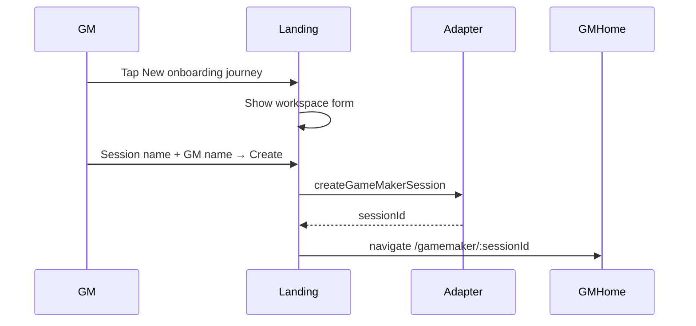
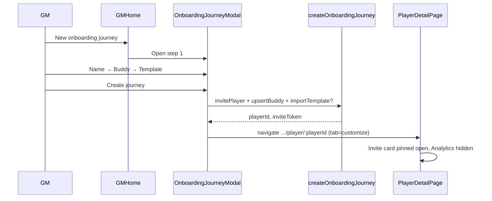
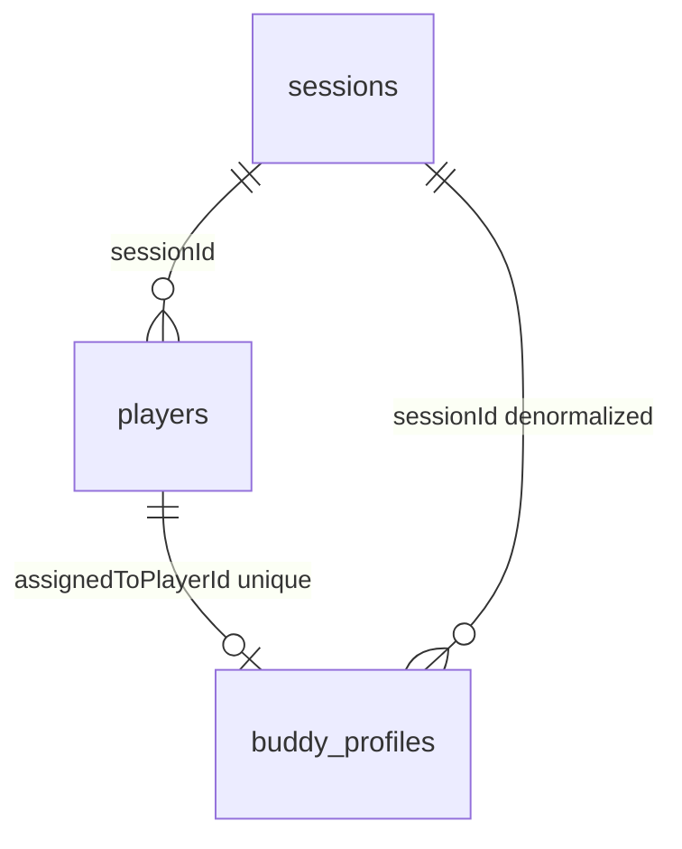

# Implementation Plan — Onboarding Journey UI Redesign

**ID:** OJ-01  
**Status:** In progress (Phases 1–2 complete)  
**Last updated:** 2026-07-05  
**Wireframe:** Cursor canvas [`onboarding-journey-redesign.canvas.tsx`](../../.cursor/projects/Users-hoonkim-Projects-messe-buddy-app/canvases/onboarding-journey-redesign.canvas.tsx) (open beside chat in IDE)

**Authority:** Product behavior in [`SPECS.md`](../SPECS.md) (invite claim C-27, workspace model D-ARCH-2). This plan is the implementation handoff for OJ-01; update [`production-implementation-plans.md`](production-implementation-plans.md) backlog when work starts.

---

## Summary

Consolidate redundant landing and GM “add player” flows into a single **new onboarding journey** UX. Players may **only** join via a per-player invitation link (`/join/:sessionId?t=:inviteToken`) — not from the landing page. After the GM completes a 3-step wizard, the app redirects to **player detail → Customize** with the invite card pinned open until claim; **Analytics** stays hidden until the player starts their journey.

---

## Problem → outcome

| Today | Target |
| ----- | ------ |
| Landing: `+ Employee`, `+ Game Maker`, Recovery key section, per-card recovery key | Landing: profile list + one bottom CTA **New onboarding journey** (workspace form unchanged) |
| Player self-join from landing (`EmployeeForm`) | Removed — join only via invite URL |
| GM **Add player** → name modal → customize tab (`?new=1`) with auto starter template | GM **New onboarding journey** → 3-step wizard (name, buddy, template) → redirect to Customize |
| Invite accordion at bottom of Customize; collapsed by default | `card player-invite` at **top** of Customize body, **forced open** until `claimStatus=claimed` |
| Analytics tab always visible on player detail | Analytics hidden until player **starts journey** (see gating below) |

**Unchanged:** Profile resume, `/join` claim flow, player cockpit after claim, Customize map/template/resources editing, Resource library tab on GM home.

---

## Wireframe screens

Interactive wireframe (390×844). Screen chips map 1:1 to sections below.

### 1. Landing — profiles only

```
┌ MesseBuddy brand ────────┐
├ Your profiles ─────────────┤
│  [profile card] × N        │  tap → resume session
├────────────────────────────┤
│ [New onboarding journey]   │  sole CTA (sticky bottom)
│ Players join via invite    │  helper caption
└────────────────────────────┘
```

- Remove: role toggles, `RecoverySection`, recovery key on `ProfileCard`.
- Keep: demo profiles, orphan badge (P-17), resume navigation.

### 2. Landing — workspace form (inline panel)

Same fields as today’s `GameMakerForm`: **Session name**, **Your name**, **Create & save profile**. Opened by bottom CTA (not a separate “Game Maker” toggle).

### 3. GM home — empty / with players

- Header CTA and empty-state CTA both labeled **New onboarding journey** (replaces “Add player”).
- Opens `OnboardingJourneyModal` (not `NameCaptureModal`).

### 4. Wizard — step 1: Player name

- Required text field.
- Copy: name appears on player card and invite.

### 5. Wizard — step 2: Assign buddy

**Not a buddy catalog** — `buddy_profiles` is one row per **player** (`assignedToPlayerId` unique).
“Pick existing” **copies** fields from a prior assignment into a **new** row for the new player (no FK).

**UI draft shape** (`BuddyPickerDraft`):

```ts
interface BuddyPickerDraft {
  readonly name: string;
  readonly email: string;
  readonly telephone: string; // maps to BuddyProfile.phone on save
  readonly role: string;
}
```

- Mode toggle: **Existing buddy** | **Add new**.
- Existing: radio list from `listDistinctBuddyProfilesForPicker(sessionId)` — show name, role, email, phone; submit `buddyProfileId` (PB record `id` of source assignment).
- Add new: four fields above → `buddyPickerDraftToProfileFields`.
- Persist: `createOnboardingJourney` → `upsertBuddyProfile(newPlayerId, …)` (can run while `claimStatus=invited`).

**Do not use `useBuddyProfile` for the wizard** — its GM draft still uses `tenure` / `contactUrl` and omits `email` / `phone` on load (align in Phase 4).

### 6. Wizard — step 3: Choose template

- **Start from scratch** (empty) — first option; skip `importTemplate`.
- Saved templates — radio list with milestone/mission counts.
- Remove auto `pickStarterTemplate` from `invitePlayer`.

### 7. Player detail — Customize (pending claim)

Post-wizard redirect: `/gamemaker/:sessionId/player/:playerId` with **Customize** tab active.

```
┌ TopBar ──────────────────┐
├ ← {player name} ──────────┤
├ Customize │ Buddy │ Pre-boarding ┤   ← Analytics omitted
├───────────────────────────┤
│ card player-invite (OPEN) │   top of main body
│   QR + join URL + Copy    │
├ Onboarding template ──────┤
├ Milestones & map ─────────┤
└ Resources ────────────────┘
```

### 8. Player detail — journey started

- **Analytics** tab appears in tab bar.
- `card player-invite` may collapse; still available to re-share.
- GM can switch to Analytics for progress feed.

---

## Interaction flows

### GM: create workspace (landing)



### GM: create onboarding journey (wizard)



### Player: claim via invite (unchanged route)

```mermaid
sequenceDiagram
  participant GM
  participant Detail
  participant Player
  participant Join as /join/:sid?t=

  GM->>Detail: Copy link / show QR
  Player->>Join: Open invite URL
  Join->>Join: claimPlayer → claimStatus=claimed
  Join->>Player: /session/:sessionId cockpit
  Note over Detail: Invite card collapsible; Analytics still hidden until journey started
  Player->>Player: Complete first mission / progress event
  Note over Detail: Analytics tab becomes visible
```

### Tab and invite gating

| State | `claimStatus` | Progress events | Analytics tab | Invite card |
| ----- | ------------- | ----------------- | ------------- | ----------- |
| Pending invite | `invited` | 0 | Hidden | Pinned open (`pinnedUntilClaimed`) |
| Claimed, not started | `claimed` | 0 | Hidden | Collapsible |
| Journey started | `claimed` | ≥ 1 | Visible | Collapsible |

**Journey started** = at least one `progress_events` row for this `playerId` (same signal Analytics needs). Revisit if product prefers “claimed only” — wireframe currently uses first progress event.

---

## Implementation phases

### Phase 1 — Landing simplification

**Status:** Done (2026-07-05)

| Task | Files | Done |
| ---- | ----- | ---- |
| Remove Employee / Game Maker toggles; add bottom CTA | `ProfileList.tsx`, `landing.css` | x |
| Remove `EmployeeForm`, `RecoverySection` from `/` landing | `LandingPage.tsx` | x |
| Keep `/join/:sessionId` claim UI (`EmployeeForm` on join route only) | `LandingPage.tsx` | x |
| Remove recovery key UI from profile cards | `ProfileCard.tsx` | x |
| Trim `useLandingFlow` (workspace panel + join route only) | `useLandingFlow.ts` | x |
| Delete `RecoverySection.tsx` | — | x |
| Rewrite `smoke-landing.ts` | `scripts/smoke-landing.ts` | x |

**Exit:** Landing smoke updated; no Employee/Recovery UI on `/`.

### Phase 2 — Backend / use-case layer

**Status:** Done (2026-07-05)

#### Pre-flight audit (hooks, use-cases, schema)

| Finding | Severity | Action in Phase 2 |
| ------- | -------- | ----------------- |
| **Use-case `invitePlayer` vs `adapter.invitePlayer`** — same name; use-case silently auto-applies first template via `pickStarterTemplate` | Drift risk | Slim use-case to player-row only; template moves to `createOnboardingJourney` |
| **`pickStarterTemplate` / `generateUniqueInviteToken`** — only used by old invite flow; latter unused anywhere | Dead | Remove exports |
| **`recoverIdentity`** — UI removed in Phase 1; no remaining imports | Orphaned | Keep use-case (SPECS still documents recovery); no UI wire |
| **`verifySession`** in `joinSession.ts` — never imported | Dead | Remove |
| **`applyTemplateToSession.ts`** — file name says session; exports `applyTemplateToPlayer` (thin `importTemplate` wrapper) | Misleading | Rename file → `applyTemplateToPlayer.ts` |
| **`playerDetailStorage`** — param named `sessionId` but callers pass **`playerId`**; key is `mb_player_template_${playerId}` | Misleading | Rename param to `playerId` |
| **`buddy_profiles` schema** — one row per **player** (`assignedToPlayerId` unique); not a global buddy catalog | Schema truth | `listBuddyProfiles(sessionId)` lists session rows; picker dedupes by name in use-case |
| Plan `existingBuddyId` | Misleading | Use `buddyProfileId` (PB record `id`) — copy fields to new player, not FK link |
| **`BuddyPickerDraft.telephone`** vs domain **`BuddyProfile.phone`** | Naming | Explicit mapper `buddyPickerDraftToProfileFields` |
| **`useBuddyProfile` / `BuddyAssignmentForm`** — draft uses `tenure`, `contactUrl`; wireframe uses `email`, `telephone` | UI drift (Phase 3/4) | Phase 2 types only; align GM buddy tab in Phase 4 |
| **`gmPlayers.invitePlayer`** — hook method name implies invite-only; will become wizard entry in Phase 3 | Misleading | Phase 2: call slim `invitePlayer`; Phase 3: add `createOnboardingJourney` to hook |

**Layering (locked for OJ-01):**

```
OnboardingJourneyModal (Phase 3)
  → useGmPlayers.createOnboardingJourney (Phase 3)
    → createOnboardingJourney use-case (Phase 2)
      → invitePlayer use-case → adapter.invitePlayer
      → adapter.upsertBuddyProfile
      → importTemplate (when templateName set)
```

`joinSession` / `claimPlayer` — unchanged; `/join` route only.

#### Corrected contracts

```ts
// src/types/buddyPicker.ts
interface BuddyPickerDraft {
  readonly name: string;
  readonly email: string;
  readonly telephone: string; // UI label; maps to BuddyProfile.phone
  readonly role: string;
}

type BuddySelection =
  | { readonly kind: "new"; readonly draft: BuddyPickerDraft }
  | { readonly kind: "existing"; readonly buddyProfileId: string };

interface CreateOnboardingJourneyInput {
  readonly playerName: string;
  readonly buddy: BuddySelection;
  readonly templateName: string | null; // null = start from scratch
}

interface CreateOnboardingJourneyResult {
  readonly playerId: string;
  readonly inviteToken: string;
  readonly appliedTemplateName: string | null;
}
```

`listDistinctBuddyProfilesForPicker(sessionId, adapter)` — use-case helper; dedupes
`listBuddyProfiles` by normalized `name` for wizard step 2.

#### Implementation tasks

| Task | Files | Done |
| ---- | ----- | ---- |
| Add `listBuddyProfiles(sessionId)` | `interface.ts`, `mockAdapter.ts`, `pbAdapter.ts` | x |
| Add `buddyPicker.ts` types + field mapper | `src/types/buddyPicker.ts`, `types/index.ts` | x |
| New `createOnboardingJourney` + distinct-buddy helper | `src/use-cases/createOnboardingJourney.ts` | x |
| Slim `invitePlayer` use-case (adapter only, returns `Player`) | `invitePlayer.ts`, `gmPlayers.ts` | x |
| Remove dead exports; rename storage params; rename template file | see audit table | x |
| Seed mock buddies with `email` / `phone` for picker | `mockData.ts` | x |

**Exit:** `deno task build` green; `invitePlayer` no longer applies templates; `createOnboardingJourney` callable from tests/hooks.

#### Deprecated (do not extend)

- `InvitePlayerResult.appliedTemplateName` — replaced by `CreateOnboardingJourneyResult`
- Auto-template on add-player — superseded by explicit wizard step 3
- `existingBuddyId` naming in early plan drafts — use `buddyProfileId`

### Phase 3 — Wizard modal + GM home

**Status:** Planned (next)

#### Buddy data model (pre-flight — resolved for Phase 3)

| Topic | Finding | Phase 3 implication |
| ----- | ------- | ------------------- |
| **Storage** | `buddy_profiles`: 1:1 with `players` via unique `assignedToPlayerId` | No new collection; no buddy catalog CRUD |
| **Adapter CRUD** | Create/Read/Update via `upsertBuddyProfile`, `getBuddyProfile`, `listBuddyProfiles`; **no Delete** | Wizard only **lists** + **creates** on journey submit |
| **“Existing” pick** | Copies `name`, `role`, `email`, `phone`, optional legacy fields from source row | UI label: “Reuse contact from …”; `buddyProfileId` = source assignment id |
| **Dedupe** | `listDistinctBuddyProfilesForPicker` dedupes by normalized **name** | Same person on two players → one picker row; edge case: name collision hides a row |
| **Before claim** | Buddy row created while `claimStatus=invited` | Player cockpit can show `BuddyCard` before claim; supersedes P-04 / form hint “once joined” for wizard path |
| **OD-05 (SPECS)** | Open: pool vs per-player | **Decided for OJ-01:** per-player assignment + copy-from-history picker (document in D-OJ-1) |
| **OD-20 (SPECS)** | Auto-apply first template on add-player | **Superseded** by wizard step 3 + `createOnboardingJourney` |
| **`useBuddyProfile`** | Legacy draft fields | **Out of scope** for Phase 3; new `useBuddyPickerOptions` hook |
| **`importTemplate`** | Does not touch buddies | Template step independent of buddy step |



**Layering (Phase 3 UI):**

```
GameMakerHomePage
  → OnboardingJourneyModal
       step 1: player name (local state)
       step 2: BuddyPicker → useBuddyPickerOptions (read-only)
       step 3: TemplateRadioList → usePlayerTemplates.listTemplates (read-only)
  → useGmPlayers.createOnboardingJourney(input)
       → createOnboardingJourney use-case (Phase 2)
       → writeAppliedTemplate(playerId, name) when applied
  → navigate /gamemaker/:sid/player/:pid?journey=1
```

#### Phase 3 tasks (implementation order)

| # | Task | Files | Notes |
| - | ---- | ----- | ----- |
| 3.1 | **`useBuddyPickerOptions`** — fetch `listDistinctBuddyProfilesForPicker`; expose `{ options, loading, error, refresh }` | `src/hooks/useBuddyPickerOptions.ts` | Adapter via `useAdapter`; active-guard like `useGmPlayers` |
| 3.2 | **`BuddyPicker`** — mode toggle; existing radios (`data-testid="oj-buddy-option-{id}"`); new form with `BuddyPickerDraft`; validation: all four fields required for new; one existing selected for pick | `src/components/gamemaker/BuddyPicker.tsx` | Display `phone` as telephone in UI |
| 3.3 | **`TemplateRadioList`** — “Start from scratch” (`templateName=null`) + templates from props; show milestone/mission counts | `src/components/gamemaker/TemplateRadioList.tsx` | Reuse `TemplateExport` shape from `usePlayerTemplates` |
| 3.4 | **`OnboardingJourneyModal`** — 3 steps, Back/Cancel, `data-testid` contract; accumulates `CreateOnboardingJourneyInput`; calls `onSubmit` on Create journey | `src/components/gamemaker/OnboardingJourneyModal.tsx` | Bottom sheet or `Modal` pattern like `NameCaptureModal` / library modals |
| 3.5 | **`useGmPlayers`** — add `createOnboardingJourney(input)`; **deprecate** `invitePlayer` from public hook API (remove or keep private until callers gone) | `src/hooks/useProgress/gmPlayers.ts` | On success: `writeAppliedTemplate` when `appliedTemplateName` set; `refresh()` player list |
| 3.6 | **`GameMakerHomePage`** — replace `NameCaptureModal` + `handleCreate` with `OnboardingJourneyModal`; loading/error toast on failure | `GameMakerHomePage.tsx` | Navigate `…/player/:pid?journey=1` (interim tab hint; Phase 4 removes query) |
| 3.7 | **`usePlayerDetailPage`** — `?journey=1` → initial tab **Customize** (replaces `?new=1` interim) | `usePlayerDetailPage.ts` | Small cross-phase hook; full invite/analytics gating stays Phase 4 |
| 3.8 | **`GmPlayersTab`** — CTA copy **New onboarding journey**; `data-testid="new-onboarding-journey-btn"` on header + empty state | `GmPlayersTab.tsx` | Remove “Add player” strings |
| 3.9 | **Styles** — wizard step layout, buddy option cards, template radios | `gamemaker.css` or colocated module | Match `design-tokens.md`; 390px modal width |
| 3.10 | **Remove** GM-home `NameCaptureModal` import | `GameMakerHomePage.tsx` | Keep `NameCaptureModal` for other flows if any |

#### Phase 3 component contracts

```ts
// useBuddyPickerOptions.ts
interface UseBuddyPickerOptionsResult {
  readonly options: ReadonlyArray<BuddyProfile>; // deduped picker rows
  readonly loading: boolean;
  readonly error: Error | null;
  readonly refresh: () => void;
}

// OnboardingJourneyModal.tsx
interface OnboardingJourneyModalProps {
  readonly open: boolean;
  readonly sessionId: string;
  readonly templates: ReadonlyArray<TemplateExport>;
  readonly loading: boolean;
  readonly onSubmit: (input: CreateOnboardingJourneyInput) => void;
  readonly onClose: () => void;
}

// BuddyPicker.tsx
interface BuddyPickerProps {
  readonly options: ReadonlyArray<BuddyProfile>;
  readonly loading: boolean;
  readonly value: BuddySelection | null;
  readonly onChange: (value: BuddySelection) => void;
}
```

#### Phase 3 — explicitly out of scope

- Global buddy catalog table or `deleteBuddyProfile`
- Refactoring `useBuddyProfile` / `BuddyAssignmentForm` field set (Phase 4)
- Invite card pin-to-top / `pinnedUntilClaimed` (Phase 4)
- Analytics tab gating (Phase 4)
- `smoke-onboarding-journey` script (Phase 5; manual MCP check optional after 3.10)
- SPECS D-OJ-1 entry (Phase 5)

#### Phase 3 exit criteria

- [ ] GM home shows **New onboarding journey** only (no Add player / name modal).
- [ ] Wizard completes all 3 steps; mock session shows ≥1 existing buddy option (Marcus/Lena).
- [ ] Submit calls `createOnboardingJourney`; new player appears in list as **Not joined yet**.
- [ ] Redirect to `/gamemaker/:sessionId/player/:playerId?journey=1` with **Customize** tab active.
- [ ] `deno task build` + `deno task lint` pass.
- [ ] No new calls to `useGmPlayers.invitePlayer` from UI.

#### Phase 3 manual test script (mock `:5173`)

1. Resume demo GM (Peter) → GM home.
2. Tap **New onboarding journey** → step 1 → enter name → Continue.
3. Step 2 → pick **Marcus Weber** (existing) or add new with email + telephone.
4. Step 3 → **Start from scratch** or a seeded template → **Create journey**.
5. Land on player detail Customize; player visible on GM home as pending.
6. Player detail → Customize shows template section (empty or applied).

**Exit:** Wizard E2E path reaches player detail Customize (invite pinning + Analytics gate in Phase 4).

### Phase 4 — Player detail behavior

| Task | Files |
| ---- | ----- |
| Move `PlayerInviteAccordion` above template section | `PlayerCustomizeTab.tsx` |
| `pinnedUntilClaimed` on accordion; default `open` when pinned | `PlayerInviteAccordion.tsx` |
| Filter `PLAYER_DETAIL_TABS` — omit Analytics when `!showAnalyticsTab` | `PlayerDetailPage.tsx`, `constants.ts` or derived helper |
| `showAnalyticsTab` from `claimStatus` + progress event count | `usePlayerDetailPage.ts` |
| Default tab **Customize** after wizard (remove `?new=1` hack) | `usePlayerDetailPage.ts`, `GameMakerHomePage.tsx` |
| If active tab is Analytics but gate closes, fall back to Customize | `usePlayerDetailPage.ts` |

### Phase 5 — Tests, smoke, docs

| Task | Files |
| ---- | ----- |
| Rewrite `smoke-landing.ts` | `scripts/smoke-landing.ts` |
| Rewrite GM/player path in `smoke-e2e.ts` | `scripts/smoke-e2e.ts` |
| Add `deno task smoke-onboarding-journey` (optional dedicated script) | `deno.json`, `scripts/smoke-onboarding-journey.ts` |
| SPECS Decision Log entry **D-OJ-1** (landing join removal, wizard pipeline) | `SPECS.md` |
| Mark OJ-01 in production plan backlog | `production-implementation-plans.md` |

---

## File map

| Concern | Primary files |
| ------- | ------------- |
| Landing | `LandingPage.tsx`, `ProfileList.tsx`, `ProfileCard.tsx`, `GameMakerForm.tsx`, `useLandingFlow.ts` |
| GM home + wizard | `GameMakerHomePage.tsx`, `GmPlayersTab.tsx`, `OnboardingJourneyModal.tsx`, `BuddyPicker.tsx`, `TemplateRadioList.tsx`, `useBuddyPickerOptions.ts` |
| Use cases | `createOnboardingJourney.ts`, `invitePlayer.ts`, `importTemplate.ts` |
| Player detail | `PlayerDetailPage.tsx`, `PlayerCustomizeTab.tsx`, `PlayerInviteAccordion.tsx`, `usePlayerDetailPage.ts` |
| Adapters | `interface.ts`, `mockAdapter.ts`, `pocketbase/pbAdapter.ts` |
| Smokes | `smoke-landing.ts`, `smoke-e2e.ts`, new `smoke-onboarding-journey.ts` |
| Styles | `landing.css`, `player-detail` / `gamemaker` CSS as needed |

**Delete / deprecate (by phase):** `RecoverySection.tsx` (done); GM-home `NameCaptureModal` usage (Phase 3); `?new=1` query (Phase 4 → `?journey=1` interim in Phase 3); `useGmPlayers.invitePlayer` public API (Phase 3).

---

## `data-testid` contract (for smokes)

| Element | testid |
| ------- | ------ |
| Landing bottom CTA | `landing-new-journey-btn` |
| Workspace form panel | `landing-workspace-form` |
| GM new journey CTA | `new-onboarding-journey-btn` |
| Wizard modal | `onboarding-journey-modal` |
| Wizard step panels | `oj-step-name`, `oj-step-buddy`, `oj-step-template` |
| Buddy existing option | `oj-buddy-option-{buddyProfileId}` |
| Template scratch option | `oj-template-scratch` |
| Create journey submit | `oj-create-journey-btn` |
| Player invite card | `player-invite-accordion` (existing) |
| Invite body visible when pinned | `player-invite-body` |
| Analytics tab | `player-detail-tab-analytics` (add to `RouteTabBar`) |
| Customize tab | `player-detail-tab-customize` |

---

## Smoke testing strategy

Smokes follow existing repo pattern: **Playwright + Firefox + iPhone 15**, screenshots under `.playwright-mcp/`, `deno task build` + `deno task lint` in CI.

### Environments

| Script | Base URL | Adapter | When |
| ------ | -------- | ------- | ---- |
| `smoke-landing` | `:5173` | Mock | After Phase 1 |
| `smoke-onboarding-journey` (new) | `:5173` | Mock | After Phase 3–4 |
| `smoke-e2e` | `https://localhost` | PocketBase (Docker) | Full stack validation |

### `smoke-landing` (rewrite)

**Remove assertions:**

- Employee button / `#lp-session-code` / join flow
- Game Maker toggle (replace with bottom CTA)
- Recovery key section

**Add assertions:**

- [ ] `landing-new-journey-btn` visible; Employee/Game Maker toggles absent
- [ ] CTA opens workspace form (`#lp-session-name`)
- [ ] Create workspace → navigates to `/gamemaker/`
- [ ] Demo profile resume still works
- [ ] Orphan badge flow unchanged (if covered)

Screenshot: `01-landing-profiles.png`, `02-landing-workspace-form.png`.

### `smoke-onboarding-journey` (new — mock, `:5173`)

End-to-end GM happy path without Docker:

1. Resume demo GM or create workspace.
2. Tap `new-onboarding-journey-btn` → modal step 1.
3. Fill player name → Continue.
4. Step 2: select existing buddy (or add new with all four fields).
5. Step 3: select **Standard** template (or scratch).
6. `oj-create-journey-btn` → URL matches `/gamemaker/.+/player/.+`.
7. Customize tab active; `player-invite-accordion` visible; `player-invite-body` visible (expanded).
8. `player-detail-tab-analytics` **not** in DOM.
9. Copy link from invite card; extract `t=` token.
10. Second browser context → `/join/:sessionId?t=` → claim → cockpit loads.
11. GM context refresh player detail → invite collapsible; still no Analytics until progress.
12. (Optional mock) trigger one progress event via adapter seed → Analytics tab appears.

Screenshots per step under `.playwright-mcp/oj-*`.

### `smoke-e2e` (update)

Replace **Add player** / `NameCaptureModal` path:

- [ ] SMOKE-01: Landing uses **New onboarding journey** for workspace (if creating fresh) or demo GM.
- [ ] SMOKE-02: Wizard completes → player detail Customize.
- [ ] SMOKE-03: Invite URL from open card → player claims → `claimStatus=claimed` on GM list.
- [ ] SMOKE-04: Analytics absent before first mission; present after player completes one mission (or progress event).

Keep existing regression blocks (gmApprove, logout, orphan profile) from `production-implementation-plans.md`.

### Manual / Playwright MCP checklist (design-tokens §10)

- [ ] 390×844 viewport screenshots for: landing, wizard steps 1–3, player detail pending, player detail active.
- [ ] No force-click on obscured elements; invite card not hidden behind map.
- [ ] Verify flat token colors per `design/design-tokens.md`.

### CI gate

`pr-check.yml` already runs `deno task build` and `deno task lint`. Add optional job step for `smoke-onboarding-journey` when stable (network + Playwright in CI).

---

## Acceptance criteria

- [ ] Landing has exactly one creation CTA; no player join UI on `/`.
- [ ] GM can create a journey with name + buddy + template (including scratch).
- [ ] Post-wizard lands on player detail **Customize** with invite card **on top** and **expanded** while `claimStatus=invited`.
- [ ] Player can only join via `/join/:sessionId?t=` (smoke opens link in second context).
- [ ] Analytics tab hidden until ≥ 1 progress event for that player.
- [ ] After claim, invite card can collapse; GM can re-expand to re-share.
- [ ] `deno task build` and `deno task lint` pass.
- [ ] `smoke-landing` and `smoke-onboarding-journey` pass on mock; `smoke-e2e` passes on Docker.

---

## Risks and notes

- **Buddy model (OJ-01):** No catalog — `buddy_profiles` is per-player; picker lists prior assignments and **copies** on select. Resolves SPECS OD-05 for prototype scope (document in D-OJ-1).
- **Name dedupe:** Two different mentors with the same display name → only one picker entry; acceptable for prototype.
- **Buddy before claim:** Wizard assigns buddy while `claimStatus=invited`; player cockpit `BuddyCard` works immediately. Backlog P-04 and `BuddyAssignmentForm` hint are stale for this path (fix in Phase 4).
- **P-11 / OD-20 superseded:** Explicit template in wizard step 3; no auto-template on `invitePlayer`.
- **Demo data:** Mock session `sess_mmt2026` must expose buddies (Marcus, Lena) and templates for wizard steps 2–3.
- **SPECS gaps:** `BuddyProfile` snippet in SPECS body missing `email`/`phone`/`quote`; `domain.ts` + `pb-schema.md` are authoritative until SPECS sync in Phase 5.
- **SPECS update:** Record **D-OJ-1** in Phase 5 — landing join removal, wizard pipeline, buddy copy semantics, OD-20 superseded.

---

## Changelog

| Date | Note |
| ---- | ---- |
| 2026-07-05 | Phase 2 complete; buddy DB investigation; Phase 3 expanded with hook boundaries and task order |
| 2026-07-05 | Phase 1 landing simplification complete |
| 2026-07-05 | Initial plan from wireframe canvas OJ-01 |
