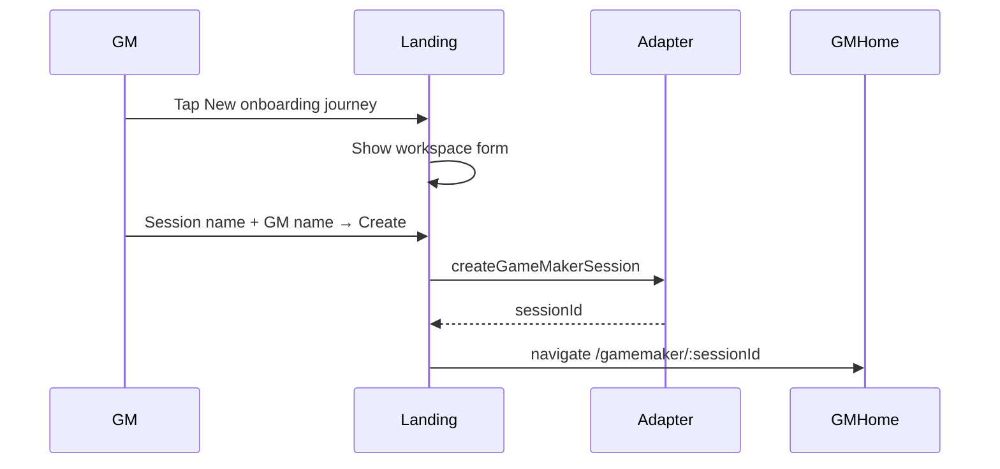
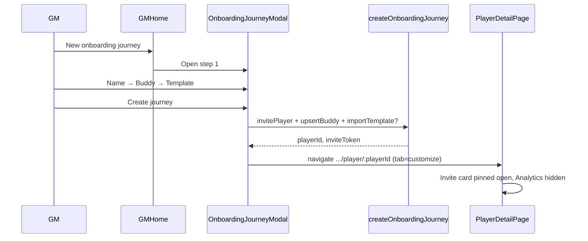

# Implementation Plan — Onboarding Journey UI Redesign

**ID:** OJ-01  
**Status:** Planned  
**Last updated:** 2026-07-05  
**Wireframe:** Cursor canvas [`onboarding-journey-redesign.canvas.tsx`](../../.cursor/projects/Users-hoonkim-Projects-messe-buddy-app/canvases/onboarding-journey-redesign.canvas.tsx) (open beside chat in IDE)

**Authority:** Product behavior in [`SPECS.md`](../SPECS.md) (invite claim C-27, workspace model D-ARCH-2). This plan is the implementation handoff for OJ-01; update [`production-implementation-plans.md`](production-implementation-plans.md) backlog when work starts.

---

## Summary

Consolidate redundant landing and GM “add player” flows into a single **new onboarding journey** UX. Players may **only** join via a per-player invitation link (`/join/:sessionId?t=:inviteToken`) — not from the landing page. After the GM completes a 3-step wizard, the app redirects to **player detail → Customize** with the invite card pinned open until claim; **Analytics** stays hidden until the player starts their journey.

---

## Problem → outcome

| Today | Target |
| ----- | ------ |
| Landing: `+ Employee`, `+ Game Maker`, Recovery key section, per-card recovery key | Landing: profile list + one bottom CTA **New onboarding journey** (workspace form unchanged) |
| Player self-join from landing (`EmployeeForm`) | Removed — join only via invite URL |
| GM **Add player** → name modal → customize tab (`?new=1`) with auto starter template | GM **New onboarding journey** → 3-step wizard (name, buddy, template) → redirect to Customize |
| Invite accordion at bottom of Customize; collapsed by default | `card player-invite` at **top** of Customize body, **forced open** until `claimStatus=claimed` |
| Analytics tab always visible on player detail | Analytics hidden until player **starts journey** (see gating below) |

**Unchanged:** Profile resume, `/join` claim flow, player cockpit after claim, Customize map/template/resources editing, Resource library tab on GM home.

---

## Wireframe screens

Interactive wireframe (390×844). Screen chips map 1:1 to sections below.

### 1. Landing — profiles only

```
┌ MesseBuddy brand ────────┐
├ Your profiles ─────────────┤
│  [profile card] × N        │  tap → resume session
├────────────────────────────┤
│ [New onboarding journey]   │  sole CTA (sticky bottom)
│ Players join via invite    │  helper caption
└────────────────────────────┘
```

- Remove: role toggles, `RecoverySection`, recovery key on `ProfileCard`.
- Keep: demo profiles, orphan badge (P-17), resume navigation.

### 2. Landing — workspace form (inline panel)

Same fields as today’s `GameMakerForm`: **Session name**, **Your name**, **Create & save profile**. Opened by bottom CTA (not a separate “Game Maker” toggle).

### 3. GM home — empty / with players

- Header CTA and empty-state CTA both labeled **New onboarding journey** (replaces “Add player”).
- Opens `OnboardingJourneyModal` (not `NameCaptureModal`).

### 4. Wizard — step 1: Player name

- Required text field.
- Copy: name appears on player card and invite.

### 5. Wizard — step 2: Assign buddy

**UI draft shape** (`BuddyPickerDraft`):

```ts
interface BuddyPickerDraft {
  readonly name: string;
  readonly email: string;
  readonly telephone: string;
  readonly role: string;
}
```

- Mode toggle: **Existing buddy** | **Add new**.
- Existing: radio list from `listBuddyProfiles(sessionId)` — show name, role, email, telephone.
- Add new: four fields above.
- Persist via `upsertBuddyProfile` on journey create (`telephone` → PB `phone`).

### 6. Wizard — step 3: Choose template

- **Start from scratch** (empty) — first option; skip `importTemplate`.
- Saved templates — radio list with milestone/mission counts.
- Remove auto `pickStarterTemplate` from `invitePlayer`.

### 7. Player detail — Customize (pending claim)

Post-wizard redirect: `/gamemaker/:sessionId/player/:playerId` with **Customize** tab active.

```
┌ TopBar ──────────────────┐
├ ← {player name} ──────────┤
├ Customize │ Buddy │ Pre-boarding ┤   ← Analytics omitted
├───────────────────────────┤
│ card player-invite (OPEN) │   top of main body
│   QR + join URL + Copy    │
├ Onboarding template ──────┤
├ Milestones & map ─────────┤
└ Resources ────────────────┘
```

### 8. Player detail — journey started

- **Analytics** tab appears in tab bar.
- `card player-invite` may collapse; still available to re-share.
- GM can switch to Analytics for progress feed.

---

## Interaction flows

### GM: create workspace (landing)



### GM: create onboarding journey (wizard)



### Player: claim via invite (unchanged route)

```mermaid
sequenceDiagram
  participant GM
  participant Detail
  participant Player
  participant Join as /join/:sid?t=

  GM->>Detail: Copy link / show QR
  Player->>Join: Open invite URL
  Join->>Join: claimPlayer → claimStatus=claimed
  Join->>Player: /session/:sessionId cockpit
  Note over Detail: Invite card collapsible; Analytics still hidden until journey started
  Player->>Player: Complete first mission / progress event
  Note over Detail: Analytics tab becomes visible
```

### Tab and invite gating

| State | `claimStatus` | Progress events | Analytics tab | Invite card |
| ----- | ------------- | ----------------- | ------------- | ----------- |
| Pending invite | `invited` | 0 | Hidden | Pinned open (`pinnedUntilClaimed`) |
| Claimed, not started | `claimed` | 0 | Hidden | Collapsible |
| Journey started | `claimed` | ≥ 1 | Visible | Collapsible |

**Journey started** = at least one `progress_events` row for this `playerId` (same signal Analytics needs). Revisit if product prefers “claimed only” — wireframe currently uses first progress event.

---

## Implementation phases

### Phase 1 — Landing simplification

| Task | Files |
| ---- | ----- |
| Remove Employee / Game Maker toggles; add bottom CTA | `ProfileList.tsx`, `landing.css` |
| Remove `EmployeeForm`, `RecoverySection` from page | `LandingPage.tsx` |
| Remove recovery key UI from profile cards | `ProfileCard.tsx` |
| Trim `useLandingFlow`: drop employee/recovery handlers; `activeForm` → workspace panel only | `useLandingFlow.ts` |
| Delete or orphan `EmployeeForm.tsx`, `RecoverySection.tsx` | — |

**Exit:** Landing smoke updated; no Employee/Recovery UI.

### Phase 2 — Backend / use-case layer

| Task | Files |
| ---- | ----- |
| Add `listBuddyProfiles(sessionId)` to `AppAdapter` | `interface.ts`, `mockAdapter.ts`, `pbAdapter.ts` |
| Add `BuddyPickerDraft` type | `src/types/` or colocate with `BuddyPicker.tsx` |
| New `createOnboardingJourney(sessionId, input)` | `src/use-cases/createOnboardingJourney.ts` |
| Remove auto template from `invitePlayer` | `invitePlayer.ts`, `gmPlayers.ts` |
| Optional: `listBuddyProfiles` dedupe by normalized name in use case | — |

`createOnboardingJourney` contract:

```ts
interface CreateOnboardingJourneyInput {
  readonly playerName: string;
  readonly buddy: BuddyPickerDraft | { readonly existingBuddyId: string };
  readonly templateName: string | null; // null = start from scratch
}
```

Returns `{ playerId, inviteToken }`.

### Phase 3 — Wizard modal + GM home

| Task | Files |
| ---- | ----- |
| New `OnboardingJourneyModal` (3 steps, back/cancel) | `src/components/gamemaker/OnboardingJourneyModal.tsx` |
| New `BuddyPicker` (existing list + new form) | `src/components/gamemaker/BuddyPicker.tsx` |
| Template step: scratch + `listTemplates` radio list | inside modal or `TemplateRadioList.tsx` |
| Wire GM home to modal; navigate on success | `GameMakerHomePage.tsx` |
| Rename CTAs | `GmPlayersTab.tsx` |

**Exit:** Wizard E2E path reaches player detail Customize.

### Phase 4 — Player detail behavior

| Task | Files |
| ---- | ----- |
| Move `PlayerInviteAccordion` above template section | `PlayerCustomizeTab.tsx` |
| `pinnedUntilClaimed` on accordion; default `open` when pinned | `PlayerInviteAccordion.tsx` |
| Filter `PLAYER_DETAIL_TABS` — omit Analytics when `!showAnalyticsTab` | `PlayerDetailPage.tsx`, `constants.ts` or derived helper |
| `showAnalyticsTab` from `claimStatus` + progress event count | `usePlayerDetailPage.ts` |
| Default tab **Customize** after wizard (remove `?new=1` hack) | `usePlayerDetailPage.ts`, `GameMakerHomePage.tsx` |
| If active tab is Analytics but gate closes, fall back to Customize | `usePlayerDetailPage.ts` |

### Phase 5 — Tests, smoke, docs

| Task | Files |
| ---- | ----- |
| Rewrite `smoke-landing.ts` | `scripts/smoke-landing.ts` |
| Rewrite GM/player path in `smoke-e2e.ts` | `scripts/smoke-e2e.ts` |
| Add `deno task smoke-onboarding-journey` (optional dedicated script) | `deno.json`, `scripts/smoke-onboarding-journey.ts` |
| SPECS Decision Log entry **D-OJ-1** (landing join removal, wizard pipeline) | `SPECS.md` |
| Mark OJ-01 in production plan backlog | `production-implementation-plans.md` |

---

## File map

| Concern | Primary files |
| ------- | ------------- |
| Landing | `LandingPage.tsx`, `ProfileList.tsx`, `ProfileCard.tsx`, `GameMakerForm.tsx`, `useLandingFlow.ts` |
| GM home + wizard | `GameMakerHomePage.tsx`, `GmPlayersTab.tsx`, `OnboardingJourneyModal.tsx`, `BuddyPicker.tsx` |
| Use cases | `createOnboardingJourney.ts`, `invitePlayer.ts`, `importTemplate.ts` |
| Player detail | `PlayerDetailPage.tsx`, `PlayerCustomizeTab.tsx`, `PlayerInviteAccordion.tsx`, `usePlayerDetailPage.ts` |
| Adapters | `interface.ts`, `mockAdapter.ts`, `pocketbase/pbAdapter.ts` |
| Smokes | `smoke-landing.ts`, `smoke-e2e.ts`, new `smoke-onboarding-journey.ts` |
| Styles | `landing.css`, `player-detail` / `gamemaker` CSS as needed |

**Delete / deprecate:** `EmployeeForm.tsx`, `RecoverySection.tsx`, GM-home `NameCaptureModal` usage, `?new=1` query convention.

---

## `data-testid` contract (for smokes)

| Element | testid |
| ------- | ------ |
| Landing bottom CTA | `landing-new-journey-btn` |
| Workspace form panel | `landing-workspace-form` |
| GM new journey CTA | `new-onboarding-journey-btn` |
| Wizard modal | `onboarding-journey-modal` |
| Wizard step panels | `oj-step-name`, `oj-step-buddy`, `oj-step-template` |
| Create journey submit | `oj-create-journey-btn` |
| Player invite card | `player-invite-accordion` (existing) |
| Invite body visible when pinned | `player-invite-body` |
| Analytics tab | `player-detail-tab-analytics` (add to `RouteTabBar`) |
| Customize tab | `player-detail-tab-customize` |

---

## Smoke testing strategy

Smokes follow existing repo pattern: **Playwright + Firefox + iPhone 15**, screenshots under `.playwright-mcp/`, `deno task build` + `deno task lint` in CI.

### Environments

| Script | Base URL | Adapter | When |
| ------ | -------- | ------- | ---- |
| `smoke-landing` | `:5173` | Mock | After Phase 1 |
| `smoke-onboarding-journey` (new) | `:5173` | Mock | After Phase 3–4 |
| `smoke-e2e` | `https://localhost` | PocketBase (Docker) | Full stack validation |

### `smoke-landing` (rewrite)

**Remove assertions:**

- Employee button / `#lp-session-code` / join flow
- Game Maker toggle (replace with bottom CTA)
- Recovery key section

**Add assertions:**

- [ ] `landing-new-journey-btn` visible; Employee/Game Maker toggles absent
- [ ] CTA opens workspace form (`#lp-session-name`)
- [ ] Create workspace → navigates to `/gamemaker/`
- [ ] Demo profile resume still works
- [ ] Orphan badge flow unchanged (if covered)

Screenshot: `01-landing-profiles.png`, `02-landing-workspace-form.png`.

### `smoke-onboarding-journey` (new — mock, `:5173`)

End-to-end GM happy path without Docker:

1. Resume demo GM or create workspace.
2. Tap `new-onboarding-journey-btn` → modal step 1.
3. Fill player name → Continue.
4. Step 2: select existing buddy (or add new with all four fields).
5. Step 3: select **Standard** template (or scratch).
6. `oj-create-journey-btn` → URL matches `/gamemaker/.+/player/.+`.
7. Customize tab active; `player-invite-accordion` visible; `player-invite-body` visible (expanded).
8. `player-detail-tab-analytics` **not** in DOM.
9. Copy link from invite card; extract `t=` token.
10. Second browser context → `/join/:sessionId?t=` → claim → cockpit loads.
11. GM context refresh player detail → invite collapsible; still no Analytics until progress.
12. (Optional mock) trigger one progress event via adapter seed → Analytics tab appears.

Screenshots per step under `.playwright-mcp/oj-*`.

### `smoke-e2e` (update)

Replace **Add player** / `NameCaptureModal` path:

- [ ] SMOKE-01: Landing uses **New onboarding journey** for workspace (if creating fresh) or demo GM.
- [ ] SMOKE-02: Wizard completes → player detail Customize.
- [ ] SMOKE-03: Invite URL from open card → player claims → `claimStatus=claimed` on GM list.
- [ ] SMOKE-04: Analytics absent before first mission; present after player completes one mission (or progress event).

Keep existing regression blocks (gmApprove, logout, orphan profile) from `production-implementation-plans.md`.

### Manual / Playwright MCP checklist (design-tokens §10)

- [ ] 390×844 viewport screenshots for: landing, wizard steps 1–3, player detail pending, player detail active.
- [ ] No force-click on obscured elements; invite card not hidden behind map.
- [ ] Verify flat token colors per `design/design-tokens.md`.

### CI gate

`pr-check.yml` already runs `deno task build` and `deno task lint`. Add optional job step for `smoke-onboarding-journey` when stable (network + Playwright in CI).

---

## Acceptance criteria

- [ ] Landing has exactly one creation CTA; no player join UI on `/`.
- [ ] GM can create a journey with name + buddy + template (including scratch).
- [ ] Post-wizard lands on player detail **Customize** with invite card **on top** and **expanded** while `claimStatus=invited`.
- [ ] Player can only join via `/join/:sessionId?t=` (smoke opens link in second context).
- [ ] Analytics tab hidden until ≥ 1 progress event for that player.
- [ ] After claim, invite card can collapse; GM can re-expand to re-share.
- [ ] `deno task build` and `deno task lint` pass.
- [ ] `smoke-landing` and `smoke-onboarding-journey` pass on mock; `smoke-e2e` passes on Docker.

---

## Risks and notes

- **Buddy catalog:** `buddy_profiles` is per-player today; `listBuddyProfiles` returns buddies already assigned in the session — dedupe for picker UX, not a new global collection.
- **P-11 superseded:** Explicit template choice in wizard replaces “starter template on add player.”
- **Demo profiles:** Landing demo GM/player remain for quick smoke; demo session must expose buddies/templates for wizard step 2–3 in mock adapter.
- **SPECS update:** Record D-OJ-1 when implementing — landing no longer offers employee join; GM onboarding journey is the canonical create path.

---

## Changelog

| Date | Note |
| ---- | ---- |
| 2026-07-05 | Initial plan from wireframe canvas OJ-01 |
