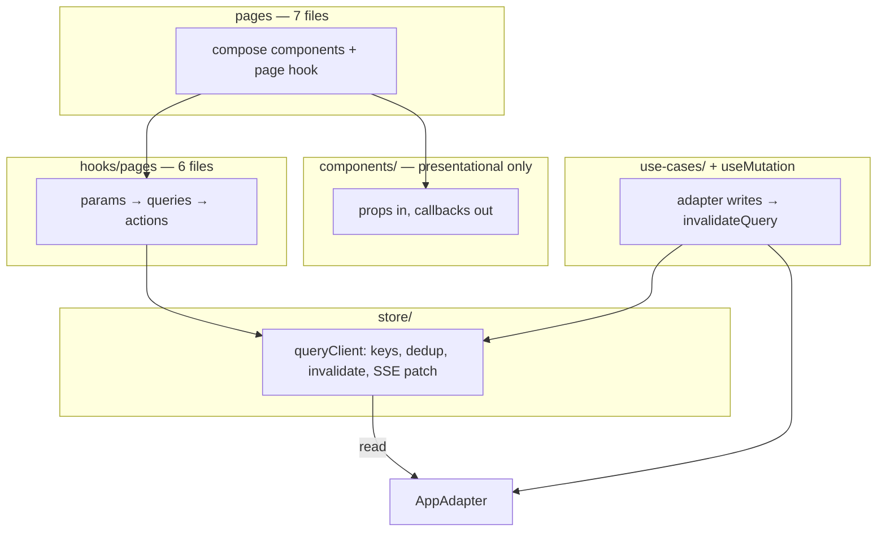

# Pages & Data Layer Refactor

**Status:** Approved (2026-07-06)  
**Companion:** [`design/component-architecture.md`](../design/component-architecture.md), [`SPECS.md`](../SPECS.md)

This refactor delivers a **smaller** codebase with **one path per concern**: seven flat page composers, six page hooks, one query store, and presentational components only. It is not additive — legacy fetch hooks, duplicate scan surfaces, and parallel roster pipelines are **deleted**, not wrapped.

---

## Problems (symptoms → root cause)

| Symptom | Root cause |
|---------|------------|
| Validation UI flicker | `useValidationConfirm` resets state while `useSession` refetches in parallel |
| Repeated PB log lines | ~18 independent `useEffect` fetch hooks; no coalescing |
| `playerId` cascade | `useSession` runs unscoped → scoped when player resolves |
| Tab over-fetch | `useState` tabs mount all hooks; library tab fetches even when hidden |
| GM home ↔ player detail double-fetch | `useGmPlayers` and `useProgressGamemaker` both call `listPlayers` + N× `listProgressEvents` |
| Component adapter calls | `QRDisplay`, `ResourceLibraryTab`, `OnboardingJourneyModal` fetch directly |

---

## Target architecture



**Invariants after migration:**

1. **Reads** — only `hooks/pages/*` via `useQuery` → `store/`.
2. **Writes** — `use-cases/*` + `useMutation` → `invalidateQuery(keys)`; no `refreshSession()` pattern.
3. **SSE** — `subscribeProgressEvent` patches `progress:{playerId}` in the store; no standalone `useWatchMission`.
4. **Components** — no `useAdapter`, no domain fetch hooks (CI grep enforced).
5. **Tabs** — `NavLink` to real paths; no `useState` tab keys; drop `?journey=1` in favour of `/customize`.

---

## Pages & routes

`src/pages/` — **seven** `.tsx` files only (no subfolders, no `.ts` helpers):

| File | Route(s) | Pane from pathname |
|------|----------|-------------------|
| `LandingPage.tsx` | `/`, `/join/:sessionId` | Join wizard vs profile picker (includes active-uid redirect) |
| `PlayerCockpitPage.tsx` | `/session/:id`, `…/assistant` | dashboard vs assistant |
| `PlayerFormPage.tsx` | `/form/:id/:missionId` | — |
| `GmHomePage.tsx` | `/gamemaker/:id`, `…/library` | players vs library |
| `GmPlayerDetailPage.tsx` | `/gamemaker/:id/player/:pid`, `…/customize`, `…/buddy`, `…/preboarding`, `…/scan` | GM player tabs + full-page scan mode |
| `ValidationPage.tsx` | `/validate/:id` | — |
| `NotFoundPage.tsx` | `*` | — |

Wizards, overlays, modals, and loading/error branches stay in `components/` — not separate pages.

**QR scan — one UI, two hosts:** extract `components/qr/QrScanPanel.tsx` (camera + decode + navigate). Used by `GmPlayerDetailPage` scan mode (`/scan` path) only. Delete standalone `QRScannerView` and `/gamemaker/:sessionId/scan` (orphaned route — nothing navigates to it today).

---

## Data layer

### Query keys (complete set)

| Key | Fetcher | Invalidated by |
|-----|---------|----------------|
| `sessionMeta:{sessionId}` | `getSession` | `updateSession` (incl. pre-boarding checklist) |
| `journey:{sessionId}:{playerId}` | `listMilestones` + `listMissions` | template apply, GM editor save, mission CRUD |
| `player:uid:{uid}` | `getPlayer` | `updatePlayer` |
| `player:id:{playerId}` | `getPlayerById` | same |
| `progress:{playerId}` | `listProgressEvents` | `upsertProgressEvent`, SSE patch |
| `buddy:{playerId}` | `getBuddyProfile` | `upsertBuddyProfile` |
| `resources:{sessionId}:{playerId}` | `listResources` | resource CRUD |
| `templates` | `listTemplates` | save/delete template |
| `gmRoster:{sessionId}` | `listPlayers` + batched `listProgressEvents` | invite, progress writes |
| `formSchema:{missionId}` | `getFormSchema` | schema upsert |
| `libraryResources` | `listLibraryResources` | library CRUD |
| `buddyPicker:{sessionId}` | `listDistinctBuddyProfilesForPicker` | buddy upserts in session |

**Rules:**

1. Coalesce in-flight requests per key.
2. `isInitialLoading` vs `isRefreshing` — stable UI on background refresh (fixes validation flicker).
3. Gate `journey:*` on resolved `playerId` — never unscoped-then-scoped.
4. `sessionMeta` 404 replaces `useSessionExists` (orphan detection on landing uses same key).
5. `gmRoster` **replaces** `useGmPlayers` and `useProgressGamemaker` **reads** — one roster fetch, warm cache across GM home and player detail.

### Page hooks (`hooks/pages/` — six files)

| Hook | Queries (mount / tab activate) |
|------|----------------------------------|
| `useLandingPage` | `sessionMeta` per profile for orphan badges; join/create on action |
| `usePlayerCockpitPage` | `player:uid`, `sessionMeta`, `journey`, `progress`, `buddy`, `resources` |
| `usePlayerFormPage` | above + `formSchema:{missionId}` |
| `useGmHomePage` | `sessionMeta`, `gmRoster`; `libraryResources` + `buddyPicker` when library tab or wizard open |
| `useGmPlayerDetailPage` | `sessionMeta`, `journey`, `buddy`, `resources`, `templates`, `gmRoster` slice, `player:id` |
| `useValidationPage` | `sessionMeta` → local decode → `journey`, `progress`, `player:id` |

Each hook returns `{ data, isInitialLoading, isRefreshing, error, actions }`. Chat (`useChat`) and tutorial state stay inside `usePlayerCockpitPage` as ephemeral UI — no query keys.

GM editor draft state (`useGmMilestoneEditor`, `useGmMissionEditor`) stays in-memory; saves go through `useMutation` → invalidate `journey:*`. Mission bottom-sheet autosave keeps `utils/draftStorage.ts` (local crash recovery only).

### Developer backend trace (session-scoped, dev-only)

A single trace sink records **every backend touch** from this browser tab, filterable by the active route `sessionId`. Replaces ad-hoc `console.log` in hooks and makes PB read counts observable during migration.

**Module:** `store/devBackendTrace.ts` (+ wired from `queryClient`, `useMutation`, adapter proxy during Phase 3).

| Property | Value |
|----------|-------|
| Enabled when | `import.meta.env.DEV` **and** `localStorage.mb_dev_trace !== "0"` (on by default in dev; opt out per tab) |
| Scope key | Route `sessionId` from `useParams()` (validation route uses the URL session; landing/join logs as `_public`) |
| Storage | In-memory ring buffer per scope (last ~200 events); not persisted across reload |
| Console | One line per event: `[mb:trace:{sessionId}] {kind} {detail}` |
| DevTools | `window.__MB_DEV_TRACE__` — `{ getLog(sessionId?), clear(), setEnabled(bool) }` |

**Event kinds** (all include `ts`, `sessionId`, `kind`):

| Kind | When | Detail fields |
|------|------|---------------|
| `query:fetch` | `fetchQuery` starts (not coalesced joiner) | `key`, `deduped: false` |
| `query:coalesce` | subscriber joins in-flight fetch | `key` |
| `query:hit` | cache served without network | `key`, `ageMs` |
| `query:invalidate` | `invalidateQuery` | `keys[]` |
| `query:patch` | SSE or `patchQuery` | `key` |
| `mutation:start` / `mutation:done` / `mutation:error` | `useMutation` lifecycle | `label`, `invalidates[]` |
| `adapter:call` | direct adapter method (until hooks retired) | `method`, `args` summary |
| `sse:subscribe` / `sse:event` | progress subscription | `playerId`, `missionId` |

**Page-hook integration:** each page hook sets the active trace scope once from `useParams().sessionId` so navigating `/gamemaker/A` → `/gamemaker/B` partitions logs automatically.

**Migration use:** ValidationPage pilot success metric (“≤ 5 reads on load”) is verified by filtering `__MB_DEV_TRACE__.getLog(sessionId)` for `query:fetch` events on first paint.

---

## Deletions (not wrappers)

### Pages & routes

- `RootRedirect.tsx` — logic moves into `LandingPage`
- `GameMakerHomePage.tsx` → `GmHomePage.tsx`
- `PlayerDetailPage.tsx` → `GmPlayerDetailPage.tsx`
- `FormPage.tsx` → `PlayerFormPage.tsx`
- `QRScannerView.tsx` + `/gamemaker/:sessionId/scan` route
- `pages/landing/*`, `pages/player-cockpit/*`, `pages/player-detail/*`

### Fetch hooks (delete entire files)

| Hook | Replaced by |
|------|-------------|
| `useSession.ts` | `sessionMeta` + `journey` queries; GM session writes → `useMutation` |
| `useSessionExists.ts` | `sessionMeta` 404 |
| `useValidationConfirm.ts` | `useValidationPage` |
| `useResolvedPlayer.ts` | `player:uid` query |
| `useQRScanContext.ts` | `sessionMeta` + `gmRoster` + `journey` in page hook |
| `usePlayerInviteToken.ts` | `inviteToken` field from `player:id` / `gmRoster` |
| `useGmPlayers.ts` | `gmRoster` query |
| `useProgress/gamemaker.ts` | `gmRoster` query + mutation actions |
| `useProgress/gmPlayers.ts` | `gmRoster` query |
| `useProgress/watchMission.ts` | SSE → `progress` cache patch |
| `useProgress/player.ts` | `progress` query + mutation actions |
| `useBuddyProfile.ts` | `buddy` query + mutation |
| `useResources.ts` | `resources` query + mutation |
| `useFormMission.ts` | `formSchema` query; submit logic in `usePlayerFormPage` |
| `usePlayerTemplates.ts` | `templates` query + mutations in page hook |
| `useLibraryResources.ts` | `libraryResources` query + mutations in `useGmHomePage` |
| `useBuddyPickerOptions.ts` | `buddyPicker` query in `useGmHomePage` |
| `usePreBoardingChecklist.ts` | `sessionMeta` read + `updateSession` mutation in page hook |
| `useScrollCollapse.ts` | unused — delete |

Delete `hooks/useProgress/` folder after migration (types move to `hooks/pages/types.ts` or `store/queryKeys.ts`).

### Dead use-cases (git rm)

- `applyDefaultOnboardingJourney.ts` + `.test.ts`
- `applyScratchJourney.ts` + `.test.ts`

Already superseded by `applyTemplateIfBlank` + `applyTemplateToNewPlayer`.

### Component boundary fixes (lift fetch to page hook)

| Component | Today | After |
|-----------|-------|-------|
| `QRDisplay` | `useSession` + `useWatchMission` | props: `qrSecret`, `onProgressUpdate` |
| `ValidationDisplay` | `useWatchMission` | props: progress callback from page hook |
| `ResourceLibraryTab` | `useLibraryResources` | props from `useGmHomePage` |
| `OnboardingJourneyModal` | `useBuddyPickerOptions` | props from `useGmHomePage` |

---

## Code moves

| From | To |
|------|-----|
| `pages/landing/*` | `components/landing/*` |
| `pages/player-cockpit/*` (UI only) | `components/player/*` |
| `pages/player-detail/*` (UI only) | `components/gamemaker/player-detail/*` |
| `pages/*/use*Page.ts` | `hooks/pages/use*Page.ts` |
| `playerDetailStorage.ts` | `utils/playerDetailStorage.ts` |
| `TUTORIAL_FORM_KEY` (duplicated) | `components/tutorial/constants.ts` (single source) |
| New | `store/queryClient.ts`, `store/queryKeys.ts`, `store/QueryProvider.tsx`, `store/devBackendTrace.ts`, `hooks/useQuery.ts`, `hooks/useMutation.ts`, `components/qr/QrScanPanel.tsx` |

---

## Client storage (consolidate, don't multiply)

| Key | Fate |
|-----|------|
| `mb_identity`, `mb_active_uid` | Keep — identity only; pages use `useIdentity` exports, not raw strings |
| `mb_player_template_{playerId}` | Keep as UI hint for "save to template" prompt; not authoritative (or add server field later) |
| `mb_draft_{sessionId}_{missionId}` | Keep — GM mission bottom-sheet crash recovery |
| `mb_tutorial_*` | Centralize in `components/tutorial/constants.ts` |
| `mb_landing_toast` | **Delete** — read path exists, no writer |

---

## Migration phases

### Phase 1 — Store + dead code removal

- [ ] `store/` + `hooks/useQuery.ts` / `useMutation.ts` + unit tests (coalesce, invalidate, loading semantics)
- [ ] `store/devBackendTrace.ts` — ring buffer, console sink, `window.__MB_DEV_TRACE__`; emit from `queryClient` (`fetch`, `coalesce`, `hit`, `invalidate`, `patch`)
- [ ] Mount `QueryProvider` in `App.tsx`
- [ ] `git rm` dead use-case stubs + `useScrollCollapse.ts`
- [ ] Centralize tutorial storage keys

### Phase 2 — Flat pages, routes, QR consolidation

- [ ] Seven page files; router paths per table above
- [ ] `RouteTabBar` → `NavLink`; derive active pane from pathname; drop `?journey=1`
- [ ] Move subfolder UI to `components/`; move page hooks to `hooks/pages/`
- [ ] Extract `QrScanPanel`; delete `QRScannerView` + orphaned scan route
- [ ] Merge `RootRedirect` into `LandingPage`
- [ ] Shared layouts in `components/layout/` (`PlayerSessionLayout`, `GmWorkspaceLayout`) to dedupe `App.tsx` wrappers

### Phase 3 — Query migration + hook retirement

Pilot first — proves the store before bulk migration:

- [ ] `useValidationPage` + thin `ValidationPage` → verify ≤ 5 PB reads, no flicker

Then remaining page hooks; **delete legacy hooks as each page migrates** (do not leave parallel paths):

- [ ] `usePlayerCockpitPage` — lift `QRDisplay` props
- [ ] `useGmHomePage` — lift `ResourceLibraryTab` + `OnboardingJourneyModal` data; `gmRoster` + lazy `libraryResources`
- [ ] `useGmPlayerDetailPage` — editor saves → `invalidateQuery`; delete `refreshSession` calls
- [ ] `usePlayerFormPage`
- [ ] `useLandingPage` (wrap `useLandingFlow` actions; orphan check via `sessionMeta`)

- [ ] Delete all hooks listed in **Deletions** section
- [ ] SSE patches `progress:{playerId}` in store; trace `sse:subscribe` / `sse:event`
- [ ] `useMutation` emits `mutation:*` events; optional thin adapter trace wrapper until legacy hooks are gone

### Phase 4 — Verify + guard

- [ ] CI/lint: no `useAdapter` in `src/components/` (adapter boundary)
- [ ] Document trace in README dev section: enable/disable via `localStorage.mb_dev_trace`, inspect via `__MB_DEV_TRACE__.getLog(sessionId)`
- [ ] Update `data-page` attributes and smoke paths (design-tokens §10)
- [ ] `deno task build`, `deno task lint`

### Phase 5 — Smoke test remediation

Source: Playwright smoke runs 2026-07-06 (mock adapter + live PocketBase), plus
[`plans/MesseBuddy_Smoke_Test_2026-07-06.md`](MesseBuddy_Smoke_Test_2026-07-06.md).
Phase 3 query migration is functionally complete; this phase closes gaps found in
end-to-end testing.

#### P1 — Blockers (ship before PB onboarding demo)

| ID | Issue | Root cause (suspected) | Fix |
|----|-------|------------------------|-----|
| ST-P1-1 | **Player form infinite re-render** on `/form/:id/:missionId` — `Maximum update depth exceeded`; Submit never persists; `progress_events` stay at 0 on PB | `PlayerFormPage.tsx` `useEffect` depends on entire `vm` object; `usePlayerFormPage` returns a new object every render (incl. unstable `progress` handle) → `setValues` loop | Narrow effect deps to `vm.status`, `vm.initialValues`, `vm.formSchema?.id` (or schema field ids hash). Optionally memoize hook return with `useMemo`. Add `usePlayerFormPage.test.ts`: mount hook, assert no re-render storm. Re-smoke: profile submit → `progress_events` count ≥ 1, XP 10/10 on cockpit |

#### P2 — Functional gaps (wrong data / dead UI)

| ID | Issue | Root cause (suspected) | Fix |
|----|-------|------------------------|-----|
| ST-P2-1 | **GM Customize map shows 0%** while player cockpit / analytics show real % | `useGmPlayerDetailPage` `milestoneProgress` may fall back to `computeProgress("", …)` or journey map nodes ignore `milestoneProgress` percent | Trace `milestoneProgress` → `JourneyMap` / node badge props on customize tab; ensure claimed players always use `gmProgress.selectedPlayerProgress.milestoneProgress`. Add test fixture with 50% milestone + assert map label |
| ST-P2-2 | **Ghost milestone dialog** after scratch-template wizard — unlabeled `dialog` "Milestone" in a11y tree, invisible, persists across tabs | `useGmMilestoneEditor` / wizard handoff leaves `selectedMilestone` set without opening visible sheet | After `applyTemplateToNewPlayer` redirect, call `milestoneEditor.setSelectedMilestone(null)` or don't auto-select first milestone. Guard `MissionBottomSheet` render: `selectedMilestone && sheetOpen`. Playwright: post-wizard DOM has no stray `dialog` without `aria-label` |
| ST-P2-3 | **Milestone-scoped resources stub** — library resources never surface to player search | `milestone_resources` join not wired; milestone Resources tab is placeholder | Track separately if out of sprint scope; minimum fix: player resource search queries `libraryResources` + attached `resources:{sessionId}:{playerId}`; milestone tab copy explains "attach from library on Customize" |
| ST-P2-4 | **`/llm/health/readiness` 502** polled every ~10s | Health route misconfigured; chat `/llm` works | Fix proxy route or stop gating UI on readiness until route exists; downgrade poll to dev-only or remove if unused |

#### P3 — UX polish (no data loss)

| ID | Issue | Fix |
|----|-------|-----|
| ST-P3-1 | **GM home empty-state flash** — "No players yet" before roster loads | Gate empty state on `gmRoster.isInitialLoading`; show skeleton/spinner until first fetch settles. Pattern: `loading \|\| players.length > 0 \|\| showEmpty` |
| ST-P3-2 | **Layered modals on first login** — tutorial + skip confirmation both visible; backdrop blocks tutorial | Serialize: tutorial skip opens confirm only after tutorial modal unmounts, or use single modal with inline confirm step (`PlayerCockpitPage` tutorial flow) |
| ST-P3-3 | **Milestone bottom sheet blocks map toolbar** (QR scanner) until closed | Raise toolbar z-index above sheet, or collapse sheet when scan mode opens (`/scan` route already exists — ensure toolbar stays reachable) |
| ST-P3-4 | **Empty-state CTA duplication** — Resource library shows "Add resource" twice; Players header CTA absent until first player | Align patterns: header CTA always visible on both tabs, or center-only on both. Pick one rule in `GmHomePage.tsx` |
| ST-P3-5 | **Grammar: "1 missions"** | Singular/plural in journey map node badge (`components/gamemaker/JourneyMap` or node renderer) |
| ST-P3-6 | **Player name entered twice** — GM sets name in wizard; join flow asks again | Prefill join Step 2 from invite token lookup (`player.name` from `getPlayerByInviteToken`); allow edit, don't force re-type |
| ST-P3-7 | **Start Date free text** — accepts garbage | `type="date"` or validate ISO in `FormShell` / schema field type handler |
| ST-P3-8 | **Truncated player-detail header** on 390px | `text-overflow: ellipsis` → allow wrap or shorten copy ("Jamie's onboarding") in `GmPlayerDetailPage` header |
| ST-P3-9 | **Silent required-field validation** on profile form | Surface `errors[fieldId]` under each field (hook already sets them; ensure `FormShell` renders inline errors, not only native focus) |
| ST-P3-10 | **React `[TIMESTAMP]` profiler spam** at info level | Dev-only: disable React Profiler wrapper in `main.tsx` unless `localStorage.mb_react_profiler === "1"` |
| ST-P3-11 | **`mb:trace` only at `console.debug`** | Add `console.info` for `query:fetch` + `mutation:done` in `devBackendTrace.ts` (keep verbose coalesce at debug) |

#### Info — documented behaviour (no code change unless product disagrees)

| ID | Note |
|----|------|
| ST-INFO-1 | Mock adapter resets progress on full `page.goto` reload — expected; PB persists (verified) |
| ST-INFO-2 | GM QR simulate picks first global QR mission, not milestone-specific — document or scope simulate to active milestone |
| ST-INFO-3 | Delete dead `src/pages/player-detail/usePlayerDetailPage.ts` if still present after Phase 2 |

#### Phase 5 verification checklist

Run against **both** adapters:

1. **PB path:** create workspace → wizard → join → profile submit → reload → XP persists
2. **Mock path:** `sess_mmt2026` QR validation → customize % matches cockpit %
3. **GM home:** no empty-state flash on cold load
4. **Post-wizard:** no ghost milestone dialog in accessibility tree
5. **Console:** 0 `Maximum update depth` / 0 unhandled errors
6. **`__MB_DEV_TRACE__.getLog(sessionId)`:** profile submit shows `mutation:done` + `query:invalidate` for `progress:*`
7. **design-tokens §10:** 390×844 screenshots for fixed flows

#### Phase 5 task order (recommended)

```
ST-P1-1  →  ST-P2-1  →  ST-P2-2  →  ST-P3-1, ST-P3-2, ST-P3-9
         →  ST-P3-5, ST-P3-6, ST-P3-7, ST-P3-8  →  ST-P3-4
         →  ST-P2-3, ST-P2-4 (if in sprint)  →  ST-P3-10, ST-P3-11
         →  Phase 5 verification checklist
```

---

## Success metrics

| Metric | Before | Target |
|--------|--------|--------|
| Files in `pages/` | 30 (9 + 21 subfolder) | **7** `.tsx` |
| Domain fetch hooks in `hooks/` | ~18 independent fetchers | **0** (only `useQuery`, `useMutation`, chat/tutorial ephemeral) |
| Page hooks in `hooks/pages/` | 0 | **6** |
| QR scan surfaces | 3 (page + modal + validation) | **1** component, 2 hosts |
| GM roster fetch pipelines | 2 (`useGmPlayers` + `useProgressGamemaker`) | **1** (`gmRoster` key) |
| Validation PB reads on load | 15–20 | ≤ 5 |
| Player cockpit mount reads | 10–14 | ≤ 7 |
| Validation UI | Spinner ↔ card flicker | Stable card after first paint |
| Tab change | Re-fetch all parent hooks | Cache hit, no spinner |
| `useAdapter` in `components/` | 4 call sites | **0** |
| Backend calls visible per session (dev) | PocketBase logs only | `__MB_DEV_TRACE__.getLog(sessionId)` |

---

## Out of scope

- TanStack Query — only if custom cache exceeds ~300 lines
- `view-models/` folder — rejected
- Server-side seed consolidation (separate track)
- `player.appliedTemplateName` server field — optional follow-up to drop `playerDetailStorage` localStorage

---

## Decision log

| ID | Decision | Rationale |
|----|----------|-----------|
| D-PAGE-1 | Seven page files max | Tabs, wizards, and state branches are not pages |
| D-PAGE-2 | URLs for tabs, one component per shell | Deep links without file proliferation |
| D-DATA-1 | FLUX query cache in `store/` | Dedup + invalidate fixes PB noise |
| D-DATA-2 | Page hooks in `hooks/pages/` | Single composition layer; no `view-models/` |
| D-DATA-3 | Split `useSession` → delete, not wrap | `sessionMeta` + `journey` keys |
| D-DATA-4 | `gmRoster` supersedes dual progress hooks | One roster path for GM home + player detail |
| D-DATA-5 | Delete legacy hooks on migration | No split-brain parallel caches |
| D-DATA-6 | Components never fetch | Props from page hooks; CI enforced |
| D-QR-1 | One `QrScanPanel`, delete orphaned scan route | `QRScannerView` unused in navigation |
| D-STORE-1 | SSE patches `progress` cache | Delete `useWatchMission` |
| D-DEV-1 | Session-scoped `devBackendTrace` in dev | One sink for query/adapter/SSE; replaces hook `console.log`; validates read budgets |
