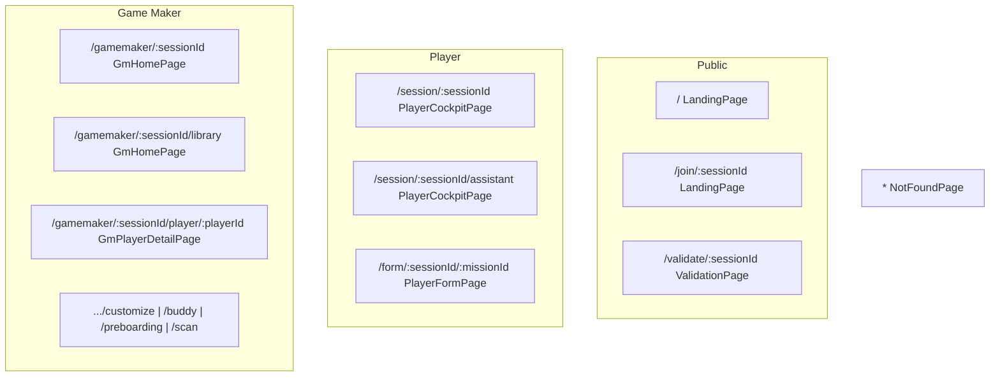
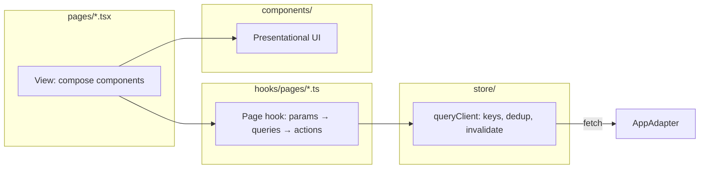

# Pages & Data Layer Refactor

**Status:** Approved (2026-07-06)  
**Companion:** [`design/component-architecture.md`](../design/component-architecture.md) (authoring rules), [`SPECS.md`](../SPECS.md) (product constraints)

This plan consolidates two approved changes:

1. **Flat `pages/`** — seven page files, no subfolders; tabs and wizards are in-page state, not separate page files.
2. **FLUX query store** — keyed reads with dedup and invalidation; page hooks in `hooks/pages/` (no `view-models/` folder).

The validation-page flicker and repeated PocketBase calls are symptoms of the current **mega-page + independent fetch hooks** pattern. This refactor addresses the root cause.

---

## Problem summary

| Symptom | Root cause |
|---------|------------|
| Validation UI flicker | `useSession` + decode effect reset `loading` / `payload` in parallel |
| Repeated PB log lines | No request coalescing; `useSession` bundles session + milestones + missions for every consumer |
| `playerId` cascade | `useSession({ playerId })` refetches unscoped → scoped when player resolves |
| Tab pages over-fetch | All hooks mount on parent even when only one tab is visible |

---

## Target: seven page files

`src/pages/` contains **only** these `.tsx` files (no subfolders, no `.ts` helpers):

| # | File | Route(s) | Internal state (not separate pages) |
|---|------|----------|--------------------------------------|
| 1 | `LandingPage.tsx` | `/`, `/join/:sessionId` | Profile picker; GM create panel; join steps `code` → `name` |
| 2 | `PlayerCockpitPage.tsx` | `/session/:sessionId`, `/session/:sessionId/assistant` | Dashboard / assistant tabs; tutorial overlay; session-missing branch |
| 3 | `PlayerFormPage.tsx` | `/form/:sessionId/:missionId` | — (standalone full-screen flow) |
| 4 | `GmHomePage.tsx` | `/gamemaker/:sessionId`, `/gamemaker/:sessionId/library` | Players / library tabs; onboarding journey wizard |
| 5 | `GmPlayerDetailPage.tsx` | `/gamemaker/:sessionId/player/:playerId`, `.../customize`, `.../buddy`, `.../preboarding`, `.../scan` | Analytics / customize / buddy / pre-boarding tabs; QR scan mode |
| 6 | `ValidationPage.tsx` | `/validate/:sessionId` | — (GM on player session; QR deep link) |
| 7 | `NotFoundPage.tsx` | `*` | — |

### Not separate page files

| UI | Lives in | Reason |
|----|----------|--------|
| Wizard steps (join, onboarding journey, GM create) | Parent page | Linear sequence |
| Tab panes (dashboard/assistant, players/library, GM player tabs) | Parent page | Same shell, URL segment for bookmark only |
| Tutorial overlay, mission popup, milestone sidebar, mission bottom sheet | `components/` | Overlay / modal |
| Loading, error, empty, unauthorized | Parent page branches | Data-state rendering |
| `RootRedirect` | Router `loader` on `/` or `LandingPage` | Redirect only |

### Files removed after migration

- `pages/landing/*`, `pages/player-cockpit/*`, `pages/player-detail/*`
- `RootRedirect.tsx`, `GameMakerHomePage.tsx`, `PlayerDetailPage.tsx`, `QRScannerView.tsx` (scan → `GmPlayerDetailPage`)

---

## Route tree

**Router pattern:** multiple paths may render the **same** page component; active pane is derived from `useLocation()` / `useParams()`, not a new file.

**Layouts (in `App.tsx`, not page files):** `RequireRole`, `DemoAwareAdapterProvider`, shared chrome wrappers.

---

## Data layer

### Architecture

- **No `view-models/` folder** — page hooks are the composition layer.
- **Components never call `AppAdapter`** — adapter boundary unchanged (AGENTS.md).
- **Writes:** `use-cases/` + `useMutation` → `invalidateQuery(keys)`.
- **SSE:** `subscribeProgressEvent` patches progress cache in place.

### Query keys

| Key | Fetcher | Invalidated by |
|-----|---------|----------------|
| `sessionMeta:{sessionId}` | `getSession` | `updateSession` |
| `journey:{sessionId}:{playerId}` | `listMilestones` + `listMissions` | template apply, GM editor save, mission CRUD |
| `player:uid:{uid}` | `getPlayer` | `updatePlayer` |
| `player:id:{playerId}` | `getPlayerById` | same |
| `progress:{playerId}` | `listProgressEvents` | `upsertProgressEvent`, SSE |
| `buddy:{playerId}` | `getBuddyProfile` | `upsertBuddyProfile` |
| `resources:{sessionId}:{playerId}` | `listResources` | resource CRUD |
| `templates` | `listTemplates` | save/delete template |
| `gmRoster:{sessionId}` | `listPlayers` + batched progress | invite, progress writes |
| `formSchema:{missionId}` | `getFormSchema` | schema upsert |
| `libraryResources` | `listLibraryResources` | library CRUD |

**Rules:**

1. Coalesce in-flight requests per key.
2. `isInitialLoading` vs `isRefreshing` — background refresh must not hide stable UI (fixes validation flicker).
3. Gate `journey:*` on resolved `playerId` — never unscoped-then-scoped refetch.
4. Replace `useSession` bundle with `sessionMeta` + `journey` queries.
5. Delete `useSessionExists` — use `sessionMeta` 404.

### Query ownership per page

| Page hook | Queries on mount / tab activate |
|-----------|----------------------------------|
| `useLandingPage` | Orphan check (optional); join/create on action only |
| `usePlayerCockpitPage` | `player:uid`, `sessionMeta`, `journey`, `progress`, `buddy`, `resources` |
| `usePlayerFormPage` | above + `formSchema:{missionId}` |
| `useGmHomePage` | `sessionMeta`, `gmRoster`; `libraryResources` when library tab active |
| `useGmPlayerDetailPage` | `sessionMeta`, `journey`, `buddy`, `resources`, `templates`, `gmRoster` slice |
| `useValidationPage` | `sessionMeta`, decode token locally, then `journey`, `progress`, `player:id` |

Tab switches inside one page **do not** re-run mount queries if cache is warm.

---

## Code moves

| From | To |
|------|-----|
| `pages/landing/*` | `components/landing/*` |
| `pages/player-cockpit/*` | `components/player/*` |
| `pages/player-detail/*` | `components/gamemaker/player-detail/*` |
| `usePlayerCockpitPage.ts` etc. | `hooks/pages/usePlayerCockpitPage.ts` |
| `playerDetailStorage.ts` | `utils/playerDetailStorage.ts` |
| New | `store/queryClient.ts`, `store/queryKeys.ts`, `store/QueryProvider.tsx`, `hooks/useQuery.ts`, `hooks/useMutation.ts` |

---

## Migration phases

### Phase 1 — Store scaffolding

- [ ] Add `store/` + `hooks/useQuery.ts` / `useMutation.ts`
- [ ] Implement keys: `sessionMeta`, `journey`, `progress`, `player:uid`, `player:id`
- [ ] Unit tests: coalesce, invalidate, `isInitialLoading` / `isRefreshing`
- [ ] Document in this file; no page migrations yet

### Phase 2 — Flat pages + routes

- [ ] Create seven page stubs; wire router (multiple paths → same component where needed)
- [ ] `RouteTabBar` → `NavLink` to real paths
- [ ] Move subfolder UI to `components/`
- [ ] Fold `QRScannerView` into `GmPlayerDetailPage` scan mode
- [ ] Remove `RootRedirect`; active-uid redirect in router loader or `LandingPage`
- [ ] Delete old page files and `pages/*/` subfolders

### Phase 3 — Page hooks + query migration

- [ ] `hooks/pages/useValidationPage.ts` — pilot; verify PB ≤ 5 reads on load
- [ ] `usePlayerCockpitPage`, `useGmHomePage`, `useGmPlayerDetailPage`, `usePlayerFormPage`, `useLandingPage`
- [ ] Remove or thin-wrap: `useSession`, `useValidationConfirm`, `useSessionExists`

### Phase 4 — Layouts & guards

- [ ] Optional shared layouts: `PlayerSessionLayout`, `GmWorkspaceLayout`, `GmPlayerLayout` (in `components/layout/`)
- [ ] Update Playwright smoke paths and `data-page` attributes

### Phase 5 — Hardening

- [ ] Dev-only query log (one line per key)
- [ ] GM roster N+1: batch via cache or future adapter helper
- [ ] CI: `deno task build`, `deno task lint`, smoke checklist §10 design-tokens

---

## Success metrics

| Metric | Before (approx) | Target |
|--------|-----------------|--------|
| Files in `pages/` | 9 routes + 21 subfolder files | **7** `.tsx` only |
| Validation PB reads on load | 15–20 | ≤ 5 |
| Player cockpit mount reads | 10–14 | ≤ 7 |
| Validation UI | Spinner ↔ card flicker | Stable card after first paint |
| Tab change | Re-fetch all parent hooks | Cache hit, no spinner |

---

## Out of scope

- Server-side seed consolidation — see [`data-source-of-truth-consolidation.md`](data-source-of-truth-consolidation.md) (if present)
- TanStack Query adoption — only if custom cache exceeds ~300 lines
- MVVM / `view-models/` folder — rejected; `hooks/pages/` is sufficient

---

## Decision log

| ID | Decision | Rationale |
|----|----------|-----------|
| D-PAGE-1 | Seven page files max | Tabs, wizards, and state branches are not pages |
| D-PAGE-2 | URLs for tabs, one component per shell | Deep links without file proliferation |
| D-DATA-1 | FLUX query cache in `store/` | Dedup + invalidate fixes PB noise |
| D-DATA-2 | Page hooks in `hooks/pages/` | Replaces `view-models/`; matches existing hook patterns |
| D-DATA-3 | Split `useSession` | `sessionMeta` vs `journey` — consumers fetch only what they need |
