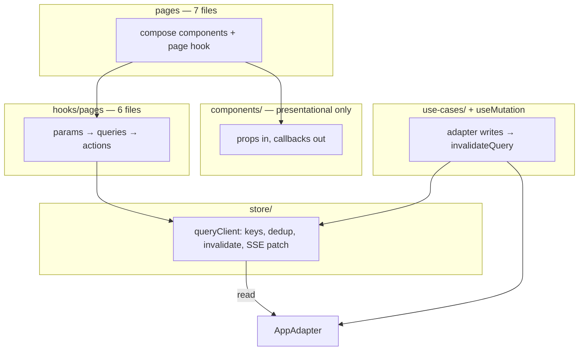

# Pages & Data Layer Refactor

**Status:** Approved (2026-07-06)  
**Companion:** [`design/component-architecture.md`](../design/component-architecture.md), [`SPECS.md`](../SPECS.md)

This refactor delivers a **smaller** codebase with **one path per concern**: seven flat page composers, six page hooks, one query store, and presentational components only. It is not additive — legacy fetch hooks, duplicate scan surfaces, and parallel roster pipelines are **deleted**, not wrapped.

---

## Problems (symptoms → root cause)

| Symptom | Root cause |
|---------|------------|
| Validation UI flicker | `useValidationConfirm` resets state while `useSession` refetches in parallel |
| Repeated PB log lines | ~18 independent `useEffect` fetch hooks; no coalescing |
| `playerId` cascade | `useSession` runs unscoped → scoped when player resolves |
| Tab over-fetch | `useState` tabs mount all hooks; library tab fetches even when hidden |
| GM home ↔ player detail double-fetch | `useGmPlayers` and `useProgressGamemaker` both call `listPlayers` + N× `listProgressEvents` |
| Component adapter calls | `QRDisplay`, `ResourceLibraryTab`, `OnboardingJourneyModal` fetch directly |

---

## Target architecture



**Invariants after migration:**

1. **Reads** — only `hooks/pages/*` via `useQuery` → `store/`.
2. **Writes** — `use-cases/*` + `useMutation` → `invalidateQuery(keys)`; no `refreshSession()` pattern.
3. **SSE** — `subscribeProgressEvent` patches `progress:{playerId}` in the store; no standalone `useWatchMission`.
4. **Components** — no `useAdapter`, no domain fetch hooks (CI grep enforced).
5. **Tabs** — `NavLink` to real paths; no `useState` tab keys; drop `?journey=1` in favour of `/customize`.

---

## Pages & routes

`src/pages/` — **seven** `.tsx` files only (no subfolders, no `.ts` helpers):

| File | Route(s) | Pane from pathname |
|------|----------|-------------------|
| `LandingPage.tsx` | `/`, `/join/:sessionId` | Join wizard vs profile picker (includes active-uid redirect) |
| `PlayerCockpitPage.tsx` | `/session/:id`, `…/assistant` | dashboard vs assistant |
| `PlayerFormPage.tsx` | `/form/:id/:missionId` | — |
| `GmHomePage.tsx` | `/gamemaker/:id`, `…/library` | players vs library |
| `GmPlayerDetailPage.tsx` | `/gamemaker/:id/player/:pid`, `…/customize`, `…/buddy`, `…/preboarding`, `…/scan` | GM player tabs + full-page scan mode |
| `ValidationPage.tsx` | `/validate/:id` | — |
| `NotFoundPage.tsx` | `*` | — |

Wizards, overlays, modals, and loading/error branches stay in `components/` — not separate pages.

**QR scan — one UI, two hosts:** extract `components/qr/QrScanPanel.tsx` (camera + decode + navigate). Used by `GmPlayerDetailPage` scan mode (`/scan` path) only. Delete standalone `QRScannerView` and `/gamemaker/:sessionId/scan` (orphaned route — nothing navigates to it today).

---

## Data layer

### Query keys (complete set)

| Key | Fetcher | Invalidated by |
|-----|---------|----------------|
| `sessionMeta:{sessionId}` | `getSession` | `updateSession` (incl. pre-boarding checklist) |
| `journey:{sessionId}:{playerId}` | `listMilestones` + `listMissions` | template apply, GM editor save, mission CRUD |
| `player:uid:{uid}` | `getPlayer` | `updatePlayer` |
| `player:id:{playerId}` | `getPlayerById` | same |
| `progress:{playerId}` | `listProgressEvents` | `upsertProgressEvent`, SSE patch |
| `buddy:{playerId}` | `getBuddyProfile` | `upsertBuddyProfile` |
| `resources:{sessionId}:{playerId}` | `listResources` | resource CRUD |
| `templates` | `listTemplates` | save/delete template |
| `gmRoster:{sessionId}` | `listPlayers` + batched `listProgressEvents` | invite, progress writes |
| `formSchema:{missionId}` | `getFormSchema` | schema upsert |
| `libraryResources` | `listLibraryResources` | library CRUD |
| `buddyPicker:{sessionId}` | `listDistinctBuddyProfilesForPicker` | buddy upserts in session |

**Rules:**

1. Coalesce in-flight requests per key.
2. `isInitialLoading` vs `isRefreshing` — stable UI on background refresh (fixes validation flicker).
3. Gate `journey:*` on resolved `playerId` — never unscoped-then-scoped.
4. `sessionMeta` 404 replaces `useSessionExists` (orphan detection on landing uses same key).
5. `gmRoster` **replaces** `useGmPlayers` and `useProgressGamemaker` **reads** — one roster fetch, warm cache across GM home and player detail.

### Page hooks (`hooks/pages/` — six files)

| Hook | Queries (mount / tab activate) |
|------|----------------------------------|
| `useLandingPage` | `sessionMeta` per profile for orphan badges; join/create on action |
| `usePlayerCockpitPage` | `player:uid`, `sessionMeta`, `journey`, `progress`, `buddy`, `resources` |
| `usePlayerFormPage` | above + `formSchema:{missionId}` |
| `useGmHomePage` | `sessionMeta`, `gmRoster`; `libraryResources` + `buddyPicker` when library tab or wizard open |
| `useGmPlayerDetailPage` | `sessionMeta`, `journey`, `buddy`, `resources`, `templates`, `gmRoster` slice, `player:id` |
| `useValidationPage` | `sessionMeta` → local decode → `journey`, `progress`, `player:id` |

Each hook returns `{ data, isInitialLoading, isRefreshing, error, actions }`. Chat (`useChat`) and tutorial state stay inside `usePlayerCockpitPage` as ephemeral UI — no query keys.

GM editor draft state (`useGmMilestoneEditor`, `useGmMissionEditor`) stays in-memory; saves go through `useMutation` → invalidate `journey:*`. Mission bottom-sheet autosave keeps `utils/draftStorage.ts` (local crash recovery only).

### Developer backend trace (session-scoped, dev-only)

A single trace sink records **every backend touch** from this browser tab, filterable by the active route `sessionId`. Replaces ad-hoc `console.log` in hooks and makes PB read counts observable during migration.

**Module:** `store/devBackendTrace.ts` (+ wired from `queryClient`, `useMutation`, adapter proxy during Phase 3).

| Property | Value |
|----------|-------|
| Enabled when | `import.meta.env.DEV` **and** `localStorage.mb_dev_trace !== "0"` (on by default in dev; opt out per tab) |
| Scope key | Route `sessionId` from `useParams()` (validation route uses the URL session; landing/join logs as `_public`) |
| Storage | In-memory ring buffer per scope (last ~200 events); not persisted across reload |
| Console | One line per event: `[mb:trace:{sessionId}] {kind} {detail}` |
| DevTools | `window.__MB_DEV_TRACE__` — `{ getLog(sessionId?), clear(), setEnabled(bool) }` |

**Event kinds** (all include `ts`, `sessionId`, `kind`):

| Kind | When | Detail fields |
|------|------|---------------|
| `query:fetch` | `fetchQuery` starts (not coalesced joiner) | `key`, `deduped: false` |
| `query:coalesce` | subscriber joins in-flight fetch | `key` |
| `query:hit` | cache served without network | `key`, `ageMs` |
| `query:invalidate` | `invalidateQuery` | `keys[]` |
| `query:patch` | SSE or `patchQuery` | `key` |
| `mutation:start` / `mutation:done` / `mutation:error` | `useMutation` lifecycle | `label`, `invalidates[]` |
| `adapter:call` | direct adapter method (until hooks retired) | `method`, `args` summary |
| `sse:subscribe` / `sse:event` | progress subscription | `playerId`, `missionId` |

**Page-hook integration:** each page hook sets the active trace scope once from `useParams().sessionId` so navigating `/gamemaker/A` → `/gamemaker/B` partitions logs automatically.

**Migration use:** ValidationPage pilot success metric (“≤ 5 reads on load”) is verified by filtering `__MB_DEV_TRACE__.getLog(sessionId)` for `query:fetch` events on first paint.

---

## Deletions (not wrappers)

### Pages & routes

- `RootRedirect.tsx` — logic moves into `LandingPage`
- `GameMakerHomePage.tsx` → `GmHomePage.tsx`
- `PlayerDetailPage.tsx` → `GmPlayerDetailPage.tsx`
- `FormPage.tsx` → `PlayerFormPage.tsx`
- `QRScannerView.tsx` + `/gamemaker/:sessionId/scan` route
- `pages/landing/*`, `pages/player-cockpit/*`, `pages/player-detail/*`

### Fetch hooks (delete entire files)

| Hook | Replaced by |
|------|-------------|
| `useSession.ts` | `sessionMeta` + `journey` queries; GM session writes → `useMutation` |
| `useSessionExists.ts` | `sessionMeta` 404 |
| `useValidationConfirm.ts` | `useValidationPage` |
| `useResolvedPlayer.ts` | `player:uid` query |
| `useQRScanContext.ts` | `sessionMeta` + `gmRoster` + `journey` in page hook |
| `usePlayerInviteToken.ts` | `inviteToken` field from `player:id` / `gmRoster` |
| `useGmPlayers.ts` | `gmRoster` query |
| `useProgress/gamemaker.ts` | `gmRoster` query + mutation actions |
| `useProgress/gmPlayers.ts` | `gmRoster` query |
| `useProgress/watchMission.ts` | SSE → `progress` cache patch |
| `useProgress/player.ts` | `progress` query + mutation actions |
| `useBuddyProfile.ts` | `buddy` query + mutation |
| `useResources.ts` | `resources` query + mutation |
| `useFormMission.ts` | `formSchema` query; submit logic in `usePlayerFormPage` |
| `usePlayerTemplates.ts` | `templates` query + mutations in page hook |
| `useLibraryResources.ts` | `libraryResources` query + mutations in `useGmHomePage` |
| `useBuddyPickerOptions.ts` | `buddyPicker` query in `useGmHomePage` |
| `usePreBoardingChecklist.ts` | `sessionMeta` read + `updateSession` mutation in page hook |
| `useScrollCollapse.ts` | unused — delete |

Delete `hooks/useProgress/` folder after migration (types move to `hooks/pages/types.ts` or `store/queryKeys.ts`).

### Dead use-cases (git rm)

- `applyDefaultOnboardingJourney.ts` + `.test.ts`
- `applyScratchJourney.ts` + `.test.ts`

Already superseded by `applyTemplateIfBlank` + `applyTemplateToNewPlayer`.

### Component boundary fixes (lift fetch to page hook)

| Component | Today | After |
|-----------|-------|-------|
| `QRDisplay` | `useSession` + `useWatchMission` | props: `qrSecret`, `onProgressUpdate` |
| `ValidationDisplay` | `useWatchMission` | props: progress callback from page hook |
| `ResourceLibraryTab` | `useLibraryResources` | props from `useGmHomePage` |
| `OnboardingJourneyModal` | `useBuddyPickerOptions` | props from `useGmHomePage` |

---

## Code moves

| From | To |
|------|-----|
| `pages/landing/*` | `components/landing/*` |
| `pages/player-cockpit/*` (UI only) | `components/player/*` |
| `pages/player-detail/*` (UI only) | `components/gamemaker/player-detail/*` |
| `pages/*/use*Page.ts` | `hooks/pages/use*Page.ts` |
| `playerDetailStorage.ts` | `utils/playerDetailStorage.ts` |
| `TUTORIAL_FORM_KEY` (duplicated) | `components/tutorial/constants.ts` (single source) |
| New | `store/queryClient.ts`, `store/queryKeys.ts`, `store/QueryProvider.tsx`, `store/devBackendTrace.ts`, `hooks/useQuery.ts`, `hooks/useMutation.ts`, `components/qr/QrScanPanel.tsx` |

---

## Client storage (consolidate, don't multiply)

| Key | Fate |
|-----|------|
| `mb_identity`, `mb_active_uid` | Keep — identity only; pages use `useIdentity` exports, not raw strings |
| `mb_player_template_{playerId}` | Keep as UI hint for "save to template" prompt; not authoritative (or add server field later) |
| `mb_draft_{sessionId}_{missionId}` | Keep — GM mission bottom-sheet crash recovery |
| `mb_tutorial_*` | Centralize in `components/tutorial/constants.ts` |
| `mb_landing_toast` | **Delete** — read path exists, no writer |

---

## Migration phases

### Phase index

| Phase | Name | Source | Status |
|-------|------|--------|--------|
| **1** | Store + dead code removal | Refactor plan | Pending |
| **2** | Flat pages, routes, QR consolidation | Refactor plan | Pending |
| **3** | Query migration + hook retirement | Refactor plan | **Done** (page hooks migrated; legacy hooks deleted) |
| **4** | Verify + guard (refactor) | Refactor plan | Pending |
| **5** | Blockers — smoke remediation | Playwright 2026-07-06 | **Done** (5.1) |
| **6** | Realtime — GM + player live sync | Playwright 2026-07-06 | **6.1–6.3, 6.5 done**; 6.4 pending |
| **7** | Functional gaps — smoke remediation | Playwright 2026-07-06 | **7.1–7.2 done**; **7.4–7.5 open**; 7.3 optional |
| **8** | UX polish — smoke remediation | Playwright 2026-07-06 | **8.1–8.9, 8.11 done**; **8.12 open**; 8.4 verify; 8.10 N/A |
| **9** | Smoke verification + CI | Phase 5–8 exit gate | **In progress** — 13–15/16 checks pass; 9.3 flaky |
| **10** | E2E harness + CI gate | Smoke scripts 2026-07-06 | Pending |

**Recommended execution order:** 6.5 → 7.4–7.5 → 8.12 → 9 (re-run) → 6.4 → 4 → 10.

**Legacy smoke IDs → phase tasks:** ST-P1-1 = **5.1** · ST-RT-1…4 = **6.1…6.4** · ST-P2-1…4 = **7.1…7.4** · ST-P3-1…11 = **8.1…8.11**

### Smoke baseline (Playwright, PocketBase, 2026-07-06 evening)

**Environment:** `http://127.0.0.1:5173` · `useMockPb: false` · iPhone 15 viewport · scripts: `scripts/smoke-phase9.ts`, `scripts/smoke-systematic.ts`

| Persona | Pass | Fail / open | Notes |
|---------|------|-------------|-------|
| **Landing** | Home renders; GM workspace create | — | Clean on most runs |
| **Game Master** | Roster, wizard, live claim, live progress after form, empty-flash fix, header, grammar, scan sheet close, ghost dialog | Library empty CTA (**8.4**) not verified — PB has 7 seeded library resources | GM path largely green |
| **Player** | Join, name prefill, tutorial modal serialize, date picker, inline validation, profile submit, XP persist, form loop | Empty mission list after scratch profile complete (**7.5**); intermittent **502** console noise (**7.4**) | Scratch = 1 mission; list empty when done |
| **Validation / QR** | GM roster % bumps after QR confirm | Player QR popup does not dismiss (**6.5** / **9.3**); validate navigation **flaky** on rerun | GM write succeeds; player SSE path broken or unreliable |

**Phase 9 script results (representative runs):**

| Run | Score | Failures |
|-----|-------|----------|
| `smoke-phase9.ts` #1 | 15/16 | `9.3.qr-player-dismiss` |
| `smoke-phase9.ts` #2 | 13/14 | `fatal` — validate URL timeout (flaky) |
| `smoke-systematic.ts` | 15/17 | `P.6.mission-list` (scratch complete); console 502 ×2 |

**Contradiction resolved:** Phase 6 findings table below originally said player QR dismiss worked (~1s). Systematic re-test shows **intermittent failure** — treat **6.5** as the source of truth until green in dual-tab Playwright.

### Phase 1 — Store + dead code removal

- [ ] **1.1** `store/` + `hooks/useQuery.ts` / `useMutation.ts` + unit tests (coalesce, invalidate, loading semantics)
- [ ] **1.2** `store/devBackendTrace.ts` — ring buffer, console sink, `window.__MB_DEV_TRACE__`; emit from `queryClient`
- [ ] **1.3** Mount `QueryProvider` in `App.tsx`
- [ ] **1.4** `git rm` dead use-case stubs + `useScrollCollapse.ts`
- [ ] **1.5** Centralize tutorial storage keys

### Phase 2 — Flat pages, routes, QR consolidation

- [ ] **2.1** Seven page files; router paths per table above
- [ ] **2.2** `RouteTabBar` → `NavLink`; derive active pane from pathname; drop `?journey=1`
- [ ] **2.3** Move subfolder UI to `components/`; move page hooks to `hooks/pages/`
- [ ] **2.4** Extract `QrScanPanel`; delete `QRScannerView` + orphaned scan route
- [ ] **2.5** Merge `RootRedirect` into `LandingPage`
- [ ] **2.6** Shared layouts in `components/layout/` (`PlayerSessionLayout`, `GmWorkspaceLayout`)

### Phase 3 — Query migration + hook retirement

Pilot first — proves the store before bulk migration:

- [x] **3.1** `useValidationPage` + thin `ValidationPage` → verify ≤ 5 PB reads, no flicker
- [x] **3.2** `usePlayerCockpitPage` — lift `QRDisplay` props
- [x] **3.3** `useGmHomePage` — lift `ResourceLibraryTab` + `OnboardingJourneyModal`; `gmRoster` + lazy `libraryResources`
- [x] **3.4** `useGmPlayerDetailPage` — editor saves → `invalidateQuery`; delete `refreshSession` calls
- [x] **3.5** `usePlayerFormPage`
- [x] **3.6** `useLandingFlow` + orphan check via `sessionMeta` (landing page hook pattern)
- [x] **3.7** Delete all hooks listed in **Deletions** section
- [x] **3.8** SSE patches `progress:{playerId}` in store; trace `sse:subscribe` / `sse:event`
- [x] **3.9** `useMutation` emits `mutation:*` events; adapter trace in `devBackendTrace`

### Phase 4 — Verify + guard (refactor)

- [ ] **4.1** CI/lint: no `useAdapter` in `src/components/` (adapter boundary)
- [ ] **4.2** Document trace in README dev section: `localStorage.mb_dev_trace`, `__MB_DEV_TRACE__.getLog(sessionId)`
- [ ] **4.3** Update `data-page` attributes and smoke paths (design-tokens §10)
- [ ] **4.4** `deno task build`, `deno task lint`

### Phase 5 — Blockers (smoke remediation)

Ship before PocketBase onboarding demo.

- [x] **5.1** Player form infinite re-render on `/form/:id/:missionId` — `Maximum update depth exceeded`; submit never persisted *(done 2026-07-06: `formInitKey` + `buildFormDefaultValues` in `PlayerFormPage.tsx`; memoized `useDerivedPlayerProgress`; `src/utils/formDefaultValues.test.ts`)*

### Phase 6 — Realtime GM + player live sync

Dual-tab smoke (PocketBase): GM tab open **without reload** while player/validator acts elsewhere.

**Findings (2026-07-06, updated after systematic smoke):**

| Flow | Observer | Realtime? | Task |
|------|----------|-----------|------|
| Player claims via `/join/...` | GM Players roster | **Yes** (post **6.1**) | — |
| GM confirms QR mission | GM roster % / analytics | **Yes** (post **6.2**) | — |
| GM confirms QR mission | Player QR wait (`QRDisplay` → subscribe + poll) | **Yes** (post **6.5**) | — |
| Player submits profile form | GM roster % | **Yes** (same-tab invalidate + **6.2**) | — |

**Root cause (GM path, fixed):** `gmRoster:{sessionId}` was fetch-on-mount only — **6.1** / **6.2** add PB subscribe on `players` + session-scoped `progress_events`.

**Root cause (player QR dismiss, fixed):** (1) GM simulate validated the **first** QR mission in journey order, not the mission the player opened. (2) Unstable SSE callback re-subscribed on every render. Fix: `pickFirstIncompleteQrMission`, session-scoped subscribe, progress poll fallback, popup closes when `progressEvent` becomes validated.

- [x] **6.1** PB subscribe on `players` (`sessionId = …`) → `patchGmRosterFromPlayer` via `useGmRosterRealtime`
- [x] **6.2** PB subscribe on `progress_events` → `patchGmRosterFromProgressEvent`; wired in `useGmHomePage` + `useGmPlayerDetailPage`
- [x] **6.3** GM Analytics tab appears without reload when first event arrives
- [ ] **6.4** Playwright dual-context spec: claim + QR validate; GM DOM updates within 10s without `page.reload()`
- [x] **6.5** Player QR wait dismisses within 10s after GM confirm — session-scoped SSE + progress poll + popup auto-close on `isCompleted`; **simulate scan picks first incomplete QR mission** (`pickFirstIncompleteQrMission`); unblocks **9.3**
  - **Verify:** `smoke-phase9.ts` `9.3.qr-player-dismiss` green on 3 consecutive runs
  - **Files:** `src/hooks/useWatchProgressMission.ts`, `src/hooks/useQrScan.ts`, `src/utils/qrMissionPick.ts`, `src/components/player/MissionDetailPopup.tsx`, `src/adapters/pocketbase/pbAdapter.ts`

### Phase 7 — Functional gaps (smoke remediation)

- [x] **7.1** GM Customize map shows 0% while cockpit/analytics show real % — `milestoneProgress` prop on `MilestoneMapEditor` via `PlayerCustomizeTab` *(done 2026-07-06)*
- [x] **7.2** Ghost milestone dialog after scratch-template wizard — clear selection on `playerId` change; guard `MissionBottomSheet` mount *(done 2026-07-06; `9.6.ghost-dialog` pass)*
- [ ] **7.3** Milestone-scoped resources stub — wire library → milestone attach → player search, or improve empty-state copy *(optional sprint)*
- [ ] **7.4** `/llm/health/readiness` 502 — fix proxy or stop background polling on player assistant path *(smoke: 502 ×2 in player console; see [`plans/MesseBuddy_Smoke_Test_2026-07-06.md`](MesseBuddy_Smoke_Test_2026-07-06.md))*
  - **Acceptance:** 0 console 502 on `/session/:id` load when LLM not configured
- [ ] **7.5** Scratch journey shows empty mission list after sole profile mission complete — `currentMissions` filters completed; dashboard looks broken
  - **Options:** show completed missions section, or “All caught up” empty state when `missions.length > 0 && currentMissions.length === 0`
  - **Verify:** `smoke-systematic.ts` `P.6.mission-list` or product sign-off on intentional behaviour

### Phase 8 — UX polish (smoke remediation)

- [x] **8.1** GM home empty-state flash — `loading` until first `gmRoster` fetch settles (`useGmHomePage`); `9.5.empty-flash` pass
- [x] **8.2** Layered modals on first login — hide tutorial when skip confirm opens; restore on cancel (`useTutorial`)
- [x] **8.3** Milestone bottom sheet on `/scan` — auto-close on scan route (`useGmPlayerDetailPage`); `G.7.scan-sheet` pass
- [x] **8.4** Empty-state CTA duplication — header “Add resource” hidden when library empty (`ResourceLibraryTab`); **verify on empty PB** (dev DB has 7 seeded resources — not exercised)
- [x] **8.5** Grammar: "1 missions" → singular/plural (`MilestoneNode`); `8.5.grammar` pass
- [x] **8.6** Player name prefill from invite token (`useLandingFlow`); `P.1.name-prefill` pass
- [x] **8.7** Start Date — `FIELD_TYPE.DATE` + `<input type="date">`; `P.3.start-date` pass
- [x] **8.8** Truncated player-detail header — `{firstName}'s Onboarding` + smaller title font
- [x] **8.9** Inline required-field validation — `FormShell noValidate` + app `validate()`; `P.4.inline-validation` pass
- [ ] **8.10** React `[TIMESTAMP]` profiler spam — **N/A:** no `Profiler` in `src/` (only `StrictMode`); close if no repro
- [x] **8.11** Dev trace log levels — `query:fetch` + `mutation:done` → `console.info` (`devBackendTrace.ts`)
- [ ] **8.12** Mobile scan button a11y — `@media (max-width: 30rem)` hides “Scan QR” label with no `aria-label`; Playwright cannot click by role on 390px
  - **Fix:** `aria-label="Scan QR code"` on header scan `Button` in `PlayerDetailHeader.tsx`

#### Documented behaviour (no change unless product disagrees)

| Note | Detail |
|------|--------|
| Mock reload | Mock adapter resets progress on full `page.goto`; PB persists (verified) |
| QR simulate scope | GM simulate picks first global QR mission, not milestone-specific |
| Dead file | Delete `src/pages/player-detail/usePlayerDetailPage.ts` if still present |

### Phase 9 — Smoke verification + CI

Exit gate for Phases 5–8. Run against **mock** and **live PocketBase**.

**Scripts:**

```bash
SMOKE_BASE_URL=http://127.0.0.1:5173 deno run -A --node-modules-dir=auto scripts/smoke-phase9.ts
SMOKE_BASE_URL=http://127.0.0.1:5173 deno run -A --node-modules-dir=auto scripts/smoke-systematic.ts
```

| ID | Check | PB status (2026-07-06) | Blocker |
|----|-------|------------------------|---------|
| **9.1** | Workspace → wizard → join → profile → reload → XP | **Pass** | — |
| **9.2** | Dual-tab claim + GM progress after form | **Pass** | — |
| **9.3** | Dual-tab QR: GM % live + player QR dismiss | **Fail / flaky** | **6.5** |
| **9.4** | Mock `sess_mmt2026` customize % vs cockpit | Not run | Mock path |
| **9.5** | GM home: no empty-state flash | **Pass** | — |
| **9.6** | Post-wizard: no ghost milestone dialog | **Pass** | — |
| **9.7** | Console: 0 depth / unhandled errors | **Pass** (phase9); 502 noise on systematic | **7.4** |
| **9.8** | Dev trace mutation events | **Pass** (API present) | — |
| **9.9** | design-tokens §10 screenshots | Not run | Manual |
| **9.10** | `deno task build`, `deno task lint` | **Pass** build; lint warnings pre-existing | **4.4** |

- [x] **9.1** PB onboarding happy path
- [x] **9.2** PB dual-tab claim + progress
- [x] **9.3** PB dual-tab QR — GM side + player dismiss (post **6.5**)
- [ ] **9.4** Mock QR / customize parity
- [x] **9.5** GM empty-flash
- [x] **9.6** Ghost dialog
- [x] **9.7** Console critical errors (502 excluded — track under **7.4**)
- [x] **9.8** Dev trace
- [ ] **9.9** Visual regression (390×844)
- [x] **9.10** Build green

**Dual-tab quick checks:**

```
☑ Tab A: GM home → Tab B: /join → Tab A roster active within 10s
☑ Tab B: profile form → Tab A GM % updates
☐ Tab B: player QR wait → Tab A GM confirm → Tab B popup dismisses within 10s  ← 6.5
☐ 3× consecutive smoke-phase9 green (incl. 9.3)
```

### Phase 10 — E2E harness + CI gate

Automate Phase 9 exit criteria in PR checks.

- [ ] **10.1** Wire `scripts/smoke-phase9.ts` into CI (Chromium + PB service container) or nightly workflow
- [ ] **10.2** Wire `scripts/smoke-systematic.ts` as persona regression suite
- [ ] **10.3** Fix ESLint errors in smoke scripts (`no-useless-assignment` in `smoke-phase9.ts`)
- [ ] **10.4** Document smoke preflight in README: PB on `:8090`, `VITE_USE_MOCK_PB=false`, Playwright install
- [ ] **10.5** Phase 9 exit: all **9.x** checkboxes + **6.4** + zero open **6.5** / **7.4** / **7.5** / **8.12** blockers

#### Remaining work by priority

| Priority | Phase | Task | Effort |
|----------|-------|------|--------|
| P0 | **6.5** | Player QR dismiss after GM confirm (blocks **9.3**) | M |
| P1 | **7.4** | Stop or fix `/llm/health/readiness` 502 polling | S |
| P1 | **8.12** | Scan QR `aria-label` on mobile header | S |
| P2 | **7.5** | Empty dashboard after scratch profile complete | S–M |
| P2 | **6.4** | Playwright dual-context CI spec | M |
| P2 | **8.4** | Verify library empty CTA on fresh PB | S |
| P3 | **4.x** | Refactor CI guards (adapter boundary, docs) | M |
| P3 | **10.x** | Smoke scripts in CI / nightly | M |
| — | **1–2** | Original flat-page refactor (if not already merged) | L |
| — | **7.3** | Milestone resources wiring | L (optional) |
| — | **8.10** | Profiler spam | Closed (N/A) |

**S** = small (≤ half day) · **M** = medium · **L** = large

---

## Success metrics

| Metric | Before | Target |
|--------|--------|--------|
| Files in `pages/` | 30 (9 + 21 subfolder) | **7** `.tsx` |
| Domain fetch hooks in `hooks/` | ~18 independent fetchers | **0** (only `useQuery`, `useMutation`, chat/tutorial ephemeral) |
| Page hooks in `hooks/pages/` | 0 | **6** |
| QR scan surfaces | 3 (page + modal + validation) | **1** component, 2 hosts |
| GM roster fetch pipelines | 2 (`useGmPlayers` + `useProgressGamemaker`) | **1** (`gmRoster` key) |
| Validation PB reads on load | 15–20 | ≤ 5 |
| Player cockpit mount reads | 10–14 | ≤ 7 |
| Validation UI | Spinner ↔ card flicker | Stable card after first paint |
| Tab change | Re-fetch all parent hooks | Cache hit, no spinner |
| `useAdapter` in `components/` | 4 call sites | **0** |
| Backend calls visible per session (dev) | PocketBase logs only | `__MB_DEV_TRACE__.getLog(sessionId)` |

---

## Out of scope

- TanStack Query — only if custom cache exceeds ~300 lines
- `view-models/` folder — rejected
- Server-side seed consolidation (separate track)
- `player.appliedTemplateName` server field — optional follow-up to drop `playerDetailStorage` localStorage

---

## Decision log

| ID | Decision | Rationale |
|----|----------|-----------|
| D-PAGE-1 | Seven page files max | Tabs, wizards, and state branches are not pages |
| D-PAGE-2 | URLs for tabs, one component per shell | Deep links without file proliferation |
| D-DATA-1 | FLUX query cache in `store/` | Dedup + invalidate fixes PB noise |
| D-DATA-2 | Page hooks in `hooks/pages/` | Single composition layer; no `view-models/` |
| D-DATA-3 | Split `useSession` → delete, not wrap | `sessionMeta` + `journey` keys |
| D-DATA-4 | `gmRoster` supersedes dual progress hooks | One roster path for GM home + player detail |
| D-DATA-5 | Delete legacy hooks on migration | No split-brain parallel caches |
| D-DATA-6 | Components never fetch | Props from page hooks; CI enforced |
| D-QR-1 | One `QrScanPanel`, delete orphaned scan route | `QRScannerView` unused in navigation |
| D-STORE-1 | SSE patches `progress` cache | Delete `useWatchMission` |
| D-DEV-1 | Session-scoped `devBackendTrace` in dev | One sink for query/adapter/SSE; replaces hook `console.log`; validates read budgets |
