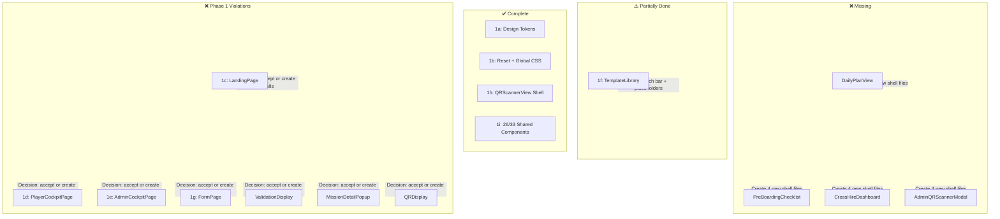

# Phase 1 ("Visual Shell") — Gap Analysis

**Date:** 2026-06-14  
**Author:** Architect mode (automated inspection)  
**Spec:** [`plans/prototype-impl-strategy.md`](./prototype-impl-strategy.md) (Phase 1, lines 184–261)

---

## Overall Assessment

The codebase has **advanced well past Phase 1 into Phase 2–4 wiring** on most pages and key player-facing components. The design tokens (1a), CSS reset/global styles (1b), QRScannerView (1h), and most shared pure-presentational components (1i) are fully complete. However, four significant gaps exist:

1. **Four components required by the plan do not exist at all.**
2. **Five page-level files are fully wired with hooks, adapters, and business logic** — these need shell-only variants or significant acceptance that Phase 1 was skipped for them.
3. **Three shared/player components contain adapter calls and data logic** in violation of the Phase 1 shell-only mandate.
4. **Several admin views (Pre-Boarding Checklist, HR Overview) are missing entirely from AdminCockpitPage.**

---

## Deliverable-by-Deliverable Breakdown

### 1a. Design Tokens (`src/styles/tokens.css`)
**Status: ✅ Complete**

| Criterion | Status |
|-----------|--------|
| Typography: `--font-display` (Playfair Display), `--font-body` (DM Sans), `--font-mono` (DM Mono) | ✅ Present |
| Color palette: bg, card, text primary/muted, accent, XP, status, tag colors | ✅ Present (HSL channel format) |
| Spacing scale: `--space-1` through `--space-12` in rem | ✅ Present |
| Touch minimum: `--touch-target: 2.75rem` (44px) | ✅ Present as `--touch-target` |
| Border radii: sm/md/lg/full | ✅ Present |
| Shadows & glassmorphism | ✅ Shadows present; explicit glassmorphism tokens not defined but CSS uses shadow/blur patterns consistent with the wireframe |

**Minor notes:**
- Tag color variants `overdue` and `needsApproval` have no explicit design tokens. CSS defines `tag-badge--mandatory` and `tag-badge--urgent` only.
- No dedicated `--glass-bg` / `--glass-blur` / `--glass-border` tokens for glassmorphism.

**Verdict:** No work required for this deliverable.

---

### 1b. Reset + Global Styles (`src/index.css`)
**Status: ✅ Complete**

| Criterion | Status |
|-----------|--------|
| Box model reset (`*`, `*::before`, `*::after` → `box-sizing: border-box; margin: 0; padding: 0`) | ✅ Present |
| Google Fonts import (Playfair Display, DM Sans, DM Mono) | ✅ Present |
| Global body typography | ✅ Present |
| All component CSS in single file | ✅ Present (1516 lines) |
| Imports `src/styles/tokens.css` | ✅ Present |
| Covers: TopBar, MapViewport, MilestoneNode, Sidebar, MissionItem, MissionCard, TagBadge, XPBadge, ProgressBar, Card, Buttons, Form, SearchBar, ResourceCard, BuddyCard, ResourcesSection, ChatPanel, TabBar, Modal, Landing, GridOverlay, QR Scanner, TutorialOverlay, FormShell, RecoveryKeyModal, AdminLayout | ✅ All present |

**Verdict:** No work required for this deliverable.

---

### 1c. LandingPage Shell
**Status: ❌ Phase 1 Violation — Fully Wired**

File: [`src/pages/LandingPage.tsx`](../src/pages/LandingPage.tsx:20) (745 lines)

| Phase 1 Requirement | Present? |
|--------------------|----------|
| Full-bleed layout | ✅ (`.landing` class, `100dvh`) |
| Brand logo/name ("Messe München") | ✅ |
| Tagline copy | ✅ |
| "Join Session" action area | ✅ (button, wired) |
| "Create Session" action area | ✅ (button, wired) |
| "Recover Progress" action area | ✅ (button, wired) |
| "Returning User redirect notice" | ✅ (implicit via useEffect) |
| **No inputs wired** | ❌ — All inputs wired with `value`/`onChange` |
| **No onClick handlers** | ❌ — All buttons have `onClick` wired to async handlers |
| **No state/logic** | ❌ — 6x `useState`, 1x `useEffect`, 1x `useRef`, adapter calls, navigation, template import, demo shortcuts |

**Phase 1 violations found:**
- Line 1: `import { useEffect, useRef, useState } from "react"`
- Line 2: `import { useNavigate }` (routing)
- Line 3: `import { useIdentity }` (hook)
- Line 4: `import { useAdapter }` (adapter)
- Lines 5–8: imports from `joinSession.ts`
- Line 9: `import { recoverIdentity }` (use case)
- Line 10: `import { importTemplate }` (use case)
- Lines 25–27: `useState` for view/status/errorMessage
- Lines 30–33: `useState` for sessionCode/sessionName/recoveryKey/recoverySessionId
- Lines 36–40: `useState` for pendingRecoveryKey/pendingRedirect
- Lines 46–52: `useEffect` — returning-user auto-redirect
- Lines 56–115: async `handleJoin`, `handleCreate`, `handleRecover` with adapter calls
- Lines 119–168: `handleDemoPlayer`, `handleDemoAdmin`, `handleTemplateImport`

**Action required:** Either (a) create a parallel `LandingPageShell.tsx` and gate by env/flag, or (b) accept that LandingPage graduated past Phase 1 and treat it as Phase 2+ complete.

---

### 1d. PlayerCockpitPage Shell
**Status: ❌ Phase 1 Violation — Fully Wired + Missing `DailyPlanView`**

File: [`src/pages/PlayerCockpitPage.tsx`](../src/pages/PlayerCockpitPage.tsx:19) (371 lines)

| Phase 1 Requirement | Present? |
|--------------------|----------|
| Scrollable single-column layout | ✅ |
| TopBar with logo/XP/avatar placeholder | ✅ (wired with real data) |
| **DailyPlanView** card/banner | ❌ **Component does not exist** |
| MilestoneMapViewer with 3 placeholder nodes | ❌ — Wired with real milestones from adapter |
| CurrentMissionsList | ✅ (wired with real data) |
| BuddyCard | ✅ (wired with real data) |
| ResourcesSection (search bar + 2 ResourceCards + ChatPanel) | ✅ (wired with real data) |
| **No hooks/adapter** | ❌ — 6 hooks called |

**Phase 1 violations found:**
- Line 1: `import { useCallback, useEffect, useState }`
- Line 5: `import { useAdapter }`
- Lines 6–10: `useIdentity`, `useSession`, `usePlayerProgress`, `useBuddy`, `useResources`
- Lines 26–56: `useEffect` for player resolution via adapter
- Lines 61–75: hooks for session/milestones/missions/buddy/progress/resources
- Lines 106–143: mission click handler with routing

**Missing component:** `DailyPlanView` — [`src/components/player/DailyPlanView.tsx`] does not exist. The plan requires: "_card or banner showing 'Today's Missions' with 2–3 placeholder mission rows; visually distinct from the full milestone mission list_".

**Action required:**
1. Create `src/components/player/DailyPlanView.tsx` (Phase 1 shell)
2. Either demote `PlayerCockpitPage` to shell or accept as Phase 2+ complete

---

### 1e. AdminCockpitPage Shell
**Status: ❌ Phase 1 Violation — Fully Wired + Missing 2 Entire Views**

File: [`src/pages/AdminCockpitPage.tsx`](../src/pages/AdminCockpitPage.tsx:26) (267 lines)

| Phase 1 Requirement | Present? |
|--------------------|----------|
| Tab-based navigation (Active Session / Pre-Boarding / HR Overview) | ❌ **No tabs exist** |
| TopBar | ✅ (wired) |
| PlayerSelectorDropdown | ✅ (wired with real players) |
| PlayerProfileCard | ✅ (wired) |
| PendingApprovalsPanel | ✅ (wired with real pending events) |
| MilestoneMapEditor with GridOverlay | ✅ (shell, no drag wired) |
| MilestoneSidebarEditor | ✅ (collapsed placeholder shown when no milestone selected) |
| BuddyAssignmentForm | ✅ (shell) |
| ResourcesEditor | ✅ (shell, form onSubmit collects FormData — minor logic) |
| SaveActions | ✅ (shell) |
| **Pre-Boarding Checklist view** | ❌ **Component does not exist** |
| **HR Overview view (CrossHireDashboard)** | ❌ **Component does not exist** |
| TemplateLibrary | ✅ (embedded in sidebar, but empty templates array) |
| **No hooks/adapter** | ❌ — 4 hooks called |

**Phase 1 violations found:**
- Line 1: `import { useCallback, useEffect, useState }`
- Line 10: `import { useAdapter }`
- Lines 11–13: `useIdentity`, `useSession`, `useResources`
- Lines 37–41: `useEffect` for `adapter.listPlayers`
- Lines 44–58: `useState` + `useCallback` + `useEffect` for progress events
- Lines 82–149: approval handlers and template export with adapter calls

**Missing components:**
1. `PreBoardingChecklist` — [`src/components/admin/PreBoardingChecklist.tsx`] does not exist
2. `PreBoardingChecklistItem` rows (checkbox + label) do not exist
3. `CrossHireDashboard` — [`src/components/admin/CrossHireDashboard.tsx`] does not exist
4. `HireProgressRow` — does not exist
5. `StalledHireAlert` badge — does not exist

**Action required:**
1. Create `PreBoardingChecklist.tsx` + `PreBoardingChecklistItem` subcomponent
2. Create `CrossHireDashboard.tsx` + `HireProgressRow` + `StalledHireAlert`
3. Add tab-based navigation to AdminCockpitPage (Active Session / Pre-Boarding Checklist / All New Hires)
4. Either demote or accept wired status

---

### 1f. Template Library View
**Status: ⚠️ Partially Done**

File: [`src/components/admin/TemplateLibrary.tsx`](../src/components/admin/TemplateLibrary.tsx:16) — shell ✅

| Plan Requirement | Status |
|-----------------|--------|
| Heading "Onboarding Templates" | ❌ — Heading is just "Templates" |
| Search bar | ❌ — No search bar |
| 2–3 placeholder TemplateCards | ❌ — Shows "No templates saved yet." empty state only |
| "Use Template" button stub | ✅ — "Load" button exists |
| Reachable from LandingPage "Create Session → Load Template" | ❌ — Not reachable; landing page has file import instead |

**Gaps:**
- TemplateLibrary is embedded in AdminCockpitPage sidebar but Phase 1 spec says it should be reachable from the Landing Page
- No placeholder template cards are shown (empty state only)
- No search bar in the template view
- Heading text is "Templates" not "Onboarding Templates"

**Action required:**
1. Add 2–3 placeholder `TemplateCard` entries with hardcoded data when in shell mode
2. Add a `SearchBar` component above the list
3. Change heading to "Onboarding Templates"
4. Add a route entry point from LandingPage (a "Browse Templates" button/link)

---

### 1g. FormPage Shell
**Status: ❌ Phase 1 Violation — Fully Wired**

File: [`src/pages/FormPage.tsx`](../src/pages/FormPage.tsx:11) (347 lines)

| Phase 1 Requirement | Present? |
|--------------------|----------|
| Full-page layout | ✅ |
| Title placeholder | ✅ (wired to real mission title) |
| Two example field shells (text, select) via `FormField` | ✅ (`FormField` component supports text/textarea/select/multiSelect) |
| Wrapped in `FormShell` | ✅ (`FormShell` exists and is used) |
| Submit button | ✅ |
| **No state/logic** | ❌ — 7x `useState`, 3x `useEffect`, adapter calls, form submission, validation, navigation |

**Phase 1 violations found:**
- Line 1: `import { useCallback, useEffect, useState }`
- Line 4: `import { useAdapter }`
- Lines 5–7: `useIdentity`, `useSession`, `usePlayerProgress`
- Lines 20–43: `useEffect` for player resolution
- Lines 62–91: `useEffect` for form schema fetching from adapter
- Lines 94–97: form state (`values`, `errors`, `isSubmitting`, `isDraft`)
- Lines 110–168: field change, validate, submit, save-for-later handlers

**Action required:** Either create a shell variant or accept wired status.

---

### 1h. QRScannerView Shell
**Status: ✅ Complete**

File: [`src/pages/QRScannerView.tsx`](../src/pages/QRScannerView.tsx:7) (64 lines)

| Phase 1 Requirement | Present? |
|--------------------|----------|
| Full-screen dark background | ✅ (`.qr-scanner` class, `background-color: hsl(0 0% 0%)`) |
| Camera feed placeholder | ✅ (`CameraFeed` with `isActive={false}`, shows "Camera inactive") |
| ValidationResult panel placeholder | ✅ (`ValidationResult` with `state="idle"`, shows "Ready to scan") |
| No state/logic | ✅ — No `useState`, no `useEffect`, no adapter calls |
| Hardcoded TopBar props | ✅ (`playerName="Peter Tubak"`) |

**Verdict:** No work required. This is the only page that is a true Phase 1 shell.

---

### 1i. Shared Components — Visual Shells Only

| Component | File | Pure Shell? | Notes |
|-----------|------|-------------|-------|
| **MilestoneNode** | [`src/components/shared/MilestoneNode.tsx`](../src/components/shared/MilestoneNode.tsx:18) | ✅ Yes | No state/logic. Status variants via CSS class. Liquid-fill indicator present. |
| **MapViewport** | [`src/components/shared/MapViewport.tsx`](../src/components/shared/MapViewport.tsx:34) | ⚠️ Interaction logic | Has `useState`/`useEffect`/`useRef` for pan/zoom/pinch. This is **interaction logic** (not data-fetching), which may be acceptable per plan: "_shared pan/zoom/pinch viewport with zoom controls_". Judgement call. |
| **MissionCard** | [`src/components/shared/MissionCard.tsx`](../src/components/shared/MissionCard.tsx:17) | ✅ Yes | No state/logic. Derives `isCompleted` from props. |
| **TopBar** | [`src/components/shared/TopBar.tsx`](../src/components/shared/TopBar.tsx:9) | ✅ Yes | Pure presentational. Fixed, blur not yet implemented (CSS uses solid background). |
| **BackgroundCanvas** | [`src/components/shared/BackgroundCanvas.tsx`](../src/components/shared/BackgroundCanvas.tsx:8) | ✅ Yes | Pure presentational. `object-fit: cover`. |
| **ValidationDisplay** | [`src/components/player/ValidationDisplay.tsx`](../src/components/player/ValidationDisplay.tsx:15) | ❌ **Violation** | Contains `useEffect`, `useAdapter`, `subscribeProgressEvent`. Should be a pure shell in Phase 1. |
| **TutorialOverlay** | [`src/components/tutorial/TutorialOverlay.tsx`](../src/components/tutorial/TutorialOverlay.tsx:56) | ✅ Yes | Static placeholder steps. No state/logic. Highlight ring placeholder present. |
| **TutorialStep** | [`src/components/tutorial/TutorialStep.tsx`](../src/components/tutorial/TutorialStep.tsx:20) | ✅ Yes | Pure presentational. Step indicator, progress dots, CTA button. |
| **TagBadge** | [`src/components/shared/TagBadge.tsx`](../src/components/shared/TagBadge.tsx:7) | ✅ Yes | Pure presentational. Variant classes via `tag-badge--{variant}`. |
| **XPBadge** | [`src/components/shared/XPBadge.tsx`](../src/components/shared/XPBadge.tsx:6) | ✅ Yes | Pure presentational. Number + "XP" label. |
| **RecoveryKeyModal** | [`src/components/shared/RecoveryKeyModal.tsx`](../src/components/shared/RecoveryKeyModal.tsx:10) | ⚠️ Minor logic | Has `useState` for copy-to-clipboard feedback. Minor UI state — not data-fetching. Acceptable. |
| **SearchBar** | [`src/components/shared/SearchBar.tsx`](../src/components/shared/SearchBar.tsx:9) | ✅ Yes | Pure presentational. `onChange` delegates to prop. No internal state. |
| **ResourceCard** | [`src/components/shared/ResourceCard.tsx`](../src/components/shared/ResourceCard.tsx:11) | ✅ Yes | Pure presentational. |
| **AdminQRScannerModal** | ❌ **Missing** | ❌ | **Does not exist.** Required per plan: "_modal overlay with camera feed placeholder, scan status indicator, cancel button_". |

---

## Player Components Status

| Component | File | Pure Shell? | Notes |
|-----------|------|-------------|-------|
| **DailyPlanView** | ❌ **Missing** | ❌ | **Does not exist.** Required per plan: "_card or banner showing 'Today's Missions' with 2–3 placeholder mission rows_" |
| **MilestoneMapViewer** | [`src/components/player/MilestoneMapViewer.tsx`](../src/components/player/MilestoneMapViewer.tsx:16) | ✅ Yes | Pure presentational. Derives progress map from props. Delegates to MapViewport + MilestoneNode. |
| **CurrentMissionsList** | [`src/components/player/CurrentMissionsList.tsx`](../src/components/player/CurrentMissionsList.tsx:31) | ✅ Yes | Pure presentational. Derives `isCompleted` from props. `firstSentence` is a pure function. |
| **BuddyCard** | [`src/components/player/BuddyCard.tsx`](../src/components/player/BuddyCard.tsx:24) | ✅ Yes | Pure presentational. Helper `initials()` is a pure function. |
| **ResourcesSection** | [`src/components/player/ResourcesSection.tsx`](../src/components/player/ResourcesSection.tsx:32) | ⚠️ Minor logic | Has `useState` for local search query filtering. Not data-fetching. Could be argued as UI state. |
| **ChatPanel** | [`src/components/player/ChatPanel.tsx`](../src/components/player/ChatPanel.tsx:15) | ✅ Yes | Pure presentational. |
| **ResourcesChat** | [`src/components/player/ResourcesChat.tsx`](../src/components/player/ResourcesChat.tsx:10) | ✅ Yes | Pure presentational. Tabs are static. |
| **MissionDetailPopup** | [`src/components/player/MissionDetailPopup.tsx`](../src/components/player/MissionDetailPopup.tsx:43) | ❌ **Violation** | Contains `useState`, `useCallback`, `useRef`, `useAdapter`, `adapter.upsertProgressEvent`, swipe-down gesture, markdown rendering. Fully wired. |
| **MilestoneSidebarViewer** | [`src/components/player/MilestoneSidebarViewer.tsx`](../src/components/player/MilestoneSidebarViewer.tsx:20) | ⚠️ Minor logic | Has `useState` for tab switching + `useRef` for swipe-to-close. Minor interaction logic. |
| **QRDisplay** | [`src/components/player/QRDisplay.tsx`](../src/components/player/QRDisplay.tsx:15) | ❌ **Violation** | Contains `useState`, `useEffect` (x2), `useRef`, `useAdapter`, `encodeQRPayload`, `QRCode.toCanvas`. Fully wired. |
| **PendingApprovalDisplay** | [`src/components/player/PendingApprovalDisplay.tsx`](../src/components/player/PendingApprovalDisplay.tsx:8) | ✅ Yes | Pure presentational. |
| **YouAreHereMarker** | [`src/components/player/YouAreHereMarker.tsx`](../src/components/player/YouAreHereMarker.tsx:9) | ✅ Yes | Pure presentational. |
| **ProgressLegend** | [`src/components/player/ProgressLegend.tsx`](../src/components/player/ProgressLegend.tsx:12) | ✅ Yes | Pure presentational. |
| **FormField** | [`src/components/form/FormField.tsx`](../src/components/form/FormField.tsx:26) | ✅ Yes | Pure presentational with helper pure functions (`parseMultiSelect`, `toggleOption`). |
| **FormShell** | [`src/components/form/FormShell.tsx`](../src/components/form/FormShell.tsx:20) | ✅ Yes | Pure presentational. |

---

## Admin Components Status

| Component | File | Pure Shell? | Notes |
|-----------|------|-------------|-------|
| **PlayerSelectorDropdown** | [`src/components/admin/PlayerSelectorDropdown.tsx`](../src/components/admin/PlayerSelectorDropdown.tsx:10) | ✅ Yes | Pure presentational. Controlled component. |
| **PlayerProfileCard** | [`src/components/admin/PlayerProfileCard.tsx`](../src/components/admin/PlayerProfileCard.tsx:8) | ✅ Yes | Pure presentational. |
| **PendingApprovalsPanel** | [`src/components/admin/PendingApprovalsPanel.tsx`](../src/components/admin/PendingApprovalsPanel.tsx:12) | ✅ Yes | Pure presentational. Delegates to `ApprovalRequestCard`. |
| **ApprovalRequestCard** | [`src/components/admin/ApprovalRequestCard.tsx`](../src/components/admin/ApprovalRequestCard.tsx:10) | ✅ Yes | Pure presentational. Has "Approve"/"Reject" buttons. Plan says "Scan QR" button stub — `ApprovalRequestCard` has "Approve"/"Reject" instead. |
| **MilestoneMapEditor** | [`src/components/admin/MilestoneMapEditor.tsx`](../src/components/admin/MilestoneMapEditor.tsx:17) | ✅ Yes | Pure presentational. Uses `MapViewport` + draggable `MilestoneNode` + `GridOverlay`. |
| **GridOverlay** | [`src/components/admin/GridOverlay.tsx`](../src/components/admin/GridOverlay.tsx:7) | ✅ Yes | Pure presentational. SVG grid with `repeating-linear-gradient`. |
| **MilestoneSidebarEditor** | [`src/components/admin/MilestoneSidebarEditor.tsx`](../src/components/admin/MilestoneSidebarEditor.tsx:21) | ✅ Yes | Pure presentational. Shows "Select a milestone to edit" when null. |
| **BuddyAssignmentForm** | [`src/components/admin/BuddyAssignmentForm.tsx`](../src/components/admin/BuddyAssignmentForm.tsx:15) | ✅ Yes | Pure presentational. Form inputs, no state. |
| **ResourcesEditor** | [`src/components/admin/ResourcesEditor.tsx`](../src/components/admin/ResourcesEditor.tsx:14) | ⚠️ Minor logic | `onSubmit` extracts `FormData`. Minor DOM logic but no data-fetching. |
| **SaveActions** | [`src/components/admin/SaveActions.tsx`](../src/components/admin/SaveActions.tsx:10) | ✅ Yes | Pure presentational. |
| **SaveTemplateModal** | [`src/components/admin/SaveTemplateModal.tsx`](../src/components/admin/SaveTemplateModal.tsx:11) | ✅ Yes | Pure presentational. Controlled props. |
| **TemplateLibrary** | [`src/components/admin/TemplateLibrary.tsx`](../src/components/admin/TemplateLibrary.tsx:16) | ✅ Yes | Pure presentational. Shows empty state when no templates. |
| **PreBoardingChecklist** | ❌ **Missing** | ❌ | **Does not exist.** |
| **CrossHireDashboard** | ❌ **Missing** | ❌ | **Does not exist.** |

---

## Layout / Route Guard

| Component | File | Pure Shell? | Notes |
|-----------|------|-------------|-------|
| **RequireRole** | [`src/components/layout/RequireRole.tsx`](../src/components/layout/RequireRole.tsx:13) | ⚠️ Routing logic | Uses `useIdentity`, `useParams`, `<Navigate>`. Phase 1 says "no routing". But route guards are infrastructure, not UI shell. Judgement call. |

---

## Summary of Missing Components

These **must be created** to satisfy Phase 1:

| # | Component | Target Path | Plan Reference |
|---|-----------|-------------|----------------|
| 1 | `DailyPlanView` | `src/components/player/DailyPlanView.tsx` | 1d — card/banner showing "Today's Missions" with 2–3 placeholder mission rows |
| 2 | `PreBoardingChecklist` | `src/components/admin/PreBoardingChecklist.tsx` | 1e — card with heading "Before Anna's first day", list of `PreBoardingChecklistItem` rows (checkbox + label) |
| 3 | `CrossHireDashboard` | `src/components/admin/CrossHireDashboard.tsx` | 1e — list/card grid of `HireProgressRow` components with `StalledHireAlert` badge |
| 4 | `AdminQRScannerModal` | `src/components/admin/AdminQRScannerModal.tsx` | 1i — modal overlay with camera feed placeholder, scan status indicator, cancel button |

## Phase 1 Violation Summary

These files contain `useState`/`useEffect`/adapter calls that should not exist in Phase 1 shells:

| # | File | Violations |
|---|------|-----------|
| 1 | [`src/pages/LandingPage.tsx`](../src/pages/LandingPage.tsx:20) | 6x useState, 1x useEffect, 1x useRef, useAdapter, useIdentity, 4 async handlers, demo shortcuts, template import |
| 2 | [`src/pages/PlayerCockpitPage.tsx`](../src/pages/PlayerCockpitPage.tsx:19) | 3x useState, 1x useEffect, useCallback, useAdapter, useIdentity, useSession, usePlayerProgress, useBuddy, useResources |
| 3 | [`src/pages/AdminCockpitPage.tsx`](../src/pages/AdminCockpitPage.tsx:26) | 5x useState, 3x useEffect, useCallback, useAdapter, useIdentity, useSession, useResources, template export |
| 4 | [`src/pages/FormPage.tsx`](../src/pages/FormPage.tsx:11) | 7x useState, 3x useEffect, useCallback, useAdapter, useIdentity, useSession, usePlayerProgress, form submission + validation |
| 5 | [`src/components/player/ValidationDisplay.tsx`](../src/components/player/ValidationDisplay.tsx:15) | useEffect, useAdapter, subscribeProgressEvent |
| 6 | [`src/components/player/MissionDetailPopup.tsx`](../src/components/player/MissionDetailPopup.tsx:43) | 2x useState, useCallback, useRef, useAdapter, adapter.upsertProgressEvent, markdown rendering |
| 7 | [`src/components/player/QRDisplay.tsx`](../src/components/player/QRDisplay.tsx:15) | 1x useState, 2x useEffect, useRef, useAdapter, encodeQRPayload, QRCode.toCanvas |

## Deliverable Summary

| Deliverable | Status | Key Issue |
|-------------|--------|-----------|
| 1a — Design Tokens | ✅ Complete | No action needed |
| 1b — Reset + Global Styles | ✅ Complete | No action needed |
| 1c — LandingPage Shell | ❌ Fully wired | 6x useState, adapter calls, async handlers |
| 1d — PlayerCockpitPage Shell | ❌ Fully wired + Missing DailyPlanView | Hooks + adapter; DailyPlanView doesn't exist |
| 1e — AdminCockpitPage Shell | ❌ Fully wired + Missing PreBoarding + HR views | No tabs; 2 major views missing entirely |
| 1f — Template Library | ⚠️ Partially done | No search bar, no placeholder cards, wrong heading |
| 1g — FormPage Shell | ❌ Fully wired | 7x useState, adapter, form logic |
| 1h — QRScannerView Shell | ✅ Complete | Only page that is a true Phase 1 shell |
| 1i — Shared Components | ⚠️ Mostly complete | 4 missing, 3 with adapter logic |

## Recommended Action Plan

### Priority 1: Create Missing Components (4 files)
These are new files with no logic — pure Phase 1 shell work:
1. `src/components/player/DailyPlanView.tsx` — card with heading "Today's Missions", 2–3 placeholder mission rows with title, XP badge, tag badge
2. `src/components/admin/PreBoardingChecklist.tsx` — card with heading, 4–5 placeholder checklist items (checkbox + label)
3. `src/components/admin/CrossHireDashboard.tsx` — heading "All New Hires", 3 `HireProgressRow` cards (on track / stalled / just started)
4. `src/components/admin/AdminQRScannerModal.tsx` — modal overlay, camera feed placeholder, "Scanning…" status, cancel button

### Priority 2: Fix TemplateLibrary (1 file)
5. Update [`src/components/admin/TemplateLibrary.tsx`](../src/components/admin/TemplateLibrary.tsx:16):
   - Change heading to "Onboarding Templates"
   - Add `SearchBar` component above template list
   - Add 2–3 hardcoded placeholder `TemplateSummary` entries with `id`, `name`, `milestoneCount`, `missionCount`

### Priority 3: Phase 1 Violation Cleanup (Decision Needed)
For the 5 page-level files and 3 component files that are fully wired, a decision is needed:
- **Option A:** Create pure-shell variants (e.g., `LandingPageShell.tsx`) and gate them behind a build flag. This preserves the wired versions for subsequent phases.
- **Option B:** Accept the wired versions as Phase 2+ graduation and focus only on missing components. The plan explicitly states Phase 1 produces "NO logic," but the codebase has clearly prioritized feature completeness over phase purity.

### Priority 4: AdminCockpitPage Layout
6. Add tab-based navigation to [`src/pages/AdminCockpitPage.tsx`](../src/pages/AdminCockpitPage.tsx:26) with tabs: "Active Session" / "Pre-Boarding Checklist" / "All New Hires". Embed `PreBoardingChecklist` and `CrossHireDashboard` behind their respective tabs.

## Architecture Diagram

