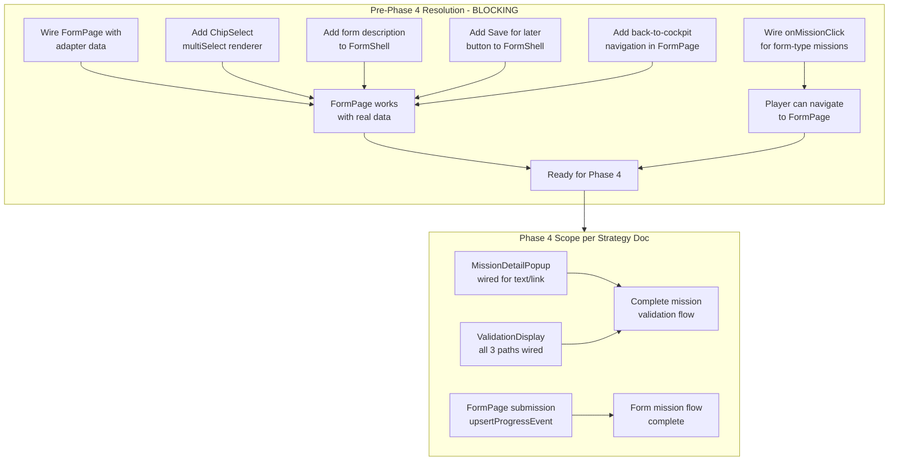
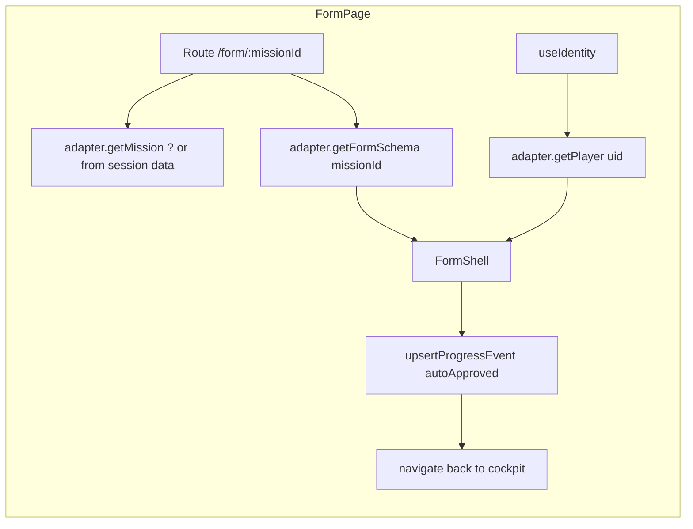
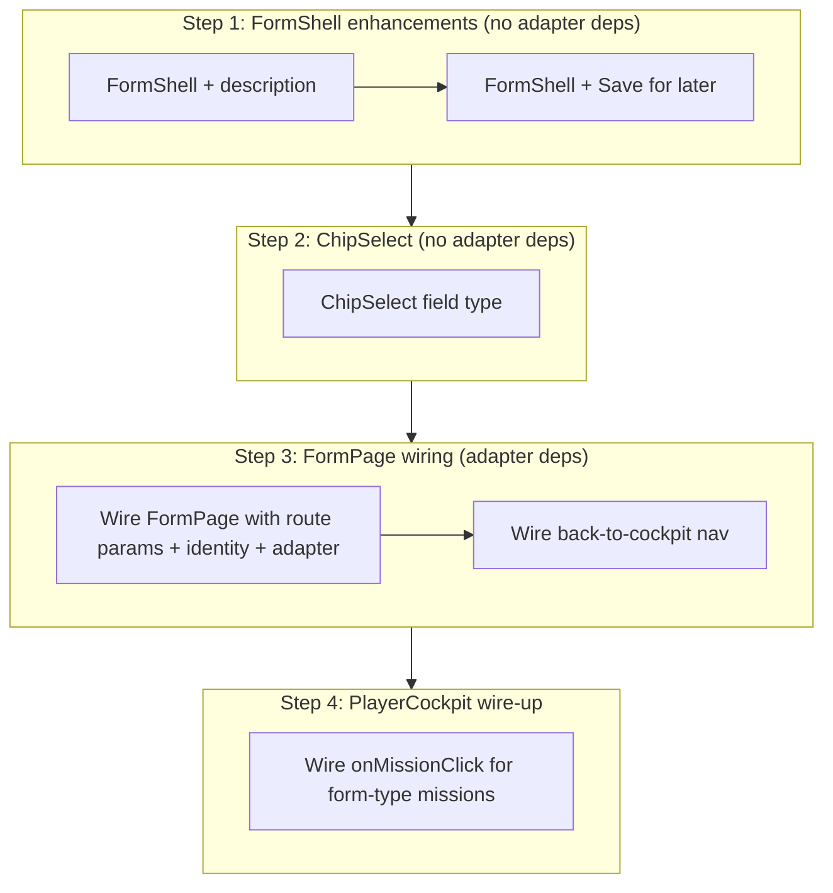

# Phase 3 Completion + Wireframe Alignment — Assessment & Resolution Plan

> **Context:** Evaluating implementation status against [`prototype-impl-strategy.md`](../prototype-impl-strategy.md) Phase 3 deliverables and [`wireframe-alignment-plan.md`](../wireframe-alignment-plan.md) gap analysis, to determine what must be resolved before Phase 4 begins.

---

## 1. Phase 3 Completion Assessment

### 3a. Data Hooks — ✅ All Implemented

| Hook | File | Status |
|---|---|---|
| `useSession` | [`src/hooks/useSession.ts`](../src/hooks/useSession.ts:1) | Fetches Session + Milestones + Missions via adapter |
| `usePlayerProgress` | [`src/hooks/usePlayerProgress.ts`](../src/hooks/usePlayerProgress.ts:1) | Fetches ProgressEvents → derives `PlayerProgress` via `computeProgress` |
| `useBuddy` | [`src/hooks/useBuddy.ts`](../src/hooks/useBuddy.ts:1) | Fetches BuddyProfile for the player |
| `useResources` | [`src/hooks/useResources.ts`](../src/hooks/useResources.ts:1) | Fetches resources, filters `isVisibleToPlayer: true` |

### 3b. PlayerCockpitPage — ✅ Fully Wired

| Section | Detail | Status |
|---|---|---|
| `TopBar` | Real `playerName`, `totalXP`, `role` from resolved Player | ✓ |
| `BackgroundCanvas` | Reads `session.bgImageUrl` | ✓ |
| `MilestoneMapViewer` | Milestones positioned at `xPercent`/`yPercent`, status from `milestoneProgress` | ✓ |
| `YouAreHereMarker` | Positioned at first `inProgress` milestone (hardcoded 15,35) | ✓ * |
| `CurrentMissionsList` | Missions filtered by `isInCurrentMissions: true` | ✓ |
| `BuddyCard` | Real buddy data or empty state | ✓ |
| `ResourcesSection` | Real resources with client-side search | ✓ |

**Minor note:** `YouAreHereMarker` position is hardcoded at `(15, 35)` — should ideally derive from the first `inProgress` milestone's coordinates. Not blocking Phase 4.

### 3c. MilestoneSidebarViewer — ✅ Wired

| Feature | Status |
|---|---|
| Opens on `MilestoneNode` click | ✓ |
| Shows real milestone name, XP progress bar, missions | ✓ |
| Close button + tap-outside-to-close | ✓ |
| Tabbed interface (Missions / Resources) | ✓ |
| `onMissionClick` placeholder (no-op — Phase 4 delivers this) | ⏳ |

### 3d. Phase 3 Exit Condition

> "Player cockpit shows real data from mock. Map nodes are positioned correctly. Clicking a milestone opens the sidebar with its missions. XP bar reflects mock progress state. All responsive at 390px."

**Verdict: ✅ MET — Phase 3 is complete.**

---

## 2. Wireframe Alignment Gap Analysis (Blocking vs Non-Blocking for Phase 4)

### Legend

| Priority | Count | Area |
|---|---|---|
| 🔴 **BLOCKING** — must be done before Phase 4 | **6** | FormPage + FormShell + ChipSelect |
| 🟡 Non-blocking (can be deferred past Phase 4) | **10** | Admin cockpit, cosmetic improvements |

### 🔴 Blocking Items (Must Resolve Before Phase 4)

| ID | Task | Wireframe Gap Ref | File(s) | Reason |
|---|---|---|---|---|
| **A** | Wire FormPage with adapter data | N/A (Phase 1 shell) | [`FormPage.tsx`](../src/pages/FormPage.tsx:1) | Currently hardwired to `MOCK_FORM_SCHEMAS[0]` — reads nothing from route params or identity |
| **B** | Add description text to FormShell | P2-7 | [`FormShell.tsx`](../src/components/form/FormShell.tsx:1) | Wireframe shows per-form description between heading and fields |
| **C** | Add "Save for later" button to FormShell | P2-4 | [`FormShell.tsx`](../src/components/form/FormShell.tsx:1) | Wireframe shows it between Back and Submit |
| **D** | Add ChipSelect component for multiSelect fields | P2-5 | [`FormField.tsx`](../src/components/form/FormField.tsx:1) | Wireframe uses toggle-able chip buttons; `FieldType` already has `multiSelect` but no rendering |
| **E** | Add back-to-cockpit navigation in FormPage | P2-8 | [`FormPage.tsx`](../src/pages/FormPage.tsx:1) | Wireframe shows "Dashboard" back link |
| **F** | Wire `onMissionClick` to navigate to `/form/:missionId` | N/A | [`PlayerCockpitPage.tsx`](../src/pages/PlayerCockpitPage.tsx:247), [`CurrentMissionsList.tsx`](../src/components/player/CurrentMissionsList.tsx:1) | Currently `() => undefined` — player can't reach form missions |

### 🟡 Non-Blocking Items (Can Be Deferred Past Phase 4)

| ID | Task | Wireframe Gap Ref | Notes |
|---|---|---|---|
| 1 | Admin cockpit layout restructure | P1-1, P1-2, P1-3 | Phase 6 work per strategy doc |
| 2 | `@handle` field in BuddyCard | P2-2 | Cosmetic — Phase 4 doesn't depend on it |
| 3 | XP ring visualization on mission cards | P2-3 | Cosmetic — Phase 4 doesn't depend on it |
| 4 | `ApprovalsPendingBadge` component | P2-1 | Phase 6 admin work |
| 5 | Landing page wording (Session ID vs Session code) | P3-1 | Minor copy change |
| 6 | Back-arrow icon on back buttons | P3-2 | Cosmetic polish |
| 7 | Mock data alignment with wireframe (Sarah Hoffmann) | P3-3 | Can update alongside Phase 4 |
| 8 | Wire admin dashboard to real adapter data | P4-1 | Phase 6 work |
| 9 | Wire "Save for later" persistence across sessions | P4-3 | Persistence layer — Phase 4 can use local state |
| 10 | Merge Admin + Player cockpit pattern | P1-2 | Phase 6 architectural work |

---

## 3. Pre-Phase-4 Resolution Plan

### Blocking Gap A: Wire FormPage with adapter data

**Current state:** [`FormPage.tsx`](../src/pages/FormPage.tsx:1) imports mock data directly.

**Required changes:**
1. Read `missionId` from route params (`/form/:missionId`)
2. Resolve player identity from `useIdentity`
3. Fetch `FormSchema` via `adapter.getFormSchema(missionId)`
4. Fetch `Mission` details via `useSession` or adapter
5. Implement form values state management (with `useState` for field values)
6. Wire form submission: `adapter.upsertProgressEvent({ status: 'autoApproved', formResponse })`
7. For profile setup mission: also call `adapter.updatePlayer` with extracted fields

**Component architecture after change:**

**Note:** The `AppAdapter` interface doesn't have `getMission(missionId)` — only `listMissions(sessionId)`. The FormPage will need either a new adapter method or to receive missions via a broader context. **Recommendation:** Either add `getMission(id: string)` to `AppAdapter`, or pass the mission as a route state parameter from the player cockpit.

### Blocking Gap B: Add description text to FormShell

**Current state:** [`FormShell.tsx`](../src/components/form/FormShell.tsx:24) has `<h1>` with `missionTitle` and immediately renders fields.

**Required changes:**
1. Add optional `description?: string` prop to `FormShellProps`
2. Render a `
` element between the heading and field list when description is provided
3. Pass through from `FormPage` using the `FormSchema` or `Mission` data

### Blocking Gap C: Add "Save for later" button to FormShell

**Current state:** Only a "Submit" button exists.

**Required changes:**
1. Add `onSaveForLater?: () => void` callback to `FormShellProps`
2. Add a "Save for later" button between Back and Submit (matching wireframe order)
3. Add `isDraft?: boolean` prop to change button text/state accordingly
4. Wire in `FormPage` to persist current field values to component state (no persistence across sessions — that's P4-3)

### Blocking Gap D: Add ChipSelect component for multiSelect fields

**Current state:** [`FormField.tsx`](../src/components/form/FormField.tsx:11) handles `textarea` and `select` but falls through to `text` input for anything else. `multiSelect` is unhandled.

**Required changes:**
1. Declare a new `ChipSelect` sub-component or inline in `FormField` that renders toggle-able chip buttons from `field.options`
2. Track selected values in an array (`string[]`) rather than a single string
3. Wireframe shows chips for "What energises you?" and "What drains you?" with 8 options each
4. Update `FormFieldProps.value` to accept `string[]` for multiSelect or update `onChange` to handle multiple values
5. Update `FormShellProps` `values` type to support `string | string[]` — or normalize to `Record<string, string>` with comma-joined values

**Type consideration:** `FormShellProps.values` is currently `Record<string, string>` — multiSelect needs `Record<string, string[]>`. This is a type boundary decision. **Recommendation:** normalize multiSelect values as comma-joined strings in the `values` record, or update the type to `Record<string, string | string[]>`. The latter is cleaner but requires updating all consumers.

### Blocking Gap E: Add back-to-cockpit navigation in FormPage

**Current state:** [`FormPage.tsx`](../src/pages/FormPage.tsx:1) uses generic `TopBar` with no navigation links.

**Required changes:**
1. Add a "Back to Dashboard" link/button in the form page header area
2. Navigate to `/session/:sessionId` for player role
3. Derive `sessionId` from identity or route state

### Blocking Gap F: Wire onMissionClick for form-type missions

**Current state:** [`PlayerCockpitPage.tsx`](../src/pages/PlayerCockpitPage.tsx:251) passes `() => undefined` as `onMissionClick`.

**Required changes:**
1. Implement `handleMissionClick` that checks `mission.type === 'form'`
2. For form-type missions: navigate to `/form/${missionId}`
3. For text/link missions: open `MissionDetailPopup` (Phase 4a work — can be stubbed for now)
4. Pass navigation callback to `CurrentMissionsList`

---

## 4. Recommended Execution Order

| Order | Task | Adapter Dependency | Files Changed |
|---|---|---|---|
| 1 | Add description + Save for later to FormShell | None (props only) | `FormShell.tsx` |
| 2 | Add ChipSelect to FormField | None (props only) | `FormField.tsx`, possibly `FormShell.tsx` |
| 3 | Wire FormPage with adapter | Yes (getFormSchema, getPlayer, upsertProgressEvent) | `FormPage.tsx`, maybe `AppAdapter` |
| 4 | Wire PlayerCockpitPage onMissionClick | None (uses useNavigate) | `PlayerCockpitPage.tsx` |

---

## 5. Summary

| Area | Status | Phase 3 Complete | Wireframe Aligned | Blocks Phase 4 |
|---|---|---|---|---|
| Data hooks | ✅ Complete | ✅ | N/A | No |
| PlayerCockpitPage | ✅ Complete | ✅ | ~75% | **Partially** — needs onMissionClick wiring |
| MilestoneMapViewer | ✅ Complete | ✅ | 100% (kept) | No |
| MilestoneSidebarViewer | ✅ Complete | ✅ | N/A | No |
| FormPage + FormShell | ⏳ Shell only | N/A | ~40% | **🔴 Yes — 6 blocking gaps** |
| FormField (multiSelect) | ❌ Missing | N/A | N/A | **🔴 Yes** |
| AdminCockpitPage | ⏳ Shell only | N/A | ~30% | No (Phase 6) |
| BuddyCard | ✅ Complete | N/A | ~80% | No (needs @handle later) |
| CurrentMissionsList | ✅ Complete | N/A | ~75% | No |

**Bottom line:** 6 blocking gaps exist, all centered on the FormPage/FormField/FormShell triad. These must be resolved before Phase 4 can begin, because Phase 4's deliverable 4d ("FormPage — wired") depends on them, and Phase 4 also depends on the player being able to navigate from the cockpit to a form mission.
