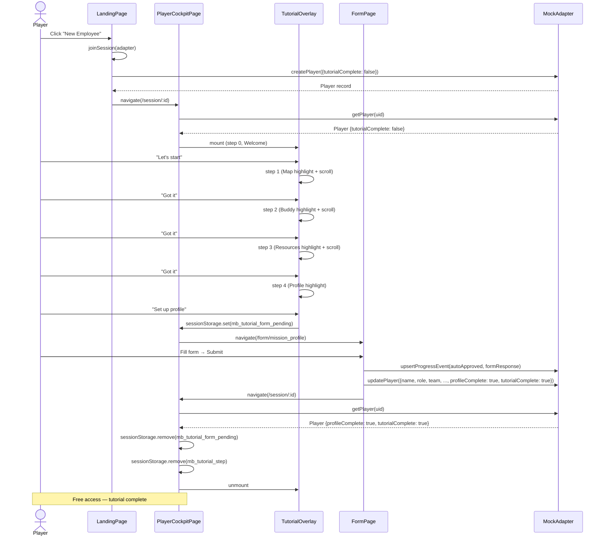

# Phase 5 — Tutorial Flow: Implementation Plan

> **Date:** 2026-06-14  
> **Spec authority:** [`SPECS.md`](../SPECS.md) §Tutorial Flow  
> **Implementation strategy:** [`plans/prototype-impl-strategy.md`](prototype-impl-strategy.md) §Phase 5  
> **Figma wireframe:** [Onboarding Login and Form](https://www.figma.com/make/ggcp1mnflafNAXM2vHMgho/Onboarding-Login-and-Form)

---

## Summary

Phase 5 wires the tutorial overlay for first-time players. The visual shells (`TutorialOverlay`, `TutorialStep`, `tutorialSteps`) exist from Phase 1 and the basic state machine is partially wired in [`PlayerCockpitPage.tsx`](../src/pages/PlayerCockpitPage.tsx). This phase completes the integration, adds persistence, fixes the profile form → player record mapping, and handles edge cases.

### Corrected User Journey

The tutorial introduces the cockpit layout first, then guides the player to complete their profile as the final step:

```
Landing → "New Employee" → Join screen (enter session code) → "Hello, <Name>." 
  → Cockpit with tutorial overlay at bottom of screen:
      Step 1: Welcome greeting (~no highlight~)
      Step 2: The Journey Map → explains milestones & XP
      Step 3: Your Buddy → explains buddy relationship  
      Step 4: Resources & AI Q&A → explains reference materials
      Step 5: Complete Your Profile → highlights the mandatory profile mission → 
        opens FormPage → submits → returns → tutorial complete → free access
```

**Critical difference from Figma wireframe:** The Figma shows "Complete your profile" immediately after the welcome. The prototype shows the cockpit first with tutorial cards explaining the layout, and the profile form is the **final** tutorial step — completing it marks the tutorial as done.

### Figma Wireframe Findings

The Figma prototype at [Onboarding Login and Form](https://www.figma.com/make/ggcp1mnflafNAXM2vHMgho/Onboarding-Login-and-Form) shows a four-screen flow:

| Figma Screen | MesseBuddy Equivalent | Status |
|---|---|---|
| Role select (`Join as`) | [`LandingPage.tsx`](../src/pages/LandingPage.tsx) role-select view | ✅ Phase 2 |
| Session code entry | [`LandingPage.tsx`](../src/pages/LandingPage.tsx) join view | ✅ Phase 2 |
| "Hello, Sarah." welcome | Tutorial Step 0 (Welcome) with personalized greeting | ⚠️ Needs personalization |
| "Complete your profile" CTA | Tutorial Step 5 (final step) — highlights profile mission in cockpit | ⚠️ Reorder steps, map player fields |
| Profile form fields | [`FormPage`](../src/pages/FormPage.tsx) + schema_profile in mock data | ⚠️ Needs field→player mapping |

---

## What Already Exists

### Visual Shells (Phase 1)
- [`TutorialOverlay.tsx`](../src/components/tutorial/TutorialOverlay.tsx) — full-screen overlay with dynamic highlight ring via `getBoundingClientRect` + `box-shadow` spotlight (9999px spread). `position:fixed`, `zIndex:90`, `pointer-events:none`. Recalcs on step change (rAF), resize, and scroll.
- [`TutorialStep.tsx`](../src/components/tutorial/TutorialStep.tsx) — dialog card at `zIndex:100`, bottom-center anchored, max-width `24rem`. Step counter + progress dots + title + body + CTA button + skip link.
- [`tutorialSteps.ts`](../src/components/tutorial/tutorialSteps.ts) — 5 step definitions with CSS `targetSelector` for each highlight target. **Needs reordering.**

### State Management (Phase 2–4)
- [`PlayerCockpitPage.tsx`](../src/pages/PlayerCockpitPage.tsx) — `tutorialStep` (0-based), `showTutorial`, `showSkipConfirm` state. Form round-trip via `sessionStorage("mb_tutorial_form_pending")`. `handleTutorialNext` routes the profile step to `/form/mission_profile`, advances other steps, calls `adapter.updatePlayer({ tutorialComplete: true })` on final step.
- [`mockAdapter.ts`](../src/adapters/mock/mockAdapter.ts:327-333) — auto-sets `player.profileComplete = true` when `mission_profile` receives `autoApproved`.

### Target Selectors to be Verified/Updated
| Step | Target | Selector | Found In |
|---|---|---|---|
| 0 (Welcome) | *(none)* | `undefined` | N/A |
| 1 (Map) | Map Viewer | `[data-testid="milestone-map-viewer"]` | [`MilestoneMapViewer.tsx`](../src/components/player/MilestoneMapViewer.tsx:24) |
| 2 (Buddy) | Buddy Card | `.buddy-card` | [`BuddyCard.tsx`](../src/components/player/BuddyCard.tsx:25) |
| 3 (Resources) | Resources Tab | `.resources-chat` | [`ResourcesChat.tsx`](../src/components/player/ResourcesChat.tsx:21) |
| 4 (Profile) | Current Missions | `[data-testid="current-missions-list"]` | [`CurrentMissionsList.tsx`](../src/components/player/CurrentMissionsList.tsx:39) |

---

## Implementation Tasks

### Task 1: Reorder Tutorial Steps

**Problem:** The current step order places Profile as step 2 (right after Welcome). The corrected journey explains the cockpit first, and the profile form is the final tutorial step.

**Files to modify:**
- [`src/components/tutorial/tutorialSteps.ts`](../src/components/tutorial/tutorialSteps.ts)
- [`src/pages/PlayerCockpitPage.tsx`](../src/pages/PlayerCockpitPage.tsx)

**Changes in `tutorialSteps.ts`:**
Reorder `PLACEHOLDER_STEPS` so the Profile step is last:

```ts
export const PLACEHOLDER_STEPS: ReadonlyArray<TutorialStepData> = [
  // Step 0 — Welcome (no highlight)
  {
    stepNumber: 1,
    totalSteps: 5,
    title: "Welcome to MesseBuddy",
    body: "...",
    ctaLabel: "Let's start",
    targetSelector: undefined,
  },
  // Step 1 — The Journey Map (was step 3)
  {
    stepNumber: 2,
    totalSteps: 5,
    title: "The Journey Map",
    body: "Each milestone is a chapter of your onboarding...",
    ctaLabel: "Got it",
    targetSelector: '[data-testid="milestone-map-viewer"]',
  },
  // Step 2 — Your Buddy (was step 4)
  {
    stepNumber: 3,
    totalSteps: 5,
    title: "Your Buddy",
    body: "Your buddy is your guide for the first weeks...",
    ctaLabel: "Got it",
    targetSelector: ".buddy-card",
  },
  // Step 3 — Resources & AI Q&A (was step 5)
  {
    stepNumber: 4,
    totalSteps: 5,
    title: "Resources & AI Q&A",
    body: "Browse hand-picked resources for your first weeks...",
    ctaLabel: "Got it",
    targetSelector: ".resources-chat",
  },
  // Step 4 — Complete Your Profile (was step 2, now final)
  {
    stepNumber: 5,
    totalSteps: 5,
    title: "Complete Your Profile",
    body: "Now let's set up your profile. Your buddy and team will use this to get to know you. Click the mandatory Profile Setup mission below.",
    ctaLabel: "Set up profile",
    targetSelector: '[data-testid="current-missions-list"]',
  },
];
```

**Changes in `PlayerCockpitPage.tsx`:**
1. Update `handleTutorialNext` — the profile step index changes from `1` to `4` (0-based). The form navigation condition becomes `tutorialStep === 4` (the last step).
2. Since the profile step is now the final step, submitting the form and returning should mark the tutorial as complete. Update the mount-effect form-round-trip logic:
   - If `mb_tutorial_form_pending` is found and `profileComplete` is now `true`, set `tutorialComplete: true` and dismiss the tutorial.
   - If `profileComplete` is still `false`, resume at step 4 (profile step).
3. The `handleTutorialNext` for non-profile steps increments `tutorialStep`. For the profile step (index 4), navigate to `/form/mission_profile`. When the user returns with `profileComplete: true`, the tutorial completes. No separate "final CTA" step after the form.

**Corrected `handleTutorialNext` logic:**
```ts
const PROFILE_STEP_INDEX = 4; // 0-based, last step

const handleTutorialNext = useCallback(() => {
  if (tutorialStep === PROFILE_STEP_INDEX) {
    sessionStorage.setItem(TUTORIAL_FORM_KEY, "1");
    navigate(`/form/${PROFILE_MISSION_ID}`);
    return;
  }

  const nextStep = tutorialStep + 1;
  if (nextStep >= PLACEHOLDER_STEPS.length) {
    // Should not reach here — profile step navigates away, 
    // and tutorial completion happens on form return.
    return;
  }
  setTutorialStep(nextStep);
}, [tutorialStep, navigate]);
```

**Corrected mount-effect form-round-trip logic:**
```ts
if (formPending !== null) {
  sessionStorage.removeItem(TUTORIAL_FORM_KEY);
  if (p?.profileComplete) {
    // Profile done — mark tutorial complete and dismiss.
    adapter.updatePlayer(playerId, { tutorialComplete: true }).catch(() => {});
    setShowTutorial(false);
    // Clear step persistence.
    sessionStorage.removeItem(TUTORIAL_STEP_KEY);
  } else {
    // User went back without submitting — stay on profile step.
    setShowTutorial(true);
    setTutorialStep(PROFILE_STEP_INDEX);
  }
}
```

---

### Task 2: Tutorial Step Persistence on Reload

**Problem:** If a player is on tutorial step 2 and refreshes the page, the tutorial restarts from step 0. The spec requires resuming from the correct step.

**Files to modify:**
- [`src/pages/PlayerCockpitPage.tsx`](../src/pages/PlayerCockpitPage.tsx)

**Changes:**
1. Add a `sessionStorage` key `"mb_tutorial_step"`.
2. On each non-form-navigation step change, write `tutorialStep` to sessionStorage.
3. On mount (in the `useEffect` that resolves the player), if no form-pending flag exists, restore from `"mb_tutorial_step"`.
4. Clear `"mb_tutorial_step"` on tutorial completion.
5. Priority order for mount resolution:
   - `mb_tutorial_form_pending` flag → handle form round-trip (Task 1 logic)
   - `mb_tutorial_step` value → restore to that step (if `player.tutorialComplete` is `false`)
   - Otherwise → start at step 0

---

### Task 3: Auto-Scroll Highlight Target into View

**Problem:** Steps 1–3 (Map, Buddy, Resources) highlight elements below the fold on mobile viewports. The highlight ring renders off-screen.

**Files to modify:**
- [`src/components/tutorial/TutorialOverlay.tsx`](../src/components/tutorial/TutorialOverlay.tsx)

**Changes:**
1. After `recalcHighlight` in the rAF effect on step change, scroll the target element into view.
2. Use `element.scrollIntoView({ behavior: 'smooth', block: 'center' })`.
3. Add a `setTimeout` (~350ms) after smooth scroll to recalculate the highlight position once more.
4. Skip if the selector matches no element.

---

### Task 4: Profile Form → Player Record Mapping

**Problem:** When a player submits the Profile Setup form, only a `ProgressEvent` is created with `formResponse`. The `Player` record's `name`, `role`, `team`, etc. remain empty. The TopBar shows no name.

**Files to modify:**
- [`src/pages/FormPage.tsx`](../src/pages/FormPage.tsx)
- [`src/adapters/mock/mockAdapter.ts`](../src/adapters/mock/mockAdapter.ts)

**Changes in `FormPage.tsx`:**
1. After successful `upsertProgressEvent` for `mission_profile`, call `adapter.updatePlayer` with mapped fields.
2. Also set `profileComplete: true` and `tutorialComplete: true` (since profile is the final tutorial step).
3. Only apply this mapping when `missionId === "mission_profile"`.

| Form Field ID | Player Field | Transform |
|---|---|---|
| `name` | `name` | direct |
| `preferredName` | `preferredName` | direct |
| `pronouns` | `pronouns` | direct |
| `role` | `role` | direct |
| `team` | `team` | direct |
| `location` | `location` | direct |
| `timezone` | `timezone` | direct |
| `languages` | `languages` | comma-split → `string[]` |
| `skillsConfident` | `skillsConfident` | comma-split → `string[]` |
| `catchUpAreas` | `skillsDevelop` | comma-split → `string[]` |
| `workArrangement` | `workStyle` | direct |

**Changes in `mockAdapter.ts`:**
- Remove lines 327-333 (the `profileComplete` auto-set side-effect). This logic moves to `FormPage`.

---

### Task 5: Tutorial Welcome Personalization

**Problem:** The Welcome step shows static text. The corrected journey shows "Hello, <Name>." when returning players are recognized.

**Files to modify:**
- [`src/components/tutorial/TutorialStep.tsx`](../src/components/tutorial/TutorialStep.tsx)
- [`src/pages/PlayerCockpitPage.tsx`](../src/pages/PlayerCockpitPage.tsx)

**Changes:**
1. Add an optional `playerName` prop to `TutorialStep`.
2. When `playerName` is provided and it's the Welcome step (step 0), render the title as `"Hello, {firstName}."` and use personalized body copy.
3. Pass `player?.name` from `PlayerCockpitPage` to the tutorial.
4. Fall back to generic text if player name is not yet available (e.g., player record hasn't loaded).

**Note:** For a brand-new player who just joined, `player.name` will be an empty string until the profile form is submitted. The Welcome step should use a generic "Hello." greeting in that case, since this is the very first interaction. The personalized version matters for the Figma-aligned visual but in practice will only show a name if the player record has one (e.g., pre-seeded demo data).

---

### Task 6: Edge Cases

**6a. Browser Back from Form Without Submitting**
- `sessionStorage("mb_tutorial_form_pending")` is set before navigation to form.
- On return, if `profileComplete` is still `false`, resume at the profile step (step 4).
- Already handled by the corrected form-round-trip logic in Task 1.

**6b. Mid-Tutorial Protocol Handler** (e.g., clicking buddy email `mailto:`)
- Tutorial state is React state — persists during protocol handler. No special handling needed.

**6c. Tutorial Completion on Form Submit**
- Since the profile step is the final step, form submission sets both `profileComplete: true` and `tutorialComplete: true` simultaneously.
- On return from form, the mount effect detects `profileComplete: true` and dismisses the tutorial entirely.

---

### Task 7: Full Tutorial End-to-End Verification

**Scenario A — Complete Tutorial Flow:**
1. Join as new player (`player_alex`, `tutorialComplete: false`)
2. Welcome step renders (no highlight) → click "Let's start"
3. Step 1 (Map) highlights MilestoneMapViewer → "Got it"
4. Step 2 (Buddy) highlights BuddyCard → "Got it"
5. Step 3 (Resources) highlights ResourcesChat → "Got it"
6. Step 4 (Profile) highlights CurrentMissionsList → "Set up profile"
7. FormPage loads → fill and submit → navigate back
8. Tutorial complete → `tutorialComplete: true` → overlay unmounts → free access

**Scenario B — Skip Tutorial:**
1. Start tutorial → click "Skip tutorial"
2. Confirmation dialog appears → click "Skip tutorial"
3. `tutorialComplete: true` persisted → overlay unmounts → free access

**Scenario C — Reload Mid-Tutorial:**
1. Advance to step 2 → refresh the page
2. Tutorial resumes at step 2 (via sessionStorage persistence from Task 2)

**Scenario D — Returning Player:**
1. Login as `player_sofia` (`tutorialComplete: true`) via "As Employee" demo button
2. No tutorial overlay displayed → direct cockpit access

---

## File Change Summary

| File | Change | Task |
|---|---|---|
| [`src/components/tutorial/tutorialSteps.ts`](../src/components/tutorial/tutorialSteps.ts) | Reorder steps: Profile moved to last position (step 5/5) | Task 1 |
| [`src/pages/PlayerCockpitPage.tsx`](../src/pages/PlayerCockpitPage.tsx) | Update profile step index to 4, adjust form-round-trip logic, add sessionStorage step persistence, pass playerName | Task 1, 2, 5 |
| [`src/components/tutorial/TutorialOverlay.tsx`](../src/components/tutorial/TutorialOverlay.tsx) | Add scroll-into-view after step change | Task 3 |
| [`src/components/tutorial/TutorialStep.tsx`](../src/components/tutorial/TutorialStep.tsx) | Accept playerName prop, personalize Welcome step | Task 5 |
| [`src/pages/FormPage.tsx`](../src/pages/FormPage.tsx) | Map profile form fields → Player record via updatePlayer; set tutorialComplete on profile submit | Task 4 |
| [`src/adapters/mock/mockAdapter.ts`](../src/adapters/mock/mockAdapter.ts) | Remove profileComplete auto-set side-effect (lines 327-333) | Task 4 |

---

## Flow Diagram



---

## Phase 5 Completion Checklist

- [ ] `deno task build` → zero TypeScript errors
- [ ] Tutorial steps reordered: Welcome → Map → Buddy → Resources → Profile
- [ ] Profile step is the final step (index 4); form submission completes the tutorial
- [ ] Tutorial step persists across page reload (sessionStorage `mb_tutorial_step`)
- [ ] Highlight targets auto-scroll into view when off-screen
- [ ] Profile form submission updates Player record fields (name, role, team, etc.)
- [ ] `tutorialComplete: true` set alongside `profileComplete: true` on profile form submit
- [ ] Welcome step shows personalized "Hello, <Name>." when name is available
- [ ] Skip flow works: confirmation dialog → `tutorialComplete: true` → dismiss
- [ ] Full tutorial flow end-to-end: Welcome → Map → Buddy → Resources → Profile → Complete
- [ ] Returning player (`tutorialComplete: true`) skips overlay entirely
- [ ] Browser back from form returns to profile tutorial step
- [ ] All highlights render at correct positions on their target elements
- [ ] No `JSON.parse` in components, no direct adapter imports, no inline types
- [ ] `mb_tutorial_step` and `mb_tutorial_form_pending` cleaned from sessionStorage on completion
