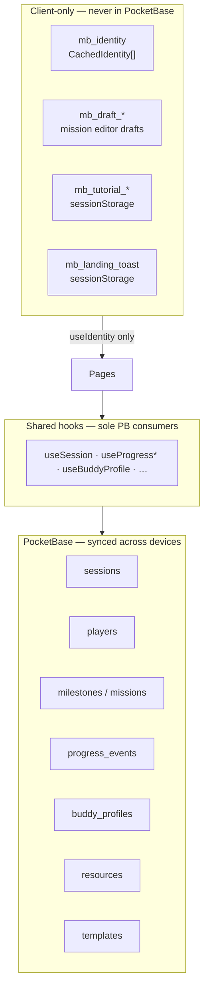
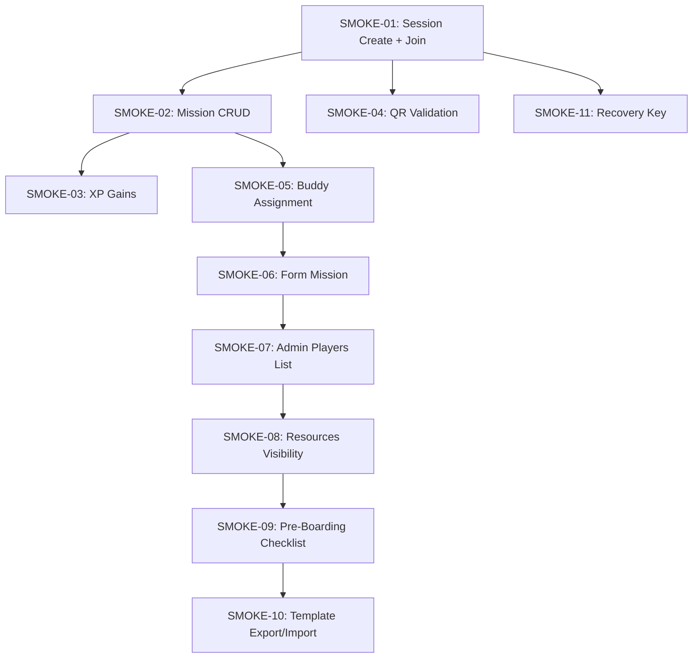
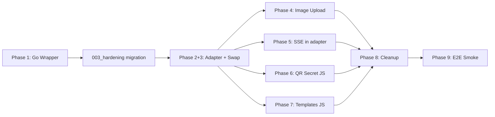

# PocketBase Full Integration — Implementation Strategy

> **Target outcome:** `docker compose up --build` delivers a MesseBuddy app where Game Maker and Player work across different devices — data survives browser restarts, QR codes carry real cryptographic secrets, images and templates persist, and the app graduates from a single-browser prototype to a tool you can hand to a real event organizer and real attendees. No manual UI setup, no admin panel clicking, no runtime scripts. Everything is automated in the Docker build.
>
> **Current reality (2026-06-18):** Docker infra (Go wrapper, migrations, nginx, supervisord) is **ready**. The PWA still hardcodes `mockAdapter` — `VITE_USE_MOCK_PB` is passed at build time but **not read in `src/`**. Multi-device persistence is **not live** until Phases 2 + 3 ship. Target schema (incl. `mapNodeScale`) documented in [`docs/pb-schema.md`](docs/pb-schema.md); migration `003_hardening.go` not yet implemented.
>
> **Last updated:** 2026-06-18 — amended for `mapNodeScale`, hook-layer boundaries, local vs synced data split, and target schema alignment.

---

## Table of Contents

1. [Architectural Overview](#architectural-overview)
2. [Implementation Principles](#implementation-principles)
3. [Data Boundary — Local vs PocketBase-Synced](#data-boundary--local-vs-pocketbase-synced)
4. [Hook Coverage Map (CRUD by Role)](#hook-coverage-map-crud-by-role)
5. [Implementation Status Summary](#implementation-status-summary)
6. [Phase 1: Go Wrapper + Migrations — ✅ IMPLEMENTED](#phase-1-go-wrapper--migrations--%E2%9C%85-implemented)
7. [Phase 2: PocketBase JS Adapter (Frontend) — ❌ PENDING](#phase-2-pocketbase-js-adapter-frontend)
8. [Phase 3: Provider Swap + Wiring — ❌ PENDING](#phase-3-provider-swap--wiring)
9. [Phase 4: Background Image Upload — ❌ PENDING](#phase-4-background-image-upload)
10. [Phase 5: SSE Real-Time Subscription — ❌ PENDING](#phase-5-sse-real-time-subscription)
11. [Phase 6: QR Session Secret — 🟡 PARTIALLY](#phase-6-qr-session-secret)
12. [Phase 7: Templates Collection — 🟡 PARTIALLY](#phase-7-templates-collection)
13. [Phase 8: Cleanup & Documentation — 🟡 PARTIALLY](#phase-8-cleanup--documentation)
14. [Phase 9: E2E Smoke Screen Testing](#phase-9-e2e-smoke-screen-testing)
15. [Acceptance Criteria — E2E Smoke Screen](#acceptance-criteria--e2e-smoke-screen)
16. [Execution Order](#execution-order)
17. [Quick Reference: All New/Modified Files](#quick-reference-all-newmodified-files)

---

## Architectural Overview

```
┌──────────────────────────────────────────────────────────────────┐
│  docker compose up --build                                       │
│                                                                  │
│  Build Stage:                                                    │
│  1. Deno builds React PWA (VITE_PB_URL=/api)                    │
│  2. Go compiles PB wrapper (embedded migrations)                 │
│                                                                  │
│  Runtime (supervisord manages both processes):                   │
│  3. nginx serves PWA on :80, proxies /api/* → PB :8090          │
│  4. pocketbase-server serve --http=0.0.0.0:8090                 │
│     ├── Auto-migrate on first run (creates all collections)     │
│     ├── OnRecordCreate("sessions") hook → generate qrSecret     │
│     └── All API rules public (C-03: no auth system)             │
│  5. PWA calls /api/* (same-origin, no CORS)                     │
└──────────────────────────────────────────────────────────────────┘
```

**Key design decisions:**

| Decision | Status | Rationale |
|---|---|---|
| **Go wrapper, not raw binary** | ✅ Done | PocketBase collections created programmatically via Go migration files in [`server/pb_migrations/`](server/pb_migrations/). |
| **Same-origin proxy via nginx** | ✅ Done | The PWA talks to `/api/*` (same origin), nginx reverse-proxies to `localhost:8090`. No CORS, no `VITE_PB_URL` build-time URL fragility. |
| **SDK at v0.27.0** | ✅ Done | [`deno.json`](deno.json:30) has `pocketbase@^0.27.0`. |
| **PB Server at v0.39.4** | ✅ Done | [`server/go.mod`](server/go.mod:5) requires `github.com/pocketbase/pocketbase v0.39.4`. |
| **No auth system** | ✅ Done | Per C-03, all collections use public API rules. The PWA manages identity via `mb_identity` localStorage UID. |
| **nginx + supervisord (two-process)** | ✅ Done | nginx serves PWA static files on `:80`, supervisord manages both nginx and pocketbase-server. Cleaner than single-binary approach — nginx handles SSE buffering/proxy correctly. |
| **Go 1.25** | ✅ Done | [`server/go.mod`](server/go.mod:3) requires Go 1.25, Dockerfile uses `golang:1.25-bookworm`. |

---

## Implementation Principles

This is a **UX-first prototyping task**: ship real multi-device persistence without changing what users see or how they interact. Structural flexibility comes from the existing adapter + shared-hook layer (C-18), not from rewriting pages or components.

| Principle | Rule |
|-----------|------|
| **No UI regression** | Pages and components under `src/pages/` and `src/components/` must not change behavior, layout, or interaction flows. PocketBase work lands in `src/adapters/pocketbase/`, [`AdapterContext.tsx`](src/adapters/AdapterContext.tsx), and at most one hook fix ([`useSession.uploadBackground`](src/hooks/useSession.ts:92)). |
| **Hook boundary (C-18)** | All synced CRUD flows through shared hooks and use-cases documented in [`docs/shared-data-access.md`](docs/shared-data-access.md). The PB adapter implements [`AppAdapter`](src/adapters/interface.ts:18) only — hooks keep their public API. |
| **Local stays local** | Identity, drafts, tutorial state, and ephemeral toasts never touch PocketBase. See [Data Boundary](#data-boundary--local-vs-pocketbase-synced). |
| **Feature map is authoritative** | GM CRUD: [`docs/admin-view-data.md`](docs/admin-view-data.md). Player reads/writes: [`docs/player-view-data.md`](docs/player-view-data.md). Implement exactly what those docs list — no speculative adapter methods. |
| **Schema follows domain types** | [`src/types/domain.ts`](src/types/domain.ts) is the contract. Migration 003 closes gaps between domain and PB (`mapNodeScale`, `bgImageUrl` FileField, C-05 index). |
| **Mock remains dev fallback** | `VITE_USE_MOCK_PB=true` keeps offline/single-browser prototyping. Docker production path uses `false` once Phase 3 ships. |

---

## Data Boundary — Local vs PocketBase-Synced



| Storage | Keys / types | Hooks / utils | PB? |
|---------|--------------|---------------|-----|
| `localStorage` | `mb_identity` → `CachedIdentity[]` | [`useIdentity`](src/hooks/useIdentity.ts), [`useActiveProfile`](src/hooks/useActiveProfile.ts) | **No** — UID, role, recovery key, session routing (C-03) |
| `localStorage` | `mb_draft_<sessionId>_<missionId>` → `StoredDraft` | [`draftStorage.ts`](src/utils/draftStorage.ts), [`useAdminMissionEditor`](src/hooks/useAdminMissionEditor.ts) | **No** — in-progress mission edits; explicit Save writes to PB |
| `sessionStorage` | `mb_tutorial_step`, `mb_tutorial_form_pending` | [`useTutorial`](src/hooks/useTutorial.ts) | **No** — tutorial UX only (`tutorialComplete` on Player **does** sync via `updatePlayer`) |
| `sessionStorage` | `mb_landing_toast` | [`useLandingFlow`](src/hooks/useLandingFlow.ts) | **No** — transient landing messages |
| PocketBase | 9 collections | All other hooks in [`docs/shared-data-access.md`](docs/shared-data-access.md) | **Yes** |

**Implication for Phase 2:** The adapter must satisfy every `AppAdapter` method invoked by hooks/use-cases in the view-data docs. It must **not** read or write `localStorage` / `sessionStorage` — that remains hook responsibility.

---

## Hook Coverage Map (CRUD by Role)

Canonical method lists live in the view-data docs. This table is the implementation checklist for `pbAdapter.ts`.

### Game Maker (admin) — [`docs/admin-view-data.md`](docs/admin-view-data.md) §7

| User-facing feature | Hook | Adapter methods |
|---------------------|------|-----------------|
| Session + map structure | `useSession` (gamemaker) | `getSession`, `listMilestones`, `listMissions`, `updateSession` |
| Map node scale (UX-012) | `useSession.updateMapNodeScale` | `updateSession({ mapNodeScale })` — requires `sessions.mapNodeScale` in PB |
| Background image | `useSession.uploadBackground` | `updateSession` with `File` (Phase 4) |
| Pre-boarding checklist | `usePreBoardingChecklist` | `updateSession({ preBoardingChecks })` |
| Milestone CRUD | `useAdminMilestoneEditor` | `createMilestone`, `updateMilestone`, `deleteMilestone` |
| Mission + form schema CRUD | `useAdminMissionEditor` | `createMission`, `updateMission`, `deleteMission`, `getFormSchema`, `upsertFormSchema` |
| Players + approvals | `useProgressAdmin` | `listPlayers`, `listProgressEvents`, `upsertProgressEvent` |
| Cross-hire dashboard | `useProgressCrossHire` | `listSessions`, `listPlayers`, `listProgressEvents` |
| Buddy assignment | `useBuddyProfile` (gamemaker) | `getBuddyProfile`, `upsertBuddyProfile` |
| Resources | `useResources` (gamemaker) | `listResources`, `createResource`, `updateResource`, `deleteResource` |
| Templates | `useTemplateLibrary` | `listTemplates`, `saveTemplate` (upsert by name), `deleteTemplate` |
| QR scan + confirm | `useValidationConfirm`, `useQRScanContext` | `getSession`, `getPlayerById`, `listProgressEvents`, `upsertProgressEvent` |

### Player — [`docs/player-view-data.md`](docs/player-view-data.md) §6

| User-facing feature | Hook / use-case | Adapter methods |
|---------------------|-----------------|-----------------|
| Join / recover | `joinSession`, `recoverIdentity` | `getSession`, `createPlayer`, `createSession`, `getPlayerByRecoveryKey` |
| Cockpit reads | `useSession`, `useResolvedPlayer`, `useProgressPlayer`, `useBuddyProfile`, `useResources` | `getSession`, `getPlayer`, `listMilestones`, `listMissions`, `listProgressEvents`, `getBuddyProfile`, `listResources` |
| Mission completion | `useProgressPlayer` | `upsertProgressEvent` |
| Validation wait (QR / gmApprove) | `useWatchMission` → `subscribeProgressEvent` | SSE in adapter (C-20 — opaque to components) |
| Form submit | `useFormMission` | `getFormSchema`, `upsertProgressEvent`, `updatePlayer` |
| Tutorial skip | `useTutorial` | `updatePlayer` |

---

## End-Value Deliverables — What Users Will Actually Get

> **The core behavioral shift:** The current mock adapter is a **single-browser demo** — server-side data (sessions, players, missions, progress, buddies, templates) lives in JavaScript memory and is lost on refresh. Both Game Maker and Player must use the same browser tab to share that memory. PocketBase integration makes it a **two-role, multi-device application** with real persistence, real concurrency, and real cryptographic security.
>
> **Note:** `mb_identity` (UID, role, sessionId, recovery key) **already persists** in `localStorage` via [`useIdentity`](src/hooks/useIdentity.ts). What mock loses on reload is everything the adapter stores — not the client identity blob itself.

### Per-Role Value

#### 🎮 Game Maker

| Value | Mock Today | PB Target |
|-------|-----------|-----------|
| **Data survives browser restarts** | ❌ All data in JS memory — refresh = gone | ✅ All data in SQLite via Docker volumes |
| **Multi-device sessions** | ❌ GM and Player must use same browser | ✅ GM on laptop, Player on phone — any device, any browser |
| **QR codes with real secrets** | ⚠️ Mock uses `record.id` (session id) as HMAC secret — guessable | ✅ 64-char hex `qrSecret` generated server-side by Go hook |
| **Background image upload** | ❌ `URL.createObjectURL` — preview disappears on reload | ✅ `FormData` upload via `pb.collection.update()` with File |
| **Template library** | ⚠️ Mock memory — lost on refresh | ✅ Persisted in `templates` collection |

#### 👤 Player

| Value | Mock Today | PB Target |
|-------|-----------|-----------|
| **Cross-session identity & progress** | ⚠️ `mb_identity` in `localStorage` survives reload; player records + progress do not | ✅ Full player profile + progress in `players` + `progress_events` collections |
| **Real-time validation feedback (QR)** | ⚠️ Mock auto-completes via in-memory subscription | ✅ `QRDisplay` SSE detects GM confirm write — no manual refresh on player side |
| **Real-time validation feedback (gmApprove)** | ⚠️ 4s `setTimeout` mock auto-approval | ✅ `ValidationDisplay` SSE (or polling per OD-09) detects GM approval write |
| **XP that accumulates persistently** | ⚠️ Mock data — gone on reload | ✅ `upsertProgressEvent` writes to real DB; `deriveXP` reads real history |
| **Buddy assignment persists** | ❌ Gone on reload | ✅ `buddy_profiles` collection — assign once, visible forever |
| **Form responses saved** | ⚠️ Mock memory — lost on reload | ✅ Responses stored in `progress_events.formResponse` (DB persistence). **GM review UI not built yet** — separate backlog item |

### What Stays the Same

The adapter pattern (C-03) plus shared hooks (C-18) guarantee **no UI regression** at the component level. Buttons, forms, maps, QR display, milestone editors, draft auto-save, and tutorial overlays stay identical. The swap from mock to PB is invisible for all user flows — only persistence, multi-device correctness, and cryptographic QR security change.

**Allowed code changes outside the adapter module:**

| Change | File | Why |
|--------|------|-----|
| Provider swap | [`AdapterContext.tsx`](src/adapters/AdapterContext.tsx), [`AdapterContextValue.ts`](src/adapters/AdapterContextValue.ts) | Wire `VITE_USE_MOCK_PB` |
| Background upload persistence | [`useSession.uploadBackground`](src/hooks/useSession.ts:92) | Replace `URL.createObjectURL` with `File` → adapter; keep `displayUrl` return shape for [`AdminCockpitPage`](src/pages/AdminCockpitPage.tsx) |
| Env types | [`vite-env.d.ts`](src/vite-env.d.ts) | `VITE_USE_MOCK_PB`, optional `pbUrl` on runtime config |
| Stale comments | [`interface.ts`](src/adapters/interface.ts), [`AGENTS.md`](AGENTS.md) | SSE attribution via `useWatchMission` |

**Explicitly out of scope:** GM form-response review UI, `FullSessionExport` backup UI, new pages/components, layout changes.

### Before/After — The Scenario That Only Works with PocketBase

```
Mock Adapter (today):          PocketBase Integration (target):
┌──────────┐                   ┌──────────────┐        ┌──────────────┐
│ SAME     │                   │ Game Maker   │        │ Player       │
│ BROWSER  │                   │ (laptop)     │        │ (phone)      │
│ TAB      │                   │              │        │              │
│         │                   │ Creates session────────► Joins        │
│ GM ──── Player              │ Creates mission───────► Sees mission  │
│         │                   │ Scans QR ◄──────────── Shows QR       │
│ (shared  │                   │ SSE update ──────────► Status flips  │
│  memory) │                   │              │        │              │
└──────────┘                   └──────────────┘        └──────────────┘
                                      │                       │
                                      └─── SQLite (Docker) ───┘
                                           All data persists
```

This is the difference between a clickable prototype and a tool you can hand to a real event organizer with real attendees.

---

## Implementation Status Summary

```
Phase 1: ██████████ 100%  (Go wrapper + migrations done)
Phase 2: ░░░░░░░░░░   0%  (entire JS adapter module missing — critical path)
Phase 3: ░░░░░░░░░░   0%  (no provider swap — blocked by Phase 2)
Phase 4: ░░░░░░░░░░   0%  (no File/FormData upload path — blocked by Phase 3)
Phase 5: ░░░░░░░░░░   0%  (no PB SSE subscription — blocked by Phase 3)
Phase 6: ████████░░  85%  (Go hook + all consumers ready; only JS adapter missing)
Phase 7: ██████░░░░  60%  (migration + schema + mock done; PB adapter methods missing)
Phase 8: ██████░░░░  60%  (pb-schema + shared-data-access target docs done; provider swap + .env.example + AGENTS.md SSE note pending)
Phase 9: ░░░░░░░░░░   0%  (extend scripts/smoke-landing.ts → full E2E against Docker)
```

**The critical gap is Phase 2 + Phase 3 together** — `src/adapters/pocketbase/` does not exist and [`AdapterContext.tsx`](src/adapters/AdapterContext.tsx) hardcodes `mockAdapter`. Importing `pbAdapter` without the provider swap breaks the build; shipping the swap without the adapter breaks runtime. Treat as **one PR**.

> ⚠️ **Docker mismatch:** `docker-compose.yml` defaults `VITE_USE_MOCK_PB` to `"false"`, but the bundle still uses mock data until Phase 3. Document this in README until fixed, or temporarily default Docker to `"true"`.

---

## Phase 1: Go Wrapper + Migrations — ✅ IMPLEMENTED

### 1a. Go module wrapper — done

[`server/main.go`](server/main.go) — compiles a custom PocketBase binary that:
- Embeds the `pb_migrations/` directory for auto-migration
- Registers `migratecmd` with `PB_AUTO_MIGRATE` env-var control
- Hooks `OnRecordCreate("sessions")` to auto-generate a random 64-char hex `qrSecret`

```go
// server/main.go (actual implementation)
package main

import (
    "crypto/rand"
    "embed"
    "encoding/hex"
    "log"
    "os"

    "github.com/pocketbase/pocketbase"
    "github.com/pocketbase/pocketbase/core"
    "github.com/pocketbase/pocketbase/plugins/migratecmd"

    _ "messe-buddy-pb/pb_migrations"
)

//go:embed pb_migrations
var migrationsDir embed.FS

func main() {
    app := pocketbase.New()

    migratecmd.MustRegister(app, app.RootCmd, migratecmd.Config{
        Dir:         "pb_migrations",
        Automigrate: os.Getenv("PB_AUTO_MIGRATE") != "false",
    })

    // qrSecret generation hook — fires after each session create.
    app.OnRecordCreate("sessions").BindFunc(func(e *core.RecordEvent) error {
        if e.Record.GetString("qrSecret") == "" {
            b := make([]byte, 32)
            if _, err := rand.Read(b); err != nil {
                return err
            }
            e.Record.Set("qrSecret", hex.EncodeToString(b))
        }
        return e.Next()
    })

    if err := app.Start(); err != nil {
        log.Fatal(err)
    }
}
```

Go module: [`server/go.mod`](server/go.mod) — module `messe-buddy-pb`, requires Go 1.25 + PB v0.39.4.

### 1b. Migration files — done

| File | Collections |
|------|-------------|
| [`server/pb_migrations/001_initial_collections.go`](server/pb_migrations/001_initial_collections.go) | sessions, players, milestones, missions, form_schemas, progress_events, buddy_profiles, resources |
| [`server/pb_migrations/002_templates.go`](server/pb_migrations/002_templates.go) | templates |

All collections use public API rules (`setPublicRules` helper sets all rules to `nil` per C-03). Key indexes: `idx_uid` (players), `idx_recoveryKey` (players), `idx_missionId` (form_schemas), `idx_assignedToPlayerId` (buddy_profiles), `idx_name` (templates).

### 1c. Dockerfile — done

[`Dockerfile`](Dockerfile) — multi-stage build:
1. **Deno stage** (`denoland/deno:2.8.1`) — `deno task build` with `VITE_PB_URL=/api`
2. **Go stage** (`golang:1.25-bookworm`) — `go mod tidy && CGO_ENABLED=0 go build` of [`server/`](server/)
3. **Runtime stage** (`debian:bookworm-slim`) — nginx + supervisord + pocketbase-server binary

### 1d. Docker runtime config — done

- [`docker/nginx.conf`](docker/nginx.conf) — proxies `/api/*` and `/_/*` to PocketBase on `:8090`, includes SSE headers (`proxy_buffering off`, `chunked_transfer_encoding on`, `proxy_read_timeout 300s`)
- [`docker/supervisord.conf`](docker/supervisord.conf) — manages nginx (priority 10) + pocketbase-server (priority 20)
- [`docker/entrypoint.sh`](docker/entrypoint.sh) — waits for virtual key, renders nginx template, writes `config.js`, starts supervisord

### 1e. Build-time env vars in docker-compose.yml — done

[`docker-compose.yml`](docker-compose.yml) app service passes:
- `VITE_PB_URL: /api` — same-origin proxy
- `VITE_USE_MOCK_PB: ${VITE_USE_MOCK_PB:-false}` — defaults to `"false"` (intended production mode; **inert until Phase 3** wires it in `src/`)
- `PB_AUTO_MIGRATE: "true"` — auto-create schema on first run

### 1f. Pending hardening (new migration `003_hardening.go`)

Do **not** edit `001_initial_collections.go` on deployed instances — add a forward migration:

- [ ] Add `sessions.mapNodeScale` (`NumberField`, default `0.33` on create — matches mock and [`Session`](src/types/domain.ts:30); shared by admin editor + player map per UX-012):

```go
sessions.Fields.Add(
    &core.NumberField{Name: "mapNodeScale"},
)
// Adapter createSession sets mapNodeScale: 0.33 when absent
```

- [ ] Composite unique index on `progress_events(playerId, missionId)` — DB-level safety net for C-05:

```go
progressEvents.AddIndex(
    "idx_player_mission", true, "playerId, missionId", "",
)
```

- [ ] Change `sessions.bgImageUrl` from `TextField` → `FileField` (required for Phase 4 upload). Existing text values on upgraded instances are discarded (greenfield Docker deploys are unaffected). See Phase 4.

Ship this migration **before or with** the JS adapter (Phase 2), so `upsertProgressEvent` upserts are race-safe from day one and `mapNodeScale` persists across devices.

Target schema documented in [`docs/pb-schema.md`](docs/pb-schema.md) (post-003 section).

---

## Phase 2: PocketBase JS Adapter (Frontend) — ❌ PENDING

> **Scope:** Implement all **32 methods** of [`AppAdapter`](src/adapters/interface.ts:18). Phase 2 and Phase 3 must land in the **same PR** — `pbAdapter` import requires the provider swap.
>
> **UX constraint:** Match mock adapter semantics exactly — same return shapes, same error surfaces, same optimistic-update compatibility hooks rely on. Use [`mockAdapter.ts`](src/adapters/mock/mockAdapter.ts) as the behavioral reference, not just the interface.

### 2a. Extend [`src/vite-env.d.ts`](src/vite-env.d.ts) (not a new `globals.d.ts`)

[`vite-env.d.ts`](src/vite-env.d.ts) already declares `Window.__MB_CONFIG__` via `MesseBuddyRuntimeConfig`. Extend it:

```typescript
interface ImportMetaEnv {
  readonly VITE_PB_URL?: string;
  readonly VITE_USE_MOCK_PB?: string; // add — used by Phase 3 provider swap
  // …existing LLM keys…
}

interface MesseBuddyRuntimeConfig {
  readonly llmBaseUrl?: string;
  readonly llmKey?: string;
  readonly llmModel?: string;
  readonly useMockChat?: boolean;
  readonly systemPrompt?: string;
  readonly pbUrl?: string; // add — runtime override; Docker defaults to /api via VITE_PB_URL
}
```

[`entrypoint.sh`](docker/entrypoint.sh) intentionally omits `pbUrl` from `config.js` (adapter falls back to `import.meta.env.VITE_PB_URL ?? "/api"`).

### 2b. Create `src/adapters/pocketbase/parsers.ts`

Marshalling layer that converts PocketBase raw records to typed app-layer interfaces (C-13). **All `JSON.parse` / file-URL resolution for PB fields lives in this file** — components and use cases never parse PB JSON (C-13 invariant).

**JSONField normalization:** PB v0.39 `JSONField` values may arrive from the SDK as **already-parsed objects** or as strings depending on context. Use a shared helper that accepts both:

```typescript
const parseJsonField = <T>(value: unknown, fallback: T): T => {
  if (value === null || value === undefined) return fallback;
  if (typeof value === "string") {
    try { return JSON.parse(value) as T; } catch { return fallback; }
  }
  return value as T;
};
```

Apply `parseJsonField` to all JSON-backed fields per [`docs/pb-schema.md`](docs/pb-schema.md):

| Collection | Field | App type |
|-----------|-------|----------|
| `form_schemas` | `fields` | `FieldSchema[]` |
| `progress_events` | `formResponse` | `Record<string, string>` |
| `missions` | `tags` | `MissionTag[]` |
| `players` | `skillsConfident`, `skillsDevelop`, `languages`, `energizers`, `drainers` | `string[]` |
| `sessions` | `preBoardingChecks` | `PreBoardingCheckItem[]` |
| `templates` | `data` | `TemplateExport` |

**File URL resolution:** Collections with `FileField` (`players.avatarUrl`, `buddy_profiles.avatarUrl`, `sessions.bgImageUrl` after migration 003) store filenames, not browser-ready URLs. Add:

```typescript
export const resolveFileUrl = (
  pb: PocketBase,
  collection: string,
  recordId: string,
  filename: string | undefined,
): string | undefined =>
  filename
    ? pb.files.getURL({ collectionIdOrName: collection, recordId, filename })
    : undefined;
```

Call from `marshalPlayer`, `marshalBuddyProfile`, and `marshalSession` so `` works without component changes.

**Sketch — session marshal (includes JSON + file URL):**

```typescript
export const marshalSession = (
  pb: PocketBase,
  raw: Record<string, unknown>,
): Session => ({
  id: raw.id as string,
  created: raw.created as string,
  updated: raw.updated as string,
  name: raw.name as string,
  bgImageUrl: resolveFileUrl(pb, "sessions", raw.id as string, raw.bgImageUrl as string) ?? "",
  mapNodeScale: (raw.mapNodeScale as number | undefined) ?? 0.33,
  gameMakerId: raw.gameMakerId as string,
  qrSecret: raw.qrSecret as string | undefined,
  preBoardingChecks: parseJsonField(raw.preBoardingChecks, []),
});
```

Implement the remaining marshals (`marshalPlayer`, `marshalMission`, `marshalFormSchema`, `marshalProgressEvent`, etc.) following the same patterns. Keep `unmarshal*` helpers for writes (`JSON.stringify` where the SDK expects a string payload).

### 2c. Create `src/adapters/pocketbase/pbAdapter.ts`

Implement all **32 methods** of [`AppAdapter`](src/adapters/interface.ts:18). Key implementation notes:

**Cancellation:** [`AppAdapter`](src/adapters/interface.ts) does not expose `AbortSignal`. Use PB SDK `$cancelKey` internally for in-flight request dedup, or defer signal support to a follow-up interface change. Do not block Phase 2 on extending the interface.

**`upsertProgressEvent` — sessionId derivation + C-05 safety:**
The method signature does not accept `sessionId`. Derive it from the player record. Prefer a single upsert keyed by `(playerId, missionId)` once migration 003 unique index exists; handle create/update race with a retry on unique constraint violation:

```typescript
const upsertProgressEvent = async (
  playerId: string,
  missionId: string,
  patch: Partial<...>,
): Promise<ProgressEvent> => {
  const filter = `playerId = "${playerId}" && missionId = "${missionId}"`;
  const existing = await pb.collection("progress_events")
    .getFullList({ filter });

  const data = {
    ...patch,
    formResponse: patch.formResponse
      ? JSON.stringify(patch.formResponse)
      : undefined,
  };

  if (existing.length > 0) {
    const record = await pb.collection("progress_events")
      .update(existing[0].id, data);
    return marshalProgressEvent(record);
  } else {
    const player = await getPlayerById(playerId);
    if (!player) throw new Error("Player not found");
    const record = await pb.collection("progress_events")
      .create({ playerId, missionId, sessionId: player.sessionId, ...data });
    return marshalProgressEvent(record);
  }
};
```

**`createSession` — defaults + qrSecret round-trip:**

Mirror mock defaults so GM/player maps render identically on first load:

```typescript
const createSession = async (name: string, gameMakerUid: string): Promise<Session> => {
  const record = await pb.collection("sessions").create({
    name,
    gameMakerId: gameMakerUid,
    bgImageUrl: "",
    mapNodeScale: 0.33,
    preBoardingChecks: [],
  });
  // Go hook sets qrSecret on create — verify response includes it (SMOKE-04)
  const withSecret = record.qrSecret
    ? record
    : await pb.collection("sessions").getOne(record.id);
  return marshalSession(pb, withSecret);
};
```

**`saveTemplate` — upsert by name:**

`templates.idx_name` is unique. Match mock overwrite semantics:

```typescript
const saveTemplate = async (template: TemplateExport): Promise<void> => {
  const filter = `name = "${template.name}"`;
  const existing = await pb.collection("templates").getFullList({ filter });
  const payload = { name: template.name, data: template };
  if (existing.length > 0) {
    await pb.collection("templates").update(existing[0].id, payload);
  } else {
    await pb.collection("templates").create(payload);
  }
};
```

**`deleteTemplate` — resolve by name:**

The [`AppAdapter`](src/adapters/interface.ts:105) signature is `deleteTemplate(name: string): Promise<void>`.

**`subscribeProgressEvent` — SSE subscription (Phase 5):**

Consumed only via [`useWatchMission`](src/hooks/useProgress/watchMission.ts) (C-20). [`QRDisplay`](src/components/player/QRDisplay.tsx) and [`ValidationDisplay`](src/components/player/ValidationDisplay.tsx) delegate to the hook — no component changes.

```typescript
subscribeProgressEvent: (
  playerId: string,
  missionId: string,
  callback: (event: ProgressEvent) => void,
): () => void => {
  const filter = `playerId = "${playerId}" && missionId = "${missionId}"`;

  const unsub = pb.collection("progress_events").subscribe("*", (e) => {
    const record = e.record as unknown as ProgressEventRaw;
    if (record.playerId === playerId && record.missionId === missionId) {
      callback(marshalProgressEvent(record));
    }
  }, { filter });

  return unsub;
};
```

**`updateSession` — File upload (Phase 4, after migration 003):**

```typescript
const updateSession = async (
  sessionId: string,
  patch: Partial<Omit<Session, keyof PBRecord>> & { bgImageUrl?: string | File },
): Promise<Session> => {
  const formData = new FormData();
  for (const [key, value] of Object.entries(patch)) {
    if (value instanceof File) {
      formData.append(key, value);
    } else if (value !== undefined) {
      formData.append(key, String(value));
    }
  }
  const record = await pb.collection("sessions").update(sessionId, formData);
  return marshalSession(pb, record);
};
```

**`deleteTemplate` — resolve by name:**
The [`AppAdapter`](src/adapters/interface.ts:105) signature is `deleteTemplate(name: string): Promise<void>`. Implementation:

```typescript
const deleteTemplate = async (name: string): Promise<void> => {
  const records = await pb.collection("templates")
    .getFullList({ filter: `name = "${name}"` });
  if (records.length > 0) {
    await pb.collection("templates").delete(records[0].id);
  }
};
```

### 2d. Create `src/adapters/pocketbase/mod.ts`

```typescript
// src/adapters/pocketbase/mod.ts
import PocketBase from "pocketbase";
import { createPBAdapter } from "./pbAdapter.ts";

const PB_URL = (() => {
  // In Docker: same-origin /api proxy
  // In dev: direct to localhost:8090, overridable via __MB_CONFIG__
  if (typeof window !== "undefined" && window.__MB_CONFIG__?.pbUrl) {
    return window.__MB_CONFIG__.pbUrl;
  }
  return import.meta.env.VITE_PB_URL ?? "/api";
})();

export const pb = new PocketBase(PB_URL);
export const pbAdapter = createPBAdapter(pb);
```

---

## Phase 3: Provider Swap + Wiring — ❌ PENDING

> Ship in the **same PR as Phase 2**. Until this lands, `VITE_USE_MOCK_PB` in Docker is inert — [`AdapterContext.tsx`](src/adapters/AdapterContext.tsx) hardcodes `mockAdapter`.

### 3a. [`src/adapters/AdapterContext.tsx`](src/adapters/AdapterContext.tsx:3) — conditional swap

Keep the mock adapter as a dev fallback controlled by `VITE_USE_MOCK_PB`:

```typescript
import type { ReactNode } from "react";
import type { AppAdapter } from "./interface.ts";
import { mockAdapter } from "./mock/index.ts";
import { pbAdapter } from "./pocketbase/mod.ts";
import { AdapterContext } from "./AdapterContextValue.ts";

interface AdapterContextProviderProps {
  readonly adapter?: AppAdapter;
  readonly children: ReactNode;
}

const USE_MOCK_PB = import.meta.env.VITE_USE_MOCK_PB === "true";

export const AdapterContextProvider = ({
  adapter = USE_MOCK_PB ? mockAdapter : pbAdapter,
  children,
}: AdapterContextProviderProps) => {
  return (
    <AdapterContext.Provider value={adapter}>
      {children}
    </AdapterContext.Provider>
  );
};
```

### 3b. [`src/adapters/AdapterContextValue.ts`](src/adapters/AdapterContextValue.ts:3) — default context value

```typescript
import { createContext } from "react";
import type { AppAdapter } from "./interface.ts";
import { mockAdapter } from "./mock/index.ts";
import { pbAdapter } from "./pocketbase/mod.ts";

const USE_MOCK_PB = import.meta.env.VITE_USE_MOCK_PB === "true";

export const AdapterContext = createContext<AppAdapter>(
  USE_MOCK_PB ? mockAdapter : pbAdapter,
);
```

---

## Phase 4: Background Image Upload — ❌ PENDING

### Schema prerequisite (migration 003)

`001_initial_collections.go` defines `sessions.bgImageUrl` as **`TextField`**. File upload via `FormData` requires **`FileField`** — add in `003_hardening.go` (see Phase 1f). [`docs/pb-schema.md`](docs/pb-schema.md) documents the target type.

### Hook change (not a page change)

Upload is orchestrated by [`useSession.uploadBackground`](src/hooks/useSession.ts:92) (gamemaker overload). [`AdminCockpitPage`](src/pages/AdminCockpitPage.tsx) only calls `uploadBackground(file)` and sets `bgImageUrlOverride` from `{ displayUrl }` — **that page stays unchanged**.

1. `updateSession` in PB adapter handles `File` via `FormData` (Phase 2c) after schema migration
2. `marshalSession` resolves file URL via `pb.files.getURL` (Phase 2b)
3. Update **`useSession.uploadBackground`** to pass the raw `File` to the adapter and return the persisted URL:

```typescript
const uploadBackground = useCallback(
  async (file: File) => {
    const updated = await adapter.updateSession(sessionId, { bgImageUrl: file });
    return { displayUrl: updated.bgImageUrl };
  },
  [adapter, sessionId],
);
```

Widen the adapter `updateSession` patch type with `{ bgImageUrl?: string | File }` at the adapter boundary only — avoid `as unknown as string` in hooks.

**UX check:** Background preview must still update immediately after upload; reload must show the same image (SMOKE-02 map tab manual check or dedicated assertion).

---

## Phase 5: SSE Real-Time Subscription — ❌ PENDING

Implementation is in `subscribeProgressEvent` inside `pbAdapter.ts` (see Phase 2c). Per C-20, components consume [`useWatchMission`](src/hooks/useProgress/watchMission.ts) — **zero component changes**.

| Consumer | When it subscribes | Purpose |
|----------|-------------------|---------|
| [`QRDisplay`](src/components/player/QRDisplay.tsx) via `useWatchMission` | QR missions (`validationMethod === "qr"`) | Player sees completion after GM confirms on [`ValidationPage`](src/pages/ValidationPage.tsx) |
| [`ValidationDisplay`](src/components/player/ValidationDisplay.tsx) via `useWatchMission` | `validationMethod === "gmApprove"` only | Player sees GM approval (mock: 4s auto-fire; PB: real SSE) |

**GM QR scan path holds no SSE** — offline HMAC verify on `ValidationPage` → GM confirm → `upsertProgressEvent` write (C-07). nginx is already configured for SSE ([`docker/nginx.conf`](docker/nginx.conf)).

---

## Phase 6: QR Session Secret — 🟡 PARTIALLY

### What's done

| Component | Status |
|-----------|--------|
| `qrSecret` field in `sessions` collection | ✅ [`001_initial_collections.go:17`](server/pb_migrations/001_initial_collections.go:17) |
| Go hook auto-generates 64-char hex on session create | ✅ [`main.go:34-43`](server/main.go:34-43) |
| [`Session` interface](src/types/domain.ts:23) has `qrSecret?: string` | ✅ |
| [`qrPayload.ts`](src/utils/qrPayload.ts) accepts `secret` parameter from caller | ✅ |
| All QR consumers use `session.qrSecret ?? sessionId` fallback | ✅ (adapter-ready) |

### What's remaining

| Task | Detail |
|------|--------|
| PB adapter methods | `createSession`, `getSession` must return `qrSecret` from the server response |
| Verify round-trip | Create session → Go hook sets `qrSecret` → PB SDK response includes it → JS adapter marshals it |
| `QRDisplay` + `AdminQRScannerModal` | Already pass `session.qrSecret ?? sessionId` — no change needed once adapter provides it |

**Note:** The plan previously described a separate migration `002_qr_secret_default.go`. The actual implementation uses a Go hook which is better — generates fresh random secrets server-side rather than static migration defaults.

---

## Phase 7: Templates Collection — 🟡 PARTIALLY

### What's done

| Component | Status |
|-----------|--------|
| Migration [`002_templates.go`](server/pb_migrations/002_templates.go) | ✅ |
| `docs/pb-schema.md` documents the templates collection | ✅ |
| Mock adapter has `listTemplates`, `saveTemplate`, `deleteTemplate` | ✅ |
| [`AppAdapter`](src/adapters/interface.ts:103-105) defines the interface | ✅ |

### What's remaining

PB adapter methods for templates — see Phase 2c (`listTemplates`, `saveTemplate` upsert-by-name, `deleteTemplate` with name-to-ID resolution). Template import/export UX in [`useTemplateLibrary`](src/hooks/useTemplateLibrary.ts) stays unchanged.

---

## Phase 8: Cleanup & Documentation — 🟡 PARTIALLY

### 8a. Done

| Item | File |
|------|------|
| PB schema reference (target post-003) | [`docs/pb-schema.md`](docs/pb-schema.md) — collections, indexes, C-13 table, local-only exclusion |
| Shared data access map | [`docs/shared-data-access.md`](docs/shared-data-access.md) — hook registry, local vs synced, CRUD checklist |
| Docker build args | [`docker-compose.yml`](docker-compose.yml) passes `VITE_USE_MOCK_PB: "false"` (default), `VITE_PB_URL: /api`, `PB_AUTO_MIGRATE: true` |

### 8b. Remaining

- [ ] **Provider swap** — wire `VITE_USE_MOCK_PB` in [`AdapterContext.tsx`](src/adapters/AdapterContext.tsx) + [`AdapterContextValue.ts`](src/adapters/AdapterContextValue.ts) (Phase 3 — **not done**)
- [x] Add `VITE_PB_URL` to [`.env.example`](.env.example) (`VITE_USE_MOCK_PB` was already present)
- [x] Target schema in [`docs/pb-schema.md`](docs/pb-schema.md) — includes `mapNodeScale`, FileField `bgImageUrl`, `idx_player_mission`
- [x] [`docs/shared-data-access.md`](docs/shared-data-access.md) — local vs synced boundary + PB hook map
- [ ] Update [`AGENTS.md`](AGENTS.md) + [`interface.ts`](src/adapters/interface.ts) SSE note — subscriptions via `useWatchMission`
- [ ] Implement migration `003_hardening.go` (schema doc is target state until this ships)

### 8c. Local dev without Docker

```sh
# Terminal 1 — PocketBase (from compiled server binary or docker compose app service :8090)
# Terminal 2
VITE_USE_MOCK_PB=false VITE_PB_URL=http://localhost:8090 deno task dev
```

Mock path unchanged: `VITE_USE_MOCK_PB=true deno task dev` (no PB required).

---

## Phase 9: E2E Smoke Screen Testing

After Phases 2–8 are complete, validate the full stack via Playwright MCP smoke tests. Extend the existing [`scripts/smoke-landing.ts`](scripts/smoke-landing.ts) (landing UI only, defaults to `http://localhost:5173`) into a full Docker E2E script. All integration smoke tests run against `docker compose up --build` with `SMOKE_BASE_URL=https://localhost` (or LAN IP).

### 9a. SMOKE-01: Session Creation & Player Join

**Steps:**
1. Game Maker opens `/` → selects "Admin" role → creates session "E2E Smoke Test"
2. Game Maker enters display name (name capture modal) → recovery key shown → dismisses
3. Verifies admin cockpit loads with empty milestone map
4. Game Maker copies session invite link from [`SessionInviteCard`](src/components/admin/SessionInviteCard.tsx)
5. **Second browser context:** Player opens invite link (`/join/:sessionId`) → session code pre-filled → joins as Player
6. Player enters name → recovery key shown → player cockpit loads

**Expected:** Both Game Maker and Player see the session. Player appears in Game Maker's player list. Data survives page reload in both contexts.

### 9b. SMOKE-02: Mission & Milestone CRUD (Admin → Player Visibility)

**Steps:**
1. Game Maker creates a milestone at position (50, 50) named "Orientation"
2. Game Maker creates a mission under "Orientation" — type `text`, difficulty 1, title "Read Welcome Guide", validationMethod `selfApprove`
3. Player refreshes — sees the milestone and mission on the map/dashboard
4. Game Maker edits the mission — changes title to "Read Onboarding Guide"
5. Player refreshes — sees updated title
6. Game Maker deletes the mission → Player refreshes → mission gone

**Expected:** CRUD operations propagate Game Maker → Player with a page refresh (SSE not required for smoke).

### 9c. SMOKE-03: XP Point Gains

**Steps:**
1. Player completes "Read Onboarding Guide" — taps "I Did This" button
2. Player dashboard shows XP bar updated
3. XP value matches `deriveXP()` output for difficulty 1
4. Player completes another mission of difficulty 5
5. XP bar updates accordingly (higher XP for higher difficulty)

**Expected:** XP accumulation follows `deriveXP.ts` algorithm (C-04): linear 1:1 difficulty weighting, rounding remainder to highest-difficulty missions first.

### 9d. SMOKE-04: QR Code Validation Flow

**Steps:**
1. Game Maker creates a mission with `validationMethod: "qr"`
2. Player opens the mission → taps "Generate QR Code"
3. QR code displays on player's screen
4. Game Maker navigates to `/admin/:sessionId/scan` → scans the QR code → lands on [`ValidationPage`](src/pages/ValidationPage.tsx)
5. Game Maker confirms validation
6. Player's mission status updates to `completed` via `QRDisplay` SSE (no manual refresh)
7. XP is awarded

**Expected:** Full QR → HMAC verify (offline on ValidationPage) → GM confirm → `upsertProgressEvent` write → player SSE callback → XP award. HMAC secret must be the server-generated `qrSecret`, not the `sessionId` fallback.

### 9e. SMOKE-05: Buddy Assignment

**Steps:**
1. Game Maker opens player detail → assigns a buddy (creates BuddyProfile)
2. Buddy card appears on Player's dashboard with name, role, tenure, quote
3. Game Maker edits buddy — changes quote
4. Player refreshes → sees updated quote

**Expected:** Buddy assignment propagates from Game Maker to Player dashboard.

### 9f. SMOKE-06: Form Mission (autoApproved)

**Steps:**
1. Game Maker creates a mission with `type: "form"` and a form schema (text + select fields)
2. Player opens the form → fills in answers → submits
3. Form response saved to `progress_events.formResponse`, mission `autoApproved` (C-06)
4. XP awarded immediately (no GM approval needed)
5. Reload player cockpit — mission stays completed; XP persists

**Expected:** Form missions self-complete. `ValidationDisplay` never mounts (C-06). **Out of scope for this phase:** GM admin UI to read form responses (no component exists yet — track as backlog).

### 9g. SMOKE-07: Admin Players List (Cross-Hire Context)

**Steps:**
1. Multiple players join the session with different roles, teams, locations
2. Game Maker opens the Players tab in admin cockpit
3. All players are listed with their profile info (name, role, team, start date)
4. Game Maker searches/filters players
5. Player profile cards show skills, languages, work style

**Expected:** Player data from `players` collection renders correctly in admin views.

### 9h. SMOKE-08: Resources Visibility

**Steps:**
1. Game Maker creates a resource (guide type, URL, description) with `isVisibleToPlayer: true`
2. Player sees the resource in the Resources section
3. Game Maker toggles `isVisibleToPlayer: false`
4. Player refreshes → resource disappears
5. Game Maker deletes the resource

**Expected:** Resource visibility toggle works; deleted resources don't appear.

### 9i. SMOKE-09: Pre-Boarding Checklist

**Steps:**
1. Game Maker adds pre-boarding checklist items (JSON array) via session edit
2. Items persist across reloads
3. Items render in admin cockpit pre-boarding section

**Expected:** `preBoardingChecks` JSON field round-trips correctly.

### 9j. SMOKE-10: Template Export/Import

**Steps:**
1. Game Maker sets up a session with milestones, missions, and form schemas
2. Game Maker exports session as template (saves to `templates` collection)
3. Game Maker creates a new session using the saved template
4. New session has the same milestones, missions, and form schemas as the original
5. Template list shows the saved template; can be deleted

**Expected:** Template round-trip: export → save to PB → import → same structure. FK relationships (`milestoneId`, `missionId`) remapped via `_milestoneOrder`/`_missionOrder` keys (see [`exportTemplate.ts`](src/use-cases/exportTemplate.ts:27) and [`importTemplate.ts`](src/use-cases/importTemplate.ts:23)).

### 9k. SMOKE-11: Recovery Key Round-Trip (optional but high value)

**Steps:**
1. Player joins session (SMOKE-01) and dismisses recovery key modal
2. Player clears identity / opens landing in fresh context
3. Player selects "Returning Employee" → enters recovery key + session code
4. Player lands in same cockpit with prior progress intact

**Expected:** `getPlayerByRecoveryKey` + `recoverIdentity` use case work against real PB data.

---

## Acceptance Criteria — E2E Smoke Screen

The following scenarios must pass as Playwright MCP smoke tests against a `docker compose up --build` environment before the implementation is considered complete.



| # | Scenario | What It Validates | User Value Delivered | Status |
|---|----------|-------------------|---------------------|--------|
| SMOKE-01 | Session create + player join | `createSession`, `createPlayer`, `getSession`, `listPlayers`, invite link, GM name capture | **Multi-device sessions** — GM on one device, Player on another; data persists across both | ❌ |
| SMOKE-02 | Mission/milestone CRUD | `createMilestone`, `createMission`, `updateMission`, `deleteMission`, `listMilestones`, `listMissions`, `updateSession({ mapNodeScale })` | **Persistent game structure** — milestones and missions survive browser restarts; map scale shared GM → player | ❌ |
| SMOKE-03 | XP point gains | `upsertProgressEvent`, `computeProgress`, `deriveXP` (C-04) | **Persistent XP** — difficulty-weighted scoring on real multi-mission history | ❌ |
| SMOKE-04 | QR validation flow | QR encode/decode (C-16), HMAC with `qrSecret`, ValidationPage confirm, player SSE | **Cryptographic QR security** — real 64-char hex secret; player status flips via `QRDisplay` subscribe | ❌ |
| SMOKE-05 | Buddy assignment | `upsertBuddyProfile`, `getBuddyProfile` | **Persistent buddy card** — survives reload | ❌ |
| SMOKE-06 | Form mission auto-approval | `getFormSchema`, `upsertFormSchema`, `upsertProgressEvent`, `formResponse` persistence | **Form answers in DB** — autoApproved + XP (GM review UI is backlog) | ❌ |
| SMOKE-07 | Admin players list | `listPlayers` — profile data in admin cockpit | **Cross-hire context** — all player profiles visible to GM across devices | ❌ |
| SMOKE-08 | Resources visibility | `createResource`, `listResources`, `updateResource`, `deleteResource` | **Real visibility toggle** — `isVisibleToPlayer` persists | ❌ |
| SMOKE-09 | Pre-boarding checklist | `updateSession` — `preBoardingChecks` JSON round-trip | **Persistent checklist** — survives browser restarts | ❌ |
| SMOKE-10 | Template export/import | `saveTemplate`, `listTemplates`, `deleteTemplate`, `bootstrapFromTemplate` | **Reusable template library** in PB with FK remapping | ❌ |
| SMOKE-11 | Recovery key round-trip | `getPlayerByRecoveryKey`, `recoverIdentity` | **Returning employee flow** — rejoin without re-enrolling | ❌ |

### Test Environment

- **Browser:** Playwright MCP (Firefox, iPhone 15 profile, 390×844 viewport)
- **Backend:** `docker compose up --build` (real PocketBase, nginx proxy, auto-migrated collections)
- **Baseline:** No pre-existing data — all test data created during smoke runs
- **Persistence:** PocketBase data persists across smoke scenarios (named volume)

### Failure Mode

Any smoke scenario failure is a **blocker** for the corresponding phase. Fix the root cause, not the test.

---

## Execution Order

```
Phase 1 (Go wrapper + migrations)     ← DONE — add 003_hardening.go before adapter
Phase 2 + 3 (JS adapter + swap)       ← NEXT — single PR; 32 AppAdapter methods
Phase 4 (Image upload)                ← Depends on 003 + Phase 2/3
Phase 5 (SSE subscription)            ← Part of pbAdapter.subscribeProgressEvent
Phase 6 (QR session secret)           ← JS adapter createSession/getSession (Go hook done)
Phase 7 (Templates collection)        ← JS adapter template methods (migration done)
Phase 8 (Cleanup & docs)              ← .env.example, AGENTS.md, pb-schema update
Phase 9 (E2E smoke screen)            ← Extend smoke-landing.ts → Docker E2E
```



---

## Quick Reference: All New/Modified Files

### New files to create:

| File | Purpose | Priority |
|------|---------|----------|
| `server/pb_migrations/003_hardening.go` | `mapNodeScale`, unique index on `progress_events`, `sessions.bgImageUrl` → FileField | P0 (before adapter) |
| `src/adapters/pocketbase/parsers.ts` | JSON + file URL marshalling (C-13) | P0 (Phase 2) |
| `src/adapters/pocketbase/pbAdapter.ts` | Full `AppAdapter` implementation (**32 methods**) | P0 (Phase 2) |
| `src/adapters/pocketbase/mod.ts` | PB client + adapter export | P0 (Phase 2) |
| `scripts/smoke-e2e.ts` | Extend [`smoke-landing.ts`](scripts/smoke-landing.ts) — SMOKE-01 through SMOKE-11 against Docker | P1 (Phase 9) |

### Files to modify:

| File | Change | Phase |
|------|--------|-------|
| `src/vite-env.d.ts` | Add `VITE_USE_MOCK_PB`, `pbUrl?` on `MesseBuddyRuntimeConfig` | Phase 2 |
| `src/adapters/AdapterContext.tsx` | `VITE_USE_MOCK_PB` conditional, import `pbAdapter` | Phase 2+3 |
| `src/adapters/AdapterContextValue.ts` | Conditional default context value | Phase 2+3 |
| `src/hooks/useSession.ts` | `uploadBackground`: pass `File` to adapter; return persisted `displayUrl` | Phase 4 |
| `.env.example` | Add `VITE_PB_URL` (dev + Docker) | Phase 8 |
| `docs/pb-schema.md` | Target schema post-003 | Phase 8 |
| `docs/shared-data-access.md` | Local vs synced boundary + PB integration map | Phase 8 |
| `AGENTS.md` | Fix SSE subscriber attribution (`useWatchMission`) | Phase 8 |
| `src/adapters/interface.ts` | Fix stale `subscribeProgressEvent` comment | Phase 8 |

### Files that require NO changes (already done):

| File | Reason |
|------|--------|
| `server/main.go` | Go wrapper complete with qrSecret hook |
| `server/go.mod` | Go module configured |
| `server/pb_migrations/001_initial_collections.go` | All 8 collections (do not edit — use 003 for hardening) |
| `server/pb_migrations/002_templates.go` | Templates collection |
| `docker/nginx.conf` | SSE-ready proxy config |
| `docker/supervisord.conf` | Manages nginx + pocketbase-server |
| `docker/entrypoint.sh` | Config.js + supervisord bootstrap |
| `Dockerfile` | Multi-stage: Deno → Go → runtime |
| `docker-compose.yml` | Build args correct (provider swap pending in src) |
| `deno.json` | `pocketbase@^0.27.0` present |
| `src/types/domain.ts` | `qrSecret`, `FormSchemaRaw`, `ProgressEventRaw` present |
| `src/adapters/interface.ts` | All **32** methods defined |
| `src/utils/qrPayload.ts` | Accepts `secret` parameter |
| `src/components/player/QRDisplay.tsx` | Uses `session.qrSecret ?? sessionId`; holds SSE subscribe |
| `src/components/player/ValidationDisplay.tsx` | SSE subscribe for `gmApprove` only |
| `src/components/admin/AdminQRScannerModal.tsx` | Uses `session.qrSecret ?? sessionId` |
| `src/hooks/useLandingFlow.ts` | Reads `inviteSessionId` from `useParams`; GM name capture |
| `src/pages/LandingPage.tsx` | Route `/join/:sessionId` exists |
| `scripts/smoke-landing.ts` | Landing UI smoke baseline — extend for E2E |
