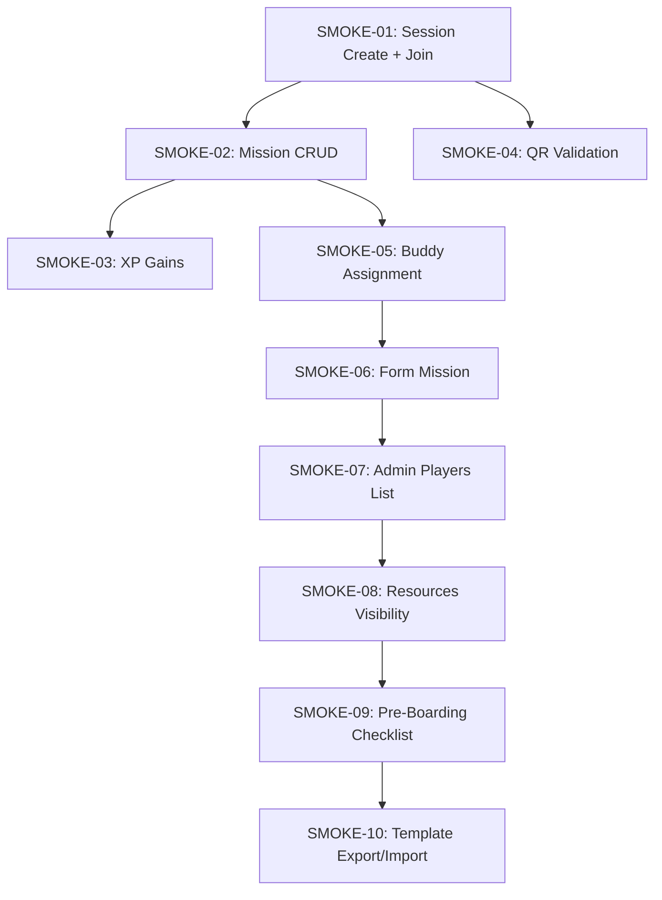
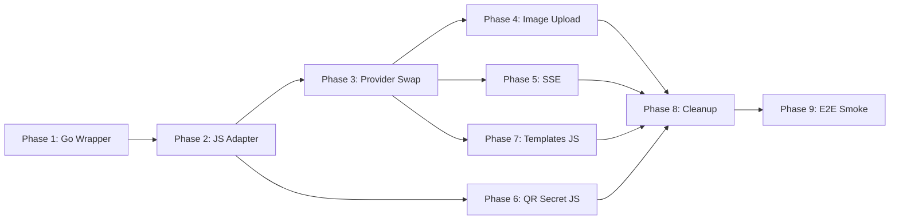

# PocketBase Full Integration — Implementation Strategy

> **Target outcome:** `docker compose up --build` delivers a MesseBuddy app where Game Maker and Player work across different devices — data survives browser restarts, QR codes carry real cryptographic secrets, images and templates persist, and the app graduates from a single-browser prototype to a tool you can hand to a real event organizer and real attendees. No manual UI setup, no admin panel clicking, no runtime scripts. Everything is automated in the Docker build.
>
> **Last updated:** 2026-06-17 — synced with actual codebase (audit report at [`pocketbase-integration-audit-report.md`](pocketbase-integration-audit-report.md)).

---

## Table of Contents

1. [Architectural Overview](#architectural-overview)
2. [Implementation Status Summary](#implementation-status-summary)
3. [Phase 1: Go Wrapper + Migrations — ✅ IMPLEMENTED](#phase-1-go-wrapper--migrations--%E2%9C%85-implemented)
4. [Phase 2: PocketBase JS Adapter (Frontend) — ❌ PENDING](#phase-2-pocketbase-js-adapter-frontend)
5. [Phase 3: Provider Swap + Wiring — ❌ PENDING](#phase-3-provider-swap--wiring)
6. [Phase 4: Background Image Upload — ❌ PENDING](#phase-4-background-image-upload)
7. [Phase 5: SSE Real-Time Subscription — ❌ PENDING](#phase-5-sse-real-time-subscription)
8. [Phase 6: QR Session Secret — 🟡 PARTIALLY](#phase-6-qr-session-secret)
9. [Phase 7: Templates Collection — 🟡 PARTIALLY](#phase-7-templates-collection)
10. [Phase 8: Cleanup & Documentation — 🟡 PARTIALLY](#phase-8-cleanup--documentation)
11. [Phase 9: E2E Smoke Screen Testing](#phase-9-e2e-smoke-screen-testing)
12. [Acceptance Criteria — E2E Smoke Screen](#acceptance-criteria--e2e-smoke-screen)
13. [Execution Order](#execution-order)
14. [Quick Reference: All New/Modified Files](#quick-reference-all-newmodified-files)

---

## Architectural Overview

```
┌──────────────────────────────────────────────────────────────────┐
│  docker compose up --build                                       │
│                                                                  │
│  Build Stage:                                                    │
│  1. Deno builds React PWA (VITE_PB_URL=/api)                    │
│  2. Go compiles PB wrapper (embedded migrations)                 │
│                                                                  │
│  Runtime (supervisord manages both processes):                   │
│  3. nginx serves PWA on :80, proxies /api/* → PB :8090          │
│  4. pocketbase-server serve --http=0.0.0.0:8090                 │
│     ├── Auto-migrate on first run (creates all collections)     │
│     ├── OnRecordCreate("sessions") hook → generate qrSecret     │
│     └── All API rules public (C-03: no auth system)             │
│  5. PWA calls /api/* (same-origin, no CORS)                     │
└──────────────────────────────────────────────────────────────────┘
```

**Key design decisions:**

| Decision | Status | Rationale |
|---|---|---|
| **Go wrapper, not raw binary** | ✅ Done | PocketBase collections created programmatically via Go migration files in [`server/pb_migrations/`](server/pb_migrations/). |
| **Same-origin proxy via nginx** | ✅ Done | The PWA talks to `/api/*` (same origin), nginx reverse-proxies to `localhost:8090`. No CORS, no `VITE_PB_URL` build-time URL fragility. |
| **SDK at v0.27.0** | ✅ Done | [`deno.json`](deno.json:30) has `pocketbase@^0.27.0`. |
| **PB Server at v0.39.4** | ✅ Done | [`server/go.mod`](server/go.mod:5) requires `github.com/pocketbase/pocketbase v0.39.4`. |
| **No auth system** | ✅ Done | Per C-03, all collections use public API rules. The PWA manages identity via `mb_identity` localStorage UID. |
| **nginx + supervisord (two-process)** | ✅ Done | nginx serves PWA static files on `:80`, supervisord manages both nginx and pocketbase-server. Cleaner than single-binary approach — nginx handles SSE buffering/proxy correctly. |
| **Go 1.25** | ✅ Done | [`server/go.mod`](server/go.mod:3) requires Go 1.25, Dockerfile uses `golang:1.25-bookworm`. |

---

## End-Value Deliverables — What Users Will Actually Get

> **The core behavioral shift:** The current mock adapter is a **single-browser demo** — all data lives in JavaScript memory, refresh the page and it's gone, and both Game Maker and Player must use the same browser. PocketBase integration makes it a **two-role, multi-device application** with real persistence, real concurrency, and real cryptographic security.

### Per-Role Value

#### 🎮 Game Maker

| Value | Mock Today | PB Target |
|-------|-----------|-----------|
| **Data survives browser restarts** | ❌ All data in JS memory — refresh = gone | ✅ All data in SQLite via Docker volumes |
| **Multi-device sessions** | ❌ GM and Player must use same browser | ✅ GM on laptop, Player on phone — any device, any browser |
| **QR codes with real secrets** | ⚠️ Uses `sessionId` as HMAC secret — guessable | ✅ 64-char hex `qrSecret` generated server-side by Go hook |
| **Background image upload** | ❌ `URL.createObjectURL` — preview disappears on reload | ✅ `FormData` upload via `pb.collection.update()` with File |
| **Template library** | ⚠️ Mock memory — lost on refresh | ✅ Persisted in `templates` collection |

#### 👤 Player

| Value | Mock Today | PB Target |
|-------|-----------|-----------|
| **Cross-session identity & progress** | ❌ Identity + progress lost on reload | ✅ `mb_identity` persists via `localStorage`, progress via `players` + `progress_events` collections |
| **Real-time validation feedback** | ⚠️ 4s `setTimeout` mock — no real server round-trip | ✅ SSE subscription fires when GM scans QR — no manual refresh |
| **XP that accumulates persistently** | ⚠️ Mock data — gone on reload | ✅ `upsertProgressEvent` writes to real DB; `deriveXP` reads real history |
| **Buddy assignment persists** | ❌ Gone on reload | ✅ `buddy_profiles` collection — assign once, visible forever |
| **Form responses saved** | ⚠️ Mock memory | ✅ Responses stored in `progress_events.formResponse` — GM can review later |

### What Stays the Same

The adapter pattern (C-03) guarantees **zero UI changes** at the component level. Every button, form, map, QR display, and milestone editor looks identical. The swap from mock to PB is invisible to the user — only the correctness and persistence change.

### Before/After — The Scenario That Only Works with PocketBase

```
Mock Adapter (today):          PocketBase Integration (target):
┌──────────┐                   ┌──────────────┐        ┌──────────────┐
│ SAME     │                   │ Game Maker   │        │ Player       │
│ BROWSER  │                   │ (laptop)     │        │ (phone)      │
│ TAB      │                   │              │        │              │
│         │                   │ Creates session────────► Joins        │
│ GM ──── Player              │ Creates mission───────► Sees mission  │
│         │                   │ Scans QR ◄──────────── Shows QR       │
│ (shared  │                   │ SSE update ──────────► Status flips  │
│  memory) │                   │              │        │              │
└──────────┘                   └──────────────┘        └──────────────┘
                                      │                       │
                                      └─── SQLite (Docker) ───┘
                                           All data persists
```

This is the difference between a clickable prototype and a tool you can hand to a real event organizer with real attendees.

---

## Implementation Status Summary

```
Phase 1: ██████████ 100%  (Go wrapper + migrations done)
Phase 2: ░░░░░░░░░░   0%  (entire JS adapter module missing — critical path)
Phase 3: ░░░░░░░░░░   0%  (no provider swap — blocked by Phase 2)
Phase 4: ░░░░░░░░░░   0%  (no File/FormData upload path — blocked by Phase 3)
Phase 5: ░░░░░░░░░░   0%  (no PB SSE subscription — blocked by Phase 3)
Phase 6: ████████░░  85%  (Go hook + all consumers ready; only JS adapter missing)
Phase 7: ██████░░░░  60%  (migration + schema + mock done; PB adapter methods missing)
Phase 8: ██████░░░░  65%  (pb-schema.md excellent; missing cleanup + config entries)
Phase 9: ░░░░░░░░░░   0%  (E2E smoke screen to be implemented with Playwright)
```

**The critical gap is Phase 2** — `src/adapters/pocketbase/` does not exist. Everything downstream (Phases 3, 4, 5) is blocked.

---

## Phase 1: Go Wrapper + Migrations — ✅ IMPLEMENTED

### 1a. Go module wrapper — done

[`server/main.go`](server/main.go) — compiles a custom PocketBase binary that:
- Embeds the `pb_migrations/` directory for auto-migration
- Registers `migratecmd` with `PB_AUTO_MIGRATE` env-var control
- Hooks `OnRecordCreate("sessions")` to auto-generate a random 64-char hex `qrSecret`

```go
// server/main.go (actual implementation)
package main

import (
    "crypto/rand"
    "embed"
    "encoding/hex"
    "log"
    "os"

    "github.com/pocketbase/pocketbase"
    "github.com/pocketbase/pocketbase/core"
    "github.com/pocketbase/pocketbase/plugins/migratecmd"

    _ "messe-buddy-pb/pb_migrations"
)

//go:embed pb_migrations
var migrationsDir embed.FS

func main() {
    app := pocketbase.New()

    migratecmd.MustRegister(app, app.RootCmd, migratecmd.Config{
        Dir:         "pb_migrations",
        Automigrate: os.Getenv("PB_AUTO_MIGRATE") != "false",
    })

    // qrSecret generation hook — fires after each session create.
    app.OnRecordCreate("sessions").BindFunc(func(e *core.RecordEvent) error {
        if e.Record.GetString("qrSecret") == "" {
            b := make([]byte, 32)
            if _, err := rand.Read(b); err != nil {
                return err
            }
            e.Record.Set("qrSecret", hex.EncodeToString(b))
        }
        return e.Next()
    })

    if err := app.Start(); err != nil {
        log.Fatal(err)
    }
}
```

Go module: [`server/go.mod`](server/go.mod) — module `messe-buddy-pb`, requires Go 1.25 + PB v0.39.4.

### 1b. Migration files — done

| File | Collections |
|------|-------------|
| [`server/pb_migrations/001_initial_collections.go`](server/pb_migrations/001_initial_collections.go) | sessions, players, milestones, missions, form_schemas, progress_events, buddy_profiles, resources |
| [`server/pb_migrations/002_templates.go`](server/pb_migrations/002_templates.go) | templates |

All collections use public API rules (`setPublicRules` helper sets all rules to `nil` per C-03). Key indexes: `idx_uid` (players), `idx_recoveryKey` (players), `idx_missionId` (form_schemas), `idx_assignedToPlayerId` (buddy_profiles), `idx_name` (templates).

### 1c. Dockerfile — done

[`Dockerfile`](Dockerfile) — multi-stage build:
1. **Deno stage** (`denoland/deno:2.8.1`) — `deno task build` with `VITE_PB_URL=/api`
2. **Go stage** (`golang:1.25-bookworm`) — `go mod tidy && CGO_ENABLED=0 go build` of [`server/`](server/)
3. **Runtime stage** (`debian:bookworm-slim`) — nginx + supervisord + pocketbase-server binary

### 1d. Docker runtime config — done

- [`docker/nginx.conf`](docker/nginx.conf) — proxies `/api/*` and `/_/*` to PocketBase on `:8090`, includes SSE headers (`proxy_buffering off`, `chunked_transfer_encoding on`, `proxy_read_timeout 300s`)
- [`docker/supervisord.conf`](docker/supervisord.conf) — manages nginx (priority 10) + pocketbase-server (priority 20)
- [`docker/entrypoint.sh`](docker/entrypoint.sh) — waits for virtual key, renders nginx template, writes `config.js`, starts supervisord

### 1e. Build-time env vars in docker-compose.yml — done

[`docker-compose.yml`](docker-compose.yml) app service passes:
- `VITE_PB_URL: /api` — same-origin proxy
- `VITE_USE_MOCK_PB: "false"` — production PB adapter
- `PB_AUTO_MIGRATE: "true"` — auto-create schema on first run

### 1f. Pending hardening

- [ ] Add composite unique index on `progress_events(playerId, missionId)` to [`001_initial_collections.go`](server/pb_migrations/001_initial_collections.go) as a DB-level safety net for C-05:

```go
progressEvents.AddIndex(
    "idx_player_mission", true, "playerId, missionId", "",
)
```

---

## Phase 2: PocketBase JS Adapter (Frontend) — ❌ PENDING

### 2a. Create `src/types/globals.d.ts`

Type declaration for the runtime config injected by [`entrypoint.sh`](docker/entrypoint.sh:39-41):

```typescript
// src/types/globals.d.ts
declare global {
  interface Window {
    __MB_CONFIG__?: {
      llmBaseUrl?: string;
      llmKey?: string;
      llmModel?: string;
      useMockChat?: boolean;
      systemPrompt?: string;
      pbUrl?: string; // PocketBase URL (for dev overrides; defaults to /api in Docker)
    };
  }
}

export {};
```

Note: This was previously described as living in [`src/config/llm.ts`](src/config/llm.ts). A standalone `globals.d.ts` is cleaner — no import needed, TypeScript picks it up automatically.

### 2b. Create `src/adapters/pocketbase/parsers.ts`

Marshalling layer that converts between PocketBase raw records (with JSON-stringified fields per [`FormSchemaRaw`](src/types/domain.ts:114) and [`ProgressEventRaw`](src/types/domain.ts:119)) and typed app-layer interfaces (C-13). **ALL `JSON.parse` calls for PB record fields are confined to this file** (C-13 invariant).

```typescript
// src/adapters/pocketbase/parsers.ts
import type {
  FieldSchema,
  FormSchema,
  FormSchemaRaw,
  Player,
  ProgressEvent,
  ProgressEventRaw,
  Session,
  Mission,
  Milestone,
  BuddyProfile,
  Resource,
  TemplateExport,
  MissionTag,
} from "../../types/index.ts";

// ── Sessions ────────────────────────────────────────────────────────────────

export const marshalSession = (raw: Record<string, unknown>): Session => ({
  id: raw.id as string,
  created: raw.created as string,
  updated: raw.updated as string,
  name: raw.name as string,
  bgImageUrl: raw.bgImageUrl as string,
  gameMakerId: raw.gameMakerId as string,
  qrSecret: raw.qrSecret as string | undefined,
  preBoardingChecks: (raw.preBoardingChecks as unknown[]) ?? [],
});

// ── Players ─────────────────────────────────────────────────────────────────

export const marshalPlayer = (raw: Record<string, unknown>): Player => ({
  id: raw.id as string,
  created: raw.created as string,
  updated: raw.updated as string,
  uid: raw.uid as string,
  recoveryKey: raw.recoveryKey as string,
  sessionId: raw.sessionId as string,
  tutorialComplete: (raw.tutorialComplete as boolean) ?? false,
  profileComplete: (raw.profileComplete as boolean) ?? false,
  name: (raw.name as string) ?? "",
  preferredName: raw.preferredName as string | undefined,
  pronouns: raw.pronouns as string | undefined,
  avatarUrl: raw.avatarUrl as string | undefined,
  role: (raw.role as string) ?? "",
  team: (raw.team as string) ?? "",
  startDate: (raw.startDate as string) ?? "",
  location: (raw.location as string) ?? "",
  timezone: (raw.timezone as string) ?? "",
  skillsConfident: (raw.skillsConfident as string[]) ?? [],
  skillsDevelop: (raw.skillsDevelop as string[]) ?? [],
  languages: (raw.languages as string[]) ?? [],
  workStyle: raw.workStyle as string | undefined,
  energizers: raw.energizers as string[] | undefined,
  drainers: raw.drainers as string[] | undefined,
});

// ── FormSchemas ─────────────────────────────────────────────────────────────

export const marshalFormSchema = (raw: FormSchemaRaw): FormSchema => ({
  id: raw.id,
  created: raw.created,
  updated: raw.updated,
  missionId: raw.missionId,
  fields: JSON.parse(raw.fields) as ReadonlyArray<FieldSchema>,
});

export const unmarshalFormSchema = (
  fields: ReadonlyArray<FieldSchema>,
): string => JSON.stringify(fields);

// ── ProgressEvents ──────────────────────────────────────────────────────────

export const marshalProgressEvent = (
  raw: ProgressEventRaw,
): ProgressEvent => ({
  id: raw.id,
  created: raw.created,
  updated: raw.updated,
  sessionId: raw.sessionId,
  playerId: raw.playerId,
  missionId: raw.missionId,
  status: raw.status,
  validatedBy: raw.validatedBy,
  validatedAt: raw.validatedAt,
  formResponse: raw.formResponse
    ? (JSON.parse(raw.formResponse) as Readonly<Record<string, string>>)
    : undefined,
});

// ── Missions ────────────────────────────────────────────────────────────────

export const marshalMission = (raw: Record<string, unknown>): Mission => ({
  id: raw.id as string,
  created: raw.created as string,
  updated: raw.updated as string,
  sessionId: raw.sessionId as string,
  milestoneId: raw.milestoneId as string,
  title: raw.title as string,
  body: (raw.body as string) ?? "",
  type: raw.type as Mission["type"],
  externalUrl: raw.externalUrl as string | undefined,
  difficulty: raw.difficulty as number,
  xpValue: raw.xpValue as number,
  tags: (raw.tags as MissionTag[]) ?? [],
  suggestedDueDate: raw.suggestedDueDate as string | undefined,
  order: raw.order as number,
  isInCurrentMissions: (raw.isInCurrentMissions as boolean) ?? false,
  validationMethod: raw.validationMethod as Mission["validationMethod"],
});

// ── Milestones ──────────────────────────────────────────────────────────────

export const marshalMilestone = (raw: Record<string, unknown>): Milestone => ({
  id: raw.id as string,
  created: raw.created as string,
  updated: raw.updated as string,
  sessionId: raw.sessionId as string,
  name: raw.name as string,
  xPercent: raw.xPercent as number,
  yPercent: raw.yPercent as number,
  xpThreshold: raw.xpThreshold as number,
  order: raw.order as number,
});

// ── BuddyProfiles ───────────────────────────────────────────────────────────

export const marshalBuddyProfile = (
  raw: Record<string, unknown>,
): BuddyProfile => ({
  id: raw.id as string,
  created: raw.created as string,
  updated: raw.updated as string,
  sessionId: raw.sessionId as string,
  assignedToPlayerId: raw.assignedToPlayerId as string,
  name: raw.name as string,
  role: (raw.role as string) ?? "",
  tenure: raw.tenure as string | undefined,
  avatarUrl: raw.avatarUrl as string | undefined,
  contactUrl: raw.contactUrl as string | undefined,
  quote: raw.quote as string | undefined,
  email: raw.email as string | undefined,
  phone: raw.phone as string | undefined,
});

// ── Resources ───────────────────────────────────────────────────────────────

export const marshalResource = (raw: Record<string, unknown>): Resource => ({
  id: raw.id as string,
  created: raw.created as string,
  updated: raw.updated as string,
  sessionId: raw.sessionId as string,
  title: raw.title as string,
  description: raw.description as string | undefined,
  type: raw.type as Resource["type"],
  url: raw.url as string,
  isVisibleToPlayer: (raw.isVisibleToPlayer as boolean) ?? false,
});

// ── Templates ───────────────────────────────────────────────────────────────

export const marshalTemplate = (
  raw: Record<string, unknown>,
): TemplateExport => JSON.parse(raw.data as string) as TemplateExport;
```

### 2c. Create `src/adapters/pocketbase/pbAdapter.ts`

Implement all 29 methods of [`AppAdapter`](src/adapters/interface.ts:18). Key implementation notes:

**AbortController pattern (all Tier 2 async methods):**
Every method that makes PB SDK requests should accept an optional `AbortSignal` parameter or use an internal `AbortController` for cancellable operations per [React Lifecycle Design Principles](SPECS.md#effect-lifecycle-tiers). The PB SDK supports cancellation via its `$cancelKey` or `signal` option.

**`upsertProgressEvent` — sessionId derivation:**
The method signature in [`AppAdapter`](src/adapters/interface.ts:68) does not accept `sessionId`. The adapter must derive it by looking up the player:

```typescript
const upsertProgressEvent = async (
  playerId: string,
  missionId: string,
  patch: Partial<...>,
): Promise<ProgressEvent> => {
  const filter = `playerId = "${playerId}" && missionId = "${missionId}"`;
  const existing = await pb.collection("progress_events")
    .getFullList({ filter });

  const data = {
    ...patch,
    formResponse: patch.formResponse
      ? JSON.stringify(patch.formResponse)
      : undefined,
  };

  if (existing.length > 0) {
    const record = await pb.collection("progress_events")
      .update(existing[0].id, data);
    return marshalProgressEvent(record);
  } else {
    const player = await getPlayerById(playerId);
    if (!player) throw new Error("Player not found");
    const record = await pb.collection("progress_events")
      .create({ playerId, missionId, sessionId: player.sessionId, ...data });
    return marshalProgressEvent(record);
  }
};
```

**`createSession` — qrSecret round-trip:**
The Go hook in [`main.go`](server/main.go:34-43) generates `qrSecret` server-side. The JS adapter's `createSession` must receive this in the response from `pb.collection("sessions").create()`. Verify that the PB SDK returns the server-mutated record — if not, re-fetch after create.

**`subscribeProgressEvent` — SSE subscription (Phase 5):**

```typescript
subscribeProgressEvent: (
  playerId: string,
  missionId: string,
  callback: (event: ProgressEvent) => void,
): () => void => {
  const filter = `playerId = "${playerId}" && missionId = "${missionId}"`;

  const unsub = pb.collection("progress_events").subscribe("*", (e) => {
    const record = e.record as unknown as ProgressEventRaw;
    if (record.playerId === playerId && record.missionId === missionId) {
      callback(marshalProgressEvent(record));
    }
  }, { filter });

  return unsub;
};
```

**`updateSession` — File upload (Phase 4):**

```typescript
const updateSession = async (
  sessionId: string,
  patch: Partial<Omit<Session, keyof PBRecord>>,
): Promise<Session> => {
  const formData = new FormData();
  for (const [key, value] of Object.entries(patch)) {
    if (value instanceof File) {
      formData.append(key, value);
    } else if (value !== undefined) {
      formData.append(key, String(value));
    }
  }
  const record = await pb.collection("sessions").update(sessionId, formData);
  return marshalSession(record);
};
```

**`deleteTemplate` — resolve by name:**
The [`AppAdapter`](src/adapters/interface.ts:105) signature is `deleteTemplate(name: string): Promise<void>`. Implementation:

```typescript
const deleteTemplate = async (name: string): Promise<void> => {
  const records = await pb.collection("templates")
    .getFullList({ filter: `name = "${name}"` });
  if (records.length > 0) {
    await pb.collection("templates").delete(records[0].id);
  }
};
```

### 2d. Create `src/adapters/pocketbase/mod.ts`

```typescript
// src/adapters/pocketbase/mod.ts
import PocketBase from "pocketbase";
import { createPBAdapter } from "./pbAdapter.ts";

const PB_URL = (() => {
  // In Docker: same-origin /api proxy
  // In dev: direct to localhost:8090, overridable via __MB_CONFIG__
  if (typeof window !== "undefined" && window.__MB_CONFIG__?.pbUrl) {
    return window.__MB_CONFIG__.pbUrl;
  }
  return import.meta.env.VITE_PB_URL ?? "/api";
})();

export const pb = new PocketBase(PB_URL);
export const pbAdapter = createPBAdapter(pb);
```

---

## Phase 3: Provider Swap + Wiring — ❌ PENDING

### 3a. [`src/adapters/AdapterContext.tsx`](src/adapters/AdapterContext.tsx:3) — conditional swap

Keep the mock adapter as a dev fallback controlled by `VITE_USE_MOCK_PB`:

```typescript
import type { ReactNode } from "react";
import type { AppAdapter } from "./interface.ts";
import { mockAdapter } from "./mock/index.ts";
import { pbAdapter } from "./pocketbase/mod.ts";
import { AdapterContext } from "./AdapterContextValue.ts";

interface AdapterContextProviderProps {
  readonly adapter?: AppAdapter;
  readonly children: ReactNode;
}

const USE_MOCK_PB = import.meta.env.VITE_USE_MOCK_PB === "true";

export const AdapterContextProvider = ({
  adapter = USE_MOCK_PB ? mockAdapter : pbAdapter,
  children,
}: AdapterContextProviderProps) => {
  return (
    <AdapterContext.Provider value={adapter}>
      {children}
    </AdapterContext.Provider>
  );
};
```

### 3b. [`src/adapters/AdapterContextValue.ts`](src/adapters/AdapterContextValue.ts:3) — default context value

```typescript
import { createContext } from "react";
import type { AppAdapter } from "./interface.ts";
import { mockAdapter } from "./mock/index.ts";
import { pbAdapter } from "./pocketbase/mod.ts";

const USE_MOCK_PB = import.meta.env.VITE_USE_MOCK_PB === "true";

export const AdapterContext = createContext<AppAdapter>(
  USE_MOCK_PB ? mockAdapter : pbAdapter,
);
```

---

## Phase 4: Background Image Upload — ❌ PENDING

The current [`handleUploadBackground`](src/pages/AdminCockpitPage.tsx:239) uses `URL.createObjectURL(file)` as a local-only workaround.

1. The `updateSession` PB adapter method handles `File` objects via `FormData` (see Phase 2c)
2. Update [`AdminCockpitPage.tsx`](src/pages/AdminCockpitPage.tsx) to pass the raw `File`:

```typescript
const handleUploadBackground = useCallback(
  (file: File) => {
    void adapter.updateSession(sid, { bgImageUrl: file as unknown as string });
  },
  [adapter, sid],
);
```

---

## Phase 5: SSE Real-Time Subscription — ❌ PENDING

Implementation is in the `subscribeProgressEvent` method of `pbAdapter.ts` (see Phase 2c). The consumers require **zero component changes**:

- [`ValidationDisplay`](src/components/player/ValidationDisplay.tsx) — subscribes when `validationMethod = 'qr'` (C-07)
- [`QRDisplay`](src/components/player/QRDisplay.tsx) — subscribes for status changes

nginx is already configured for SSE ([`docker/nginx.conf:39-44`](docker/nginx.conf:39-44)).

---

## Phase 6: QR Session Secret — 🟡 PARTIALLY

### What's done

| Component | Status |
|-----------|--------|
| `qrSecret` field in `sessions` collection | ✅ [`001_initial_collections.go:17`](server/pb_migrations/001_initial_collections.go:17) |
| Go hook auto-generates 64-char hex on session create | ✅ [`main.go:34-43`](server/main.go:34-43) |
| [`Session` interface](src/types/domain.ts:23) has `qrSecret?: string` | ✅ |
| [`qrPayload.ts`](src/utils/qrPayload.ts) accepts `secret` parameter from caller | ✅ |
| All QR consumers use `session.qrSecret ?? sessionId` fallback | ✅ (adapter-ready) |

### What's remaining

| Task | Detail |
|------|--------|
| PB adapter methods | `createSession`, `getSession` must return `qrSecret` from the server response |
| Verify round-trip | Create session → Go hook sets `qrSecret` → PB SDK response includes it → JS adapter marshals it |
| `QRDisplay` + `AdminQRScannerModal` | Already pass `session.qrSecret ?? sessionId` — no change needed once adapter provides it |

**Note:** The plan previously described a separate migration `002_qr_secret_default.go`. The actual implementation uses a Go hook which is better — generates fresh random secrets server-side rather than static migration defaults.

---

## Phase 7: Templates Collection — 🟡 PARTIALLY

### What's done

| Component | Status |
|-----------|--------|
| Migration [`002_templates.go`](server/pb_migrations/002_templates.go) | ✅ |
| `docs/pb-schema.md` documents the templates collection | ✅ |
| Mock adapter has `listTemplates`, `saveTemplate`, `deleteTemplate` | ✅ |
| [`AppAdapter`](src/adapters/interface.ts:103-105) defines the interface | ✅ |

### What's remaining

PB adapter methods for templates — see Phase 2c for implementation (`listTemplates`, `saveTemplate`, `deleteTemplate` with name-to-ID resolution).

---

## Phase 8: Cleanup & Documentation — 🟡 PARTIALLY

### 8a. Done

| Item | File |
|------|------|
| PB schema reference | [`docs/pb-schema.md`](docs/pb-schema.md) — all 9 collections, field types, JSON schemas, API rules, C-13 table |
| Build-time env vars | [`docker-compose.yml`](docker-compose.yml) passes `VITE_USE_MOCK_PB: "false"`, `VITE_PB_URL: /api`, `PB_AUTO_MIGRATE: true` |
| Mock adapter conditional | [`AdapterContext.tsx`](src/adapters/AdapterContext.tsx) + [`AdapterContextValue.ts`](src/adapters/AdapterContextValue.ts) (see Phase 3) |

### 8b. Remaining

- [ ] Add `VITE_PB_URL=/api` to [`.env.example`](.env.example) (currently only `VITE_USE_MOCK_PB` is listed):

```bash
# -- Build args (baked into the PWA JS bundle at docker build time) --
VITE_PB_URL=/api                                       # same-origin proxy in Docker; change for dev
VITE_USE_MOCK_PB=true                                  # "false" in production → real PB adapter
```

---

## Phase 9: E2E Smoke Screen Testing

After Phases 2–8 are complete, validate the full stack via Playwright MCP smoke tests and/or `scripts/smoke-landing.ts`. All smoke tests should run against a `docker compose up --build` environment.

### 9a. SMOKE-01: Session Creation & Player Join

**Steps:**
1. Game Maker opens `/` → selects "Game Maker" role → creates session "E2E Smoke Test"
2. Verifies admin cockpit loads with empty milestone map
3. Game Maker copies session invite link
4. Player opens invite link (`/join/:sessionId`) → session code pre-filled → joins as Player
5. Player enters name → recovery key shown → player cockpit loads

**Expected:** Both Game Maker and Player see the session. Player appears in Game Maker's player list.

### 9b. SMOKE-02: Mission & Milestone CRUD (Admin → Player Visibility)

**Steps:**
1. Game Maker creates a milestone at position (50, 50) named "Orientation"
2. Game Maker creates a mission under "Orientation" — type `text`, difficulty 1, title "Read Welcome Guide", validationMethod `selfApprove`
3. Player refreshes — sees the milestone and mission on the map/dashboard
4. Game Maker edits the mission — changes title to "Read Onboarding Guide"
5. Player refreshes — sees updated title
6. Game Maker deletes the mission → Player refreshes → mission gone

**Expected:** CRUD operations propagate Game Maker → Player with a page refresh (SSE not required for smoke).

### 9c. SMOKE-03: XP Point Gains

**Steps:**
1. Player completes "Read Onboarding Guide" — taps "I Did This" button
2. Player dashboard shows XP bar updated
3. XP value matches `deriveXP()` output for difficulty 1
4. Player completes another mission of difficulty 5
5. XP bar updates accordingly (higher XP for higher difficulty)

**Expected:** XP accumulation follows `deriveXP.ts` algorithm (C-04): linear 1:1 difficulty weighting, rounding remainder to highest-difficulty missions first.

### 9d. SMOKE-04: QR Code Validation Flow

**Steps:**
1. Game Maker creates a mission with `validationMethod: "qr"`
2. Player opens the mission → taps "Generate QR Code"
3. QR code displays on player's screen
4. Game Maker navigates to `/admin/:sessionId/scan` → scans the QR code
5. Validation result shows success
6. Player's mission status updates to `completed`
7. XP is awarded

**Expected:** Full QR → HMAC verify → status update → XP award cycle works end-to-end. HMAC secret (`qrSecret`) must be the actual server-generated value, not the `sessionId` fallback.

### 9e. SMOKE-05: Buddy Assignment

**Steps:**
1. Game Maker opens player detail → assigns a buddy (creates BuddyProfile)
2. Buddy card appears on Player's dashboard with name, role, tenure, quote
3. Game Maker edits buddy — changes quote
4. Player refreshes → sees updated quote

**Expected:** Buddy assignment propagates from Game Maker to Player dashboard.

### 9f. SMOKE-06: Form Mission (autoApproved)

**Steps:**
1. Game Maker creates a mission with `type: "form"` and a form schema (text + select fields)
2. Player opens the form → fills in answers → submits
3. Form response saved, mission auto-approved (`autoApproved` status per C-06)
4. XP awarded immediately (no GM approval needed)
5. Game Maker views form response in admin cockpit

**Expected:** Form missions self-complete. `ValidationDisplay` never mounts (C-06).

### 9g. SMOKE-07: Admin Players List (Cross-Hire Context)

**Steps:**
1. Multiple players join the session with different roles, teams, locations
2. Game Maker opens the Players tab in admin cockpit
3. All players are listed with their profile info (name, role, team, start date)
4. Game Maker searches/filters players
5. Player profile cards show skills, languages, work style

**Expected:** Player data from `players` collection renders correctly in admin views.

### 9h. SMOKE-08: Resources Visibility

**Steps:**
1. Game Maker creates a resource (guide type, URL, description) with `isVisibleToPlayer: true`
2. Player sees the resource in the Resources section
3. Game Maker toggles `isVisibleToPlayer: false`
4. Player refreshes → resource disappears
5. Game Maker deletes the resource

**Expected:** Resource visibility toggle works; deleted resources don't appear.

### 9i. SMOKE-09: Pre-Boarding Checklist

**Steps:**
1. Game Maker adds pre-boarding checklist items (JSON array) via session edit
2. Items persist across reloads
3. Items render in admin cockpit pre-boarding section

**Expected:** `preBoardingChecks` JSON field round-trips correctly.

### 9j. SMOKE-10: Template Export/Import

**Steps:**
1. Game Maker sets up a session with milestones, missions, and form schemas
2. Game Maker exports session as template (saves to `templates` collection)
3. Game Maker creates a new session using the saved template
4. New session has the same milestones, missions, and form schemas as the original
5. Template list shows the saved template; can be deleted

**Expected:** Template round-trip: export → save to PB → import → same structure. FK relationships (`milestoneId`, `missionId`) remapped via `_milestoneOrder`/`_missionOrder` keys (see [`exportTemplate.ts`](src/use-cases/exportTemplate.ts:27) and [`importTemplate.ts`](src/use-cases/importTemplate.ts:23)).

---

## Acceptance Criteria — E2E Smoke Screen

The following scenarios must pass as Playwright MCP smoke tests against a `docker compose up --build` environment before the implementation is considered complete.



| # | Scenario | What It Validates | User Value Delivered | Status |
|---|----------|-------------------|---------------------|--------|
| SMOKE-01 | Session create + player join | `createSession`, `createPlayer`, `getSession`, `listPlayers`, invite link route | **Multi-device sessions** — GM creates on one device, Player joins from another; data persists across both | ❌ |
| SMOKE-02 | Mission/milestone CRUD | `createMilestone`, `createMission`, `updateMission`, `deleteMission`, `listMilestones`, `listMissions` — admin changes visible to player | **Persistent game structure** — milestones and missions survive browser restarts; changes propagate GM→Player | ❌ |
| SMOKE-03 | XP point gains | `upsertProgressEvent`, `computeProgress`, `deriveXP` — difficulty-weighted XP accumulation (C-04) | **Persistent XP that accumulates** — difficulty-weighted scoring on real data; XP bar reflects actual multi-mission history | ❌ |
| SMOKE-04 | QR validation flow | QR encode/decode (C-16), HMAC verify using `qrSecret`, `upsertProgressEvent` status update, XP award | **Cryptographic QR security** — real 64-char hex `qrSecret` (not guessable `sessionId`); real-time SSE status flip when GM scans | ❌ |
| SMOKE-05 | Buddy assignment | `upsertBuddyProfile`, `getBuddyProfile` — buddy card renders on player dashboard | **Persistent buddy assignment** — buddy card stays visible across sessions; assignment survives reload | ❌ |
| SMOKE-06 | Form mission auto-approval | `getFormSchema`, `upsertFormSchema`, `upsertProgressEvent` — form submits, auto-approved (C-06), XP awarded | **Form responses saved** — Player answers persist in DB; GM can review responses later | ❌ |
| SMOKE-07 | Admin players list | `listPlayers` — all player profile data renders in admin cockpit | **Cross-hire context** — all player profiles (name, role, team, skills, languages) visible to GM across devices | ❌ |
| SMOKE-08 | Resources visibility | `createResource`, `listResources`, `updateResource`, `deleteResource` — visibility toggle works | **Real resource toggling** — `isVisibleToPlayer` persists; toggled-off resources stay hidden after reload | ❌ |
| SMOKE-09 | Pre-boarding checklist | `updateSession` — `preBoardingChecks` JSON field round-trips | **Persistent pre-boarding items** — checklist survives browser restarts; JSON field round-trips correctly | ❌ |
| SMOKE-10 | Template export/import | `saveTemplate`, `listTemplates`, `deleteTemplate`, `bootstrapFromTemplate`, `exportTemplate` — full round-trip with FK remapping | **Reusable template library** — session structures persist in `templates` collection; import into new sessions with FK remapping | ❌ |

### Test Environment

- **Browser:** Playwright MCP (Firefox, iPhone 15 profile, 390×844 viewport)
- **Backend:** `docker compose up --build` (real PocketBase, nginx proxy, auto-migrated collections)
- **Baseline:** No pre-existing data — all test data created during smoke runs
- **Persistence:** PocketBase data persists across smoke scenarios (named volume)

### Failure Mode

Any smoke scenario failure is a **blocker** for the corresponding phase. Fix the root cause, not the test.

---

## Execution Order

```
Phase 1 (Go wrapper + migrations)     ← DONE — no further work needed
Phase 2 (PB JS adapter)               ← NEXT — create parsers.ts + pbAdapter.ts + mod.ts + globals.d.ts
Phase 3 (Provider swap)               ← Depends on Phase 2
Phase 4 (Image upload)                ← Depends on Phase 3
Phase 5 (SSE subscription)            ← Depends on Phase 3
Phase 6 (QR session secret)           ← JS adapter methods only (Go hook done)
Phase 7 (Templates collection)        ← JS adapter methods only (migration done)
Phase 8 (Cleanup & docs)              ← Depends on all phases
Phase 9 (E2E smoke screen)            ← Depends on Phases 2-8
```



---

## Quick Reference: All New/Modified Files

### New files to create:

| File | Purpose | Priority |
|------|---------|----------|
| `src/types/globals.d.ts` | `window.__MB_CONFIG__` type declaration | P1 (Phase 2) |
| `src/adapters/pocketbase/parsers.ts` | JSON field marshalling (C-13) | P1 (Phase 2) |
| `src/adapters/pocketbase/pbAdapter.ts` | Full `AppAdapter` implementation (29 methods) | P1 (Phase 2) |
| `src/adapters/pocketbase/mod.ts` | Barrel export — creates PB client + adapter | P1 (Phase 2) |
| `scripts/smoke-e2e.ts` | Playwright/Deno E2E smoke script covering SMOKE-01 through SMOKE-10 | P2 (Phase 9) |

### Files to modify:

| File | Change | Phase |
|------|--------|-------|
| `server/pb_migrations/001_initial_collections.go` | Add composite unique index on `progress_events(playerId, missionId)` | P4 (Hardening) |
| `src/adapters/AdapterContext.tsx` | Add `VITE_USE_MOCK_PB` conditional, import pbAdapter | Phase 3 |
| `src/adapters/AdapterContextValue.ts` | Add conditional default context value | Phase 3 |
| `src/pages/AdminCockpitPage.tsx` | File upload: pass raw `File` to adapter (not object URL) | Phase 4 |
| `.env.example` | Add `VITE_PB_URL=/api` entry | Phase 8 |

### Files that require NO changes (already done):

| File | Reason |
|------|--------|
| `server/main.go` | Go wrapper complete with qrSecret hook |
| `server/go.mod` | Go module configured |
| `server/pb_migrations/001_initial_collections.go` | All 8 collections |
| `server/pb_migrations/002_templates.go` | Templates collection |
| `docker/nginx.conf` | SSE-ready proxy config |
| `docker/supervisord.conf` | Manages nginx + pocketbase-server |
| `docker/entrypoint.sh` | Config.js + supervisord bootstrap |
| `Dockerfile` | Multi-stage: Deno → Go → runtime |
| `docker-compose.yml` | Build args + env vars correct |
| `deno.json` | `pocketbase@^0.27.0` present |
| `docs/pb-schema.md` | Comprehensive schema reference |
| `src/types/domain.ts` | `qrSecret`, `FormSchemaRaw`, `ProgressEventRaw` present |
| `src/adapters/interface.ts` | All 29 methods defined |
| `src/utils/qrPayload.ts` | Accepts `secret` parameter |
| `src/components/player/QRDisplay.tsx` | Uses `session.qrSecret ?? sessionId` |
| `src/components/admin/AdminQRScannerModal.tsx` | Uses `session.qrSecret ?? sessionId` |
| `src/hooks/useLandingFlow.ts` | Reads `inviteSessionId` from `useParams` |
| `src/pages/LandingPage.tsx` | Route `/join/:sessionId` exists |
