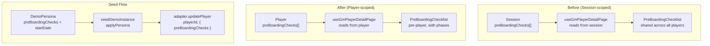
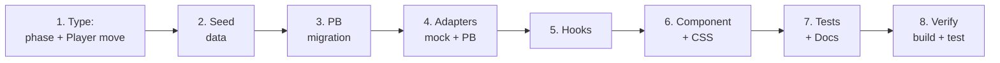

# Implementation Plan: Per-Player Pre-Boarding Checklist with Phase Grouping

## Summary

Two architectural changes combined into one implementation:

1. **Move `preBoardingChecks` from `Session` to `Player`** — the checklist becomes per-new-hire instead of session-wide. Each player gets their own tracked list.
2. **Seed the 27-item, 3-phase checklist from spec** — replace the 7-item flat list in [`DEMO_PRE_BOARDING_CHECKS`](src/constants/demoInstance.ts:22) with the full phased checklist defined in [`plans/Supervisor-check-list.docx.md`](plans/Supervisor-check-list.docx.md), with due dates computed relative to each persona's `startDate`.

## Design Decisions

| Decision | Rationale |
|----------|-----------|
| `phase` is **optional** (`readonly phase?: string`) on `PreBoardingCheckItem` | Backward-compatible; manually-added items default to no phase |
| Checklist moves **to `Player`** (was `Session`) | The spec is inherently about one new hire's onboarding; per-player scope matches reality |
| Due dates are **static ISO strings**, computed from `persona.startDate` at seed time | Each demo persona has their own `startDate`; real sessions would have the GM set dates manually |
| Phase grouping is **render-time** — no new PB collection | `PreBoardingCheckItem[]` is already a JSON field; moving it to `players` just changes which collection has it |
| PocketBase migration adds `preBoardingChecks` JSON to `players` | New 004 migration; no data migration needed since `pbAdapter` never seeds demo data |
| Items without `phase` render under an **"Other"** catch-all | Keeps flat checklists clean while supporting phased ones |

## Architecture Diagram



## Files to Change (14 total)

### Phase 1: Type & Constant Changes

#### 1. [`src/types/domain.ts`](src/types/domain.ts:26) — Move `preBoardingChecks` from Session to Player

**Remove** from `Session`:
```typescript
readonly preBoardingChecks: ReadonlyArray<PreBoardingCheckItem>;  // DELETE
```

**Add** to `Player` (after `drainers` field):
```typescript
readonly preBoardingChecks: ReadonlyArray<PreBoardingCheckItem>;
```

#### 2. [`src/types/ephemeral.ts`](src/types/ephemeral.ts:11) — Add optional `phase` field

```typescript
export interface PreBoardingCheckItem {
  readonly id: string;
  readonly label: string;
  readonly checked: boolean;
  readonly dueDate?: string;   // ISO date string or empty
  readonly phase?: string;     // e.g. "Phase 1 — Before day 1"
}
```

#### 3. [`src/constants/demoInstance.ts`](src/constants/demoInstance.ts:22) — Move to DemoPersona, add per-persona phased lists

**Remove** the standalone `DEMO_PRE_BOARDING_CHECKS` constant.

**Add** `preBoardingChecks` field to `DemoPersona`:
```typescript
export interface DemoPersona {
  // ... existing fields
  readonly preBoardingChecks?: ReadonlyArray<PreBoardingCheckItem>;
}
```

**Add a shared factory function** that builds the phased checklist with dates computed from a given `startDate`:
```typescript
const buildPreBoardingChecks = (
  startDate: string,
): ReadonlyArray<PreBoardingCheckItem> => { /* ... */ };
```

This avoids duplicating 27 items per persona. Each persona calls `buildPreBoardingChecks(persona.startDate)`.

**Phase constants:**
- `"Phase 1 — Before day 1  ·  Pre-boarding preparation"`
- `"Phase 2 — Day 1  ·  Welcome & orientation"`
- `"Phase 3 — After day 1  ·  Ongoing support"`

**Phase 1 items** (9 items, with relative deadlines):

| id | label | dueDate offset | checked |
|----|-------|---------------|---------|
| `pbc_sys_access` | Request system access for new hire via ServiceNow | Day −7 | false |
| `pbc_workstation` | Set up workstation (desk, monitor, keyboard, nameplate) | Day −3 | true |
| `pbc_access_card` | Order office key / access card | Day −3 | false |
| `pbc_day1_schedule` | Define and document the day-1 schedule | Day −2 | false |
| `pbc_calendar` | Block calendar for welcome meetings on day 1 | Day −2 | false |
| `pbc_welcome_lunch` | Organise welcome lunch with the team | Day −1 | false |
| `pbc_assign_missions` | Set up new hire in MesseBuddy — assign missions from template | Day −1 | false |
| `pbc_assign_buddy` | Assign buddy and fill in buddy card in app | Day −1 | true |
| `pbc_induction_plan` | Prepare induction plan document | Day −1 | false |

**Phase 2 items** (10 items, no due dates):

| id | label |
|----|-------|
| `pbc_reception` | Pick up new hire at reception |
| `pbc_it_equipment` | Collect IT equipment together at service lounge |
| `pbc_introduce_team` | Introduce to all team members individually |
| `pbc_campus_tour` | Give campus tour (canteen, printers, first aid, emergency exits, Stempeluhr) |
| `pbc_safety_briefing` | Conduct safety briefing (Unterweisung) — sign paper form |
| `pbc_share_app` | Share MesseBuddy with new hire |
| `pbc_welcome_lunch_day1` | Shared welcome lunch with team |
| `pbc_walkthrough_plan` | Present and walk through the induction plan document |
| `pbc_first_task` | Assign first task |
| `pbc_eod_checkin` | End-of-day check-in conversation (how was it?) |

**Phase 3 items** (8 items, with relative deadlines):

| id | label | dueDate offset |
|----|-------|---------------|
| `pbc_key_contacts` | Introduce key contacts in other departments | Week 1 |
| `pbc_dept_structure` | Explain department structure and reporting lines | Week 1 |
| `pbc_one_on_one` | Set up monthly 1:1 cadence in calendar | Week 1 |
| `pbc_book_training` | Book required training and seminars on Campus | Weeks 1–2 |
| `pbc_review_progress` | Review new hire's mission progress in MesseBuddy | (blank — recurring "Weekly") |
| `pbc_review_onboarding` | Review overall onboarding completion in MesseBuddy | Month 1 |
| `pbc_3month_checkin` | 3-month check-in (HR leads, supervisor attends) | Month 3 |
| `pbc_probation` | Schedule probation conversation | Month 5 |

**Date computation helper:**
```typescript
const addDays = (iso: string, days: number): string => {
  const d = new Date(iso);
  d.setUTCDate(d.getUTCDate() + days);
  return d.toISOString().split("T")[0] ?? iso;
};

const addMonths = (iso: string, months: number): string => {
  const d = new Date(iso);
  d.setUTCMonth(d.getUTCMonth() + months);
  return d.toISOString().split("T")[0] ?? iso;
};
```

> **Sofia's dates (startDate=2026-05-01):** Phase 1 dates range from 2026-04-24 to 2026-04-30; Phase 3 dates range from 2026-05-08 to 2026-10-01.
>
> **Alex's dates (startDate=2026-06-16):** Phase 1 dates range from 2026-06-09 to 2026-06-15; Phase 3 dates range from 2026-06-23 to 2026-11-16.

### Phase 2: Adapter Changes (Mock + PocketBase)

#### 4. [`src/adapters/pocketbase/pbAdapter.ts`](src/adapters/pocketbase/pbAdapter.ts:62) — Move preBoardingChecks handling from session to player

**`createSession`** (line 129): Remove `preBoardingChecks: []`.
```typescript
// Before:
mapNodeScale: 0.33,
preBoardingChecks: [],
// After:
mapNodeScale: 0.33,
```

**`toSessionBody`** (lines 62, 70-71): Remove `preBoardingChecks` special-casing.
```typescript
// Before (line 62):
body[key] = key === "preBoardingChecks" ? value : value;
// After:
body[key] = value;

// Before (lines 70-71):
else if (key === "preBoardingChecks") {
  formData.append(key, JSON.stringify(value));
// After: remove entire else-if block (no JSON-specific handling needed for sessions)
```

**`invitePlayer`** (line 223): Add `preBoardingChecks: []` to the create payload.
```typescript
skillsDevelop: [],
languages: [],
preBoardingChecks: [],  // NEW
```

**`updatePlayer`** (line 231): JSON-serialize `preBoardingChecks` when present in patch, similar to how `toSessionBody` handled it. Add logic:
```typescript
const body: Record<string, unknown> = {};
for (const [key, value] of Object.entries(patch)) {
  if (value === undefined) continue;
  body[key] = key === "preBoardingChecks" ? JSON.stringify(value) : value;
}
const record = await pb.collection("players").update(playerId, body);
```

#### 5. [`src/adapters/pocketbase/parsers.ts`](src/adapters/pocketbase/parsers.ts:63) — Move from marshalSession to marshalPlayer

**Remove** from [`marshalSession`](src/adapters/pocketbase/parsers.ts:63):
```typescript
preBoardingChecks: parseJsonField<ReadonlyArray<PreBoardingCheckItem>>(
  raw.preBoardingChecks,
  [],
),  // DELETE these 4 lines
```

**Add** to [`marshalPlayer`](src/adapters/pocketbase/parsers.ts:96) (after `drainers`):
```typescript
preBoardingChecks: parseJsonField<ReadonlyArray<PreBoardingCheckItem>>(
  raw.preBoardingChecks,
  [],
),
```

#### 6. [`src/adapters/mock/mockAdapter.ts`](src/adapters/mock/mockAdapter.ts:197) — Move preBoardingChecks from session to player

**`createSession`** (line 198): Remove `preBoardingChecks: []`.

**`invitePlayer`** (line 271): Add `preBoardingChecks: []` to the Player literal.

**`updatePlayer`** (line 294): No changes needed — mock adapter does spread `{ ...existing, ...patch }` which naturally handles the new field.

#### 7. [`src/adapters/interface.ts`](src/adapters/interface.ts:37) — Update `updateSession` patch type

**Remove** `preBoardingChecks` from the implicit fields allowed in `updateSession` patch. Since `preBoardingChecks` is no longer a `Session` field, it naturally falls out of `Partial<Omit<Session, keyof PBRecord | "bgImageUrl">>`.

No explicit code change needed — the type narrows automatically when `preBoardingChecks` is removed from `Session`.

### Phase 3: Hook Changes

#### 8. [`src/hooks/pages/useGmPlayerDetailPage.ts`](src/hooks/pages/useGmPlayerDetailPage.ts:446) — Read from player, persist via updatePlayer

**Current code** (lines 439-483):
```typescript
const [preBoardingItems, setPreBoardingItems] = useState<...>([]);
const [syncedPreBoardingSessionId, setSyncedPreBoardingSessionId] = useState<string | null>(null);
if (session && session.id !== syncedPreBoardingSessionId) {
  setSyncedPreBoardingSessionId(session.id);
  setPreBoardingItems(session.preBoardingChecks);
}
const persistPreBoarding = useCallback(
  (next) => {
    setPreBoardingItems(next);
    void adapter.updateSession(homeSid, { preBoardingChecks: next }).then(...);
  },
  [adapter, client, homeSid],
);
```

**New code:**
```typescript
const [preBoardingItems, setPreBoardingItems] = useState<...>([]);
const [syncedPreBoardingPlayerId, setSyncedPreBoardingPlayerId] = useState<string | null>(null);

// Sync from player data (which arrives via playerQuery)
const player = playerQuery.data;
if (player && player.id !== syncedPreBoardingPlayerId) {
  setSyncedPreBoardingPlayerId(player.id);
  setPreBoardingItems(player.preBoardingChecks);
}

const persistPreBoarding = useCallback(
  (next: ReadonlyArray<PreBoardingCheckItem>) => {
    setPreBoardingItems(next);
    void adapter.updatePlayer(playerId, { preBoardingChecks: next }).then(
      (updated) => {
        client.patchQuery(queryKeys.playerId(playerId), () => updated);
      },
    );
  },
  [adapter, client, playerId],
);
```

**Key differences:**
- Sync key changes from `session.id` to `player.id` (via `playerQuery.data?.id`)
- Persist uses `adapter.updatePlayer(playerId, ...)` instead of `adapter.updateSession(homeSid, ...)`
- Cache invalidation uses `queryKeys.playerId(playerId)` instead of `queryKeys.sessionMeta(homeSid)`

### Phase 4: Seed Data Changes

#### 9. [`src/use-cases/seedDemoInstance.ts`](src/use-cases/seedDemoInstance.ts:129) — Move seed to per-persona

**Remove** session-level seed (lines 129-131):
```typescript
// DELETE:
await adapter.updateSession(DEMO_SESSION_ID, {
  preBoardingChecks: DEMO_PRE_BOARDING_CHECKS,
});
```

**Remove** import of `DEMO_PRE_BOARDING_CHECKS` (line 6).

**Add** per-persona seed inside `applyPersona` (after the `adapter.updatePlayer` call at line 44):
```typescript
// After persona profile fields are set, seed the pre-boarding checklist
if (persona.preBoardingChecks && persona.preBoardingChecks.length > 0) {
  await adapter.updatePlayer(player.id, {
    preBoardingChecks: persona.preBoardingChecks,
  });
}
```

### Phase 5: Component & CSS Changes

#### 10. [`src/components/gamemaker/PreBoardingChecklist.tsx`](src/components/gamemaker/PreBoardingChecklist.tsx:14) — Add phase grouping UI

**Change:** Group items by `phase` and render each group with a header and per-phase count.

```typescript
// New: group items by phase
const grouped = useMemo(() => {
  const map = new Map<string, PreBoardingCheckItem[]>();
  for (const item of items) {
    const key = item.phase ?? "__other__";
    const group = map.get(key);
    if (group) group.push(item);
    else map.set(key, [item]);
  }
  return map;
}, [items]);

const phaseOrder = useMemo(() => {
  const keys = [...grouped.keys()];
  return keys.filter(k => k !== "__other__").concat(
    keys.includes("__other__") ? ["__other__"] : []
  );
}, [grouped]);

const hasPhases = grouped.size > 1 || !grouped.has("__other__");
```

**Rendering structure** (inside the existing `<section>` card, replacing the single `<ul>`):
```
{hasPhases
  ? phaseOrder.map(phase => (
      <div key={phase} className="preboarding-checklist__phase-group">
        {phase !== "__other__" && (
          <h3 className="preboarding-checklist__phase-header">
            {phase}
            <span className="preboarding-checklist__phase-count">
              {completedInPhase}/{totalInPhase}
            </span>
          </h3>
        )}
        <ul className="preboarding-checklist__list">
          {/* existing item rendering unchanged */}
        </ul>
      </div>
    ))
  : (
    <ul className="preboarding-checklist__list">
      {/* flat list fallback — zero visual change */}
    </ul>
  )
}
```

**Conditional rendering rules:**
- If no items have `phase` → flat `<ul>` (identical to current behavior)
- If at least one item has `phase` → grouped with headers
- "Other" group header hidden when it's the only group OR when all items have phases
- Summary line unchanged: `"N of M tasks complete"` at top

#### 11. [`src/styles/components/gamemaker.css`](src/styles/components/gamemaker.css:281) — Add phase group styles

**New CSS** (after existing `.preboarding-checklist__actions` block):
```css
/* Phase grouping */
.preboarding-checklist__phase-group {
  display: flex;
  flex-direction: column;
  gap: var(--space-1);
}

.preboarding-checklist__phase-header {
  margin: var(--space-4) 0 0;
  padding-bottom: var(--space-2);
  font-family: var(--font-display);
  font-size: var(--text-base);
  font-weight: var(--weight-semibold);
  color: hsl(var(--color-fg));
  border-bottom: 1px solid hsl(var(--color-border));
  display: flex;
  align-items: baseline;
  justify-content: space-between;
}

.preboarding-checklist__phase-header:first-child {
  margin-top: 0;
}

.preboarding-checklist__phase-count {
  font-size: var(--text-xs);
  font-weight: var(--weight-normal);
  color: hsl(var(--color-muted-fg));
}
```

All tokens from existing [`tokens.css`](src/styles/tokens.css).

### Phase 6: Migration & Documentation

#### 12. New migration: `server/pb_migrations/004_preboarding_on_players.go`

```go
package migrations

import (
	"github.com/pocketbase/pocketbase/core"
	m "github.com/pocketbase/pocketbase/migrations"
)

func init() {
	m.Register(func(app core.App) error {
		// Add preBoardingChecks JSON field to players
		players, err := app.FindCollectionByNameOrId("players")
		if err != nil {
			return err
		}
		players.Fields.Add(
			&core.JSONField{Name: "preBoardingChecks"},
		)
		return app.Save(players)
	}, func(app core.App) error {
		// Down migration: no-op (field stays)
		return nil
	})
}
```

> **Note on data migration:** No data needs to be moved. Production `sessions.preBoardingChecks` is always `[]` because `pbAdapter` never calls `seedDemoInstance`. The `sessions.preBoardingChecks` field stays in the schema (existing 001 migration) but is no longer read by the app — clean removal from `sessions` is a separate ARCH task.

#### 13. [`docs/pb-schema.md`](docs/pb-schema.md:47) — Update schema docs

**Remove** `preBoardingChecks` row from `sessions` table.

**Add** `preBoardingChecks` row to `players` table:
```
| `preBoardingChecks` | JSON | | `PreBoardingCheckItem[]` — per-player pre-boarding checklist |
```

Update JSON field marshalling table (line 250):
```
| `players` | `preBoardingChecks` | `PreBoardingCheckItem[]` |
```

#### 14. Test fixture updates (3 files)

| File | Change |
|------|--------|
| [`seedDemoInstance.test.ts`](src/use-cases/seedDemoInstance.test.ts:63) | Remove `preBoardingChecks: []` from `createSession` fixture |
| [`applyDefaultSessionBackground.test.ts`](src/use-cases/applyDefaultSessionBackground.test.ts:46) | Remove `preBoardingChecks: []` from `testSession` object |
| [`applyTemplateToNewPlayer.test.ts`](src/use-cases/applyTemplateToNewPlayer.test.ts:48) | Remove `preBoardingChecks: []` from `testSession` object |

## Execution Order



1. **[`src/types/ephemeral.ts`](src/types/ephemeral.ts:11)** — Add `readonly phase?: string`
2. **[`src/types/domain.ts`](src/types/domain.ts:26)** — Move `preBoardingChecks` from `Session` to `Player`
3. **[`src/constants/demoInstance.ts`](src/constants/demoInstance.ts:22)** — Replace `DEMO_PRE_BOARDING_CHECKS` with `buildPreBoardingChecks(startDate)` factory; add field to `DemoPersona`
4. **New: `server/pb_migrations/004_preboarding_on_players.go`** — Add `preBoardingChecks` JSON field to `players`
5. **[`src/adapters/pocketbase/parsers.ts`](src/adapters/pocketbase/parsers.ts:63)** — Move from `marshalSession` to `marshalPlayer`
6. **[`src/adapters/pocketbase/pbAdapter.ts`](src/adapters/pocketbase/pbAdapter.ts:62)** — Remove from `createSession`/`toSessionBody`; add to `invitePlayer`; JSON-serialize in `updatePlayer`
7. **[`src/adapters/mock/mockAdapter.ts`](src/adapters/mock/mockAdapter.ts:197)** — Remove from `createSession`; add to `invitePlayer`
8. **[`src/hooks/pages/useGmPlayerDetailPage.ts`](src/hooks/pages/useGmPlayerDetailPage.ts:439)** — Sync from `player.preBoardingChecks`; persist via `updatePlayer`
9. **[`src/use-cases/seedDemoInstance.ts`](src/use-cases/seedDemoInstance.ts:129)** — Remove session-level seed; add per-persona in `applyPersona`
10. **[`src/components/gamemaker/PreBoardingChecklist.tsx`](src/components/gamemaker/PreBoardingChecklist.tsx:14)** — Add phase grouping with headers + per-phase counts
11. **[`src/styles/components/gamemaker.css`](src/styles/components/gamemaker.css:281)** — Add phase group styles
12. **Test fixtures (3 files)** — Drop `preBoardingChecks: []` from Session literals
13. **[`docs/pb-schema.md`](docs/pb-schema.md:47)** — Reflect the field move

## Verification Checklist

- [ ] `deno task build` compiles without errors
- [ ] `deno task lint` passes
- [ ] `deno test src/use-cases/seedDemoInstance.test.ts` passes
- [ ] `deno test src/use-cases/applyDefaultSessionBackground.test.ts` passes
- [ ] `deno test src/use-cases/applyTemplateToNewPlayer.test.ts` passes
- [ ] Visual: Navigate to Peter → Sofia → Pre-boarding tab → 3 phases with 27 items
- [ ] Visual: Navigate to Peter → Alex → Pre-boarding tab → Alex's dates computed from 2026-06-16
- [ ] Visual: Toggle a checkbox for Sofia → refresh → state persists (per-player)
- [ ] Visual: Toggle a checkbox for Alex → Sofia's checkboxes unaffected
- [ ] Visual: Items without `phase` render under "Other" header

## Out of Scope (Future Enhancements)

| Item | Rationale |
|------|-----------|
| Phase selector in the inline "Add item" form | Keeps scope focused; inline add still creates phase-less items |
| Per-player due date computation from `Player.startDate` in production | GM sets dates manually; auto-computation from startDate is a seed-time-only convenience |
| Drag-and-drop reordering within/between phases | Not in spec |
| Collapsible phase sections | No spec requirement |
| Removing `sessions.preBoardingChecks` from PB schema | Cleanup is a separate ARCH task; field harmlessly stays |
