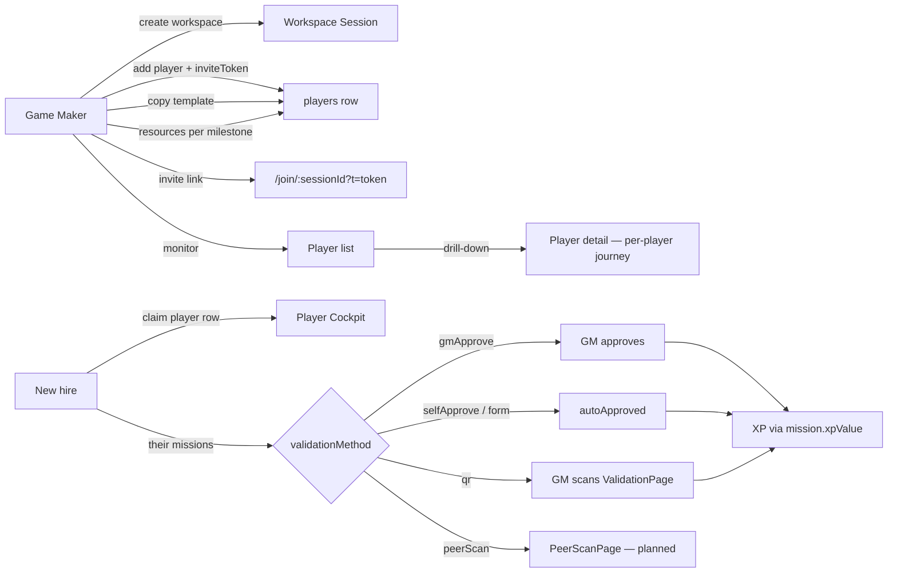

# Production Implementation Plan — MesseBuddy

**Status:** Active · single source of truth for spec alignment and production testing prep  
**Last updated:** 2026-07-05  
**Supersedes:** All other files previously in `plans/` (audits, gap analysis, UI redesign backlog)

---

## Authority hierarchy

| Document | Role |
| -------- | ---- |
| [`SPECS.md`](../SPECS.md) | **Product behavior** — terminology, constraints (C-*), routes, Decision Log |
| [`docs/README.md`](../docs/README.md) | Architecture diagrams (PlantUML) — hire lifecycle, QR routing, data model |
| **This file** | **Implementation status** — what is done, what is open, how to test, fix order |
| [`AGENTS.md`](../AGENTS.md) | Agent/dev workflow — stack, commands, UI layers |

When SPECS and code disagree, **SPECS wins**; track gaps here until closed.

---

## Production testing prerequisites

1. **Stack:** `docker compose build app && docker compose up app` — served at **`http://localhost:8700/`** (not Vite `:5173` alone).
2. **Wait for user confirmation** before live smoke tests after a rebuild.
3. **Mock vs production:** `DemoAwareAdapterProvider` routes per-profile — `isDemo: true` → `mockAdapter`; otherwise → real PocketBase. Demo session `sess_mmt2026` is always mock.
4. **Workspace model (2026-07-05):** One GM → one **workspace session**. **Players**
   are first-class `players` rows (invited or claimed). Milestones/missions are
   **per-player**; **resources** per-milestone (`milestoneId`). GM identity in
   PocketBase (`players.role = gamemaker`). Per-player **`inviteToken`** invite
   URLs. See SPECS.md § Workspace & player model.

---

## Target product loop (from SPECS — revised 2026-07-05)

**QoL (secondary):** buddy card, per-milestone resources, AI chat, tutorial, pre-boarding checklist, templates, map background.

---

## Implementation status dashboard

### Done (verified in code or prior live smoke)

| ID | Item | Spec / ref | Notes |
| -- | ---- | ---------- | ----- |
| ✅ | Hire list shows pending + joined hires | C-24 (legacy) | **Superseded by ARCH-05** — still lists sessions today |
| ✅ | Logout leaves profile in `localStorage` | C-23 | GM + player navigate to `/` only |
| ✅ | Single “Add new hire” CTA when list empty | Smoke #20 | Becomes “Add player” in ARCH-05 |
| ✅ | Mission editor back respects dirty state | Smoke #25b | `MissionBottomSheet.attemptBack` + `ConfirmSheet` |
| ✅ | XP-only missions | OD-02, C-04 | `xpValue` on save; `XpSelector` 5/10/15/20 |
| ✅ | Hire creation navigation race | Audit 07-01 §1.1 | PB `requestKey` / sequencing fix |
| ✅ | QR validation route for real hires | Audit 07-01 P2 §1 | `ValidationPage` resolves GM via `gameMakerId` |
| ✅ | Form schema saved on first create | Audit 07-01 P2 §2 | `saveMissions` uses `createMission` return id |
| ✅ | Post-QR `goToAdmin` uses home session | Audit 07-01 P2 follow-up | `ValidationPage` → `identity.sessionId` |
| ✅ | `/join/:sessionId` prefills session code | Audit 07-03 fixed | `useLandingFlow` |
| ✅ | Tutorial skip persists | Audit 07-03 fixed | `tutorialComplete` on player |
| ✅ | Stale GM workspace session detection | Partial §6 | `useSessionExists` on `AdminHomePage` |
| ✅ | **P-01** Admin draft projection | C-22 | `selectedMilestone` derived; `missionOrderChanges` in `sheetMissions` |
| ✅ | **P-07** Player stale-session error UI | C-23 area | `session-missing` card + remove profile |
| ✅ | **P-16** GM Journey Map XP before join | C-04 | `computeProgress` fallback in `useHireDetailPage` |
| ✅ | **P-17** Orphaned profile badge on landing | Landing UX | `orphanedUids` + `ProfileCard` confirm-remove |
| ✅ | **P-18** Auto-resume last-active profile | Landing/auth | `RootRedirect` + `mb_active_uid` |
| ✅ | Core loops (selfApprove, gmApprove, resources, buddy after join, templates) | Audit 07-01 P2 §3 | Re-verify after ARCH phase |

### Open — blocks or misleads in production

| Priority | ID | Item | Spec | Status |
| -------- | -- | ---- | ---- | ------ |
| **P0** | **ARCH** | **Workspace architecture migration** | C-26, glossary | **Blocks all feature work.** See Phase 0 below. Subsumes **P-15**. |
| P0 | **P-02** | `peerScan` validation not implemented | C-25, glossary | No `PeerScanPage`, `peer_scans` collection, or admin feed |
| P1 | **P-03** | Invite uses per-player `inviteToken` | C-27 | Wire `?t=` claim path; remove dead shared-link-only code |
| P1 | **P-04** | Buddy save no-ops before player joins | QoL | `useBuddyProfile.upsertBuddy` returns if `!playerId` |
| P1 | **P-05** | “Suggested next step” wrong on empty hire | Analytics | Needs re-verification on empty **player** journey |
| P2 | **P-06** | Settings referenced but missing | Tutorial copy | Skip dialog says “from settings”; avatar disabled |
| P2 | **P-08** | Landing session-code examples confuse | Join flow | Demo/mock IDs shown as valid codes |
| P2 | **P-09** | AI assistant no upfront unavailable state | QoL | Generic error only after send |
| P3 | **P-10** | Admin shows `player.name` not `preferredName` | Smoke #24 | Hire header ignores `preferredName` |
| P3 | **P-11** | No starter template on add player | OD-20 | New players empty until GM applies template |
| P3 | **P-12** | QR scanner has no manual token entry | C-07 UX | Camera-only in `QRScannerView` |
| P3 | **P-13** | Admin invite QR uses external CDN | Robustness | `SessionInviteCard` CDN script |
| P3 | **P-14** | ValidationPage shows raw player UID | UX | Cosmetic GM field |

### Superseded / folded into ARCH

| ID | Item | Notes |
| -- | ---- | ----- |
| ~~P-15~~ | GM home session doubles as hire #1 | Root cause: `createSession` per hire. **Fixed by ARCH-05** (players not sessions). |
| ~~P-01~~ | Admin draft projection | Done — re-verify after `playerId` scoping |
| ~~P-07~~ | Player stale-session UI | Done |
| ~~P-16~~ | GM Journey Map 0/0 XP | Done — re-verify per-player scope |
| ~~P-17~~ | Orphaned profiles on landing | Done |
| ~~P-18~~ | Auto-resume at `/` | Done |

### By design (not bugs — document for testers)

| Item | Note |
| ---- | ---- |
| Resources workspace-scoped only | **Superseded** — per-milestone via `milestoneId` (OD-22) |
| `mandatory` tag cosmetic | No enforcement logic — badge only |
| Mock `gmApprove` auto-completes in 4s | Production stays `pendingApproval` until GM acts |
| Chat messages not persisted | Ephemeral `useChat` state |
| PB `difficulty` field | Legacy column; adapter sends `difficulty: 1` on create; **XP authoritative via `xpValue`** |

---

## Phased work plan

### Phase 0 — Workspace architecture (BLOCKING — start here)

**Goal:** Align PocketBase schema, adapters, routes, and hooks with SPECS.md
workspace model (decision 2026-07-05). No new features until this phase ships.

| Task | ID | Files / area | Acceptance |
| ---- | -- | ------------ | ---------- |
| PB migration: `players.role` (UserRole), `jobTitle`, `claimStatus`, `inviteToken`; legacy job `role` → `jobTitle` | ARCH-01 | `server/pb_migrations/`, `domain.ts` | GM signup creates `players` row + workspace; add player generates `inviteToken` |
| PB migration: `milestones.playerId`, `missions.playerId`, `resources.milestoneId` | ARCH-02 | migrations | Per-player journeys; resources per milestone |
| Adapter: `createPlayer`, `getPlayerByInviteToken`, `claimPlayerByInviteToken` | ARCH-03 | adapters, `joinSession.ts` | Invite URL claim + multi-device recovery |
| Routes + `AdminHomePage` tabs (Players \| Resources) | ARCH-04 | `App.tsx`, `AdminHomePage` | Resources tab CRUD; `/admin/:sid/player/:pid` |
| Replace `useGmHires` with `useGmPlayers` | ARCH-05 | `gmHires.ts`, `AdminHomePage`, `joinSession.ts` | `createHire` → `createPlayer`; list shows players not sessions; **no duplicate workspace row** |
| Update `importTemplate` for per-player + milestone resources | ARCH-06 | `importTemplate.ts` | Template paste targets selected player |
| Player cockpit: fetch milestones/missions for logged-in `playerId` | ARCH-07 | `useSession`, `usePlayerCockpitPage` | Player sees only their journey |
| Docs: `hire-lifecycle.puml`, `pb-schema.md`, `AGENTS.md` routes | ARCH-08 | `docs/` | Diagrams match spec |

**Invite (OD-25 resolved):** `createPlayer` always sets `inviteToken`. Join flow
reads `?t=` → claim or recover. Multi-device: same token + recovery key (OD-27:
last-write-wins, no conflict UI).

**Verify:** `deno task build` · full smoke on `:8700` after migration + data reset.

### Phase 1 — Spec alignment quick wins ✅ (2026-07-03)

Completed in this pass:

- C-23 logout behavior  
- C-24 hire list  
- Smoke #20 duplicate CTA  
- Smoke #25b editor back guard  
- OD-02 XP-only + C-04 threshold sync on save  

**Verify:** `deno task build` · manual smoke on `:8700` after rebuild.

### Phase 2 — Admin editor correctness ✅ (mostly done — re-verify post-ARCH)

**Goal:** GM edits in Customize tab match what saves and what the player sees.

| Task | Files | Acceptance |
| ---- | ----- | ---------- |
| ~~Project `missionOrderChanges` into mission list~~ | `useHireDetailPage.ts` | ✅ P-01 — re-verify with `playerId` filter |
| ~~Sync `selectedMilestone` from `draftMilestones`~~ | `useAdminMilestoneEditor.ts` | ✅ P-01 |
| Regression: XP + form schema on create | `useAdminMissionEditor.ts` | New form mission fields persist in one save |

### Phase 3 — Invite & identity hardening

| Task | Decision needed | Acceptance |
| ---- | --------------- | ---------- |
| Wire per-player `inviteToken` claim (`?t=`) | — | ✅ folded into ARCH-03 / C-27 |
| ~~Player stale-session error UI~~ | — | ✅ P-07 |
| Landing placeholder codes | — | No demo session id as “try this” example |
| ~~Auto-resume last-active profile at `/`~~ | — | ✅ P-18 |
| ~~Orphaned profile badge~~ | — | ✅ P-17 |

### Phase 4 — `peerScan` (new feature)

Per SPECS glossary and [`docs/mission-validation-flow.puml`](../docs/mission-validation-flow.puml):

1. PB migration: `peer_scans` collection + unique `(missionId, playerId, scannerDeviceId)`  
2. `PeerScanPage` route `/peer/:sessionId?t=`  
3. Player `QRDisplay` variant for peer missions  
4. GM analytics feed  
5. Resolve OD-21 (fixed name form vs mission `FormSchema`)

### Phase 5 — QoL & production polish

Lower priority until Phases 2–4 stable:

- OD-20 auto-seed “Complete Your Profile” on **add player**  
- P-04 buddy form disabled state when no player  
- P-05 analytics empty-state copy  
- P-06 minimal settings / fix tutorial copy  
- P-10 `preferredName` on admin hire header  
- Player profile fields visibility (see gap register G-05 in appendix)  
- Admin form-response review UI (G-03)  
- Pre-boarding visible to player (G-04)  

### Phase 6 — UI redesign backlog (historical)

The 2026-06 UI redesign doc (`UI_Redesign_Planning.md`) targeted `AdminCockpitPage` tab restructure. **Current architecture superseded that:**

| Redesign intent | Current state |
| --------------- | ------------- |
| New Hires as primary GM view | ✅ `AdminHomePage` |
| Per-player detail (customize, analytics, buddy) | ✅ `HireDetailPage` → **`PlayerDetailPage`** in ARCH-04 |
| Map/mission editing per hire | ✅ Customize tab — **per `playerId`** after ARCH-02 |

Remaining redesign ideas (sort control on hire list, dynamic tutorial, profile/settings) live in Phase 5 or open issues — not separate page architecture.

---

## Open issues — detail

### P-01 · Admin draft projection (C-22)

**Symptoms:** Milestone rename in open sheet shows stale name; mission reorder in list reverts visually after drag.

**Root cause:**

- `useAdminMilestoneEditor` keeps `selectedMilestone` as snapshot at `openMilestone` time.  
- `useHireDetailPage.sheetMissions` filters server `missions` by milestone but does not apply `missionOrderChanges`.

**Fix direction:** Derive display milestone from `draftMilestones.get(selectedMilestoneId) ?? serverMilestone`. Merge order overrides into `sheetMissions` before passing to `MissionBottomSheet`.

---

### P-02 · `peerScan` not implemented

**Spec:** Fourth validation method — crowd QR, no scanner identity, dedupe by `scannerDeviceId` (C-25).

**Gap:** Types may reference `peerScan` in unions; no route, page, adapter methods, or PB collection.

---

### P-03 · Invite token vs shared link

**UI says:** “Send [Name] their onboarding link” (personal).  
**Code does:** `SessionInviteCard.tsx` → `${origin}/join/${sessionId}` — anyone can join as new player.

**Parallel dead code:** `generateInviteToken`, `buildInviteUrl`, `claimPlayerSlot`, `getPlayerByInviteToken` path in `useLandingFlow`.

**Fix:** Pick one — wire token + pending player row, or simplify copy and remove unused claim path.

---

### P-04 · Buddy assignment before join

**Root cause:** `useBuddyProfile.ts` — `if (!playerId) return;`  
**Fix:** Disable save + inline copy, or store buddy against session until player exists.

---

### P-05 · Analytics “All tasks complete” on empty hire

**Root cause:** `HireAnalytics.tsx` `nextTask` loop finds no missions → falls through to completion message.  
**Fix:** Distinguish `missions.length === 0` → “No missions set up yet — add some in Customize.”

---

### P-06 · Settings / tutorial mismatch

Tutorial skip: *“complete the tutorial later from settings.”* No settings route; `TopBar` avatar disabled without `onAvatarClick`.

**Fix:** Minimal settings sheet (replay tutorial, recovery key) **or** change copy and hide avatar until implemented.

---

### P-15 · GM home session doubles as hire #1 → **Superseded by ARCH**

**Status:** Folded into **Phase 0 (ARCH-05)**. Root cause was treating each hire as
`adapter.createSession()`. Target: `createPlayer()` on the workspace session only.

**Historical note (2026-07-03):** `createGameMakerSession` and `useGmHires.createHire`
both called `createSession`, so the workspace appeared as hire #1.

---

### ARCH · Workspace architecture migration

**Decision (2026-07-05):**

- One GM → one workspace `sessions` row
- Players = `players` rows (`role=player`, `claimStatus`, `inviteToken`)
- GM = `players` row (`role=gamemaker`) + `sessions.gameMakerId`
- Milestones/missions: `playerId` FK
- Resources: `milestoneId` FK (Resources tab + milestone editor)
- `role` = user type; `jobTitle` = UI only
- Invite: `/join/:sessionId?t=:inviteToken`; multi-device via recovery (OD-27)
- Hire list = `listPlayers(sessionId)` filtered to `role=player`
- Drill-down = `/admin/:sessionId/player/:playerId`

See SPECS.md § Workspace & player model for the authoritative diagram.

---

### P-16 · GM Journey Map "Total XP" reads 0/0 before player joins

**Found:** Live smoke test, 2026-07-03 — added a 15 XP mission to a milestone on a hire with no player yet. Player-side cockpit (once joined) correctly showed "0 / 15 XP" immediately. GM-side `HireDetailPage` Journey Map widget showed "0 / 0 XP" both before and after a full page reload, and only flipped to "0 / 15 XP" once the player had joined.

**Root cause:** Not yet isolated — the underlying `xpThreshold` sync (C-04, marked Done) is clearly computing correctly somewhere, since the player view gets it right pre-approval. The GM widget likely reads a player-scoped progress object that doesn't populate until `listPlayers(sessionId)` returns a row, rather than deriving straight from `missions`/`milestones` the way the player cockpit does.

**Why it matters:** A GM building out a hire's missions before sending the invite link has no way to sanity-check milestone XP totals during setup — the number just reads zero regardless of what's been saved.

**Fix direction:** Find the GM-side total-XP computation (likely in `HireDetailPage.tsx` or a hook it calls) and confirm whether it's gated on `player` existing; if so, fall back to summing `mission.xpValue` directly from `missions`/`milestones` when there's no player yet, matching what the player cockpit already does.

---

### P-17 · Orphaned local identities are silent dead ends

**Found:** Live smoke test, 2026-07-03. The landing page had four leftover non-demo profiles from prior test sessions. Clicking "Resume as Nadia Kessler" (Employee, stale session) did nothing visible — no navigation, no error, no toast. Resuming a stale GM profile ("gsfdg") did navigate, landing on an in-page "This session could not be found... Remove this profile" card — but only *after* the click, with no prior indication on the profile list that this would happen.

**Root cause:** `handleResume` in `useLandingFlow.ts` (lines 224-229) calls `navigate(dest, { replace: true })` unconditionally from the cached identity — there's no backend existence check at the list level. `ProfileCard.tsx` has no concept of an orphaned/dead state at all: no styling variant, no badge, and its `onClick` always calls `onResume` directly. The existence check that does exist (`useSessionExists.ts`) is only ever invoked *after* navigating, on `AdminHomePage` — it's not wired into the player route at all, which is why the Employee case fails completely silently (this is the mechanism behind the already-tracked P-07).

**Product spec (Hoon, 2026-07-03):** Any cached identity with no corresponding backend session should be visually marked "User removed" and rendered with a red/muted variant on the profile list. Clicking a marked-dead profile should open a delete-confirmation dialog instead of attempting to resume it.

**Fix direction:**
- On landing mount, batch-check each non-demo cached identity's session existence (extend or reuse the `adapter.getSession` pattern from `useSessionExists.ts`, ideally batched rather than N sequential calls for N cached profiles).
- Thread an `isOrphaned`/`missing` flag through `ProfileList.tsx` → `ProfileCard.tsx`.
- In `ProfileCard.tsx`: render a "User removed" badge and a red/muted card variant when orphaned; change the card's `onClick` to open a confirm-delete dialog (reuse the existing `ConfirmSheet` pattern used elsewhere, e.g. `MissionBottomSheet.attemptBack`) instead of calling `onResume`, and wire its confirm action to the existing `handleRemoveProfile` (`useLandingFlow.ts:231`).
- Related: P-07 (player cockpit bounces silently on a stale session reached via direct/QR navigation, not just from the landing list) should be re-tested once this lands, since fixing the list-level check doesn't by itself fix navigation from an invite/QR link to a since-deleted session.

**Superseded scope (see P-18):** with P-18's auto-redirect shipped, the picker is no longer the default view for a returning user — it's specifically what renders when the last-active profile turns out to be dead. The "User removed" badge described above is what explains *why* the user landed on the picker instead of their dashboard, so it still needs to exist, but the batch existence-check across every cached profile can wait until the picker is actually shown (on-demand, not on every app boot).

---

### P-18 · No "return to last session" on app boot

**Product decision (Hoon, 2026-07-04):** `"/"` should default to the dashboard of the profile the user last logged into. The full profile picker (current landing page) should only render when the user has explicitly logged out without logging back in, or has never created a profile.

**Current state:** `useIdentity.ts` stores `mb_identity` as an array of `CachedIdentity` under one key — there is no "which one is active" pointer, only the list, in insertion order. `RequireRole.tsx` is a synchronous, cache-only guard: it matches `sessionId` + `role` against the cached list and redirects to `/` if nothing matches, with no backend call. `App.tsx` renders `<LandingPage />` unconditionally at `"/"` and again at `/join/:sessionId`.

**Recommended architecture:**

1. **New pointer, separate from the profile list.** Add `mb_active_uid` (single uid, not a full identity) alongside `mb_identity` in `useIdentity.ts`. Set it wherever `useLandingFlow.ts` currently calls `setIdentity` + `navigate` on success — `handleResume`, `handleCreateAdmin`, and the join-flow completion.
2. **Resolve it above the picker, not inside it.** Replace `{ path: "/", element: <LandingPage /> }` in `App.tsx` with a new `RootRedirect` component. On mount: read `mb_active_uid` synchronously; if it matches a cached profile, `<Navigate>` immediately to `/admin/:sessionId` (GM) or `/session/:sessionId` (Player) — no picker flash. If unset or no match, render `LandingPage`. This mirrors the sync-cache-then-async-validate pattern `RequireRole` already uses.
3. **Logout clears the pointer, not the profile.** Current logout behavior (C-23 — profile stays cached) is correct and unchanged; just also clear `mb_active_uid` there. That alone satisfies the "explicit logout" condition.
4. **Empty list ⇒ no pointer ⇒ picker.** Falls out for free — covers "never created a profile."
5. **`/join/:sessionId` is unaffected.** It should never auto-redirect to an old dashboard — visiting a join link means "I want this session," not "resume where I left off." Leave it rendering `LandingPage` directly, untouched by `RootRedirect`.
6. **Dead last-active profile (decided 07-04):** `RootRedirect` redirects optimistically per (2); the destination page's existing guard (`useSessionExists` on GM side; player-side equivalent once P-07 is fixed) bounces back to `/` and clears `mb_active_uid` on a 404. Landing back on the picker then shows that one profile flagged via P-17's "User removed" badge, so the bounce is explained rather than silent.
7. **Switch-profile affordance (decided 07-04, scope now):** since TopBar has no avatar/menu (P-06), auto-redirect makes explicit Log Out the only way back to the picker. Add a minimal "Switch profile" link on `AdminHomePage` / `PlayerCockpitPage` (routes to `/` with `mb_active_uid` cleared, same effect as logout minus actually logging out) rather than deferring this to the full P-06 settings sheet. Placement/exact copy is an open implementation detail, not yet decided.

**Files:** `src/hooks/useIdentity.ts` (add pointer + accessor), new `src/pages/RootRedirect.tsx` (or similar), `src/App.tsx` (swap `"/"` element), `src/hooks/useLandingFlow.ts` (set pointer on success paths), logout handler (wherever "Log Out" is wired — `AdminHomePage.tsx` / `PlayerCockpitPage.tsx` topbar action), `RequireRole.tsx` / `useSessionExists.ts` (reuse for the dead-pointer bounce-back), `ProfileCard.tsx` (P-17's badge, now also serves this flow).

**Not yet decided:** exact placement/copy for the "Switch profile" link (item 7); whether GM's "dashboard" should ever be deeper than `/admin/:sessionId` (e.g. last-viewed hire) — recommend starting with the hire list only, revisit if it's not enough.

---

## Production smoke test checklist

Run on **`http://localhost:8700/`** after confirmed deploy.

### Game Maker

- [ ] Create workspace → lands on **empty player list** (not a phantom hire)
- [ ] Add player → `inviteToken` generated; invite URL `/join/:sid?t=`
- [ ] Open same invite on second device → recovery → same progress from PB
- [ ] Pending player card shows “Not joined yet”; claimed player shows progress
- [ ] Log out → landing; resume profile still available
- [ ] Resources tab on admin home — CRUD + milestone filter
- [ ] Resources visible in player milestone sidebar (linked via `milestoneId`)
- [ ] Apply template to selected player → milestones/missions/resources for that player
- [ ] Create mission with XP 15 → save → player sees 15 XP on card
- [ ] Milestone `xpThreshold` equals sum of mission XP in that milestone
- [ ] Form mission: add fields → single save → player form renders fields
- [ ] Reorder missions in sheet → order holds until save (after P-01 fix)
- [ ] Editor back with unsaved edits → confirm sheet
- [ ] Invite link opens join flow with session prefilled
- [ ] gmApprove: pending panel → approve → player XP updates
- [ ] QR: simulate scan → ValidationPage → confirm → returns to GM home (not landing)
- [ ] Stale GM profile (deleted session) → error card with remove option

### Player

- [ ] Join via invite → cockpit with configured content
- [ ] selfApprove mission → immediate XP
- [ ] gmApprove → waiting state → GM approve → XP
- [ ] Form mission → submit → profile fields saved
- [ ] Leave session → landing; profile preserved
- [ ] Tutorial skip does not reappear on reload

### Regression guards

- [ ] No `deriveXP` / difficulty in admin mission editor
- [ ] `deno task build` and `deno task lint` pass
- [ ] PR CI (`.github/workflows/pr-check.yml`) green

---

## Resolved decisions (do not re-litigate)

Authoritative register: [`SPECS.md` § Decision Log](../SPECS.md).

| ID | Decision |
| -- | -------- |
| D-ARCH | Workspace model; `role`/`jobTitle` split; per-player inviteToken; resources per-milestone |
| OD-14 | `players.role` in PB; localStorage cache |
| OD-22 / OD-26 | `resources.milestoneId`; Resources tab + milestone editor |
| OD-25 / OD-27 | Per-player inviteToken URL; multi-device last-write-wins |
| OD-02 | XP is GM-set `xpValue` only |
| OD-08 | Per-mission `validationMethod` |
| OD-09 | SSE/polling hook-internal (C-20) |
| D-C04 | `xpThreshold` = sum of mission XP in milestone |

---

## Appendix A — Gap register (display & data visibility)

Condensed from integration gap analysis. **Not production blockers** unless marked P-* above.

| ID | Gap | Priority |
| -- | ----- | -------- |
| G-03 | No admin UI for form `formResponse` review | Phase 5 |
| G-04 | Pre-boarding checks not shown to player | Phase 5 |
| G-05 | Many `Player` profile fields collected but not displayed | Phase 5 |
| G-06 | `avatarUrl` not passed to `TopBar` | Polish |
| G-07 | Buddy `avatarUrl` unused | Polish |
| G-08 | `suggestedDueDate` not on player cards | Polish |
| G-09 | Link missions: `externalUrl` not on card (only popup) | Polish |
| G-16 | Static tutorial `PLACEHOLDER_STEPS` | Polish |
| G-17 | Static “Your onboarding journey starts here.” | Polish |

---

## Appendix B — Key file map

| Area | Files |
| ---- | ----- |
| Spec | `SPECS.md`, `docs/*.puml`, `docs/pb-schema.md` |
| **ARCH — player list** | `src/hooks/useProgress/gmHires.ts` → `useGmPlayers.ts`, `AdminHomePage.tsx` |
| **ARCH — GM signup** | `src/use-cases/joinSession.ts` (`createGameMakerSession`) |
| Player detail / save | `src/pages/hire-detail/useHireDetailPage.ts` → `player-detail/` (ARCH-04) |
| Mission editor | `src/hooks/useAdminMissionEditor.ts`, `MissionBottomSheet.tsx` |
| Milestone editor | `src/hooks/useAdminMilestoneEditor.ts` |
| Templates | `src/use-cases/importTemplate.ts`, `exportTemplate.ts` |
| Landing / profiles | `src/hooks/useLandingFlow.ts`, `useIdentity.ts`, `RootRedirect.tsx` |
| Adapters | `src/adapters/mock/mockAdapter.ts`, `pocketbase/pbAdapter.ts` |

---

## Changelog

| Date | Change |
| ---- | ------ |
| 2026-07-05 | SPECS Decision Log consolidated; implementation meta removed from spec body |
| 2026-07-05 | Clarified inviteToken, resources per-milestone, `role` vs `jobTitle` |
| 2026-07-04 | P-18 added: auto-resume last-active profile at `/` |
| 2026-07-03 | Live smoke test on `:8700` (GM + Player flow, gmApprove end-to-end) surfaced P-15, P-16, P-17; flagged P-05 for re-verification (observed already-fixed behavior on an empty hire) |
| 2026-07-03 | Created consolidated plan; superseded 5 prior `plans/` documents |
| 2026-07-03 | Phase 1 complete: C-23, C-24, XP-only (OD-02), smoke #20/#25b |
| 2026-07-01 | Prior audits: hire race, QR guard, form schema, core loop verification |
| 2026-06-30 | Integration gap analysis (input/storage matrix, G-01–G-19) |
