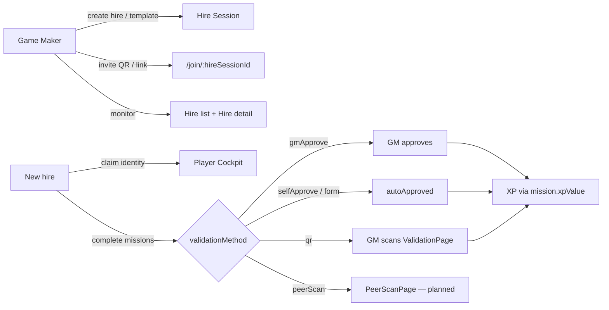

# Production Implementation Plan — MesseBuddy

**Status:** Active · single source of truth for spec alignment and production testing prep  
**Last updated:** 2026-07-03  
**Supersedes:** All other files previously in `plans/` (audits, gap analysis, UI redesign backlog)

---

## Authority hierarchy

| Document | Role |
| -------- | ---- |
| [`SPECS.md`](../SPECS.md) | **Product behavior** — terminology, constraints (C-*), routes, validation flows |
| [`docs/README.md`](../docs/README.md) | Architecture diagrams (PlantUML) — hire lifecycle, QR routing, data model |
| **This file** | **Implementation status** — what is done, what is open, how to test, fix order |
| [`AGENTS.md`](../AGENTS.md) | Agent/dev workflow — stack, commands, UI layers |

When SPECS and code disagree, **SPECS wins**; track gaps here until closed.

---

## Production testing prerequisites

1. **Stack:** `docker compose build app && docker compose up app` — served at **`http://localhost:8700/`** (not Vite `:5173` alone).
2. **Wait for user confirmation** before live smoke tests after a rebuild.
3. **Mock vs production:** `DemoAwareAdapterProvider` routes per-profile — `isDemo: true` → `mockAdapter`; otherwise → real PocketBase. Demo session `sess_mmt2026` is always mock.
4. **Two-tier sessions:** GM **home session** (`/admin/:homeSessionId`) owns hires; each **hire** is its own session (`/admin/:homeSessionId/hire/:hireSessionId`). QR/validate URLs use the **hire** session id; route guards must resolve GM identity via `gameMakerId`, not exact session id match.

---

## Target product loop (from SPECS)

**QoL (secondary):** buddy card, resources, AI chat, tutorial, pre-boarding checklist, templates, map background.

---

## Implementation status dashboard

### Done (verified in code or prior live smoke)

| ID | Item | Spec / ref | Notes |
| -- | ---- | ---------- | ----- |
| ✅ | Hire list shows pending + joined hires | C-24 | `AdminHomePage` — no `filter(joined)` |
| ✅ | Logout leaves profile in `localStorage` | C-23 | GM + player navigate to `/` only |
| ✅ | Single “Add new hire” CTA when list empty | Smoke #20 | Header button hidden when `hires.length === 0` |
| ✅ | Mission editor back respects dirty state | Smoke #25b | `MissionBottomSheet.attemptBack` + `ConfirmSheet` |
| ✅ | XP-only missions | OD-02, C-04 | `xpValue` on save; `XpSelector` 5/10/15/20; `computeMilestoneThreshold`; removed `deriveXP` / `difficulty` |
| ✅ | Hire creation navigation race | Audit 07-01 §1.1 | PB `requestKey` / sequencing fix |
| ✅ | QR validation route for real hires | Audit 07-01 P2 §1 | `ValidationPage` resolves GM via `gameMakerId` |
| ✅ | Form schema saved on first create | Audit 07-01 P2 §2 | `saveMissions` uses `createMission` return id |
| ✅ | Post-QR `goToAdmin` uses home session | Audit 07-01 P2 follow-up | `ValidationPage` → `identity.sessionId` |
| ✅ | `/join/:sessionId` prefills session code | Audit 07-03 fixed | `useLandingFlow` |
| ✅ | Tutorial skip persists | Audit 07-03 fixed | `tutorialComplete` on player |
| ✅ | Stale GM home session detection | Partial §6 | `useSessionExists` on `AdminHomePage` |
| ✅ | Core loops (selfApprove, gmApprove, resources, buddy after join, templates) | Audit 07-01 P2 §3 | Re-verify after each major change |

### Open — blocks or misleads in production

| Priority | ID | Item | Spec | Status |
| -------- | -- | ---- | ---- | ------ |
| P0 | **P-01** | Admin draft projection broken | C-22 | `selectedMilestone` snapshot stale; `missionOrderChanges` not merged into `sheetMissions` — reorder snaps back (smoke #25a, #26) |
| P0 | **P-02** | `peerScan` validation not implemented | C-25, glossary | No `PeerScanPage`, `peer_scans` collection, or admin feed |
| P1 | **P-03** | Invite link is shared URL, not token claim | Hire invite | `SessionInviteCard` uses `/join/:id` only; `buildInviteUrl` / `claimPlayerSlot` unused (audit §5) |
| P1 | **P-04** | Buddy save no-ops before player joins | QoL | `useBuddyProfile.upsertBuddy` returns if `!playerId`; UI still active (audit §1) |
| P1 | **P-05** | “Suggested next step” wrong on empty hire | Analytics | Empty milestones → “All tasks complete 🎉” (`HireAnalytics.tsx`) |
| P2 | **P-06** | Settings referenced but missing | Tutorial copy | Skip dialog says “from settings”; avatar disabled everywhere (`TopBar`) |
| P2 | **P-07** | Stale **player** identity silent failure | C-23 area | GM home has `useSessionExists`; player cockpit may still bounce silently |
| P2 | **P-08** | Landing session-code examples confuse | Join flow | Demo/mock IDs shown as valid codes (audit §7) |
| P2 | **P-09** | AI assistant no upfront unavailable state | QoL | Generic error only after send (audit §9) |
| P3 | **P-10** | Admin shows `player.name` not `preferredName` | Smoke #24 | Form mission saves `preferredName`; hire header ignores it |
| P3 | **P-11** | No starter template on `createHire` | OD-20 | New hires empty until GM applies template (smoke #21) |
| P3 | **P-12** | QR scanner has no manual token entry | C-07 UX | Camera-only in `QRScannerView` |
| P3 | **P-13** | Admin invite QR uses external CDN | Robustness | `SessionInviteCard` CDN script; mission QR uses bundled `qrcode` |
| P3 | **P-14** | ValidationPage shows raw player UID | UX | Cosmetic GM field |

### By design (not bugs — document for testers)

| Item | Note |
| ---- | ---- |
| Resources session-scoped only | OD-22 — no `missionId` FK in v1 (smoke #22) |
| `mandatory` tag cosmetic | No enforcement logic — badge only |
| Mock `gmApprove` auto-completes in 4s | Production stays `pendingApproval` until GM acts |
| Chat messages not persisted | Ephemeral `useChat` state |
| PB `difficulty` field | Legacy column; adapter sends `difficulty: 1` on create; **XP authoritative via `xpValue`** |

---

## Phased work plan

### Phase 1 — Spec alignment quick wins ✅ (2026-07-03)

Completed in this pass:

- C-23 logout behavior  
- C-24 hire list  
- Smoke #20 duplicate CTA  
- Smoke #25b editor back guard  
- OD-02 XP-only + C-04 threshold sync on save  

**Verify:** `deno task build` · manual smoke on `:8700` after rebuild.

### Phase 2 — Admin editor correctness (next)

**Goal:** GM edits in Customize tab match what saves and what the player sees.

| Task | Files | Acceptance |
| ---- | ----- | ---------- |
| Project `missionOrderChanges` into mission list | `useHireDetailPage.ts` (`sheetMissions`) | Reorder in sheet persists in UI until save; order written on save |
| Sync `selectedMilestone` from `draftMilestones` | `useAdminMilestoneEditor.ts` | Rename milestone in sheet header reflects draft before save |
| Regression: XP + form schema on create | `useAdminMissionEditor.ts` | New form mission fields persist in one save |

### Phase 3 — Invite & identity hardening

| Task | Decision needed | Acceptance |
| ---- | --------------- | ---------- |
| Wire token invite **or** delete dead claim code | Product: single-use vs shared link | One mechanism; UI copy matches behavior |
| Player stale-session error UI | — | 404 on `getSession` → “Remove profile?” not blank cockpit |
| Landing placeholder codes | — | No demo session id as “try this” example on production build |

### Phase 4 — `peerScan` (new feature)

Per SPECS glossary and [`docs/mission-validation-flow.puml`](../docs/mission-validation-flow.puml):

1. PB migration: `peer_scans` collection + unique `(missionId, playerId, scannerDeviceId)`  
2. `PeerScanPage` route `/peer/:sessionId?t=`  
3. Player `QRDisplay` variant for peer missions  
4. GM analytics feed  
5. Resolve OD-21 (fixed name form vs mission `FormSchema`)

### Phase 5 — QoL & production polish

Lower priority until Phases 2–4 stable:

- OD-20 auto-seed “Complete Your Profile” on `createHire`  
- P-04 buddy form disabled state when no player  
- P-05 analytics empty-state copy  
- P-06 minimal settings / fix tutorial copy  
- P-10 `preferredName` on admin hire header  
- Player profile fields visibility (see gap register G-05 in appendix)  
- Admin form-response review UI (G-03)  
- Pre-boarding visible to player (G-04)  

### Phase 6 — UI redesign backlog (historical)

The 2026-06 UI redesign doc (`UI_Redesign_Planning.md`) targeted `AdminCockpitPage` tab restructure. **Current architecture superseded that:**

| Redesign intent | Current state |
| --------------- | ------------- |
| New Hires as primary GM view | ✅ `AdminHomePage` |
| Per-hire detail (customize, analytics, buddy) | ✅ `HireDetailPage` |
| Map/mission editing per hire | ✅ Customize tab + `MissionBottomSheet` |

Remaining redesign ideas (sort control on hire list, dynamic tutorial, profile/settings) live in Phase 5 or open issues — not separate page architecture.

---

## Open issues — detail

### P-01 · Admin draft projection (C-22)

**Symptoms:** Milestone rename in open sheet shows stale name; mission reorder in list reverts visually after drag.

**Root cause:**

- `useAdminMilestoneEditor` keeps `selectedMilestone` as snapshot at `openMilestone` time.  
- `useHireDetailPage.sheetMissions` filters server `missions` by milestone but does not apply `missionOrderChanges`.

**Fix direction:** Derive display milestone from `draftMilestones.get(selectedMilestoneId) ?? serverMilestone`. Merge order overrides into `sheetMissions` before passing to `MissionBottomSheet`.

---

### P-02 · `peerScan` not implemented

**Spec:** Fourth validation method — crowd QR, no scanner identity, dedupe by `scannerDeviceId` (C-25).

**Gap:** Types may reference `peerScan` in unions; no route, page, adapter methods, or PB collection.

---

### P-03 · Invite token vs shared link

**UI says:** “Send [Name] their onboarding link” (personal).  
**Code does:** `SessionInviteCard.tsx` → `${origin}/join/${sessionId}` — anyone can join as new player.

**Parallel dead code:** `generateInviteToken`, `buildInviteUrl`, `claimPlayerSlot`, `getPlayerByInviteToken` path in `useLandingFlow`.

**Fix:** Pick one — wire token + pending player row, or simplify copy and remove unused claim path.

---

### P-04 · Buddy assignment before join

**Root cause:** `useBuddyProfile.ts` — `if (!playerId) return;`  
**Fix:** Disable save + inline copy, or store buddy against session until player exists.

---

### P-05 · Analytics “All tasks complete” on empty hire

**Root cause:** `HireAnalytics.tsx` `nextTask` loop finds no missions → falls through to completion message.  
**Fix:** Distinguish `missions.length === 0` → “No missions set up yet — add some in Customize.”

---

### P-06 · Settings / tutorial mismatch

Tutorial skip: *“complete the tutorial later from settings.”* No settings route; `TopBar` avatar disabled without `onAvatarClick`.

**Fix:** Minimal settings sheet (replay tutorial, recovery key) **or** change copy and hide avatar until implemented.

---

## Production smoke test checklist

Run on **`http://localhost:8700/`** after confirmed deploy.

### Game Maker

- [ ] Create hire → lands on Customize (`?new=1`), hire appears on home list as **pending**
- [ ] Pending hire card shows “Not joined yet”; joined hire shows progress
- [ ] Log out → landing; resume profile still available
- [ ] Apply template → milestones/missions appear
- [ ] Create mission with XP 15 → save → player sees 15 XP on card
- [ ] Milestone `xpThreshold` equals sum of mission XP in that milestone
- [ ] Form mission: add fields → single save → player form renders fields
- [ ] Reorder missions in sheet → order holds until save (after P-01 fix)
- [ ] Editor back with unsaved edits → confirm sheet
- [ ] Invite link opens join flow with session prefilled
- [ ] gmApprove: pending panel → approve → player XP updates
- [ ] QR: simulate scan → ValidationPage → confirm → returns to GM home (not landing)
- [ ] Stale GM profile (deleted session) → error card with remove option

### Player

- [ ] Join via invite → cockpit with configured content
- [ ] selfApprove mission → immediate XP
- [ ] gmApprove → waiting state → GM approve → XP
- [ ] Form mission → submit → profile fields saved
- [ ] Leave session → landing; profile preserved
- [ ] Tutorial skip does not reappear on reload

### Regression guards

- [ ] No `deriveXP` / difficulty in admin mission editor
- [ ] `deno task build` and `deno task lint` pass
- [ ] PR CI (`.github/workflows/pr-check.yml`) green

---

## Resolved decisions (do not re-litigate)

| ID | Decision |
| -- | -------- |
| OD-02 | XP is GM-set `xpValue` only — no difficulty normalization |
| OD-08 | Per-mission `validationMethod` |
| OD-09 | SSE/polling is hook-internal (C-20) |
| C-04 | `xpThreshold` = sum of mission `xpValue` in milestone |

Full OD table: [`SPECS.md` § Open Decisions](../SPECS.md).

---

## Appendix A — Gap register (display & data visibility)

Condensed from integration gap analysis. **Not production blockers** unless marked P-* above.

| ID | Gap | Priority |
| -- | ----- | -------- |
| G-03 | No admin UI for form `formResponse` review | Phase 5 |
| G-04 | Pre-boarding checks not shown to player | Phase 5 |
| G-05 | Many `Player` profile fields collected but not displayed | Phase 5 |
| G-06 | `avatarUrl` not passed to `TopBar` | Polish |
| G-07 | Buddy `avatarUrl` unused | Polish |
| G-08 | `suggestedDueDate` not on player cards | Polish |
| G-09 | Link missions: `externalUrl` not on card (only popup) | Polish |
| G-16 | Static tutorial `PLACEHOLDER_STEPS` | Polish |
| G-17 | Static “Your onboarding journey starts here.” | Polish |

---

## Appendix B — Key file map

| Area | Files |
| ---- | ----- |
| Spec | `SPECS.md`, `docs/*.puml`, `docs/pb-schema.md` |
| Hire list / logout | `src/pages/AdminHomePage.tsx`, `src/hooks/useSessionExists.ts` |
| Hire detail / save | `src/pages/hire-detail/useHireDetailPage.ts`, `HireDetailOverlays.tsx` |
| Mission editor | `src/hooks/useAdminMissionEditor.ts`, `MissionBottomSheet.tsx`, `MissionEditor.tsx` |
| Milestone editor | `src/hooks/useAdminMilestoneEditor.ts` |
| XP threshold | `src/use-cases/computeMilestoneThreshold.ts` |
| Player leave | `src/pages/player-cockpit/usePlayerCockpitPage.ts` |
| QR validate | `src/pages/ValidationPage.tsx`, `src/utils/qrPayload.ts` |
| Invite | `src/components/admin/SessionInviteCard.tsx`, `src/utils/inviteUrl.ts`, `src/use-cases/joinSession.ts` |
| Progress | `src/use-cases/computeProgress.ts` |
| Adapters | `src/adapters/mock/mockAdapter.ts`, `src/adapters/pocketbase/pbAdapter.ts` |

---

## Changelog

| Date | Change |
| ---- | ------ |
| 2026-07-03 | Created consolidated plan; superseded 5 prior `plans/` documents |
| 2026-07-03 | Phase 1 complete: C-23, C-24, XP-only (OD-02), smoke #20/#25b |
| 2026-07-01 | Prior audits: hire race, QR guard, form schema, core loop verification |
| 2026-06-30 | Integration gap analysis (input/storage matrix, G-01–G-19) |
