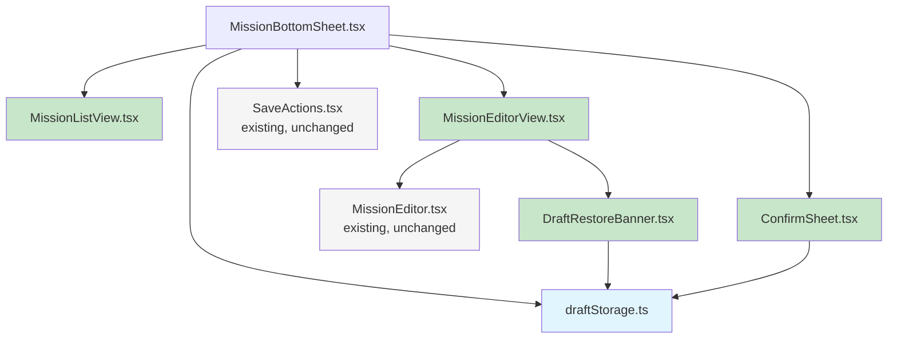

# Refactor `MissionBottomSheet.tsx`

## Problem

[`src/components/admin/MissionBottomSheet.tsx`](../src/components/admin/MissionBottomSheet.tsx:1) is **558 lines** — too long for a single React component. It mixes four distinct concerns into one file:

1. **Draft persistence** — localStorage read/write/clear utilities (not React-specific)
2. **Drag-to-dismiss** — pointer event handlers for swipe-down-to-close
3. **View routing** — list-vs-editor navigation with slide animations
4. **Render** — deeply nested JSX with conditional sub-views, rename input, draft banner, confirmation overlay

## Design Constraints

Per [`SPECS.md`](../SPECS.md#design-constraints--invariants):

| Constraint | Implication |
|---|---|
| C-12 (No `enum`) | `SheetView` and `ConfirmState` remain `type` unions — no change needed |
| C-13 (No `JSON.parse` in components) | `draftStorage.ts` handles `JSON.parse` internally — it already does |
| `verbatimModuleSyntax` | Use `import type` for type-only imports |

## What NOT to Extract (and Why)

| Candidate | Reason to Keep Inline |
|---|---|
| **`useDragToDismiss` hook** | 45 lines of straightforward pointer event handlers. Highly sheet-specific — zero reuse potential. A hook would add indirection without reducing cognitive load. |
| **`useSheetView` hook** | 30 lines — simple `useState` + two `useEffect`s. Extracting would force prop threading of `view`/`viewAnim`/`navigateTo` back into the component. |
| **`SheetHeader` sub-component** | Would need **10+ props** (`view`, `milestone`, `isRenaming`, `renameValue`, `setRenameValue`, `handleRenameSubmit`, `setIsRenaming`, `activeMission`, `draft`, `attemptClose`, `navigateTo`). The prop interface would be larger than the render code it replaces. |

## Extraction Plan

### File 1: `src/utils/draftStorage.ts` — Pure Utilities

**What moves:** Lines 9–88 of `MissionBottomSheet.tsx`
- `StoredDraft` interface (moved out, not duplicated)
- `DRAFT_KEY()` key generator
- `loadStoredDraft()`, `saveStoredDraft()`, `clearStoredDraft()`
- `formatTime()` date formatter

**Why:** These are pure functions with zero React dependency. They belong in `src/utils/` alongside other generic helpers.

**API surface:**
```ts
export interface StoredDraft { ... }
export const DRAFT_KEY: (sessionId: string, missionId: string) => string;
export const loadStoredDraft: (sessionId: string, missionId: string) => StoredDraft | null;
export const saveStoredDraft: (sessionId: string, missionId: string, draft: DraftMission) => void;
export const clearStoredDraft: (sessionId: string, missionId: string) => void;
export const formatTime: (iso: string) => string;
```

### File 2: `src/components/admin/ConfirmSheet.tsx` — Confirmation Overlay

**What moves:** Lines 521–551 (the `sheet-confirm` overlay)

**Props:**
```ts
interface ConfirmSheetProps {
  readonly onKeepEditing: () => void;
  readonly onSaveDraft: () => void;
  readonly onDiscardAndClose: () => void;
}
```

**Why:** Isolated UI concern. Three callbacks, zero state. Already has its own CSS classes (`.sheet-confirm`, `.sheet-confirm__title`, etc.).

### File 3: `src/components/admin/DraftRestoreBanner.tsx` — Draft Banner

**What moves:** Lines 440–473 (the `draft-banner` element)

**Props:**
```ts
interface DraftRestoreBannerProps {
  readonly savedAt: string;
  readonly onDismiss: () => void;
  readonly onLoad: () => void;
}
```

**Why:** Self-contained presentational component. Imports `formatTime` from `draftStorage.ts` directly — no need to thread it through `MissionBottomSheet`.

**CSS:** Already uses `.draft-banner`, `.draft-banner__text`, `.draft-banner__actions` (defined in `src/index.css:2278`). No changes needed.

### File 4: `src/components/admin/MissionListView.tsx` — List View Body

**What moves:** Lines 376–428 (mission list `<ul>` + "+ Add mission" button)

**Props:**
```ts
interface MissionListViewProps {
  readonly missions: ReadonlyArray<Mission>;
  readonly activeMissionId: string | null;
  readonly onMissionSelect: (missionId: string) => void;
  readonly onAddMission: () => void;
}
```

**Why:** Encapsulates list rendering. The `navigateTo("editor", "forward")` call is absorbed into the `onClick` handler — the parent wires `onMissionSelect` and `onAddMission` to both trigger the state changes AND navigate. This avoids the parent needing to pass a `navigateTo` callback explicitly.

**CSS:** Uses `.sheet-mission-list`, `.sheet-mission-item`, `.sheet-mission-item--active` (already defined).

### File 5: `src/components/admin/MissionEditorView.tsx` — Editor View Body

**What moves:** Lines 431–503 (editor with draft banner + MissionEditor + empty state)

**Props:**
```ts
interface MissionEditorViewProps {
  readonly draft: DraftMission | null;
  readonly xpPreview: number;
  readonly storedDraft: StoredDraft | null;
  readonly onDraftChange: (draft: DraftMission) => void;
  readonly onDismissStoredDraft: () => void;
  readonly onLoadStoredDraft: () => void;
}
```

**Internal:** Renders [`DraftRestoreBanner`](src/components/admin/DraftRestoreBanner.tsx) internally — not exposed to `MissionBottomSheet`. Also renders the existing [`MissionEditor`](src/components/admin/MissionEditor.tsx:18).

**Why:** Bundles the three editor states (draft banner, editor, empty placeholder) into one component. `MissionBottomSheet` doesn't need to know about `DraftRestoreBanner` at all.

### What Stays in `MissionBottomSheet.tsx`

After extraction, the main component retains:

```
import { /* ... 5 new imports ... */ } from "...";

// ── Types (unchanged) ──
type SheetView = "list" | "editor";
type ConfirmState = "idle" | "pending-close";
interface MissionBottomSheetProps { /* unchanged */ }

// ── Component (reduced to ~310 lines) ──
const MissionBottomSheet = (props) => {
  // View state + navigation (unchanged)
  // Drag-to-dismiss (unchanged)
  // Confirm state + attemptClose (unchanged)
  // Draft persistence effect (uses imported loadStoredDraft)
  // Rename state + handler (unchanged)
  // Computed values (unchanged)

  return (
    <>
      {/* Backdrop (unchanged) */}
      <div className="bottom-sheet-backdrop..." />

      {/* Sheet wrapper (unchanged) */}
      <div className="bottom-sheet..." role="dialog" ...>
        {/* Drag handle (unchanged) */}
        <div className="sheet-drag-zone" ... />

        {/* Header (unchanged — see "What NOT to extract" above) */}
        <div className="sheet-header"> ... </div>

        {/* Body */}
        <div className="sheet-body">
          <div className={`sheet-view${viewAnim ? ...}`}>
            {view === "list"
              ? <MissionListView ... />
              : <MissionEditorView ... />
            }
          </div>
        </div>

        {/* Footer (unchanged) */}
        {view === "editor" && (
          <div className="sheet-footer">
            <SaveActions ... />
          </div>
        )}

        {/* Confirm overlay (delegated) */}
        {confirmState === "pending-close" && (
          <ConfirmSheet ... />
        )}
      </div>
    </>
  );
};
```

## Dependency Graph After Refactor



- **Blue** = `src/utils/` (pure utility)
- **Green** = new `src/components/admin/` files
- **Gray** = existing, unchanged files

## Line Count Estimate

| File | Status | Lines |
|---|---|---|
| `MissionBottomSheet.tsx` | Modified | 558 → ~310 |
| `draftStorage.ts` | **New** | ~65 |
| `ConfirmSheet.tsx` | **New** | ~35 |
| `DraftRestoreBanner.tsx` | **New** | ~35 |
| `MissionListView.tsx` | **New** | ~55 |
| `MissionEditorView.tsx` | **New** | ~45 |
| **Total net** | | 558 → 545 |

The total line count is roughly neutral (import/export boilerplate offsets the extraction), but **the main component shrinks by ~45%** and each extracted module has a single, well-defined responsibility.

## Execution Order

1. `draftStorage.ts` — no downstream dependencies
2. `ConfirmSheet.tsx` — imports from `draftStorage.ts`
3. `DraftRestoreBanner.tsx` — imports from `draftStorage.ts`
4. `MissionListView.tsx` — no new dependencies
5. `MissionEditorView.tsx` — imports `DraftRestoreBanner` and `MissionEditor`
6. Rewire `MissionBottomSheet.tsx` — imports all the above, removes moved code

## CSS

**Zero CSS changes.** All extracted components use the same CSS classes that are already defined in [`src/index.css`](../src/index.css:2079). The HTML structure (class names, nesting) is preserved identically.

## Tests

No tests exist for `MissionBottomSheet` (confirmed by search). When tests are added later, each extracted component can be tested independently using [`mockAdapter`](../src/adapters/mock/mockAdapter.ts:367).

## Risks

| Risk | Mitigation |
|---|---|
| Breaking the drag-to-dismiss gesture | Drag handlers (pointer events) stay entirely in `MissionBottomSheet` — no change |
| Prop mismatch in parent | The parent ([`AdminCockpitPage.tsx`](../src/pages/AdminCockpitPage.tsx:560)) passes the same 15 props — no change to the interface |
| View animation regression | The `sheet-view` wrapper with animation classes stays in `MissionBottomSheet` — no structural change |
| Draft restore workflow breakage | `storedDraft` state, the localStorage read effect, and `handleSaveDraft`/`handleDiscardAndClose` callbacks all stay in `MissionBottomSheet` — only the banner rendering moves |
