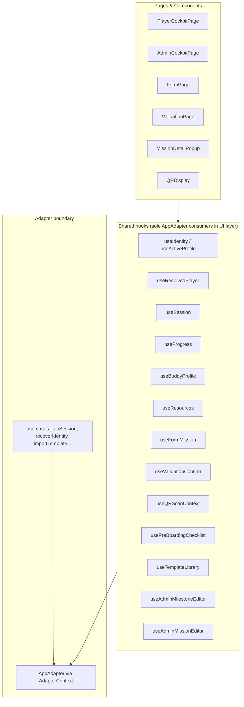

# Introduction


**Phase A** of the two-phase data unification refactoring. Delivers a **C-18-compliant** shared hook layer so pages and components never call [`AppAdapter`](src/adapters/interface.ts:18) directly. Consolidates fragmented progress/buddy/resources hooks, adds missing domain hooks (player resolution, form mission, QR validation, session writes), and aligns identity with [`SPECS.md`](SPECS.md:244) (`CachedIdentity` cache + `Player` canonical record).

**Baseline audits (must preserve UX):** [`docs/admin-view-data.md`](docs/admin-view-data.md) and [`docs/player-view-data.md`](docs/player-view-data.md) document every dynamic field, interaction, and data flow in the current UI. Phase A refactors *how* data is fetched — not *what* the user sees. See [§ UX preservation checklist](#ux-preservation-checklist).

**Prerequisite for:** [`plans/pocketbase-full-integration-strategy.md`](plans/pocketbase-full-integration-strategy.md) — the PB JS adapter plugs in behind these hooks; components stay unchanged when mock → PB.

### Success criteria (Phase A exit gate)

- [x] `rg 'useAdapter' src/pages src/components` returns **zero** matches (excluding test files if any)
- [x] `rg 'from.*adapters/interface' src/pages src/components` returns **zero** matches
- [x] All domain adapter methods are consumed **only** from `src/hooks/` and `src/use-cases/`
- [x] Every data-fetching hook exposes `loading`, `error`, and `refresh` (REQ-005)
- [x] Real-time progress updates flow through `useProgress.watchMission` (C-20) — no component calls `subscribeProgressEvent`
- [x] [UX preservation checklist](#ux-preservation-checklist) — all P0 items verified
- [x] `deno task lint && deno task build` pass
- [x] Manual smoke tests TEST-001 through TEST-018 pass

---

## Architecture

### Data flow



### Shared hook registry (canonical — C-18)

Each row is the **sole** hook layer for its adapter methods. Pages and components import hooks only.

| Hook | Adapter methods | Roles | Notes |
|------|-----------------|-------|-------|
| [`useIdentity`](src/hooks/useIdentity.ts) | *(none — `localStorage`)* | both | Multi-profile `mb_identity` array; cross-tab `storage` sync |
| [`useActiveProfile`](src/hooks/useActiveProfile.ts) | *(composes `useIdentity`)* | both | `useActiveProfile(sessionId, role?)` → `CachedIdentity \| null`; use on **all** routed pages (not `profiles[0]`) |
| [`useResolvedPlayer`](src/hooks/useResolvedPlayer.ts) | `getPlayer`, `getPlayerById`, `updatePlayer` | player | `uid` → full `Player`; GM has no `players` row — returns `null` for GM routes |
| [`useSession`](src/hooks/useSession.ts) | `getSession`, `listMilestones`, `listMissions`, `updateSession` | both | Admin: `uploadBackground`, optional `updateMapNodeScale` (see UX-012) |
| [`useProgress`](src/hooks/useProgress.ts) | `listProgressEvents`, `upsertProgressEvent`, `subscribeProgressEvent`, `listPlayers` | both | Discriminated modes; **`watchMission`** (C-20); mutations auto-`refresh` local state |
| [`useBuddyProfile`](src/hooks/useBuddyProfile.ts) | `getBuddyProfile`, `upsertBuddyProfile` | both | Admin: reload draft on `playerId` change; expose `savedBuddy` after upsert |
| [`useResources`](src/hooks/useResources.ts) | `listResources`, `createResource`, `updateResource`, `deleteResource` | both | Player: filtered; admin: optimistic CRUD + `refresh` |
| [`useFormMission`](src/hooks/useFormMission.ts) | `getFormSchema` + progress/player writes | player | Route `/form/:sessionId/:missionId`; profile-mission mirror (UX-008) |
| [`useValidationConfirm`](src/hooks/useValidationConfirm.ts) | `getPlayerById`, `listProgressEvents`, `upsertProgressEvent` | gamemaker | All ValidationPage error states (UX-015) |
| [`useQRScanContext`](src/hooks/useQRScanContext.ts) | `getSession`, `listPlayers`, `listMissions` | gamemaker | + `buildSimulateScanUrl()` for dev simulate button |
| [`usePreBoardingChecklist`](src/hooks/usePreBoardingChecklist.ts) | `updateSession` (`preBoardingChecks`) | gamemaker | Internal `useAdapter()`; seeds on session **reference** change |
| [`useTemplateLibrary`](src/hooks/useTemplateLibrary.ts) | templates + `getFormSchema` | gamemaker | Internal `useAdapter()`; **`active` tab guard** preserved |
| [`useAdminMilestoneEditor`](src/hooks/useAdminMilestoneEditor.ts) | milestone CRUD | gamemaker | **Refactor:** internal `useAdapter()` — remove `adapter` param from `saveMilestones` |
| [`useAdminMissionEditor`](src/hooks/useAdminMissionEditor.ts) | mission + form schema CRUD | gamemaker | **Refactor:** internal `useAdapter()` — remove `adapter` param from `saveMissions` |
| [`useTutorial`](src/hooks/useTutorial.ts) | `updatePlayer` via callback | player | Accept `updatePlayer` from `useResolvedPlayer`; no raw `adapter` |

**Allowed adapter consumers outside hooks:** `src/use-cases/` only. Landing flow calls use-cases, not adapter methods directly.

**Explicitly not adapter domain:** `useChat` / `useChatStream` (C-17 ephemeral chat).

**Non-goals (stay page-orchestrated):** Composite admin Save (milestones + missions + order + form schemas in one click), `draftStorage` localStorage restore banner, `isDirty` composite across two editor hooks, session-error redirect + toast — pages keep orchestration; hooks supply data + mutations only.

### C-18 enforcement

| Layer | May import `useAdapter`? |
|-------|--------------------------|
| `src/hooks/` | ✅ Yes |
| `src/use-cases/` | ✅ Yes (receives `AppAdapter` as parameter) |
| `src/adapters/` | ✅ Yes |
| `src/pages/` | ❌ No |
| `src/components/` | ❌ No |

**TASK-050:** ESLint `no-restricted-imports` blocking `useAdapter` and `AppAdapter` under `src/pages/**` and `src/components/**`.

There are **no C-18 exceptions** for pages or components.

### Real-time sync (C-20)

```typescript
watchMission(
  playerId: string,
  missionId: string,
  onUpdate: (event: ProgressEvent) => void,
): () => void;
```

- [`QRDisplay`](src/components/player/QRDisplay.tsx) — QR completion after GM confirm (C-07)
- [`ValidationDisplay`](src/components/player/ValidationDisplay.tsx) — `gmApprove` only (`qr` subscribes in `QRDisplay`, not `ValidationDisplay`)

**Mutation contract:** `markPending`, `markSelfComplete`, `markAutoApproved` update local `progressEvents` and re-run `computeProgress` immediately; callers may also call `refresh()` — `onValidated` in popup must still trigger visible XP/map update without full page reload.

**Admin QR (C-07):** No GM subscription — `useValidationConfirm.confirm()` writes; player `watchMission` receives update.

**Out of scope Phase A:** Admin live feed when player submits `pendingApproval` from another device (requires session-scoped SSE — PB follow-up). Admin `approve`/`reject` still re-fetches that player's events locally.

### Identity & instance management

| Concept | Implementation |
|---------|----------------|
| **Canonical record** | `Player` in PocketBase (`players` collection) |
| **Offline cache** | `CachedIdentity` in `localStorage.mb_identity` (multi-profile array) |
| **Route guard** | `RequireRole` — `sessionId` + `role` match |
| **Active profile** | `useActiveProfile(sessionId, role)` on cockpits, ValidationPage, QRScannerView |
| **Demo** | `isDemo: true`; demo logout = navigate `/` only; real logout = `removeProfile(uid)` |
| **GM identity** | `CachedIdentity` + `sessions.gameMakerId`; no `players` row (OD-14) |

Delete [`ephemeralIdentityStore.ts`](src/hooks/ephemeralIdentityStore.ts) stub after zero-import verification.

---

## UX preservation checklist

Sourced from [`docs/admin-view-data.md`](docs/admin-view-data.md) and [`docs/player-view-data.md`](docs/player-view-data.md). Each item maps to implementation tasks.

### P0 — Must not regress

| ID | Behavior | Source | Plan task |
|----|----------|--------|-----------|
| UX-001 | Admin **auto-selects first player** on initial load | admin §3.D | TASK-022 |
| UX-002 | **Player select reloads buddy** draft (`handlePlayerSelectWithBuddy`) | admin §3.F | TASK-030, TASK-052 |
| UX-003 | **`bgImageUrlOverride`** — local preview on upload without session re-fetch | admin §3.A | TASK-011, TASK-052 |
| UX-004 | **Composite Save** — milestones + missions + form schemas + order + deletes, then toast | admin §4.4 | Non-goal: page keeps orchestration; TASK-061 refactors save calls only |
| UX-005 | **Draft localStorage** restore banner in MissionBottomSheet | admin §3.C | No hook change — verify TEST-017 |
| UX-006 | **Tab-gated fetches** — cross-hire only when tab active; templates only when Active Session tab | admin §3.I, §3.J | TASK-023, TASK-045 |
| UX-007 | **Pending approvals** = filter `allProgressEvents` where `status === pendingApproval` | admin §3.E | TASK-022 |
| UX-008 | **FormPage profile mission** (`mission_m1_profile`): mirror 11 fields + `profileComplete` + `tutorialComplete` | player §2.3 | TASK-040, TEST-010 |
| UX-009 | **Post-validation refresh** — popup `onValidated` → progress/XP updates without reload | player §3.E | TASK-021, TASK-025 |
| UX-010 | **Mission routing** — FORM incomplete → `/form/:sessionId/:missionId`; else popup | player §3.D | Page logic unchanged |
| UX-011 | **Tutorial form round-trip** — `mb_tutorial_form_pending` in sessionStorage | player §3.H | TASK-044 |
| UX-012 | **`mapNodeScale`** — today: admin slider is **local override only** (not persisted on Save). **Phase A fix:** persist via `updateSession({ mapNodeScale })` so player map matches admin slider | admin §3.A, MilestoneMapEditor | TASK-011b |
| UX-013 | **Simulate Scan** in AdminQRScannerModal — encodeQRPayload for first player + first QR mission | admin §3.K | TASK-042 |
| UX-014 | **Multi-profile GM** — QRScannerView/ValidationPage TopBar use `useActiveProfile`, not `profiles[0]` | admin §1.2 | TASK-003, TASK-054, TASK-062 |
| UX-015 | **ValidationPage errors** — missing token, decode fail, wrong session, confirm fail; FetchErrorPanel + retry | admin §1.3 | TASK-041 |
| UX-016 | **Session error redirect** — `sessionStorage.mb_landing_toast` + `navigate("/")` | player §2.2, admin §5.2 | Page-level — preserve in TASK-051, TASK-052 |
| UX-017 | **Resources search** — collapsible; results only after user types query | player §3.G | Keep filter in `ResourcesSection` (TASK-031) |
| UX-018 | **Editor hooks** — `saveMilestones`/`saveMissions` must not require `adapter` from page | admin §4.1 | TASK-061 |

### P1 — Improve within Phase A

| ID | Behavior | Plan |
|----|----------|------|
| UX-019 | Buddy/resources **`refresh`** — player sees GM changes after reload | REQ-005; expose `refresh` on `useBuddyProfile`, `useResources` |
| UX-020 | Admin **refresh session** after structural save so GM sees new mission IDs before approving | TASK-052: call `useSession.refresh()` after successful save |
| UX-021 | **`qrSecret` on player** — prototype exposes via `useSession`; Phase B strips via C-19 view types | Note in Phase B preview |

---

## 1. Requirements & Constraints

- **REQ-001**: [`useProgress`](src/hooks/useProgress.ts) replaces [`useAdminPlayers`](src/hooks/useAdminPlayers.ts), [`usePlayerProgress`](src/hooks/usePlayerProgress.ts), and [`useCrossHireData`](src/hooks/useCrossHireData.ts). Exposes discriminated union result types per mode.
- **REQ-002**: [`useBuddyProfile`](src/hooks/useBuddyProfile.ts) replaces [`useBuddy`](src/hooks/useBuddy.ts) and admin inline buddy pattern in [`AdminCockpitPage`](src/pages/AdminCockpitPage.tsx).
- **REQ-003**: [`useResources`](src/hooks/useResources.ts) supports both roles with admin CRUD callbacks.
- **REQ-004**: Rename `LocalIdentity` → `CachedIdentity` per SPECS. No component imports `LocalIdentity`. `isDemo` stays on `CachedIdentity` only (client flag, not on `Player` PB type).
- **REQ-005**: All data-fetching hooks expose `loading`, `error`, `refresh`. Mutation hooks expose `error` + `refresh` where applicable.
- **REQ-006**: [`useResolvedPlayer`](src/hooks/useResolvedPlayer.ts) centralizes `uid` → `Player` resolution; removes duplicated effects in [`PlayerCockpitPage`](src/pages/PlayerCockpitPage.tsx) and [`FormPage`](src/pages/FormPage.tsx).
- **REQ-007**: [`useSession`](src/hooks/useSession.ts) gains `updateSession` / `uploadBackground(file)` for admin — removes direct adapter call in AdminCockpitPage.
- **REQ-008**: [`useProgress`](src/hooks/useProgress.ts) exposes `watchMission`, `markPending`, `markSelfComplete`, `markAutoApproved` so [`MissionDetailPopup`](src/components/player/MissionDetailPopup.tsx) never calls `upsertProgressEvent` directly.
- **REQ-009**: New hooks: `useFormMission`, `useValidationConfirm`, `useQRScanContext`, `useActiveProfile`.
- **REQ-010**: ESLint enforces C-18 at lint time (TASK-050).
- **REQ-011**: Editor hooks (`useAdminMilestoneEditor`, `useAdminMissionEditor`) and `useTemplateLibrary` use internal `useAdapter()` — no `adapter` parameter from pages.
- **REQ-012**: `useProgress` mutations update derived `playerProgress` in-hook; `watchMission` callbacks trigger recompute.
- **REQ-013**: `useBuddyProfile` admin mode resets draft when `playerId` changes; returns `savedBuddy` after upsert (replaces `buddyProfileRef` pattern).
- **REQ-014**: `useSession.uploadBackground` returns display URL; page may set local override until server URL resolves (UX-003).
- **REQ-015**: `useSession.updateMapNodeScale` persists to adapter (UX-012 — fixes GM→player scale drift).
- **REQ-016**: `useQRScanContext.buildSimulateScanUrl()` encapsulates dev simulate path (UX-013).
- **REQ-017**: `useTemplateLibrary` retains `active: boolean` guard; remove `adapter` from hook props.
- **CON-001**: No PocketBase schema changes. Zero Go migration files.
- **CON-002**: [`AppAdapter`](src/adapters/interface.ts) interface shape unchanged. Phase A is hook/component refactoring above the adapter boundary.
- **CON-003**: C-01 through C-17 remain in force. C-18 and C-20 are active in Phase A. C-19 and C-21 deferred to Phase B.
- **GUD-001**: Follow [AGENTS.md](AGENTS.md) React Lifecycle principles: Tier 2+ async cleanup (`cancelled` flag), `refresh` on every fetch hook, Latest Ref Pattern for stable callbacks.
- **PAT-001**: Role parameter: `{ role: "player" | "gamemaker" }` on hooks that differ by role.
- **PAT-002**: Split large hooks into co-located modules: `useProgress/player.ts`, `admin.ts`, `crossHire.ts`.
- **PAT-003**: Discriminated unions for multi-mode hooks — TypeScript narrows return shape; no optional-field soup.

---

## 2. Implementation Steps

### Phase 1: Identity & instance management

| Task | Description | Done | Date |
|------|-------------|------|------|
| TASK-001 | Rename `LocalIdentity` → `CachedIdentity`. No re-export alias. | ✅ | 2026-06-18 |
| TASK-002 | `useIdentity` types → `CachedIdentity` only (multi-profile array already implemented). | ✅ | 2026-06-18 |
| TASK-003 | Create `useActiveProfile(sessionId, role?)`. | ✅ | 2026-06-18 |
| TASK-004 | Update landing, RequireRole, use-cases, LandingPage. | ✅ | 2026-06-18 |
| TASK-005 | Delete `ephemeralIdentityStore.ts` stub. | ✅ | 2026-06-18 |
| TASK-006 | TEST-007, TEST-008 cross-tab + demo profiles. | ✅ | 2026-06-18 |

### Phase 2: `useResolvedPlayer` + extend `useSession`

| Task | Description | Done | Date |
|------|-------------|------|------|
| TASK-010 | Create `useResolvedPlayer(uid)`. | ✅ | 2026-06-18 |
| TASK-011 | Extend `useSession`: `updateSession(patch)`, `uploadBackground(file)` → `{ displayUrl }` for override pattern (UX-003). | ✅ | 2026-06-18 |
| TASK-011b | Add `updateMapNodeScale(scale)` → `updateSession({ mapNodeScale })` (UX-012). Wire MilestoneMapEditor slider to call hook instead of local-only override. | ✅ | 2026-06-18 |
| TASK-012 | Migrate PlayerCockpitPage. | ✅ | 2026-06-18 |
| TASK-013 | Migrate FormPage (player resolution only; form logic Phase 5). | ✅ | 2026-06-18 |

### Phase 3: `useProgress`

| Task | Description | Done | Date |
|------|-------------|------|------|
| TASK-020 | Discriminated types + `useProgress/` modules. | ✅ | 2026-06-18 |
| TASK-021 | Player mode: progress + `markPending`, `markSelfComplete`, `markAutoApproved`; mutations refresh local state (UX-009). | ✅ | 2026-06-18 |
| TASK-022 | Admin mode: port useAdminPlayers including **auto-select first player** (UX-001), `pendingEvents` filter (UX-007). | ✅ | 2026-06-18 |
| TASK-023 | Cross-hire: `active` guard + cancellation (UX-006). | ✅ | 2026-06-18 |
| TASK-024 | `watchMission` → internal `subscribeProgressEvent`. | ✅ | 2026-06-18 |
| TASK-025 | `refresh` + error clear; `watchMission` callback triggers `computeProgress` re-run. | ✅ | 2026-06-18 |

### Phase 4: `useBuddyProfile` + `useResources`

| Task | Description | Done | Date |
|------|-------------|------|------|
| TASK-030 | `useBuddyProfile`: reload on `playerId` change (UX-002); admin `savedBuddy` after upsert; `refresh` (UX-019). | ✅ | 2026-06-18 |
| TASK-031 | `useResources`: role param, admin optimistic CRUD, `refresh`; search stays in ResourcesSection (UX-017). | ✅ | 2026-06-18 |

### Phase 5: Domain-specific hooks

| Task | Description | Done | Date |
|------|-------------|------|------|
| TASK-040 | `useFormMission`: schema fetch + submit; **profile mission branch** for `mission_m1_profile` — mirror 11 fields, `profileComplete`, `tutorialComplete` (UX-008). | ✅ | 2026-06-18 |
| TASK-041 | `useValidationConfirm`: decode, confirm, discrete errors (missing token, HMAC fail, wrong session, confirm fail) + retry (UX-015). | ✅ | 2026-06-18 |
| TASK-042 | `useQRScanContext`: prefetch data + **`buildSimulateScanUrl()`** (UX-013). | ✅ | 2026-06-18 |
| TASK-043 | `usePreBoardingChecklist`: internal `useAdapter()`; seed on session ref change. | ✅ | 2026-06-18 |
| TASK-044 | `useTutorial`: `updatePlayer` callback injection (UX-011). | ✅ | 2026-06-18 |
| TASK-045 | `useTemplateLibrary`: internal `useAdapter()`, remove `adapter` prop, keep **`active` guard** (UX-006). | ✅ | 2026-06-18 |

### Phase 5b: Editor hooks — internal adapter (C-18 completion)

| Task | Description | Done | Date |
|------|-------------|------|------|
| TASK-061 | `useAdminMilestoneEditor.saveMilestones(sid, serverMilestones)` — no `adapter` arg; internal `useAdapter()` (UX-018). | ✅ | 2026-06-18 |
| TASK-062 | `useAdminMissionEditor.saveMissions(sid, serverMissions, xpPreview)` — no `adapter` arg (UX-018). | ✅ | 2026-06-18 |

### Phase 6: Migrate pages & components

| Task | Description | Done | Date |
|------|-------------|------|------|
| TASK-050 | ESLint C-18 rule. | ✅ | 2026-06-18 |
| TASK-051 | PlayerCockpitPage — preserve session-error redirect + toast (UX-016); tutorial demo override. | ✅ | 2026-06-18 |
| TASK-052 | AdminCockpitPage — wire buddy on `selectPlayer`; `bgImageUrlOverride`; call `session.refresh()` after save (UX-020); demo vs real logout. | ✅ | 2026-06-18 |
| TASK-053 | FormPage → `useFormMission`. | ✅ | 2026-06-18 |
| TASK-054 | ValidationPage → `useValidationConfirm` + `useActiveProfile` (UX-014). | ✅ | 2026-06-18 |
| TASK-055 | MissionDetailPopup → progress mutations; parent passes `onValidated` → `refresh`. | ✅ | 2026-06-18 |
| TASK-056 | QRDisplay → `useSession` + `watchMission`. | ✅ | 2026-06-18 |
| TASK-057 | ValidationDisplay → `watchMission` (gmApprove only). | ✅ | 2026-06-18 |
| TASK-058 | AdminQRScannerModal → `useQRScanContext` + simulate via hook. | ✅ | 2026-06-18 |
| TASK-062b | QRScannerView → `useActiveProfile` for TopBar (UX-014). | ✅ | 2026-06-18 |
| TASK-059 | Delete deprecated hooks. | ✅ | 2026-06-18 |
| TASK-060 | `deno task lint && deno task build`. | ✅ | 2026-06-18 |

### Phase 7: Documentation

| Task | Description | Done | Date |
|------|-------------|------|------|
| TASK-070 | `docs/shared-data-access.md` — include UX checklist + hook registry. | ✅ | 2026-06-18 |
| TASK-071 | Update puml diagrams. | ✅ | 2026-06-18 |
| TASK-072 | Rename admin/player-view-data → `*-legacy.md`; link from shared-data-access. | ✅ | 2026-06-18 |
| TASK-073 | AGENTS.md SSE + Form route `/form/:sessionId/:missionId`. | ✅ | 2026-06-18 |

---

## 3. Hook contracts (reference)

### `useSession` — admin extensions

```typescript
useSession(sessionId, { role?: "player" | "gamemaker" });
// Player: { session, milestones, missions, loading, error, refresh }
// Gamemaker adds:
//   updateSession(patch)
//   uploadBackground(file) → Promise<{ displayUrl: string }>  // for bgImageUrlOverride
//   updateMapNodeScale(scale) → Promise<void>                 // persists UX-012
```

### `useProgress` — player mutations

```typescript
// After markSelfComplete / markPending / markAutoApproved:
// - local progressEvents updated
// - playerProgress recomputed via computeProgress
// - no full page reload required for XP bar / map
```

### `useFormMission`

```typescript
useFormMission(sessionId, missionId, { player, updatePlayer, markAutoApproved });
// submitForm(values):
//   - upsertProgressEvent autoApproved + formResponse
//   - if missionId === "mission_m1_profile": mirror 11 profile fields + flags
```

### `useValidationConfirm`

```typescript
// errorKind: "missing_token" | "decode" | "wrong_session" | "confirm" | null
// retry() re-runs decode; confirm() writes completed + navigates
```

### `useQRScanContext`

```typescript
// { session, players, missions, loading, error, refresh,
//   buildSimulateScanUrl(): Promise<string | null> }
```

### `useBuddyProfile` — admin

```typescript
// When playerId changes: reset buddyDraft from server or empty template
// upsertBuddy() → updates savedBuddy; toast remains page responsibility
```

---

## 4. Alternatives

- **ALT-001** through **ALT-005**: unchanged from v2.0.
- **ALT-006**: Leave `mapNodeScale` local-only — **rejected**; GM slider changes invisible to player violates shared map UX (UX-012).

---

## 5. Dependencies

- **DEP-001** through **DEP-006**: unchanged.
- **DEP-007**: [`docs/admin-view-data.md`](docs/admin-view-data.md), [`docs/player-view-data.md`](docs/player-view-data.md) — UX acceptance baseline.

---

## 6. Files

### New files

`useActiveProfile.ts`, `useResolvedPlayer.ts`, `useProgress/`, `useBuddyProfile.ts`, `useFormMission.ts`, `useValidationConfirm.ts`, `useQRScanContext.ts`, `docs/shared-data-access.md`

### Modified files (additions to v2.0 list)

| File | Change |
|------|--------|
| `src/hooks/useAdminMilestoneEditor.ts` | Internal `useAdapter`; `saveMilestones` signature |
| `src/hooks/useAdminMissionEditor.ts` | Internal `useAdapter`; `saveMissions` signature |
| `src/hooks/useTemplateLibrary.ts` | Remove `adapter` prop; keep `active` guard |
| `src/components/admin/MilestoneMapEditor.tsx` | Call `updateMapNodeScale` on slider change |
| `src/pages/QRScannerView.tsx` | `useActiveProfile` |
| `eslint.config.js` | C-18 rule |

### Deleted files

Unchanged: `useAdminPlayers`, `usePlayerProgress`, `useCrossHireData`, `useBuddy`, `ephemeralIdentityStore`

---

## 7. Testing

| ID | Scenario |
|----|----------|
| TEST-001 | Player Cockpit — map, missions, buddy, resources |
| TEST-002 | Admin Cockpit — players, pending approvals, approve/reject |
| TEST-003 | Cross-Hire tab — active guard + cancel on tab switch |
| TEST-004 | Buddy — select player B after A, draft reloads; save persists |
| TEST-005 | Resources — CRUD + visibility toggle |
| TEST-006 | Identity persistence |
| TEST-007 | Cross-tab profile sync |
| TEST-008 | Demo profiles |
| TEST-009 | Recovery key |
| TEST-010 | Form submit + **profile mission** field mirror |
| TEST-011 | QR — GM confirm → player `watchMission` → XP without reload |
| TEST-012 | gmApprove — admin approve → player `watchMission` |
| TEST-013 | MissionDetailPopup — hook mutations only |
| TEST-014 | C-18 grep gate |
| TEST-015 | lint + build |
| TEST-016 | Background upload — map shows image immediately (override) |
| TEST-017 | Mission draft restore banner — localStorage round-trip |
| TEST-018 | **mapNodeScale** — admin slider change visible on player map after refresh (UX-012) |

---

## 8. Risks & mitigations

| Risk | Mitigation |
|------|------------|
| AdminCockpitPage complexity | One domain per PR; UX checklist per PR |
| `mapNodeScale` persistence changes mock sessions | Mock adapter `updateSession` already supports patch |
| Editor save refactor breaks batch save | TEST-002 + manual save/discard after TASK-061/062 |
| `useProgress` union confusion | Type guards or mode-specific wrapper hooks (internal) |
| `watchMission` leaks | Cleanup on unmount; dedupe subscriptions |
| Player `qrSecret` exposure | Document UX-021; C-19 in Phase B |
| Cross-device stale session data | UX-020 admin refresh; player reload — SSE deferred |

---

## 9. Phase B preview (out of scope)

- **C-19:** `PlayerSessionView` omits `qrSecret`; `useQRMission` or server-side signing (OD-13)
- **C-21:** `pre_boarding_checks` collection
- **SharedDataProvider:** facade over Phase A hooks
- **OD-14:** Server-validated roles
- **Live admin pending feed:** SSE on `progress_events` filtered by `sessionId`
- **Player auto-sync:** session/mission updates without manual refresh

---

## 10. Related specifications

- [SPECS.md § Design Constraints](SPECS.md:1065) — C-18, C-20
- [SPECS.md § Unified Identity Model](SPECS.md:244)
- [AGENTS.md](AGENTS.md)
- [docs/admin-view-data.md](docs/admin-view-data.md) — admin UX baseline (→ legacy after Phase 7)
- [docs/player-view-data.md](docs/player-view-data.md) — player UX baseline (→ legacy after Phase 7)
- [plans/pocketbase-full-integration-strategy.md](plans/pocketbase-full-integration-strategy.md)
- [docs/pb-schema.md](docs/pb-schema.md)
