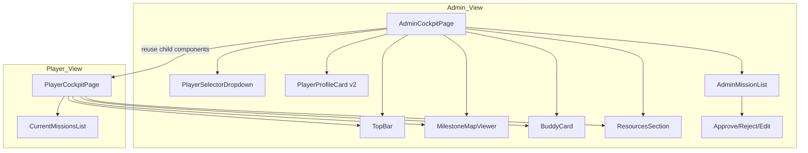

# Wireframe Alignment Plan

## 1. Wireframe Navigation Map

The following screens were systematically explored via Playwright on the Figma Make prototype (`Onboarding Login and Form`):

```
Landing Page
├── [New Employee] → Session Entry (Session ID textbox + Join button)
├── [Admin] → Admin Access (no credentials) → [Enter Admin View]
│   └── Admin Dashboard
│       ├── Top Bar: ADMIN badge, Messe logo, player dropdown, Approvals pending (4)
│       ├── Employee Info Card (name, role, start date, email, summary, progress 65%)
│       ├── Milestones Grid (6 milestones as visual nodes with progress %)
│       ├── Current Missions (4 mission cards with tags, XP, due dates, action buttons)
│       ├── Your Buddy (Katrin Meier card with quote, email, phone, @handle, Book meeting)
│       └── Resources (search bar + 6 resource links with icons)
│       └── [Mission click] → How You Work Form
│           ├── Text: skill/interest nobody would guess
│           ├── Chips: What energises you? (8 options, multi-select)
│           ├── Chips: What drains you? (8 options, multi-select)
│           ├── Text (optional): pet peeve
│           ├── Textarea (optional): how I work best
│           └── Buttons: Back, Save for later, Submit
└── [Recover my progress] → Alert: "Progress recovery feature - would restore saved onboarding data"
```

---

## 2. Gap Analysis

### 2A. Landing Page (`LandingPage.tsx`)

| Element | Wireframe | Current Implementation | Gap |
|---|---|---|---|
| MM logo + Messe München | Present | Present | Aligned |
| Heading | "Employee Onboarding" | "Employee Onboarding" | Aligned |
| Subtitle | "Choose how you'd like to join" | "Choose how you'd like to join" | Aligned |
| "Join as" label | Above buttons | Above buttons | Aligned |
| New Employee button | Primary style | Primary style | Aligned |
| Admin button | Secondary style | Secondary style | Aligned |
| Recover my progress | Ghost link below divider | Ghost link below divider | Aligned |
| Footer contact | "Having trouble? Contact IT Support" | Same, with mailto link | Aligned |
| **Session ID label** | "Session ID" | "Session code" | **Minor wording diff** |
| **Helper text** | "Code for onboarding system access shared with you previously" | "Ask your Game Master for the code" | **Different helper text** |
| **Back button icon** | Left arrow icon | Text-only "Back" button | **Missing icon** |

**Gap severity: Low** — Mostly aligned. Session entry wording and back icon are minor.

### 2B. Admin Dashboard (`AdminCockpitPage.tsx`)

| Element | Wireframe | Current Implementation | Gap |
|---|---|---|---|
| **Top bar ADMIN badge** | ADMIN badge + Messe logo | No ADMIN badge | Missing |
| **Player selector** | Dropdown showing selected player name + role | Dropdown showing bare name | Partially implemented (needs role display) |
| **Approvals pending badge** | Button showing count "(4)" | Separate panel, not a top-bar badge | **Structural gap** |
| Employee Info Card | Name, Role, Start Date, Email, Background Summary, Progress 65% | `PlayerProfileCard` has only name, role, team, start date | **Missing fields** (email, background summary, progress %) |
| Milestones Grid | 6 milestones as visual nodes with connected lines, progress %, XP to go | `MilestoneMapEditor` uses pan/zoom canvas with nodes | **Current map is superior** — keep it |
| Current Missions | Rich cards with tags, XP, due date, action buttons (approve/reject/edit) | Not rendered in admin cockpit | **Missing entirely** |
| **Missions shown for selected player** | Yes — missions are player-specific | Admin sees template-level missions in `MilestoneSidebarEditor` | **Different paradigm** |
| Your Buddy | Full card with quote, email, phone, @handle, Book a meeting | `BuddyAssignmentForm` is a bare form with name/role/tenure fields | **Missing buddy preview** |
| Resources | Search bar + 6 resource links with type icons | `ResourcesEditor` is a bare list with add/delete buttons | **Missing rich resource display** |

**Gap severity: HIGH** — Admin cockpit requires a significant layout restructure.

### 2C. Player Cockpit (`PlayerCockpitPage.tsx`)

| Element | Wireframe (Admin view of player) | Current Player View | Gap |
|---|---|---|---|
| Top bar | Player name + XP + role | Player name + XP + role | Aligned |
| Milestones Map | Grid map (6 milestone nodes) | Pan/zoom canvas map | **Current is better** — keep |
| Current Missions | 4 cards with tags, XP, due date | List with tags, XP, due date | Partially aligned |
| **Mission tags** | `mandatory`, `urgent`, `needs approval` | Generic tag support exists | Aligned (data-driven) |
| **XP ring on missions** | Circular progress ring around XP | Bolt icon + XP text | **Missing ring/chart** |
| **Action buttons** | Approve/reject/edit icons on each mission | No action buttons | Not needed on player side |
| Buddy Card | Quote, email, phone, @handle, Book meeting | Quote, email, phone, Book meeting | **Missing @handle** |
| Resources | Search bar + 6 links | Search bar + resource cards | Aligned |

**Gap severity: MEDIUM** — Mostly aligned, needs @handle on buddy and XP ring visualization.

### 2D. Form Page (`FormPage.tsx`)

| Element | Wireframe | Current Implementation | Gap |
|---|---|---|---|
| Navigation | Dashboard back link in top | TopBar with generic nav | **Missing Dashboard back link** |
| Heading | "How You Work" | Mission title (hard-wired) | Aligned (data-driven) |
| Description | "Your answers appear on your profile card" | No per-form description | **Missing description section** |
| **Multi-select chips** | Chip buttons for 8 options, toggle-able | Text inputs only | **Chip component doesn't exist** |
| Text fields | 2 text fields (free text entries) | FormField renders text inputs | Partially aligned |
| Textarea | 1 textarea (multi-line) | Not supported | **Missing textarea** |
| **Save for later** | Button between Back and Submit | Not present | **Missing** |
| Submit button | Present | Present (disabled) | Aligned (needs wiring) |

**Gap severity: HIGH** — Form system needs chip-select and textarea support, plus "Save for later" button.

---

## 3. Key Design Decisions

### 3A. Grid Map (Keep Current Implementation)

The user explicitly stated: *"The grid map view of the current implementation is better."*

The current `MilestoneMapViewer` with pan/zoom canvas is superior to the wireframe's static grid. **No changes needed** to the milestone map component.

### 3B. Tutorial Flow Order

The user stated: *"the first onboarding mission is a mission that will happen after finishing the tutorial sequence for the final prototype [but] the current wireframe starts with the onboarding, and then the tutorial sequence. This is not the correct behavior, and should be switched for the prototype."*

**Decision for prototype**: Onboarding → first mission (no tutorial). The tutorial system (`TutorialOverlay`, `TutorialStep`) exists in the codebase but should not gate the first mission for the prototype flow.

### 3C. Admin Dashboard Restructure

The wireframe admin dashboard is essentially the **player cockpit viewed through an admin lens**. This suggests merging the player and admin dashboards rather than maintaining separate implementations.

---

## 4. Implementation Todo List

### Priority 1 (Structural Changes)

- [ ] **P1-1: Restructure Admin Cockpit layout** to match wireframe: single-panel admin view with player selector at top, employee info card, milestones map, current missions list, buddy card, and resources section in a scrollable layout
- [ ] **P1-2: Merge Admin + Player cockpit** architectural pattern — AdminCockpitPage should reuse PlayerCockpitPage components with overlay permissions (approve/reject buttons, edit controls)
- [ ] **P1-3: Add employee info section** to admin cockpit with all fields: Name, Role, Start Date, Email, Background Summary, Onboarding Progress %

### Priority 2 (Component Enhancements)

- [ ] **P2-1: Add `ApprovalsPendingBadge`** component — top-bar pill button showing pending count with visual indicator
- [ ] **P2-2: Add `@handle` field** to `BuddyCard` component with icon
- [ ] **P2-3: Add XP progress ring** visualization to mission cards (circular SVG ring around XP value)
- [ ] **P2-4: Add "Save for later" button** to `FormShell` — persists draft state without submitting
- [ ] **P2-5: Add `ChipSelect` form field type** — multi-select chip group component for form schema
- [ ] **P2-6: Add `textarea` form field type** — multi-line text input type
- [ ] **P2-7: Add per-form description text** between heading and fields in `FormShell`
- [ ] **P2-8: Add back-to-dashboard link** in form page navigation

### Priority 3 (Minor Polish)

- [ ] **P3-1: Update landing page** — change "Session code" label to "Session ID", update helper text
- [ ] **P3-2: Add back-arrow icon** to back buttons throughout app
- [ ] **P3-3: Populate mock data** to reflect Sarah Hoffmann profile and realistic missions matching wireframe

### Priority 4 (Data Flow)

- [ ] **P4-1: Wire admin dashboard** to real adapter data (player-specific missions, progress, approvals)
- [ ] **P4-2: Wire form submission** — save form responses, trigger approval flow where needed
- [ ] **P4-3: Wire Save for later** — persist draft form state across sessions

---

## 5. Component Architecture Diagram



---

## 6. Summary

| Area | Alignment | Action Required |
|---|---|---|
| Landing Page | ~90% | Minor wording + back icon |
| Admin Cockpit | ~30% | **Major restructure** needed |
| Player Cockpit | ~75% | Missing @handle, XP ring |
| Form System | ~40% | Missing chips, textarea, save-for-later |
| Milestone Map | 100% | Keep current implementation |

**Estimated total tasks: 16**
**Priority 1: 3 structural changes**
**Priority 2: 8 component enhancements**
**Priority 3: 3 minor polish items**
**Priority 4: 3 data flow tasks**
